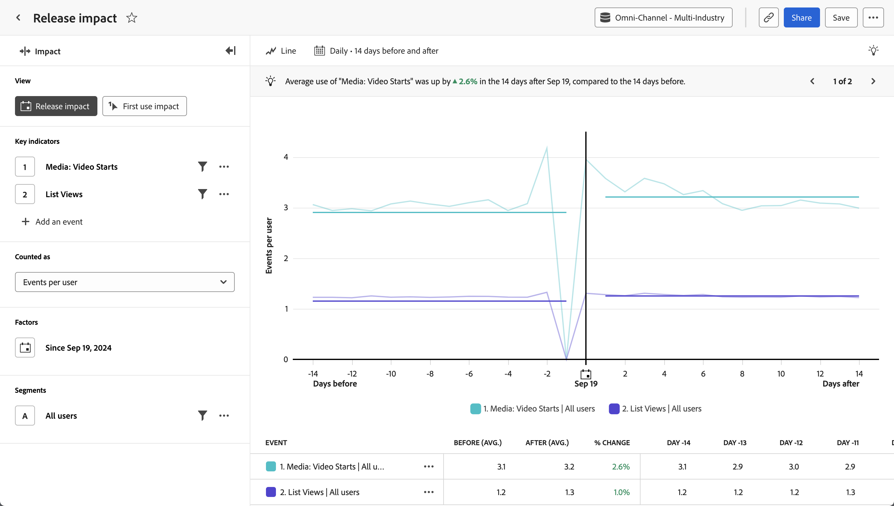

# [!UICONTROL Release impact]-analys {#release-impact}

<!-- markdownlint-disable MD034 -->

>[!CONTEXTUALHELP]
>id="workspace_guidedanalysis_releaseimpact_button"
>title="Frisläpp påverkan"
>abstract="Jämför prestanda i lika stora perioder före och efter lanseringen."

<!-- markdownlint-enable MD034 -->

Analysen  **[!UICONTROL Release impact]** visar en jämförelse av hur nyckelindikatorer utfördes före och efter ett visst datum. Den vågräta axeln i den här rapporten är ett tidsintervall, medan den lodräta axeln mäter de önskade nyckelindikatorerna. Ett lodrätt streck mitt i diagrammet representerar det datum som du vill jämföra före och efter. Detta datum är vanligtvis en betydande ändring av den produkt som du vill mäta mot, till exempel en uppdatering av produkten eller en kampanjstart.

>[!VIDEO](https://experienceleague.adobe.com/sv/docs/customer-journey-analytics-learn/tutorials/guided-analysis/release-impact)

## Användningsexempel

Användningsexempel för den här analysen är:

* **Allmän prestandautvärdering:** En jämförelse av övergripande nyckelindikatorer, t.ex. engagemangsmått, kan hjälpa dig att avgöra om en given release totalt sett var framgångsrik.
* **Övervakning**: Spåra viktiga mätvärden som du kan förvänta dig ska vara platta när ändringar görs, som inläsningstid eller antal inloggningar. Använd den här analysen för att jämföra dem före och efter en release för att säkerställa att den inte fick några oönskade konsekvenser.
* **Funktionsanpassning**: Om en produktuppdatering är inriktad på att förbättra en viss funktion kan du använda den här analysen för att direkt jämföra den funktionens användning före och efter produktuppdateringen.
* **Felidentifiering**: Genom att spåra antalet fel före och efter en release kan du få en tidig indikation på kundproblem. Om antalet fel ökar direkt efter en release kan ni tillsammans med konstruktions- eller utvecklingsteamen identifiera och korrigera problemet och på så sätt förhindra att kunderna påverkas ytterligare.

## Gränssnitt

I [Gränssnitt](../overview.md#interface) finns en översikt över gränssnittet för guidad analys. Följande inställningar är specifika för den här analysen:

### Frågerår

Med frågerefältet kan du konfigurera följande komponenter:

* **[!UICONTROL View]**: Växla mellan den här analysen och [Första användningen &#x200B;](first-use-impact.md).
* **[!UICONTROL Key indicators]**: De händelser som du vill mäta per användare. Varje markerad tangentindikator representeras som en färgad linje. En rad som representerar händelsen läggs till i tabellen. Du kan inkludera upp till tre händelser.
* **[!UICONTROL Counted as]**: Den beräkningsmetod som du vill använda för de markerade händelserna. Alternativen är [!UICONTROL Events per user], [!UICONTROL Percentage of users], [!UICONTROL Events], [!UICONTROL Sessions] och [!UICONTROL Users].
* **[!UICONTROL Factors]**: Det datum som du vill jämföra före och efter.
* **[!UICONTROL Segments]**: Det segment som du vill mäta. Det valda segmentet filtrerar data så att de bara fokuserar på de personer som matchar dina segmentkriterier.

### Diagraminställningar

Analysen av [!UICONTROL Release impact] innehåller följande diagraminställningar som kan justeras i menyn ovanför diagrammet:

* **[!UICONTROL Chart type]**: Den typ av visualisering som du vill använda. Alternativen är [!UICONTROL Line] och [!UICONTROL Bar].

### Datumintervall

Datumvalet i effektanalysen fungerar annorlunda än andra analyser, eftersom rapporten kretsar kring det datum som anges i frågerefältet. Följande alternativ är tillgängliga:

* **[!UICONTROL Interval]**: Datumgranulariteten som du vill visa data efter. Giltiga alternativ är [!UICONTROL Daily], [!UICONTROL Weekly], [!UICONTROL Monthly] och [!UICONTROL Quarterly]. Om du ändrar intervallet påverkas alternativen för perioden Före och efter.
* **[!UICONTROL Before and after period]**: Den tid som ska analyseras före och efter det datum som anges i frågerefälten. Vilka alternativ som är tillgängliga beror på valet av [!UICONTROL Interval].

<!--
## Example

See below for an example of the analysis.

-->
