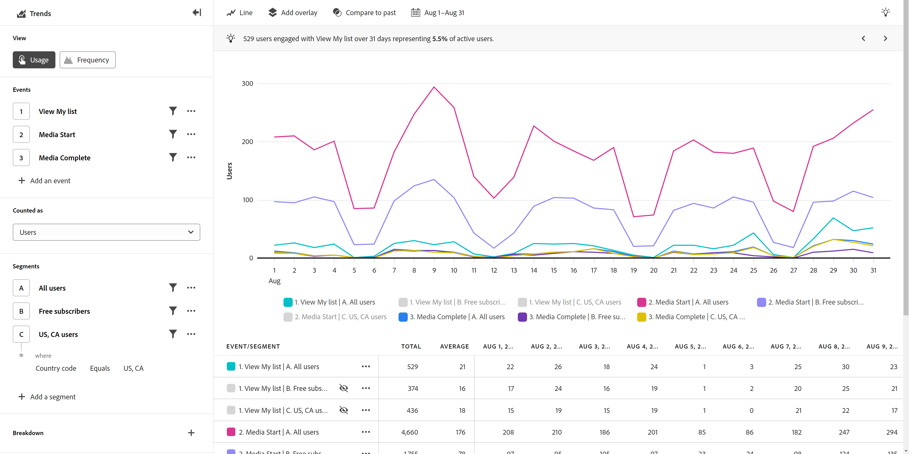

# Användning

{{release-limited-testing}}

The **Användning** visningstypen ger värdefull information om hur produkten eller användarens beteende fungerar över tiden. Den vågräta axeln i den här rapporten är alltid en tidshalaritet, medan den lodräta axeln mäter dina önskade händelser. Exempel:

* **Utvärdera produktens prestanda**: Trender gör att du kan utvärdera den övergripande prestandan för din produkt under en viss period. Genom att analysera mätvärden som användarinteraktion, konverteringsgrad eller intäkter kan ni identifiera om produktens prestanda förbättras, stagnerar eller försämras.
* **Antagande av nya funktioner**: Trender gör att du kan förstå hur användare antar nya funktioner eller uppdateringar som du släpper. Du kan avgöra vilka funktioner som är populära och vilka som behöver förbättras. Med den här informationen kan ni fatta datadrivna beslut om vilka funktioner ni ska prioritera utvecklingsarbetet kring.
* **Användarbeteende**: Trender ger insikt i användarbeteendet över tid. Genom att undersöka specifika åtgärder som användare utför kan du identifiera mönster där användare kan släppa av. Du kan kombinera insikter från den här vytypen med [Funktion](friction.md) för ännu mer insikter om beteenden.
* **A/B-testning och -experimenterande**: Om du kör A/B-tester i produkten kan du använda Trends för att mäta vilka tester som är mest framgångsrika över tid.

## Frågerår

Med frågerefältet kan du konfigurera följande komponenter:

* **Händelser**: De händelser som du vill mäta i din rapport. Varje händelse som markeras här representeras som en färgad linje eller en uppsättning staplar, beroende på diagramtyp. En rad som representerar händelsen trended läggs till i tabellen. Du kan inkludera upp till fem händelser.
* **Folk**: De segment som du vill mäta i rapporten. Varje segment som är markerat här dubblerar antalet rader i diagrammet och raderna i tabellen. Varje uppsättning med händelser representeras för varje segment. Du kan inkludera upp till fem segment.

## Diagraminställningar

Trender har följande diagraminställningar. Du kan justera diagraminställningarna på menyn mellan vytypen och kalenderväljaren.

* **Mått**: Det mått som du vill mäta. Alternativen är Händelser, Sessioner, Användare, Händelser per session och Händelser per användare.
* **Diagramtyp**: Den typ av visualisering som du vill använda. Du kan välja mellan Linje, Stapel, Staplad liggande och Staplad yta.

## Använd tidsjämförelse

{{apply-time-comparison}}

## Datumintervall

Anger önskat datumintervall. Den här inställningen har två viktiga komponenter:

* **Intervall**: Datumgranulariteten som du vill visa data i. Giltiga alternativ är Timly, Daily, Weekly, Monthly och Quarterly. Samma datumintervall kan ha olika intervall som påverkar antalet datapunkter i diagrammet och antalet kolumner i tabellen. Om du till exempel visar en analys som sträcker sig över tre dagar med daglig granularitet visas bara tre datapunkter, medan en analys som sträcker sig över tre dagar med timgranularitet visar 72 datapunkter.
* **Datum**: Start- och slutdatumet. Det finns förinställningar för datumintervall tillgängliga, eller så kan du använda kalenderväljaren för att ange exakt önskat datum.
