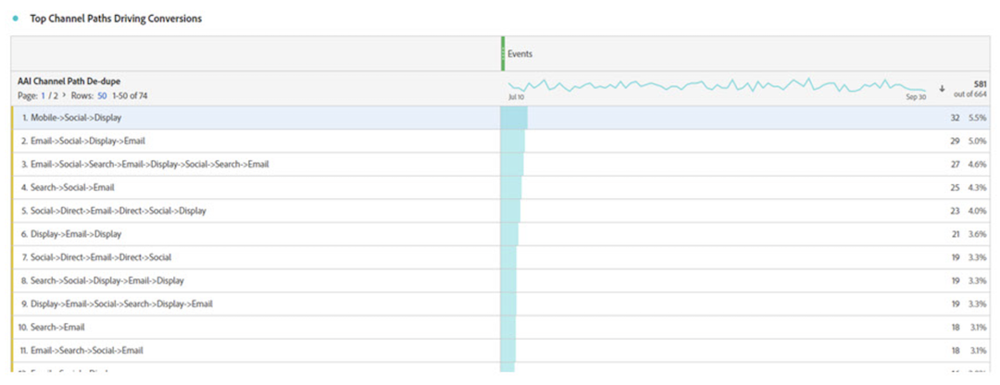
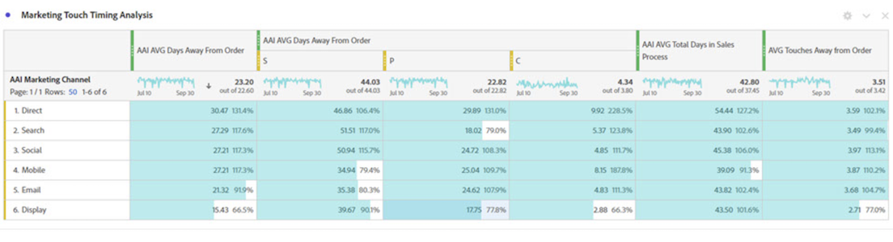

# Integrera Attribution AI med CJA

[Attribution AI](https://experienceleague.adobe.com/docs/experience-platform/intelligent-services/attribution-ai/overview.html?lang=en), som en del av Adobe Experience Platform Intelligent Services, är en flerkanalig algoritmisk attribueringstjänst som beräknar påverkan och inkrementell påverkan av kundinteraktioner i förhållande till angivna resultat. Med Attribution AI kan marknadsförarna mäta och optimera marknadsförings- och annonsutgifterna genom att förstå effekten av varje enskild kundinteraktion under varje fas av kundresan.

Attribution AI kan integreras med Customer Journey Analytics (CJA) i den utsträckning som Attribution AI kör modeller mot kundens kontaktytor för marknadsföring och konverteringsdatakällor. CJA importerar sedan utdata från dessa modeller som en datauppsättning eller kan integreras med resten av dina CJA-datauppsättningar. Datauppsättningar som har Attribution AI kan sedan utnyttjas i datavyer och rapporter i CJA.

Attribution AI stöder 3 Experience Platform scheman: Experience Event, Adobe Analytics och Consumer Experience Event.

Attribution AI har stöd för två kategorier av poäng: algoritmisk och regelbaserad.

## Algoritmiska poäng

Algoritmiska poäng inkluderar inkrementella och påverkade poäng.

* **[!UICONTROL Influenced]bakgrundsmusik** dividera 100 % av konverteringskrediten mellan olika marknadsföringskanaler.
* **[!UICONTROL Incremental]bakgrundsmusik** först och främst ta hänsyn till en konverteringsbaslinje som ni skulle ha uppnått även utan marknadsföring. Denna baslinje bygger på AI-observationer av mönster, säsongsvariation och så vidare på grund av den befintliga varumärkesigenkänningen, lojaliteten och munordet. Den återstående krediten delas upp i marknadsföringskanaler.

## Regelbaserade poäng

Regelbaserade poäng inkluderar

* **[!UICONTROL First touch]** ger 100 % uppskattning av den kontaktyta som först visas i attribueringssökningsfönstret.
* **[!UICONTROL Last touch]** ger 100 % uppskattning av den beröringspunkt som inträffade senast före konverteringen.
* **[!UICONTROL Linear]** ger samma beröm till alla kontaktytor som leder till konvertering.
* **[!UICONTROL U-shaped]** ger 40 % beröm för den första interaktionen, 40 % tack för den sista interaktionen och delar de återstående 20 % på eventuella kontaktpunkter däremellan. Vid konvertering med en enda kontaktpunkt får du 100 % kredit. För konverteringar med två kontaktpunkter får båda 50 % rabatt.
* **[!UICONTROL Time-Decay]** följer en exponentiell minskning med en anpassad halveringsparameter, där standardvärdet är 7 dagar. Vikten för varje kanal beror på hur lång tid det tar mellan öppnandet av kontaktpunkten och den slutliga konverteringen. Formeln som används för att bestämma kredit är `2^(-t/halflife)`, där `t` är tiden mellan en kontaktpunkt och en konvertering. Alla beröringspunkter normaliseras sedan till 100 %.

## Arbetsflöde

Vissa av stegen utförs i Adobe Experience Platform innan du arbetar med utdata i CJA. Utdata består av en datauppsättning med en tillämpad Attribution AI.

### Steg 1: Skapa en Attribution AI-instans

I Experience Platform skapar du en Attribution AI-instans genom att markera och mappa data, definiera händelser och utbilda data enligt beskrivningen [här](https://experienceleague.adobe.com/docs/experience-platform/intelligent-services/attribution-ai/user-guide.html).

### Steg 2: Konfigurera en CJA-anslutning till Attribution AI-datauppsättningar

I CJA kan du nu [skapa en eller flera anslutningar](/help/connections/create-connection.md) till datauppsättningar från Experience Platform som har instrumenterats för Attribution AI. Dessa datauppsättningar visas med prefixet &quot;Attribution AI Scores&quot;, vilket visas här:

### Steg 3: Skapa datavyer baserade på dessa anslutningar

I CJA [skapa en eller flera datavyer](/help/data-views/create-dataview.md) som innehåller Attribution AI-XDM-fält. (Det skulle vara bra att ha en skärmbild här.)

### Steg 4: Rapport om AAI-data på CJA-arbetsytan

I ett CJA Workspace-projekt kan ni hämta mätvärden som&quot;AI-order&quot; och dimensioner som&quot;AI Campaign Name&quot; eller&quot;AAI Marketing Channel&quot;.

>[!IMPORTANT]
>
>De här dimensionerna och måtten namnges inte internt på det här sättet. De här är&quot;egna namn&quot;. The [namnkonvention i Attribution AI](https://experienceleague.adobe.com/docs/experience-platform/intelligent-services/attribution-ai/input-output.html?lang=en#attribution-ai-output-data) följer schemasökvägen. Vi rekommenderar att du byter namn på den långa schemasökvägen i AI till korta, användarvänliga namn (mått/mått) i CJA. Du kan göra det i **[!UICONTROL Data views]** > **[!UICONTROL Edit data view]** > **[!UICONTROL Components]** tab > **[!UICONTROL Schema fields]** -> Klicka på ett schemafält -> **[!UICONTROL Component name]**.

**Order med påverkad och inkrementell poängsättning**

Här ser vi ett Workspace-projekt med AAI-data som visar order med påverkad och inkrementell poängsättning. Detaljgranska alla aspekter för att förstå attribuering genom att: kampanj, produktgrupp, användarsegment, geografi och så vidare.

**Marknadsföringsprestanda**

Jämför och kontrastera attribuering mellan olika attribueringsmodeller:

**Kanalinteraktion**

Förstå kanalinteraktion för att se vilken kanal som kan användas mest effektivt med andra kanaler med hjälp av ett Venndiagram:

**De vanligaste banorna för konvertering**

I den här tabellen visas de översta banorna för konvertering (borttagning av dubbletter) som hjälper dig att utforma och optimera kontaktytor:

**Leadtid till konvertering**

Här ser vi ledtiden till konvertering när en kontaktyta är i mixen. Det hjälper till att optimera ledtiden:

## Skillnader mellan Attribution AI och Attribution IQ

Så när bör ni använda Attribution AI data jämfört med [Attribution IQ](/help/analysis-workspace/attribution/overview.md), en inbyggd CJA-funktion? I den här tabellen visas några av skillnaderna i funktionalitet:

| Funktionalitet | Attribution AI | Attribution IQ |
| --- | --- | --- |
| Stegvis attribuering | Ja | Nej |
| Tillåter användare att justera modellen | Ja | Ja |
| Ger attribuering över flera kanaler (Obs! AAI använder inte samma sammanslagna data som CJA gör.) | Ja | Ja |
| Inkluderar påverkade poäng | Ja | Ja |
| Gör HTML-modellering | Ja | Ja |
| Regionsbaserade attribueringsmodeller | Ja | Ja |
| Kan konfigurera kontaktytor för marknadsföring i modellen | Ja | Nej |

{style=&quot;table-layout:auto&quot;}
