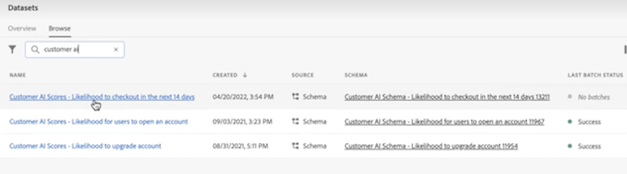
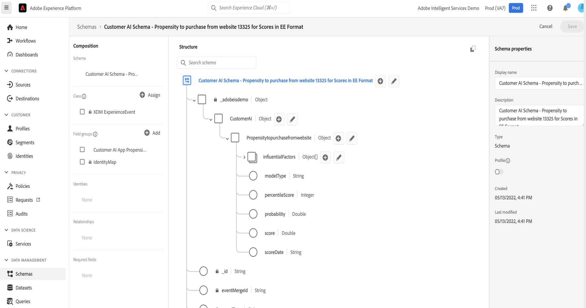
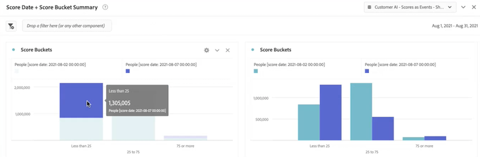
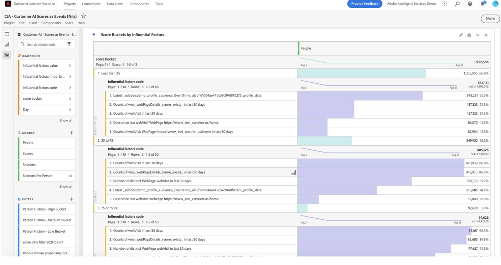

# Integrera kundens AI-data

{{release-limited-testing}}

[Kund-AI](https://experienceleague.adobe.com/docs/experience-platform/intelligent-services/customer-ai/overview.html), som en del av Adobe Experience Platform Intelligent Services, ger marknadsförarna möjlighet att generera kundprognoser på individnivå.

Med hjälp av inflytelserika faktorer kan kundens AI tala om för er vad en kund kan tänkas göra och varför. Dessutom kan marknadsförarna dra nytta av kundernas AI-prognoser och insikter för att personalisera kundupplevelser genom att leverera de lämpligaste erbjudandena och budskapen.

Kundens AI bygger på individuella beteendedata och profildata för benägenhetsbedömning. Kundens AI är flexibelt eftersom det kan användas i flera datakällor, bland annat Adobe Analytics, Adobe Audience Manager, data för kundupplevelsehändelser och händelsedata för upplevelsehändelser. Om du använder Experience Platform källanslutning för att hämta in Adobe Audience Manager- och Adobe Analytics-data hämtar modellen automatiskt standardhändelsetyperna för att utbilda och poängsätta modellen. Om du tar med din egen Experience Event-datauppsättning utan standardhändelsetyper måste alla relevanta fält mappas som anpassade händelser eller profilattribut om du vill använda dem i modellen. Detta kan du göra i kundens AI-konfigurationssteg i Experience Platform.

Kundens AI kan integreras med Customer Journey Analytics i den utsträckning som kundens AI-aktiverade datauppsättningar kan utnyttjas i datavyer och rapporter i Customer Journey Analytics. Ni kan:

* **Spåra benägenhetspoäng för ett användarsegment över tid**.
   * Användningsexempel: Förstå sannolikheten för att kunder i ett visst segment ska konvertera.
   * Exempel: En marknadsförare i en hotellkedja vill förstå sannolikheten för att en hotellkund ska köpa en showbiljett på hotellets konsertplats.
* **Analysera vilka lyckade händelser eller attribut som är associerade med benägenhetspoäng**.
   * Använd skiftläge: Förstå attribut eller framgångshändelser som är kopplade till benägenhetspoängen.
   * Exempel: En marknadsförare i en hotellkedja vill förstå hur inköp av showbiljetter på en konsertplats på ett hotell kopplas till benägenhetspoäng.
* **Följ inmatningsflödet för kundbenägenhet över olika poängserier**.
   * Användningsexempel: Förstå personer som till en början var lågbenägna användare och som senare blev högbenägna användare.
   * Exempel: En marknadsförare i en hotellkedja vill förstå vilka hotellkunder som ursprungligen identifierades som kunder med låg benägenhet att köpa en showbiljett, men som med tiden blivit kunder med stor benägenhet att köpa en showbiljett.
* **Titta på fördelningen av benägenheten**.
   * Användningsfall: Förstå fördelningen av benägenhetspoäng för att vara mer exakt när du definierar segment.
   * Exempel: En återförsäljare vill göra en viss kampanj för 50 USD av en produkt. De kanske bara vill göra en mycket begränsad befordran på grund av budgeten osv. De analyserar data och bestämmer sig för att endast inrikta sig på de 80 % mer av sina kunder.
* **Titta på sannolikheten att utföra en åtgärd för en viss kohort över tiden**.
   * Användningsfall: Spåra en viss kohort över tid.
   * Exempel: En marknadsförare i en hotellkedja vill spåra sin bronsitet mot sin silvernivå, eller silverskikt mot sin guldskikt, över tiden. De ser varje kohorts benägenhet att boka hotellet över tid.

Så här integrerar du kundens AI-data med Customer Journey Analytics:

>[!NOTE]
>
>Vissa av stegen utförs i Adobe Experience Platform innan du arbetar med utdata i Customer Journey Analytics.

## Steg 1: Konfigurera en AI-instans för kund

När du har förberett dina data och har alla dina autentiseringsuppgifter och scheman på plats börjar du med att följa guiden [Konfigurera en AI-kundinstans](https://experienceleague.adobe.com/docs/experience-platform/intelligent-services/customer-ai/user-guide/configure.html) i Adobe Experience Platform.

## Steg 2: Konfigurera en Customer Journey Analytics-anslutning till kundens AI-datauppsättningar

I Customer Journey Analytics kan du nu [skapa en eller flera anslutningar](/help/connections/create-connection.md) till Experience Platform-datauppsättningar som har instrumenterats för kundens AI. Varje förutsägelse, som&quot;Sannolikhet att uppgradera konto&quot;, motsvarar en datauppsättning. Dessa datauppsättningar visas med prefixet&quot;Customer AI Scores in EE Format - name_of_application&quot;.

>[!IMPORTANT]
>
>Varje kund-AI-instans har två utdatamängder om växlingsknappen är aktiverad för att aktivera bakgrundsmusik för Customer Journey Analytics under konfigurationen i steg 1. En utdatamängd visas i profilens XDM-format och en i Experience Event XDM-format.

Här är ett exempel på ett XDM-schema som Customer Journey Analytics tar med som en del av en befintlig eller ny datamängd:

(Observera att exemplet är en profildatauppsättning. Samma uppsättning schemaobjekt skulle ingå i en Experience Event-datauppsättning som Customer Journey Analytics skulle hämta. Experience Event-datauppsättningen skulle innehålla tidsstämplar som poängdatum.) Alla kunder som får poäng i den här modellen har poäng, scoreDate osv. som är kopplade till dem.

## Steg 3: Skapa datavyer baserade på dessa anslutningar

I Customer Journey Analytics kan du nu fortsätta till [skapa datavyer](/help/data-views/create-dataview.md) med de dimensioner (till exempel poäng, poängdatum, sannolikhet och så vidare) och mått som togs med som en del av anslutningen som du upprättade.

## Steg 4: Rapport om CAI-poäng i Workspace

Skapa ett nytt projekt och dra in visualiseringar i Customer Journey Analytics Workspace.

### Betyg för trendbenägenhet

Här är ett exempel på ett Workspace-projekt med CAI-data som trendar benägenhetspoängen för ett användarsegment över tiden, i &#x200B; staplade stapeldiagram:

### Tabell med orsakskoder

Här är en tabell som visar orsakskoder för varför ett segment har hög eller låg &#x200B;:

### Anmälningsflöde för kundbenägenhet

I det här flödesdiagrammet visas inmatningsflödet för kundens benägenhet jämfört med olika poängserier &#x200B;:

### Fördelning av benägenhetspoäng

I det här stapeldiagrammet visas hur &#x200B; kan fördelas:

### Propenthypsöverlappningar

I det här Venedig-diagrammet visas hur benägenheten överlappar olika poäng:

