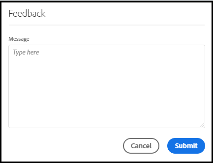

# [!UICONTROL Labs] Användarhandbok

>[!NOTE]
>
>Den här funktionen finns för närvarande i [begränsad testning](/help/release-notes/releases.md).

[!UICONTROL Labs] gör det möjligt att skapa snabbare prototyper av idéer i ett tidigt skede. Det är en kombination av verktyg och processer som snabbar upp utvecklingen på ett öppet sätt, med kundfokus. Det gör det möjligt för användarna att interagera med ny teknik, att upptäcka värdefulla insikter och att påverka framtida funktionsutveckling och prioriteringar. Du kan använda Labs för att få tidig tillgång till innovationer i Customer Journey Analytics (CJA) och för att utvärdera kommande funktioner i samband med era egna affärsanvändningsfall och data.

## Krav

[!UICONTROL Labs] aktiveras automatiskt för alla administratörer. Övriga teammedlemmar bör kontakta produktadministratörer och begära åtkomst.

Om du inte redan har gjort det läser du och signerar de tillämpliga formulären för sekretessavtal och villkor.

## Öppna [!UICONTROL Labs] Portal

För åtkomst [!UICONTROL Labs]:

1. Om du inte redan har åtkomst till [!UICONTROL Workspace] och [!UICONTROL Labs]ber du administratören om behörighet.

1. I CJA klickar du på **[!UICONTROL Labs]** -fliken.

## Utvärdera en prototyp

Så här startar och utvärderar du en prototyp:

1. På [!UICONTROL Labs] skärm, klicka **[!UICONTROL Launch]** för den prototyp du vill se. När prototypen startas visas dess namn i det övre vänstra hörnet i prototypmiljön.

   lägg till skärmbild här

1. Se en video som markerar prototypen genom att klicka **[!UICONTROL Watch Video]** i skärmens övre högra hörn. Klicka **[!UICONTROL Close]** när videon är klar.

   lägg till skärmbild här

1. Arbeta med prototypen. När du arbetar i prototypmiljön:

* Projekt som skapas i prototypmiljön kan inte sparas eller delas.

* I en prototyp kan du utvärdera data med alla dimensioner, mått, segment och visualiseringar som du annars har tillgång till i Workspace.

* Ändringar som du gör i en prototyp påverkar inte datainsamling eller -bearbetning.

* Ändringar som görs genom att segment, beräknade värden och aviseringar skapas eller ändras kvarstår utanför prototypmiljön.

## Lämna feedback

1. Klicka **[!UICONTROL Give Feedback]** för att kunna ge feedback i meddelanderutan när som helst när du arbetar med prototypen.

   

1. Klicka **[!UICONTROL Submit]** för att skicka feedback.

1. Om du vill prova en annan prototyp eller avsluta prototypmiljön klickar du på **[!UICONTROL Leave Prototype]** i skärmens övre högra hörn och fyll i den korta enkäten för prototypen. Alla ändringar som görs i ett prototypprojekt går förlorade när prototypmiljön avslutas.

   

1. Klicka **[!UICONTROL Submit]** för att återgå till huvudportalen för förhandsvisningar.

## CJA Labs-prototyper

* Insiktsgenerator på naturspråk: Innehåller en sammanfattning av alla data på ett naturligt språk som du analyserar i en frihandstabell.
* Visualiseringsrekommendation: Rekommenderar visualiseringar som fungerar bra tillsammans med dina data.

## Ytterligare information

* Vissa prototyper i [!UICONTROL Labs] och blir Customer Journey Analytics-funktioner, andra kanske inte gör det. Din feedback styr beslutet, så granska prototyperna och berätta för Adobe hur värdefulla du hittar dem.
* Labs är tillgängliga för alla SKU-berättiganden.
