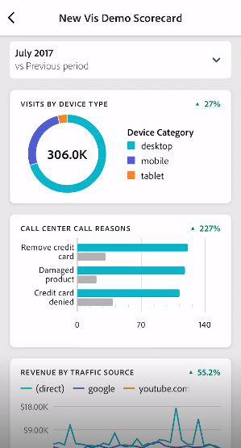

# Hantera styrkort

I det här avsnittet beskrivs hur du kan visa och hantera styrkortselement.

## Visa och konfigurera egenskaper för paneler {#tiles}

När du klickar på en platta i styrkortsverktyget visas egenskaperna och egenskaperna för plattan och dess detaljbild i den högra listen. I den här rälsen kan du ange en ny **titel** för plattan och alternativt konfigurera plattan genom att använda segment.

## Visa detaljbilder {#view-detail-slides}

När du klickar på paneler visas i ett dynamiskt popup-fönster hur detaljbilden visas för den verkställande användaren i appen. Du kan lägga till dimensioner för att dela upp dina data efter dina specifika behov. Om en dimension inte har tillämpats är fördelningsdimensionen **timme** eller **dagar**, beroende på standarddatumintervallet.

Uppdelningar förfinar analysen genom att dela upp mätvärden efter dimensionsobjekt som exempelvis följande:

* Unika besökarvärden uppdelade efter annonsplattform (AMO-ID)
* Besök uppdelade efter produktkategori (detaljhandel)
* Total intäkt uppdelad efter produktnamn

Varje dimension som läggs till i rutan visas i en nedrullningsbar meny i den detaljerade vyn av programmet. Den verkställande användaren kan sedan välja bland de alternativ som listas i listrutan.

## Anpassa detaljbilder {#customize-detail-slide}

Med skräddarsydda detaljbilder kan ni målinrikta er ännu mer om vilken information ni delar med er målgrupp.

>[!BEGINSHADEBOX]

Se  [Anpassade detaljvyer](https://video.tv.adobe.com/v/3428930?quality=12&learn=on&captions=swe){target="_blank"} för en demonstrationsvideo.

>[!ENDSHADEBOX]

Du kan ändra layouten för varje detaljbild och lägga till text som bättre förklarar vad slutanvändaren kan se i informationen. Du kan också ändra diagramtyp med hjälp av den nedrullningsbara menyn.

### Ändra bildrutelayout

Ändra bildrutelayouten så att den fokuserar på den viktigaste informationen. Du kan till exempel ändra layouten så att bara ett diagram eller en tabell visas. Om du vill ändra bildrutelayouten väljer du ett av de fördesignade formaten.

Du kan också ändra bildrutelayouten genom att dra och släppa visualiseringskomponenter från den vänstra listen på arbetsytan. Varje detaljbild kan endast innehålla två visualiseringar åt gången.

### Lägga till beskrivande text i en bildruta

Du kan lägga till text för att ge meningsfull information om vad som finns i diagrammen eller nyanserna om data.

Om du vill lägga till text i en detaljbildruta väljer du en layout som visar symbolen `T` eller drar och släpper textvisualiseringskomponenten från den vänstra listen. Textredigeraren öppnas automatiskt när du lägger till en ny textvisualisering eller väljer en bildlayout med text. I textredigeraren finns alla standardalternativ för formatering av texten. Du kan använda textformat som stycke, rubriker och underrubriker och använda fet och kursiv stil. Du kan justera text, lägga till punktlistor och numrerade listor samt lägga till länkar. När du är klar med redigeringen klickar du på minimeringsknappen i det övre högra hörnet av textredigeraren för att stänga den. Om du vill redigera text som du redan har lagt till väljer du pennikonen och öppnar textredigeraren igen.

## Ta bort komponenter {#remove}

Om du vill ta bort en komponent som har tillämpats på hela styrkortet klickar du var som helst på styrkortet utanför rutorna och tar sedan bort den genom att klicka på **x** som visas när du håller muspekaren över komponenten, så som visas nedan för **förstagångsbesök** :

## Skapa dataartiklar {#create-data-story}

En databerättelse är en samling datapunkter, kontext och relaterade mått som bygger på ett centralt tema eller mätvärden.

Om du till exempel fokuserar på webbtrafik kan det vara dina viktigaste mätvärden, men du kanske också är intresserad av nya personer, unika personer, och du kanske vill se data uppdelade efter webbsida eller efter vilken typ av enhet som trafiken kommer från. Med hjälp av datarubriker i mobilstyrningsprojekt kan du placera dina viktigaste mätvärden i centrum samtidigt som du berättar hela artikeln bakom mätvärdena med flera detaljbilder.

Titta på videon och lär dig mer om hur du skapar databerättelser i mobilstyrkortsprojekt i Analysis Workspace.

>[!BEGINSHADEBOX]

En demonstrationsvideo finns i  [Databerättelser för Mobile Scorecard-projekt](https://video.tv.adobe.com/v/3416392/?quality=12&learn=on){target="_blank"} .

>[!ENDSHADEBOX]

**Så här skapar du en dataartikel** {#data-story-create}

Bygg din databerättelse genom att lägga till flera detaljbilder i en ruta.

1. Börja med ett mobilstyrningsprojekt.
1. Välj en platta som du vill skapa en artikel från.
   
   {width=".50%"}
1. Lägg till bilder för att skapa din databerättelse. Den första bilden genereras som standard.
Om du vill lägga till nya bildrutor håller du markören över eller klickar på en bildruta och väljer sedan bland de tillgängliga alternativen:
   * Tryck på +-tecknet för att skapa en ny bildruta.
   * Tryck på ikonen Duplicera om du vill duplicera den befintliga bildrutan.
1. Om du skapar en tom bildruta drar och släpper du komponenter från den vänstra listen, eller väljer en layout som automatiskt fyller bildrutan med data från den.
   
Om du vill ta bort en bildruta trycker du på papperskorgsikonen.

### Anpassa en dataartikel {#customize-data-story}

Med hjälp av dataartiklar kan du anpassa allt så att du kan dela information som du vill dela och utesluta allt som du inte behöver. Du kan anpassa plattor och enskilda bildrutor för att lägga till segment, visa uppdelningar, ändra layout och ändra visualiseringar.

**Anpassa rutor**

1. Tryck på en platta. Den markerade plattan visas med blå konturer och den högra panelen visar rutans egenskaper.
1. Ändra alternativ för rubrik, diagramtyp och annan ruta.
1. Dra en komponent till plattan.
   
När du drar och släpper en komponent, t.ex. en visualisering, på en platta används komponenten på alla bilder i en dataartikel.
1. Om du bara vill ändra titeln håller du ned Skift-tangenten för att tillämpa ändringen.
   

>[!NOTE]
>Bilder ärver komponenter från plattan, men rutor ärver inte komponenter från bildrutor.

**Anpassa enskilda bilder**

Du kan ändra visualiseringen för enskilda bilder i en dataartikel. Du kan till exempel ändra ett vågrätt fält till ett ringdiagram för en viss bildruta. Du kan också ändra layouten. Se [Anpassa detaljbilder](#customize-detail-slide).

### Förhandsgranska en dataartikel {#preview-data-story}

När du har skapat en dataartikel använder du knappen **Förhandsgranska** för att visa och interagera med en dataartikel som om du var en appanvändare. Mer information om hur du förhandsgranskar din dataartikel finns i [Förhandsgranska ett styrkort](#preview)

### Navigera mellan rutor och bilder {#navigate-tiles-slides}

I navigeringsfältet visas ikoner som representerar vad som finns på varje bildruta. Navigeringsfältet gör det enkelt att navigera till en viss bildruta om du har många bildrutor.

Om du vill flytta mellan plattan och bildrutorna trycker du på navigeringsfältet.

{width="45%"}

Du kan också navigera fram och tillbaka genom att använda pilarna på tangentbordet eller genom att markera en komponent och hålla den till vänster eller höger på skärmen för att rulla.

## Förhandsgranska styrkort {#preview}

Du kan förhandsgranska hur styrkortet kommer att se ut och fungera när det har publicerats i appen Adobe Analytics dashboards.

1. Klicka på **[!UICONTROL Preview]** i skärmens övre högra hörn.

   

1. Om du vill visa hur styrkortet kommer att se ut på olika enheter väljer du en enhet i listrutan [!UICONTROL Device preview].

   

1. Om du vill interagera med förhandsgranskningen kan du:

   * Vänsterklicka för att simulera knackning på telefonskärmen.

   * Använd datorns rullningsfunktion för att simulera rullning av telefonskärmen med fingret.

   * Klicka och håll ned för att simulera att du trycker och håller fingret på telefonskärmen. Detta är användbart när du vill interagera med visualiseringarna i den detaljerade vyn.

## Dela styrkort {#share}

Så här delar du styrkortet med en verkställande användare:

1. Klicka på menyn **[!UICONTROL Share]** och välj **[!UICONTROL Share scorecard]**.

1. Fyll i fälten i formuläret **[!UICONTROL Share Mobile Scorecard]** genom att:

   * Ange namnet på styrkortet
   * Ange en beskrivning av styrkortet
   * Lägga till relevanta taggar
   * Ange mottagare för styrkortet

1. Klicka på **[!UICONTROL Share]**.

När du har delat ett styrkort kan mottagarna komma åt det på sina kontrollpaneler i Analytics. Om du gör efterföljande ändringar av styrkortet i styrkortsverktyget uppdateras de automatiskt i det delade styrkortet. Chefsanvändare ser sedan ändringarna när de har uppdaterat styrkortet i sin app.

Om du uppdaterar styrkortet genom att lägga till nya komponenter kanske du vill dela styrkortet igen (och markera alternativet **[!UICONTROL Share embedded components]**) för att se till att dina chefsanvändare har tillgång till dessa ändringar.

### Dela styrkort med hjälp av en delbar länk

Genom att använda en delbar länk är det enkelt att dela ett styrkort i ett e-postprogram, dokument eller textmeddelandeprogram. Med den delbara länken kan mottagarna öppna styrkortet på sina datorer eller i kontrollpanelernas mobilapp. Enkel, djup länkning gör det ännu enklare att dela projekt och öka engagemanget med era intressenter.

Dela ett styrkort med hjälp av en delbar länk

1. Klicka på menyn **[!UICONTROL Share]** och välj **[!UICONTROL Share scorecard]**.

   

1. Kopiera länken och klistra in den i ett e-postmeddelande, dokument eller en snabbmeddelandeapp.

   När en mottagare använder en datorapp eller en webbläsare för att öppna länken öppnas ett mobilstyrkortsprojekt i Workspace.

   När en mottagare öppnar länken på en mobil enhet öppnas styrkortet direkt i Adobe Analytics-appen för instrumentpaneler.

   Om en mottagare inte har laddat ned mobilappen dirigeras han/hon till applistan i App Store eller Google Play Store där han/hon kan ladda ned den.

## Ta bort dimensionsobjektet [!UICONTROL Unspecified] {#remove-dims}

Om du vill ta bort [!UICONTROL Unspecified] dimensionsobjekt från dina data gör du följande:

1. Välj rätt platta.
1. I den högra listen, under **[!UICONTROL Drill ins]**, väljer du högerpilen bredvid dimensionsobjektet vars **[!UICONTROL Unspecified]** objekt du vill ta bort.

   

1. Klicka på ikonen bredvid **[!UICONTROL Unspecified]** för att ta bort ospecificerade data från din rapportering. (Du kan även ta bort andra dimensionsobjekt.)

## Visa intelligenta bildtexter i styrkort {#captions}

Intelligenta bildtexter kan hjälpa icke-analytiker att förstå sina data bättre utan hjälp av analytiker. Intelligenta bildtexter använder avancerad maskininlärning och generativ AI för att ge värdefulla insikter på naturspråket för visualiseringar.

Dessa bildtexter bygger på viktiga statistiska insikter i data och formulerar dem på naturligt språk, vilket hjälper icke-analytikerna att utveckla sin datakunskap.

Intelligent bildtext finns för alla visualiseringar i mobilappen, inklusive Line, Donut, Bar Chart och Summary Number.

Så här visar du intelligenta bildtexter i ett mobilstyrkort:

1. Klicka i ett styrkort i en ruta. I det här styrkortet klickar du till exempel i linjediagrammet längst ned.

   

1. Tryck på den blå ikonen längst upp till höger för att generera bildtexterna. Bildtexterna visas under linjediagrammet.

   

1. Svep åt höger för att visa alla intelligenta bildtexter.

   Intelligenta bildtexter kan peka på datatoppar, avvikelser, trender, minskningar, korrelationer och andra fenomen.

1. Tryck på den svarta flaggan i en bildtext för att rapportera ett problem, till exempel skadligt eller olagligt innehåll.

   

1. Klicka på X för att avsluta dialogrutan **[!UICONTROL Report results]**.
