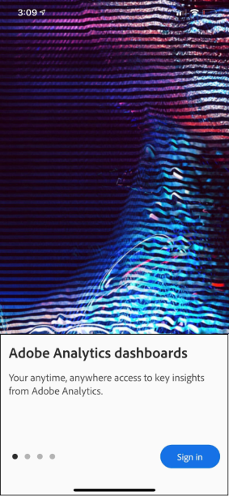
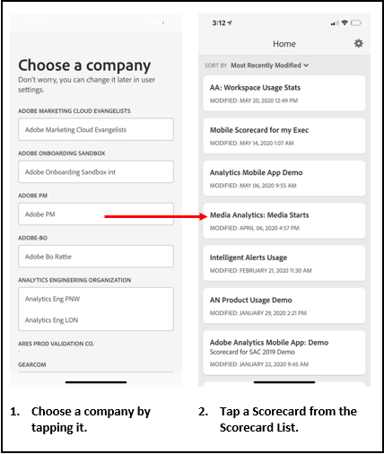
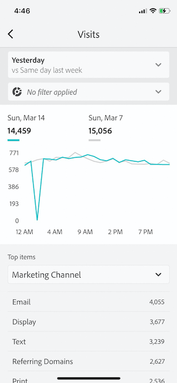
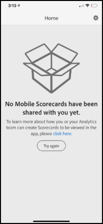

# Konfigurera företagsanvändare för att använda kontrollpaneler

I vissa fall kan företagsledare behöva lite extra hjälp för att komma åt och använda appen. I det här avsnittet finns information som kan hjälpa lärarna att få hjälp med detta.

## Se till att appanvändare har tillgång till Adobe Analytics

1. Konfigurera nya användare i [Experience Cloud Admin Console](https://experienceleague.adobe.com/docs/analytics/admin/admin-console/permissions/product-profile.html).

1. Om du vill kunna dela styrkort måste du ge programanvändare behörighet att komma åt styrkortskomponenter som Analysis Workspace, de datavyer som styrkort baseras på samt segment, mått och mått.

## Systemkrav för appanvändare

För att se till att företagsinterna användare har tillgång till dina styrkort i appen ska du se till att:

* De lägsta kraven för mobiloperativsystem på enheterna är iOS version 10 eller senare, eller Android version 4.4 (KitKat) eller senare
* De har en giltig inloggning på Customer Journey Analytics.
* Du har skapat mobila styrkort för dem och delat dem med dem.
* De har tillgång till de komponenter som styrkortet innehåller. Observera att du kan välja ett alternativ när du delar dina styrkort till **[!UICONTROL Share embedded components]**.

## Hjälp chefer att hämta och installera program

>[!NOTE]
>
>Även om mobilappen heter Adobe Analytics Dashboard i appbutiken kan appen användas på samma sätt med Customer Journey Analytics mobilstyrkort.

**För företagsledare på iOS:**

Klicka på följande länk (den är också tillgänglig i Customer Journey Analytics under **[!UICONTROL Tools]** > **[!UICONTROL Analytics dashboards (mobile opp)]**) och följ anvisningarna för att hämta, installera och öppna appen:

`[iOS link](https://apple.co/2zXq0aN)`

**För företagsledare på Android:**

Klicka på följande länk (den är också tillgänglig i Customer Journey Analytics under **[!UICONTROL Tools]** > **[!UICONTROL Analytics dashboards (mobile app)]**) och följ anvisningarna för att hämta, installera och öppna appen:

`[Android link](https://bit.ly/2LM38Oo)`

När de har hämtats och installerats kan företagsanvändare logga in i appen med sina befintliga Customer Journey Analytics-autentiseringsuppgifter. Vi stöder både Adobe och Enterprise/Federated ID.

## Hjälp cheferna att komma åt styrkortet

1. Låt chefsanvändare logga in i appen.

   Skärmen **[!UICONTROL Choose a company]** visas. På den här skärmen visas de inloggningsföretag som den verkställande användaren tillhör.

1. Låt dem trycka på namnet på inloggningsföretaget eller Experience Cloud Org som gäller för styrkortet som du delade.

   Styrkortslistan visar sedan alla styrkort som har delats med den verkställande direktören under det inloggningsföretaget.

1. Låt dem sortera den här listan efter **[!UICONTROL Most recently modified]**, om tillämpligt.

1. Låt dem trycka på namnet på styrkortet för att visa det.

   

### Förklara styrkortets användargränssnitt

Förklara för den verkställande användaren hur rutor visas i de styrkort som du delar.

Ytterligare information om plattor:

* Miniatyrdiagrammens granularitet beror på datumintervallets längd:
* En dag visar en timtrend
   * Mer än en dag och mindre än ett år visar en daglig trend
   * Ett år eller mer visar en vecktrend
   * Formeln för ändring av procentvärde är metrisk summa (aktuellt datumintervall) - metrisk summa (jämförelsedatumintervall) / metrisk summa (jämförelsedatumintervall).
   * Du kan dra ned skärmen för att uppdatera styrkortet.

1. Tryck på en platta för att visa hur en detaljerad uppdelning för plattan fungerar.

   

   * Tryck på en punkt i ett miniatyrdiagram för att se data som hör till den punkten på raden.

   * En tabell inkluderas för att visa data med dimensioner som har lagts till i rutan. Tryck på nedpilen för att välja mått. Om ingen dimension har lagts till i rutan visas diagramdata i tabellen.

1. Om du vill ändra datumintervall för styrkortet trycker du på datumhuvudet och väljer den primära kombination och den kombination av datumintervall som du vill visa.

   

## Ändra appinställningar

Om du vill ändra inställningarna trycker du på alternativet **[!UICONTROL Preferences]** ovan. I inställningarna kan du aktivera biometrisk inloggning eller ställa in programmet för mörkt läge enligt nedan:

## Felsökning

Om den verkställande användaren loggar in och ser ett meddelande om att inget har delats:

* Den verkställande användaren kan ha valt fel Customer Journey Analytics-sandlåda, eller
* Styrkortet kanske inte har delats med den verkställande användaren.

Kontrollera att chefsanvändaren kan logga in i rätt Customer Journey Analytics-sandlåda och att styrkortet har delats.
