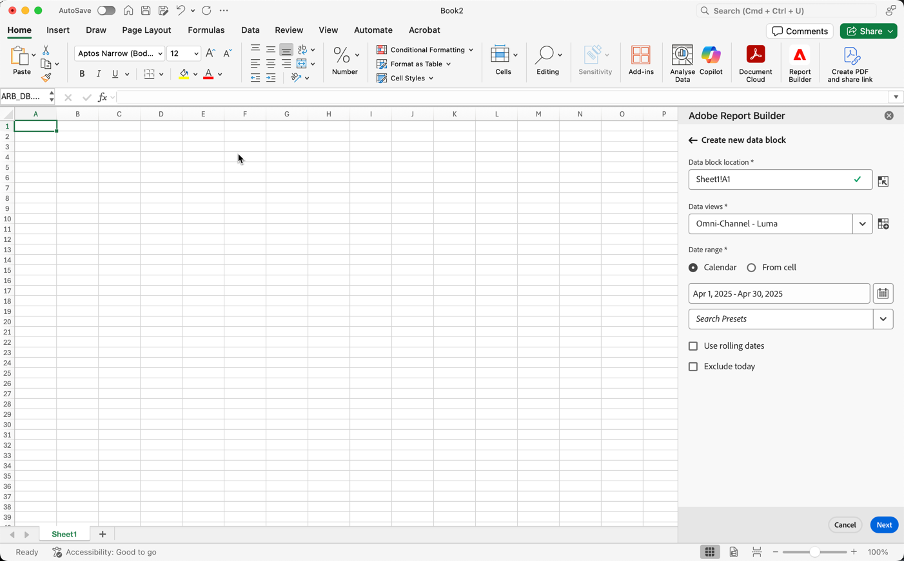
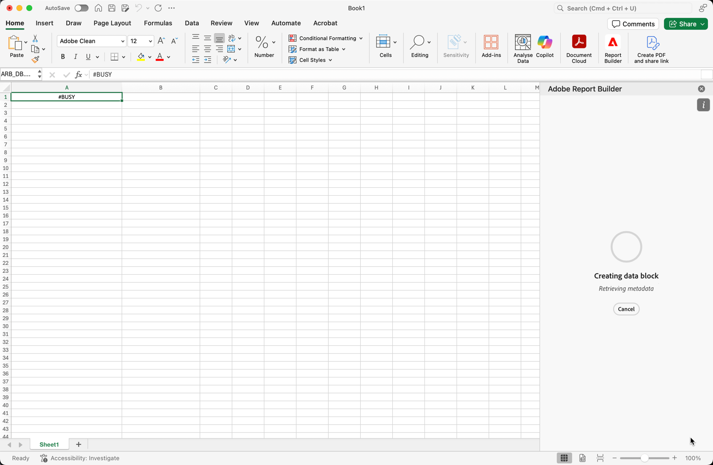
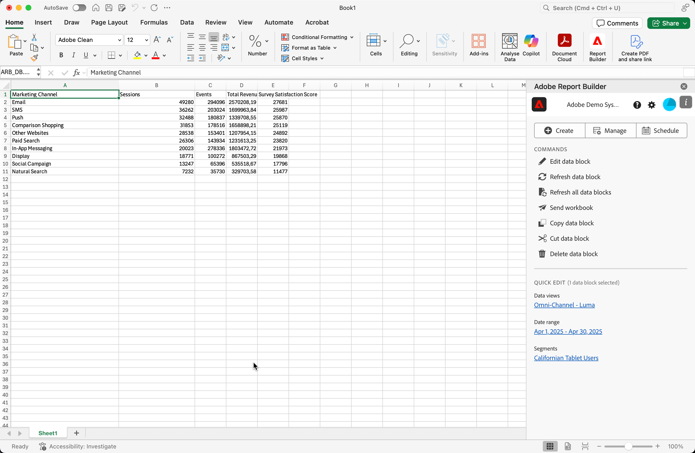

# Skapa ett datablock

Ett *datablock* är den datatabell som skapas av en enskild databegäran. En Report Builder-arbetsbok kan innehålla flera datablock. När du skapar ett datablock konfigurerar du först datablocket och skapar sedan datablocket.

## Konfigurera datablocket

Konfigurera de inledande datablocksparametrarna för datablockets plats, datavyer och datumintervall.

1. Välj  **[!UICONTROL Create]**.

   

1. Ange **[!UICONTROL Data block location]**.

   Platsalternativet för datablocket definierar den plats i kalkylbladet där rapportbyggaren lägger till data i kalkylbladet.

   Om du vill ange platsen för datablocket markerar du en enskild cell i kalkylbladet eller anger en celladress som `a3`, `\\\$a3`, `a\\\$3` eller `sheet1!a2`. Den angivna cellen kommer att vara det övre vänstra hörnet i datablocket när data hämtas.

   Använd  om du vill välja en plats för ett datablock från den markerade cellen i kalkylbladet.

1. Välj **[!UICONTROL Data views]**.

   Med alternativet Datavyer kan du välja en datavy från en nedrullningsbar meny eller referera till en datavy från en cellplats.

   Välj  om du vill skapa en datavy från en cell.

1. Ange **[!UICONTROL Date range]**.

   Med datumintervallalternativet kan du välja ett datumintervall. Datumintervall kan vara fasta eller rullande. Mer information om alternativ för datumintervall finns i [Välj ett datumintervall](select-date-range.md).

   Välj **[!UICONTROL Calendar]** om du vill välja ett dataintervall med  eller ange ett datumintervall manuellt. Du kan också välja en förinställning i listrutan Sökförinställningar.

   Välj **[!UICONTROL From Cell]** om du vill definiera start- och slutdata baserat på en cell i det aktuella bladet.

1. Välj **Nästa**.

   

   När du har konfigurerat datablocket kan du välja mått, mätvärden och segment för att skapa datablocket. Flikarna Dimensioner, Metrisk och Segment visas ovanför rutan Tabellverktyg.

## Bygg datablocket

Om du vill skapa datablocket väljer du rapportkomponenter och anpassar sedan layouten.

1. Lägg till dimensioner, mått och segment.

   Bläddra i komponentlistorna eller använd fältet **sök** för att hitta komponenter. Dra och släpp komponenter till tabellrutan eller dubbelklicka på ett komponentnamn i listan för att automatiskt lägga till komponenten i tabellrutan.

   Dubbelklicka på en komponent för att lägga till komponenten i ett standardavsnitt i tabellen.

   - Dimension-komponenter läggs till i avsnittet Rad eller i kolumnavsnittet om du redan har en dimension i kolumnerna.
   - Datumkomponenter läggs till i avsnittet Kolumn.
   - Segmentkomponenter läggs till i segmentavsnittet.

### Startdatum som Dimension

Ange startdatumet som en dimension för att tydligt identifiera startdatumet för ditt datablock. Detta är praktiskt om du har en schemalagd rapport med ett löpande datumintervall eller om du har ett okonventionellt datumintervall och du behöver inte ta hänsyn till startdatumet.

1. Ordna objekten i tabellrutan för att anpassa layouten för ditt datablock.

   Dra och släpp komponenter i tabellrutan för att ändra ordning på komponenterna eller högerklicka på ett komponentnamn och välj på Alternativ-menyn.

   När du lägger till komponenter i tabellen visas en förhandsvisning av datablocket på datablockets plats i kalkylbladet. Layouten för förhandsgranskningen av datablocket uppdateras automatiskt när du lägger till, flyttar eller tar bort objekt i tabellen.

   

### Visa eller dölj rad- och kolumnrubriker

1. Välj ikonen **[!UICONTROL Table]** .

   

1. Markera eller avmarkera alternativet Visa rad- och kolumnrubriker. Rubrikerna visas som standard.

### Dölja eller visa dimensionsetiketter och måttrubriker

Markera ellipsikonen på dimensionerna eller kolumnrubrikerna för att visa inställningarna.

1. Välj  **[!UICONTROL Hide]** eller  **[!UICONTROL Show]** för att växla dimensionsetiketter eller kolumnrubriker. Alla etiketter visas som standard.

1. Välj **[!UICONTROL Finish]**.

Ett bearbetningsmeddelande visas när analysdata hämtas.

Report Builder hämtar data och visar det ifyllda datablocket i kalkylbladet.

