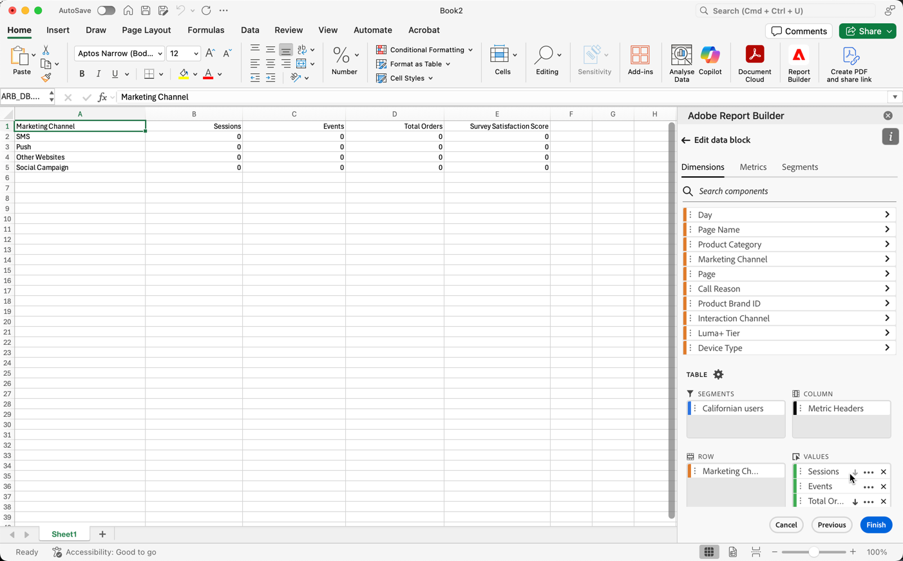
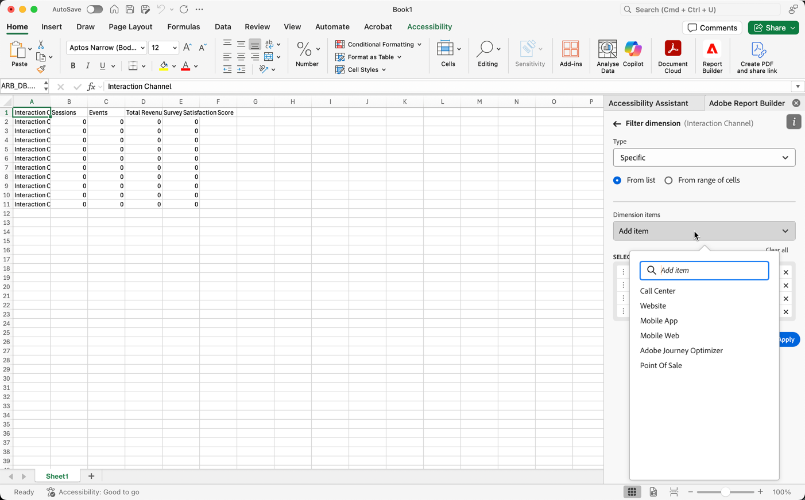
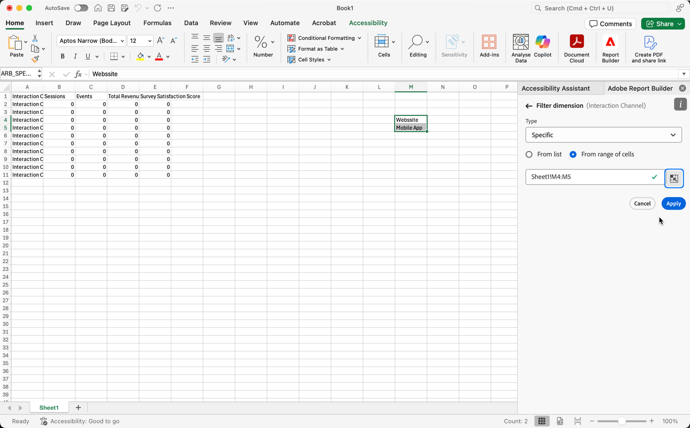

# Filterdimensioner

Som standard returnerar varje dimensionsartikel i tabellen de 10 översta artiklarna för den dimensionen.

Så här ändrar du dimensionsobjekten som returneras för varje dimension:

1. Markera en cell i datablocket.

1. Välj  **[!UICONTROL Edit data block]** på panelen **[!UICONTROL Commands]**.

1. Välj **[!UICONTROL Next]** om du vill visa fliken **[!UICONTROL Dimensions]**.

1. Välj  bredvid ett komponentnamn i tabellen.

   {zoomable="yes"}

1. Välj **[!UICONTROL Filter dimension]** på snabbmenyn för att visa rutan **[!UICONTROL Filter dimension]**.

1. Välj **Mest populära** eller **Specifik** som **[!UICONTROL Type]**.

   {zoomable="yes"}

1. Välj lämpliga alternativ baserat på vald [filtertyp](#filter-type).

1. Välj **[!UICONTROL Apply]** om du vill lägga till filtret.

1. Report Builder visar ett meddelande som bekräftar det tillagda filtret.

Håll pekaren över en dimension om du vill visa använda filter. Dimensioner med använda filter visar en -filterikon bredvid dimensionsnamnet.

## Ändra filter och sorteringsordning

En  eller  visas bredvid mätvärdet som används för att filtrera och sortera datablocket. Pilens riktning anger om måttet är sorterat i stigande eller fallande ordning.

Så här ändrar du sorteringsordningen:

- Välj  eller  bredvid måttet för att växla sorteringsordning.

Så här ändrar du måtten som används för att filtrera och sortera datablocket:

1. Håll pekaren över den önskade måttkomponenten i tabellverktyget för att visa ytterligare alternativ.

2. Välj  för det önskade måttet.

   {zoomable="yes"}

## Filtertyp

Det finns två sätt att filtrera dimensionsobjekt: [Mest populära](#most-popular) och [Specifika](#specific-filtering)

### **[!UICONTROL Most popular]**

Med alternativet **[!UICONTROL Most popular]** kan du dynamiskt filtrera dimensionsobjekt baserat på mätvärden. De vanligaste returnerar de högst rankade dimensionsobjekten baserat på måttvärden. Som standard listas de första 10 dimensionsobjekten, sorterade efter det första mätvärdet som lagts till i datablocket.

{zoomable="yes"}

#### Alternativ för sidor och rader

Använd fälten **[!UICONTROL Page]** och **[!UICONTROL Rows]** för att dela upp data i sekventiella grupper eller sidor. Med den här funktionen kan du hämta andra rankade radvärden än de översta i rapporten. Och är särskilt användbart när du vill hämta data över gränsen på 50 000 rader.

Standardvärdet för sidan är `1` och för rader är `10`. Dessa standardvärden innebär att varje sida har 10 rader med data. Sidan 1 returnerar de 10 översta objekten, sidan 2 returnerar de 10 efterföljande objekten och så vidare.

Tabellen nedan innehåller exempel på sid- och radvärden och resultatet.

| Sida | Rad | Utdata |
|------|--------|----------------------|
| 1 | 10 | De 10 viktigaste objekten |
| 2 | 10 | Objekt 11-20 |
| 1 | 100 | Top 100 items |
| 2 | 100 | Posterna 101-200 |
| 2 | 50 000 | 50 001-100 000 |

Tabellen nedan innehåller minimi- och maximivärden för sidor och rader.

|       | Minimivärden | Maximala värden |
|-------|---------------:|---------------:|
| Startsida | 1 | 50 miljoner |
| Antal rader | 1 | 50 000 |

#### Inkludera &quot;Inget värde&quot;

I Customer Journey Analytics samlar vissa dimensioner in en *Ingen*-post. Med inställningen **[!UICONTROL Include "No value"]** kan du exkludera dessa värden från rapporter. Du kan t.ex. skapa en klassificering som produktnamnsklassificeringen baserat på SKU-nyckeln för produkten. Om en specifik produkt-SKU inte har konfigurerats med den specifika produktnamnsklassificeringen, anges värdet för produktnamnet till *Inget värde*.

**[!UICONTROL Include "No value"]** är markerat som standard. Avmarkera det här alternativet om du vill utesluta poster utan värde.

#### Filtrera efter villkor

Du kan filtrera dimensionsobjekt baserat på om alla villkor är uppfyllda eller om något villkor är uppfyllt.

Så här anger du filtervillkor:

1. Välj en operator i listrutan operator. Som standard är **[!UICONTROL Contains the phrase]** markerat

   {zoomable="yes"}

1. Ange ett sökord.

1. Välj  **[!UICONTROL Add row]** för att bekräfta markeringen och lägga till ett annat villkorsobjekt.

1. Välj  om du vill ta bort ett villkorsobjekt.

Du kan inkludera upp till 10 villkorsobjekt.

### **[!UICONTROL  Specific]**

Med alternativet **[!UICONTROL Specific]** kan du skapa en fast lista med dimensionsobjekt för varje dimension. Använd filtertypen **[!UICONTROL Specific]** för att ange exakt vilka dimensionsobjekt som ska inkluderas i filtret. Du kan markera objekt från en lista eller från ett cellintervall.

{zoomable="yes"}

#### Från lista

1. Välj alternativet **[!UICONTROL From list]** om du vill söka efter och välja dimensionsobjekt.

   När du väljer alternativet **Från lista** fylls listan **[!UICONTROL Dimension items]** med dimensionsobjekt ordnade efter antal händelser.

   {zoomable="yes"}

1. Ange en sökterm i  **[!UICONTROL _Lägg till objekt_]** för att söka i listan.

1. Om du vill söka efter ett objekt som inte ingår i de senaste 90 dagarnas data väljer du **[!UICONTROL Show items for the last 6 months]** för att utöka sökningen. När data från de senaste sex månaderna har lästs in uppdaterar Report Builder länken till **[!UICONTROL Show items for last 18 months]**.

1. Om du vill ta bort ett objekt från listan **[!UICONTROL Selected items]** väljer du .

1. Om du vill flytta ett objekt i listan **[!UICONTROL Selected items]** drar och släpper du objektet eller väljer  för att visa snabbmenyn och väljer bland flyttalternativen.

1. Välj **[!UICONTROL Apply]**.

Report Builder uppdaterar listan så att den specifika filtrering som du tillämpade visas.

#### Från cellintervall

Välj alternativet **Från cellintervall** om du vill välja ett cellintervall som innehåller listan med måttobjekt som ska matchas.

{zoomable="yes"}

När du markerar ett cellintervall bör du tänka på följande begränsningar:

- Intervallet måste innehålla minst en cell.
- Intervallet får inte innehålla fler än 50 000 celler.
- Intervallet måste finnas i en enda oavbruten rad eller kolumn.

Markeringen kan innehålla tomma celler eller celler med värden som inte matchar ett visst dimensionsobjekt.

### Filtrera snabbt en dimension

Så här filtrerar du en dimension som för närvarande inte har något filter:

1. Välj  för en dimension. Exempel: **[!UICONTROL Interaction channel]**.

1. Dubbelmarkera dimensionsobjekt som ska läggas till i filtret. Du kan också markera ett eller flera dimensionsobjekt och dra och släppa markeringen i avsnittet  **[!UICONTROL Row]** .

   {zoomable="yes"}

