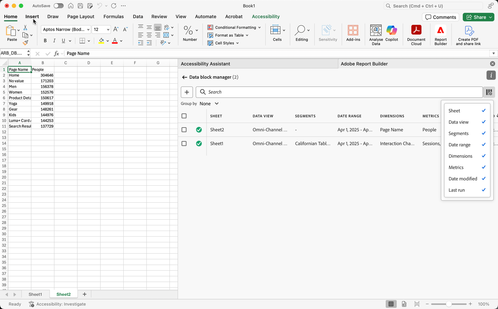

# Hantera datablock

Du kan visa och hantera alla datablock i en arbetsbok med [!UICONTROL Data block manager]. [!UICONTROL Data block manager] innehåller sök-, filter- och sorteringsfunktioner som gör att du kan hitta specifika datablock. När du har markerat ett eller flera datablock kan du redigera, ta bort eller uppdatera de markerade datablocken.

## Visa datablock

Om du vill visa en tabell med alla datablock i en arbetsbok väljer du  **[!UICONTROL Manage]**.

{zoomable="yes"}

**[!UICONTROL Data block manager]** visar en tabell med alla datablock i en arbetsbok.

{zoomable="yes"}

Du kan använda  för att välja vilka kolumner du vill visa.

## Sortera datablock

Du kan sortera datablockstabellen efter en kolumn som visas. Du kan till exempel sortera datablock efter datavyer, segment, datumintervall och andra variabler.

Om du vill sortera datablockstabellen väljer du en kolumnrubrik. Markera samma kolumnrubrik om du vill kasta om sorteringsordningen.

## Sök i datablock

Använd fältet  **[!UICONTROL _Sök_]** för att hitta något i datablockstabellen. Du kan till exempel söka efter mått i datablocken eller datavyn. Du kan också söka efter datum i datumintervallet, ändringsdatumet eller sista körningsdatumkolumnen.

## Redigera datablock

Du kan redigera datavyer och datumintervalldatablock. Eller segmenten som tillämpas på datablock.

Du kan till exempel ersätta ett befintligt segment med ett nytt segment i ett eller flera datablock.

1. Markera de datablock som du vill uppdatera. Du kan markera kryssrutan på den översta nivån om du vill markera alla datablock, eller markera enskilda datablock.

   {zoomable="yes"}

1. Välj  för att visa fönstret **[!UICONTROL Quick edit]**.

   {zoomable="yes"}

1. Markera en länk om du vill uppdatera datavyer, datumintervall eller segment. I **[!UICONTROL Quick Edit]** - **[!UICONTROL Segments]** kan du lägga till, ta bort eller uppdatera segment för de markerade datablocken.

   {zoomable="yes"}

## Uppdatera datablock

Välj  om du vill uppdatera datablockstabellen.

Kontrollera om ett datablock har uppdaterats genom att visa ikonen för uppdateringsstatus:

- Ett uppdaterat datablock visar .

- Ett datablock som inte kunde uppdateras visar en .

## Ta bort datablock

Så här tar du bort ett eller flera datablock:

1. Markera ett eller flera datablock.
1. Välj .
1. Välj **[!UICONTROL Delete]** i dialogrutan **[!UICONTROL Delete data block]** eller **[!UICONTROL Cancel]** om du vill avbryta borttagningen.

## Gruppera datablock

Du kan gruppera datablock med hjälp av den nedrullningsbara menyn **[!UICONTROL Group by]** eller välja en kolumnrubrik.

Om du vill sortera datablock efter kolumn markerar du kolumnrubriken. Om du vill gruppera datablock efter grupper väljer du ett gruppnamn i listrutan **[!UICONTROL Group by]**. På skärmbilden nedan visas datablock grupperade efter datavy.

Du kan använda gruppering för att snabbt markera datablock som du vill ändra ett vanligt element för, som segment.

{zoomable="yes"}

