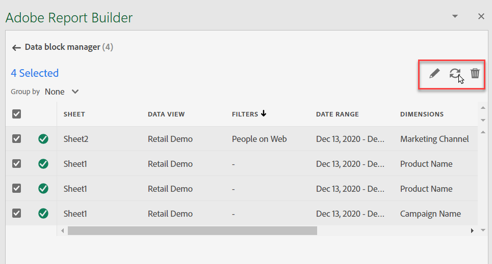

# Hantera datablock i Report Builder

Du kan visa och hantera alla datablock i en arbetsbok med hjälp av Data Block Manager. Med Data Block Manager kan du söka, filtrera och sortera efter specifika datablock. När du har markerat ett eller flera datablock kan du redigera, ta bort eller uppdatera de markerade datablocken.

## Visa datablock

Klicka **Hantera** om du vill visa en lista över alla datablock i en arbetsbok.

Dataslockhanteraren visar alla datablock som finns i en arbetsbok. 

## Sortera listan över datablock

Du kan sortera data blockeringslista efter en kolumn som visas. Du kan till exempel sortera data blockeringslista efter rapportsviter, filter, datumintervall och andra variabler.

Om du vill sortera data blockeringslista klickar du på en kolumnrubrik.

## Sök i Data Blockeringslista

Använd sökfältet för att hitta något i datablockstabellen. Du kan till exempel söka efter mätvärden i datablocken eller rapportsviten. Du kan också söka efter datum i datumintervallet, ändringsdatumet eller sista körningsdatumkolumnen.

## Redigera datablock

Du kan redigera datavyn, datumintervallet eller de filter som används i ett eller flera datablock.

Du kan till exempel ersätta ett befintligt filter med ett nytt filter i ett eller flera datablock.

1. Markera de datablock som du vill uppdatera.

Du kan markera kryssrutan på den översta nivån om du vill markera alla datablock, eller markera enskilda datablock.

1. Klicka på redigeringsikonen för att visa snabbredigeringsfönstret.

1. Välj en filterlänk för att uppdatera datavyer, datumintervall eller filter.

## Uppdatera datablock

Klicka på uppdateringsikonen för att uppdatera datablocken i listan.

Om du vill kontrollera om ett datablock har uppdaterats kan du visa ikonen för uppdateringsstatus. En bock i en grön cirkel  anger att uppdateringen av datablocket lyckades. Ett datablock som inte har uppdaterats visas med en varningsikon .  Detta gör det enkelt att identifiera om något datablock innehåller fel.

## Ta bort ett datablock

Klicka på papperskorgsikonen för att ta bort ett markerat datablock.

## Gruppera datablock

Klicka på kolumnrubrikerna om du vill gruppera datablock eller välj ett kolumnnamn på menyn **Gruppera efter** *Namn* lista.

## Ändra vyn för Hanteraren för datablockering

Du kan ändra vilka kolumner som ska visas i fönstret Dataslockshanteraren.

Klicka på kolumnlistan  -ikonen för att välja vilka kolumner som ska listas i Data Block Manager. Markera ett kolumnnamn som du vill visa kolumnen med. Avmarkera kolumnnamnet som du vill ta bort från vyn.

