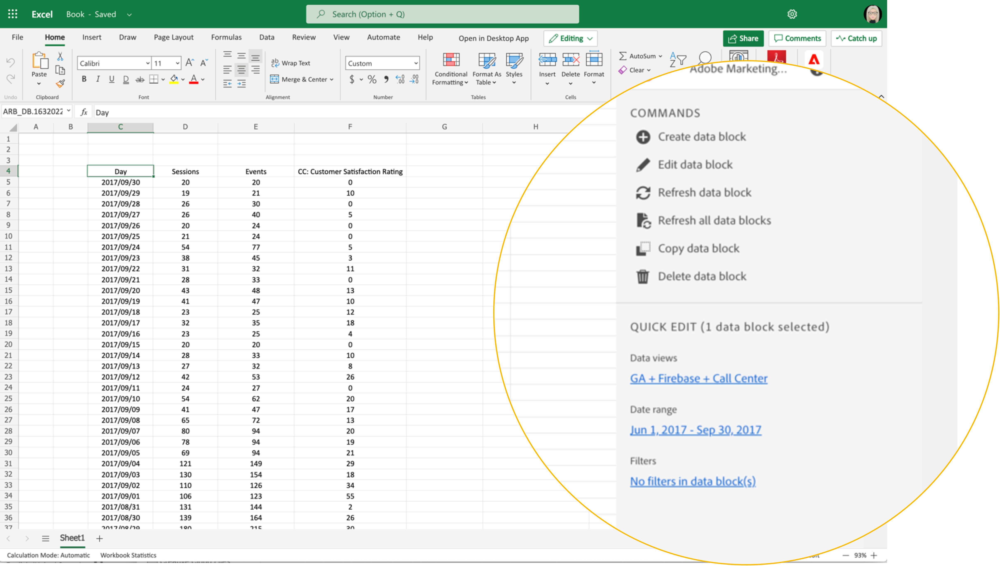

# Report Builder Hub

Använd Report Builder nav för att skapa, uppdatera eller ta bort datablock.

Navet Report Builder innehåller panelerna KOMMANDON och QUICK EDIT.



## KOMMANDON

Använd KOMMANDON-panelen för att komma åt kommandon som är kompatibla med de markerade cellerna eller en tidigare åtgärd.


### Kommandon

| Visade kommandon | Tillgängligt när.. | Syfte |
|------|------------------|--------|
| Skapa datablock | En eller flera celler markeras i arbetsboken. | Används för att skapa ett datablock |
| Redigera datablock | Det markerade cellområdet eller cellområdet ingår endast i ett datablock. | Används för att redigera ett datablock |
| Uppdatera datablock | Markeringen innehåller minst ett datablock. Kommandot uppdaterar bara de markerade datablocken. | Används för att uppdatera ett eller flera datablock |
| Uppdatera alla datablock | Arbetsboken innehåller ett eller flera datablock. | Används för att uppdatera ALLA datablock i arbetsboken |
| Kopiera datablock | Det markerade cellområdet eller cellområdet ingår i ett eller flera datablock. | Används för att kopiera ett datablock |
| Ta bort datablock | Det markerade cellområdet eller cellområdet ingår endast i ett datablock. | Används för att ta bort ett datablock |

## SNABBREDIGERING, panel

När du markerar ett eller flera datablock i ett kalkylblad visas panelen QUICK EDIT i Report Builder. Du kan använda panelen QUICK EDIT för att ändra parametrar i ett enda datablock eller för att ändra parametrar i flera datablock samtidigt.


De ändringar du gör i snabbredigeringsavsnitten gäller för alla markerade datablock.

### Datavyer

Datablocken hämtar data från en markerad datavy. Om flera datablock är markerade i ett kalkylblad och de inte hämtar data från samma datavy, visar länken **Datavyer** *Flera*.

När du ändrar datavyn används den nya datavyn för alla datablock i markeringen. Komponenterna i datablocket matchas mot den nya datavyn baserat på ID, till exempel matchning av ```evars```). Om en komponent inte hittas i ett datablock visas ett varningsmeddelande och komponenten tas bort från datablocket.

Om du vill ändra datavyn väljer du en ny datavy i listrutan.


### Datumintervall

**Datumintervall** visar datumintervallet för de markerade datablocken. Om flera datablock har markerats med flera datumintervall visas **Datumintervallet**-länken *Flera*.

### Filter

Länken **Filter** visar en sammanfattningslista över de filter som används av de markerade datablocken. Om flera datablock har markerats med flera filter visas **Filter**-länken *Flera*.
