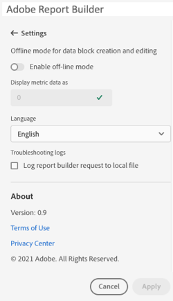

# Inställningar för Report Builder

Använd rutan **Inställningar** om du vill konfigurera inställningar på programnivå, t.ex. det språk som visas i användargränssnittet eller om du vill arbeta i offlineläge eller inte. Inställningarna används omedelbart och ställs in för alla framtida sessioner tills de ändras.

Så här ändrar du inställningarna för Report Builder

1. Klicka på ikonen **Inställningar**.

1. Gör ändringar i Aktivera offlineläge, välj ett språk eller aktivera inställningarna för felsökningsloggen.

1. Klicka på **Använd**.

   

## Offline-läge

Data hämtas inte när du skapar och redigerar ett datablock i offlineläge. I stället används simuleringsdata så att du snabbt kan skapa och redigera ett datablock utan att vänta på att begäran ska köras. När du är online igen uppdaterar kommandot *Uppdatera datablock* eller *Uppdatera alla datablock*-kommandot de datablock du skapade med aktuella data.

Aktivera offlineläge

1. Klicka på ikonen **Inställningar**.

1. Välj **Aktivera offlineläge**.

1. Ange ett positivt heltal i fältet **Visa mätdata som**.

1. Klicka på **Använd**.

## Språk

Du kan välja språk för användargränssnittet i Report Builder. Alla Adobe Analytics-språk som stöds finns tillgängliga.

Välj det språk som ska användas i användargränssnittet i Report Builder

1. Klicka på Inställningar.

1. Välj ett språk i listrutan **Språk**.

   

1. Klicka på **Använd.**

## Felsökning

Använd felsökningsinställningen för att logga alla klient-/serverdata till en lokal fil. Använd det här alternativet för att lösa supportärenden.

Om du vill aktivera felsökningsalternativet väljer du **Log report builder-begäran till den lokala filen**.
