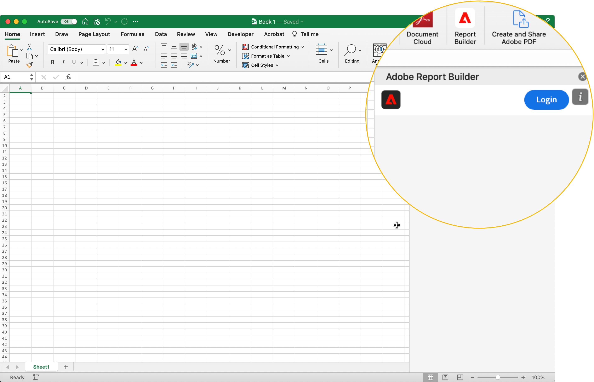

# Report Builder

I den här artikeln beskrivs kraven för att använda Report Builder för Customer Journey Analytics i Microsoft Excel. Och hur du installerar och konfigurerar tillägget.

## Krav

Report Builder för Customer Journey Analytics stöds av följande operativsystem och webbläsare.

### macOS

- macOS Version 10.x eller senare
- Alla Excel-versioner

### Windows

- Windows 10, version 1904 eller senare
- Excel version 2106 eller senare

  Alla Excel-användare med Windows-datorer måste installera Microsoft Edge Webview2 för att kunna använda tillägget. Installera:

   1. Gå till <https://developer.microsoft.com/en-us/microsoft-edge/webview2/>.
   1. Välj och hämta rätt version av **[!UICONTROL Evergreen Standalone Installer]** för din plattform.
   1. Kör installationsprogrammet och följ installationsanvisningarna.

### Webbkontor

- Stöder alla webbläsare och versioner.

## Report Builder Excel-tillägg

Installera Report Builder Excel-tillägget om du vill använda Report Builder för Customer Journey Analytics. När du har installerat Report Builder Excel-tillägget kan du komma åt Report Builder från en öppen Excel-arbetsbok.

### Hämta och installera Report Builder-tillägget

Så här hämtar och installerar du Report Builder-tillägget

1. Starta Excel och öppna en ny arbetsbok.

1. Välj **[!UICONTROL Insert]** > **[!UICONTROL Add-ins]** > **[!UICONTROL Get Add-ins]** på huvudmenyn.

1. I dialogrutan för Office-tillägg väljer du fliken **[!UICONTROL Store]**.

1. Sök efter `Report Builder` och välj **[!UICONTROL Add]**.

1. Välj **[!UICONTROL Continue]** i dialogrutan Licensvillkor och sekretesspolicy.

Om fliken **[!UICONTROL Store]** inte visas:

1. I Excel väljer du **[!UICONTROL File]** > **[!UICONTROL Account]** > **[!UICONTROL Manage Settings]** på huvudmenyn.

1. Markera rutan bredvid **[!UICONTROL Enable optional connected experiences]**.

1. Starta om Excel.

Om din organisation blockerar åtkomsten till Microsoft Store:

- Kontakta IT-avdelningen eller säkerhetsteamet för att få Report Builder-tillägget godkänt. Välj fliken **[!UICONTROL Admin Managed]** i Office **[!UICONTROL Add-ins]**-dialogrutan när du har godkänt.

  {zoomable="yes"}

När du har installerat Report Builder-tillägget visas ikonen  **[!UICONTROL Report Builder]** i Excel-menyfliksområdet på fliken **[!UICONTROL Home]** .

{zoomable="yes"}

## Logga in på Report Builder

När du har installerat Report Builder for Excel-tillägget för din operativplattform eller webbläsare följer du de här stegen för att logga in på Report Builder.

1. Öppna en Excel-arbetsbok.

1. Välj  **[!UICONTROL Report Builder]** för att starta Report Builder.

1. Välj **[!UICONTROL Login]** i verktygsfältet Adobe Report Builder.

   {zoomable="yes"}

1. Ange din kontoinformation för Adobe. Kontoinformationen ska överensstämma med dina Customer Journey Analytics-uppgifter.

   {zoomable="yes"}

När du har loggat in visas din inloggningsikon och organisation högst upp på panelen

## Byt organisation

När du loggar in första gången loggas du in på den standardorganisation som tilldelats din profil eller den organisation som du har valt som en del av inloggningsflödet.

1. Välj namnet på organisationen som visas när du loggar in.

1. Välj en organisation i listan över tillgängliga organisationer. Endast organisationer som du har åtkomst till listas.

   {zoomable="yes"}

## Logga ut

Så här loggar du ut från Report Builder:

1. Spara ändringar i alla öppna arbetsböcker.

1. Välj avatarikonen för att visa din användarprofil.

   {zoomable="yes"}

1. Välj **[!UICONTROL Sign Out]**.
