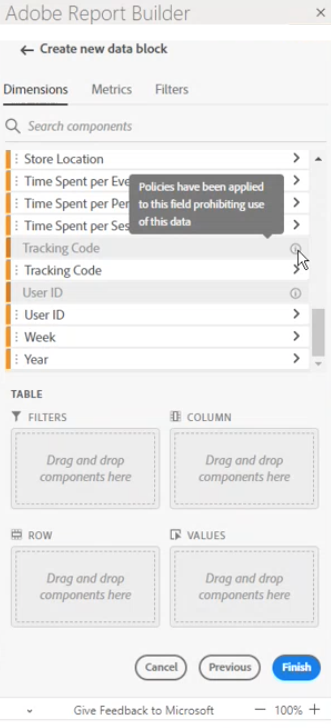

# Begränsade etiketter i Report Builder

Vanligtvis ärvs datastyrningsrelaterade inställningar i Customer Journey Analytics från Experience Platform. Integrationen mellan Customer Journey Analytics och Experience Platform Data Governance möjliggör märkning av känsliga Customer Journey Analytics-data och tillämpning av sekretesspolicyer.

Sekretessetiketter och integritetspolicyer som skapas för datauppsättningar som används av Experience Platform kan visas i arbetsflödet för Customer Journey Analytics datavyer. Dessa etiketter stoppar eller varnar användare som skapar mätvärden och dimensioner från känsliga fält. Mer information om datauppsättningar finns i [Datauppsättningsöversikt](https://experienceleague.adobe.com/en/docs/experience-platform/catalog/datasets/overview)

När data exporteras från Customer Journey Analytics (via rapportering, export, API osv.) läggs dessutom varningar eller etiketter till för att meddela användarna att en rapport innehåller känslig information som behöver behandlas på ett visst sätt.

Tack vare den här integreringen kan ni hantera regelefterlevnaden. Datahanteringen i organisationen kan ange regler som begränsar användningen. Detta innebär att era Customer Journey Analytics-användare kan använda data med större tillförsikt, eftersom de vet att de följer de regler som definieras av datasegmenter.

Mer information finns i [Customer Journey Analytics och datastyrning](https://experienceleague.adobe.com/en/docs/analytics-platform/using/cja-privacy/privacy-overview)

## Visa begränsade data

Det finns två Adobe-definierade policyer i Customer Journey Analytics som påverkar rapportering, hämtning och delning:

* Använd Analytics-policy
* Tillämpa hämtningspolicy

Komponenter som omfattas av de här profilerna är nedtonade och har en  -ikon. När du hovrar över infoikonen visas en anteckning som anger följande: **[!UICONTROL Policies have been applied to this field prohibiting use of this data]**.

Mer information finns i [Etiketter och profiler](https://experienceleague.adobe.com/en/docs/analytics-platform/using/cja-dataviews/data-governance).

<!--

{zoomable="yes"}
-->

## Uppdatera rapporter som innehåller begränsade data

Om en användare har skapat en Report Builder-rapport med dataelement som senare är begränsade visas ett felmeddelande när rapporten uppdateras.

{width="100%" zoomable="yes"}
