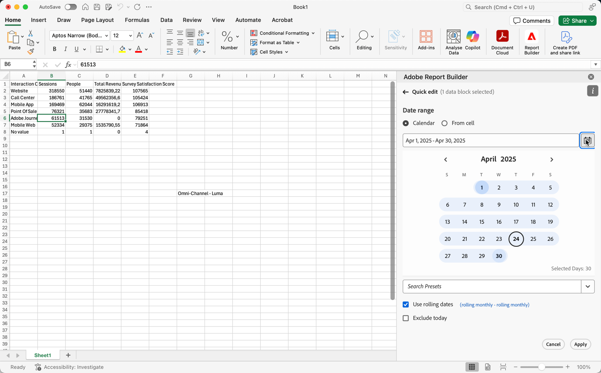
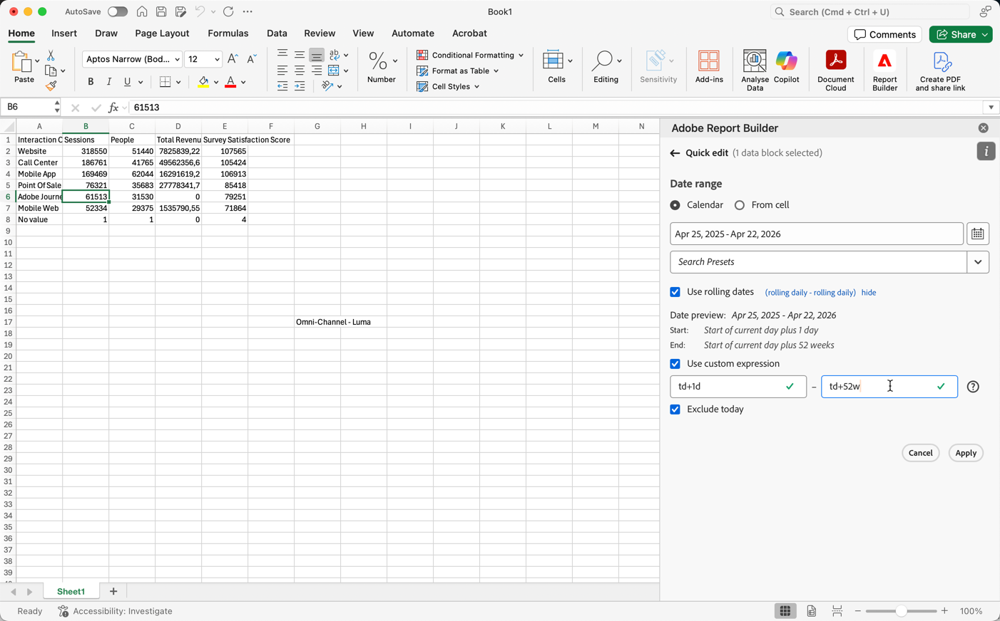
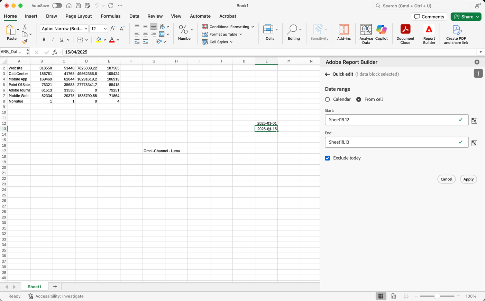

# Välj ett datumintervall

Så här ändrar du datumintervallet för ett befintligt datablock:

- Välj **[!UICONTROL Edit a data block]**, eller
- Markera länken **[!UICONTROL Date range]** i **[!UICONTROL Quick edit]**.

Använd följande alternativ för att ändra ett datumintervall för ett datablock.

## Kalender

Med alternativet **[!UICONTROL Calendar]** kan du skapa statiska eller rullande datum med följande alternativ:

### Datumintervall

Datumintervallfältet visar det aktuella datumintervallet för begäran om datablock. Du kan ange datum direkt eller använda  för att ange ett datumintervall.

{zoomable="yes"}

### Förinställningar

Använd listrutan med förinställningar för att välja en förinställning. Du kan också ange text för att söka efter förinställningar.

{zoomable="yes"}

Den förinställda listrutan innehåller en standarduppsättning med förinställda datumintervall och datumintervallkomponenter för en datavy som du har sparat eller en datavy som delats med dig.

### Rullande datum

Så här definierar du rullande datum:

{zoomable="yes"}

1. Välj **[!UICONTROL Use rolling dates]** för att definiera logiken för en definition av rullande datum. Du kan markera texten inom hakparenteser (till exempel **[!UICONTROL fixed start - rolling daily]**) för att utöka panelen och ange information för **[!UICONTROL Start]** och **[!UICONTROL End]**.

1. Välj **[!UICONTROL Start of]**, **[!UICONTROL End of]** eller **[!UICONTROL Fixed day]**.

   - När du har valt **[!UICONTROL Start of]** eller **[!UICONTROL End of]** kan du skapa ett fullständigt uttryck. Till exempel: **[!UICONTROL End of]** **[!UICONTROL current year]** **[!UICONTROL plus]** `1` **[!UICONTROL day]**. Välj lämpligt värde för varje enskild del av uttrycket.

      - Välj ett värde för aktuell. Exempel: **[!UICONTROL current year]**.
      - Välj ett värde för en valfri ytterligare beräkning. Exempel: **[!UICONTROL plus]**.
      - När du har angett ytterligare en beräkning anger du ett värde. Exempel: `1`.
      - När du har angett ytterligare en beräkning väljer du den tidsperiod som ska användas för beräkningen. Exempel: **[!UICONTROL day]**.

   - När du har valt **[!UICONTROL Fixed Day]** anger du en fast dag eller använder väljaren för att välja en dag.

1. Välj **[!UICONTROL hide]** om du vill dölja informationen för beräkning av rullande datum.

### Anpassade uttryck

Med alternativet för anpassade uttryck kan du ändra datumintervallet genom att skapa ett anpassat uttryck eller genom att ange en aritmetisk formel.

{zoomable="yes"}

1. Välj **[!UICONTROL Use rolling dates]**.

1. Välj **[!UICONTROL Use custom expression]**.

   När du väljer **[!UICONTROL Use custom expression]** inaktiveras standardkontrollerna för rullande datumintervall.

1. Ange ett [anpassat uttryck](#create-a-custom-expression).

1. Använd **[!UICONTROL Date preview]** för att verifiera det resulterande datumintervallet.

#### Skapa ett anpassat uttryck

1. Ange en [datumreferens](#date-references).

1. Lägg till en valfri [datumoperator](#date-operators) om du vill flytta datumet till föregående eller kommande datum.

Du kan ange ett anpassat uttryck som innehåller flera operatorer, till exempel `tm-11m-1d`.

#### Datumreferenser

I följande tabell visas exempel på datumreferenser.

| Datumreferens | Typ | Beskrivning |
|----------------|--------------|----------------------------|
| `1/1/10` | Statiskt datum | Anges i ISO-datumformat |
| `td` | Rullningsdatum | Början av aktuell dag |
| `tw` | Rullningsdatum | Början av aktuell vecka |
| `tm` | Rullningsdatum | Månadens början |
| `tq` | Rullningsdatum | Början av aktuellt kvartal |
| `ty` | Rullningsdatum | Början av aktuellt år |

#### Datumoperatorer

I följande tabell visas exempel på operatorer för datum.

| Datumoperator | Enhet | Beskrivning |
|----------------|---------|--------------------|
| `+6d` | Dag | Lägg till 6 dagar i datumreferensen |
| `+1w` | Vecka | Lägg till en hel vecka i datumreferensen |
| `-2m` | Månad | Subtrahera 2 hela månader till datumreferensen |
| `-4q` | Kvartal | Subtrahera 4 kvartal till datumreferensen |
| -`1y` | År | Ta bort ett år från datumreferensen |

#### Datumuttryck

I följande tabell visas exempel på datumuttryck.

| Datumuttryck | Betydelse |
|-----------------|--------------------------------------|
| `td` | Idag |
| `td-1w` | Första dagen i förra veckan |
| `tm-1d` | Sista dagen i föregående månad |
| `td-52w` | Samma dag, för 52 veckor sedan |
| `tm-11m-1d` | Sista dagen i samma månad förra året |
| `"2020-09-06"` | Specifikt datum, 9 september 2020 |

## Datumintervall från cell

Datumintervallet kan anges i kalkylbladsceller. Använd alternativet **[!UICONTROL Date range from cell]** för att välja datablockets start- och slutdatum från markerade celler. När du väljer alternativet **[!UICONTROL From cell]** visar panelen **[!UICONTROL From]**- och **[!UICONTROL To]**-fält där du kan ange en cellplats eller använda  för att välja den markerade cellen.

{zoomable="yes"}

## Exkludera idag

Välj **[!UICONTROL Exclude today]** om du vill exkludera idag från ett valt datumintervall. Den aktuella dagen exkluderas från alla lägen som används för att definiera ett datumintervall: kalender, rullande datum eller anpassade uttryck.

## Giltiga datumintervall

I följande lista beskrivs giltiga datumintervallformat.

- Start- och slutdatum måste ha följande format: ÅÅÅ-MM-DD

- Startdatumet måste vara tidigare än eller lika med slutdatumet. Båda datumen kan anges till framtiden.

- När du använder rullande datum måste startdatumet vara idag eller tidigare. Startdagen måste vara tidigare om **[!UICONTROL Exclude today]** har valts.

- Du kan skapa en statisk datumintervalluppsättning för framtiden. Du kan till exempel behöva ange ett framtida datum för lanseringen av en marknadsföringskampanj nästa vecka. Med det här alternativet skapas en arbetsboksövervakning för en kampanj i förväg.

## Ändra datumintervall

Du kan redigera datumintervallet för ett befintligt datablock.

1. Markera en cell i datablocket.

- Välj **[!UICONTROL Edit data block]** på panelen **[!UICONTROL Commands]** eller
- Markera länken **[!UICONTROL Date range]** på panelen **[!UICONTROL Quick edit]**.

1. Ändra datumintervallet med något av de tillgängliga datumalternativen.

1. Välj **[!UICONTROL Apply]**.

Report Builder använder det nya datumintervallet för alla datablock i markeringen.
