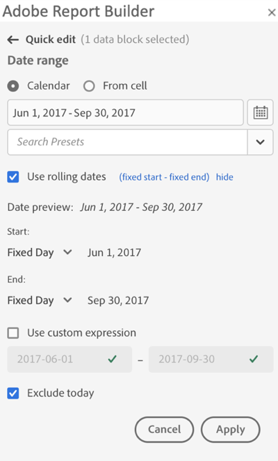
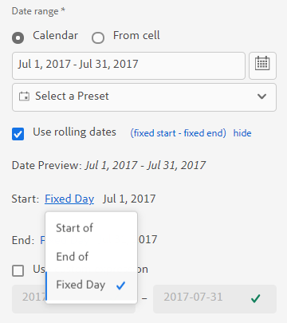

# Välj ett datumintervall

Om du vill ändra datumintervallet för ett befintligt datablock väljer du Redigera ett datablock eller använder panelen QUICK EDIT.

Använd följande alternativ för att ändra ett datumintervall för ett datablock.

**Kalender**

I kalendern kan du skapa statiska eller rullande datum med följande alternativ:

- Datumintervallfält
- Kalender
- Listrutan Förinställning
- Läge för rullande datum
- Anpassa uttryck


**Från cell**

Med alternativet Från cell kan du referera till datum som anges i kalkylbladsceller.

Du kan välja att exkludera idag för valfritt datumintervall.



## Använda kalendern

När du använder **kalendern** visar datumintervallfältet det aktuella datumintervallet för begäran om datablocket. Du kan ange datum direkt i datumintervallfältet eller använda ett dataområdesalternativ.

### Datumintervallfält

Ange datum direkt i datumintervallfältet

1. Klicka på datumintervallfältet bredvid kalenderikonen.

1. Ange start- och slutdatum för datumintervallet.

### Kalender

Välja datum med hjälp av kalendern

1. Klicka på kalenderikonen om du vill visa en månadskalender.

1. Klicka på ett startdatum.

1. Klicka på ett slutdatum.

Om du vill ange ett omvänt datumintervall klickar du först på slutdatumet och sedan på startdatumet.


### Listrutan Förinställning

Den förinställda listrutan innehåller en standarduppsättning med förinställda datumintervall och datumintervallkomponenter för en datavy som du har sparat eller en datavy som delats med dig.

### Rullande datum

Med alternativet för rullande datum kan du välja ett datumintervall med rullande datum.

1. Välj **Använd rullande datum**.

1. Välj ett rullande uttryck för start- och slutdatumet.

   

   **Början av**  - Här kan du välja början av en dag, vecka, månad, kvartal eller år.

   **Slutet av**  - Gör att du kan välja slutet av en dag, vecka, månad, kvartal eller år.

   **Fast dag**  - Gör att du kan korrigera ett start- eller slutdatum medan det andra datumet rullar.

1. Välj dag, vecka, månad, kvartal eller år som rullande period.

   

1. Lägg till eller subtrahera dagar, veckor, månader, kvartal eller år från ditt rullande datum.

   

1. Klicka på Nästa för att definiera dataområdet.

   Använd datumförhandsvisningen för att bekräfta att det resulterande datumintervallet är det önskade intervallet.

### Anpassade uttryck

Med alternativet för anpassade uttryck kan du ändra datumintervallet genom att skapa ett anpassat uttryck eller genom att ange en aritmetisk formel.

1. Välj **Använd rullande datum**.

1. Välj **Använd anpassat uttryck**.

   När du väljer alternativet **Använd anpassat uttryck** inaktiveras standardkontrollerna för rullande datumintervall.

   

1. Ange ett anpassat uttryck.

   En exempellista med anpassade uttryck finns i **Datumuttryck**.

1. Använd datumförhandsvisningen för att kontrollera att det resulterande datumintervallet är det önskade intervallet.

#### Skapa ett anpassat uttryck

1. Ange en **datumreferens**.

1. Lägg till **Datumoperatorer** om du vill flytta datumet till föregående eller kommande datum.

Du kan ange ett anpassat datumuttryck som innehåller flera operatorer, till exempel ```tm-11m-1d```.

#### Datumreferenser

I följande tabell visas exempel på datumreferenser.

| Datumreferens | Typ | Beskrivning |
|----------------|--------------|----------------------------|
| 1/1/10 | Statiskt datum | Anges i ISO-datumformat |
| td | Rullningsdatum | Början av aktuell dag |
| tw | Rullningsdatum | Början av aktuell vecka |
| tm | Rullningsdatum | Månadens början |
| tq | Rullningsdatum | Början av aktuellt kvartal |
| ty | Rullningsdatum | Början av aktuellt år |

#### Datumoperatorer

I följande tabell visas exempel på operatorer för datum.

| Datumoperatorer | Enhet | Beskrivning |
|----------------|---------|--------------------|
| +6d | Dag | Lägg till 6 dagar i datumreferensen |
| +1w | Vecka | Lägg till en hel vecka i datumreferensen |
| -2m | Månad | Subtrahera 2 hela månader till datumreferensen |
| -4q | Kvartal | Subtrahera 4 kvartal till datumreferensen |
| -1y | År | Ta bort ett år från datumreferensen |

#### Datumuttryck

I följande tabell visas exempel på datumuttryck.

| Datumuttryck | Betydelse |
|-----------------|--------------------------------------|
| td-1w | Första dagen i förra veckan |
| tm-1d | Sista dagen i föregående månad |
| td-52w | Samma dag, för 52 veckor sedan |
| tm-11m-1d | Sista dagen i samma månad förra året |
| &quot;2020-09-06&quot; | 9 sept 2020 |

## Datumintervall från cell

Datumintervallet kan anges i kalkylbladsceller. Använd alternativet **Datumintervall från cell** för att välja datablockets start- och slutdatum från markerade celler. När du väljer alternativet **Från cell** visar panelen fälten **Från** och **Till** där du kan ange en cellplats.


## Exkludera idag

Välj alternativet **Uteslut i dag** om du vill utesluta i dag från ett valt datumintervall. Om du väljer att inkludera idag kan ofullständiga data hämtas för idag.

När du väljer det här alternativet utesluts den aktuella dagen från alla lägen för datumintervall, inklusive kalender, rullande datum eller anpassade uttryck.****

## Giltiga datumintervall

I följande lista beskrivs giltiga datumintervallformat.

- Start- och slutdatum måste ha följande format: YYY-MM-DD

- Startdatumet måste vara tidigare än eller lika med slutdatumet. Båda datumen kan anges till framtiden.

- När du använder rullande datum måste startdatumet vara idag eller tidigare. Det måste finnas i det förflutna om **Exkludera i dag** är markerat.

- Du kan skapa en statisk datumintervalluppsättning för framtiden. Du kan till exempel behöva ange ett framtida datum för lanseringen av en marknadsföringskampanj nästa vecka. Med det här alternativet skapas en arbetsboksövervakning för en kampanj i förväg.

## Ändra datumintervall

Du kan redigera datumintervallet för ett befintligt datablock genom att välja Redigera datablock på KOMMANDON-panelen eller genom att markera datumintervalllänken på QUICK EDIT-panelen.

**Redigera datablock**  - Gör att du kan redigera flera datablocksparametrar, inklusive datumintervall, för ett enda datablock.

**Snabbredigering: Datumintervall**  - Här kan du redigera datumintervallet för ett eller flera datablock.

Redigera datumintervallet från SNABBREDIGERING-panelen

1. Markera celler i ett eller flera datablock i ett kalkylblad.

1. Klicka på länken **Datumintervall** på panelen QUICK EDIT.

1. Välj datumintervall med något av datumalternativen.

1. Klicka på **Använd**.


Report Builder använder det nya datumintervallet för alla datablock i markeringen.
