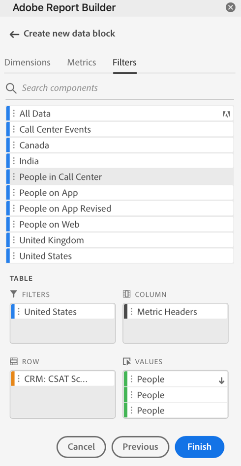

# Arbeta med filter i Report Builder

Du kan använda filter när du skapar ett nytt datablock eller när du väljer **Redigera datablock** från KOMMANDONA-panelen.

## Använda filter på ett datablock

Om du vill använda ett filter på hela datablocket dubbelklickar du på ett filter eller drar och släpper filter från komponentlistan i filteravsnittet i tabellen.

## Tillämpa filter på enskilda mätvärden

Om du vill använda filter på enskilda mätvärden drar och släpper du ett filter på ett mätvärde i tabellen. Du kan också klicka på **...** till höger om ett mätresultat i tabellrutan och välj **Filtermått**. Om du vill visa använda filter håller du pekaren över eller väljer ett mått i tabellrutan. Mätvärden med tillämpade filter visar en filterikon.

<!--  -->

## Snabbredigeringsfilter

Du kan använda snabbredigeringspanelen för att lägga till, ta bort eller ersätta filter för befintliga datablock.

När du markerar ett cellintervall i kalkylbladet visas **Filter** på snabbredigeringspanelen visas en sammanfattning av de filter som används av datablocken i markeringen.

Redigera filter med hjälp av snabbredigeringspanelen

1. Markera ett cellintervall från ett eller flera datablock.

   

1. Klicka på länken Filter för att öppna panelen Snabbredigering - filter.

   

### Lägga till eller ta bort ett filter

Du kan lägga till eller ta bort filter med alternativen Lägg till/ta bort.

1. Välj **Lägg till/ta bort** på panelen Snabbredigeringsfilter.

   Alla filter som tillämpas på de markerade datablocken visas på panelen Snabbredigeringsfilter. Filter som används på alla datablock i markeringen visas under **Tillämpas på alla markerade datablock** rubrik. Filter som används på vissa, men inte alla, datablock listas under **Tillämpas på ett eller flera markerade datablock** rubrik.

   När det finns flera filter i de markerade datablocken kan du söka efter specifika filter med **Lägg till filter** sökfält.

   

1. Lägg till filter genom att välja filter på menyn **Lägg till filter** nedrullningsbar meny.

   Listan med sökbara filter innehåller alla filter som är tillgängliga för datavyer som finns i ett eller flera av de markerade datablocken samt alla filter som är tillgängliga globalt i organisationen.

   Om du lägger till ett filter tillämpas filtret på alla datablock i markeringen.

1. Klicka på ikonen Ta bort om du vill ta bort filter **x** till höger om filtren i **Tillämpade filter** lista.

1. Klicka **Använd** om du vill spara ändringarna och gå tillbaka till navpanelen.

   Report Builder visar ett meddelande som bekräftar de använda filterändringarna.

### Ersätta ett filter

Du kan ersätta ett befintligt filter med ett annat om du vill ändra hur data filtreras.

1. Välj **Ersätt** på panelen Snabbredigeringsfilter.

   

1. Använd **Söklista** sökfält för att hitta specifika filter.

1. Välj ett eller flera filter som du vill ersätta.

1. Sök efter ett eller flera filter i fältet Ersätt med.

   Om du väljer ett filter läggs det till i **Ersätt med**... lista.

   

1. Klicka **Använd**.

   Report Builder uppdaterar filterlistan så att den återspeglar ersättningen.
