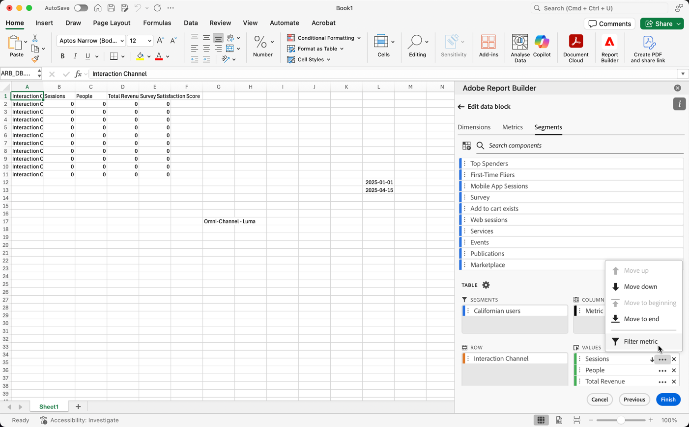
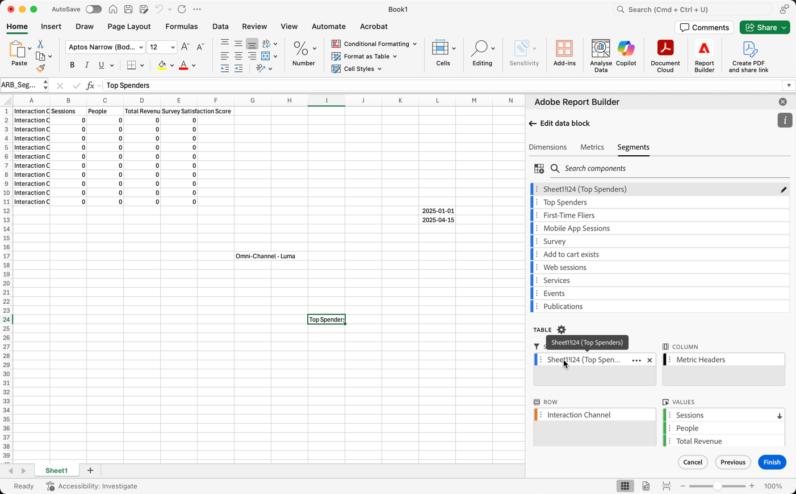
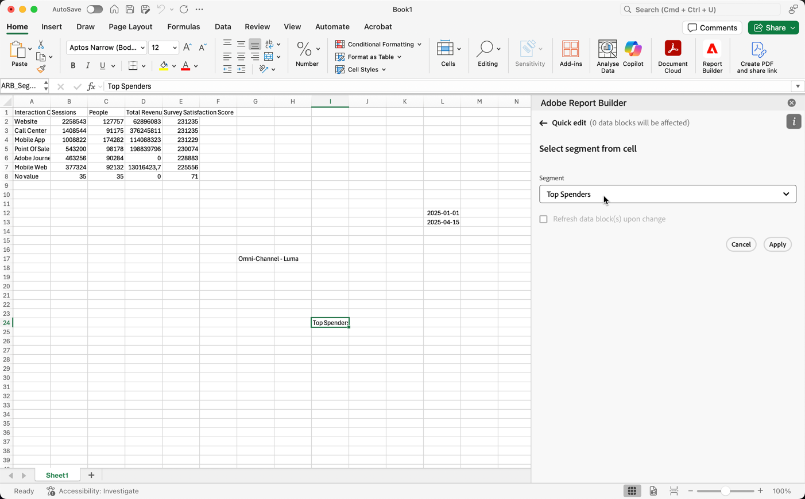

# Arbeta med segment

Du kan tillämpa segment när du skapar ett nytt datablock eller när du väljer **[!UICONTROL Edit data block]** på panelen **[!UICONTROL Commands]**.

## Använda segment i ett datablock

Om du vill tillämpa ett segment på hela datablocket dubbelmarkerar du ett segment eller drar och släpper segment från komponentlistan till segmentavsnittet i tabellen.

## Tillämpa filter på enskilda mätvärden

Så här använder du filter med segment för enskilda mätvärden:

* Dra och släpp ett eller flera segment från **[!UICONTROL Segments]** till ett mätvärde i tabellen.

* Alternativt:

   1. Välj  för ett specifikt mått i rutan **[!UICONTROL Table]** och välj sedan **[!UICONTROL Filter metric]**.

      {zoomable="yes"}

   1. Välj ett eller flera segment i listrutan **[!UICONTROL Segments]**. Segmenten läggs till i listan **[!UICONTROL Segments applied]**.

      
   1. Välj  om du vill ta bort ett segment från listan **[!UICONTROL Segment applied]**. Eller välj **[!UICONTROL Clear all]** om du vill ta bort alla segment från listan **[!UICONTROL Segment applied]**.
   1. Välj **[!UICONTROL Apply]**.

Om du vill visa använda filter håller du pekaren över eller väljer ett mått i tabellrutan. Mätvärden med tillämpade segment visar en segmentikon.

## Snabbredigeringssegment

Du kan använda panelen **[!UICONTROL Quick edit]** för att lägga till, ta bort eller ersätta segment för befintliga datablock.

När du markerar ett cellintervall i kalkylbladet visas en sammanfattningslista med de segment som används av datablocken i markeringen på länken **[!UICONTROL Segments]** på panelen **[!UICONTROL Quick edit]**.

Så här redigerar du segment med panelen **[!UICONTROL Quick edit]**:

1. Markera ett cellintervall från ett eller flera datablock.

1. Klicka på länken **[!UICONTROL Segments]** för att öppna panelen **[!UICONTROL Quick edit]** **[!UICONTROL Segments]**.

### Lägga till eller ta bort segment

Du kan lägga till eller ta bort segment med alternativen Lägg till/ta bort.

1. Välj fliken **[!UICONTROL Add/Remove]** på panelen **[!UICONTROL Quick edit]** **[!UICONTROL Segments]**.

   1. Välj ett eller flera segment i listrutan **[!UICONTROL Segments]**. Segmenten läggs till i listan **[!UICONTROL Segments applied]**.
   1. Välj  om du vill ta bort ett segment från listan **[!UICONTROL Segment applied]**.
   1. Välj **[!UICONTROL Apply]**.

Report Builder visar ett meddelande som bekräftar de använda segmentändringarna.

### Ersätt segment

Du kan ersätta ett befintligt segment med ett annat segment om du vill ändra hur data segmenteras.

1. Välj fliken **[!UICONTROL Replace]** på panelen **[!UICONTROL Quick edit]** **[!UICONTROL Segments]**.

1. Använd sökfältet **Söklista** för att hitta specifika segment.

1. Markera ett eller flera segment som du vill ersätta.

1. Sök efter ett eller flera segment i listrutan Ersätt med om du vill lägga till segmentet i listan **[!UICONTROL Replace with]**.

1. Välj **[!UICONTROL Apply]**.

Report Builder uppdaterar segmentlistan så att den återspeglar ersättningen.

## Definiera datablocksegment från celler

Datablocken kan referera till segment från en cell. Flera datablock kan referera till samma cell för segment, vilket gör att du enkelt kan byta segment för flera datablock samtidigt.

Så här använder du segment från en cell:

1. [Skapa ett nytt datablock](create-a-data-block.md#create-a-data-block) eller redigera ett befintligt datablock.
1. Välj fliken **[!UICONTROL Segments]** för att definiera segment.
1. Välj .

   {zoomable="yes"}

1. Markera cellen som du vill att datablocken ska referera till ett segment från.

1. Dubbelmarkera om du vill lägga till ett segment i cellen. Du kan också dra och släppa ett eller flera segment i avsnittet **[!UICONTROL Segments included]**.

1. Välj **[!UICONTROL Apply]** om du vill skapa referenscellen.

1. På fliken **Segment** lägger du till det nyligen skapade referenscellsegmentet i ditt datablock.

   {zoomable="yes"}

1. Välj **[!UICONTROL Finish]**.

Om du vill använda referenscellen som ett segment i andra datablock använder du cellreferensen som ett av segmenten i listan **[!UICONTROL Segments]** på fliken **[!UICONTROL Table]**.

### Använd en referenscell för att ändra datablocksegment

1. Markera referenscellen i kalkylbladet.

1. Markera länken under **[!UICONTROL Segments from cell]** på menyn **[!UICONTROL Quick Edit]**.

   {zoomable="yes"}

1. Välj segmentet i listrutan.

1. Välj **[!UICONTROL Apply]**.
