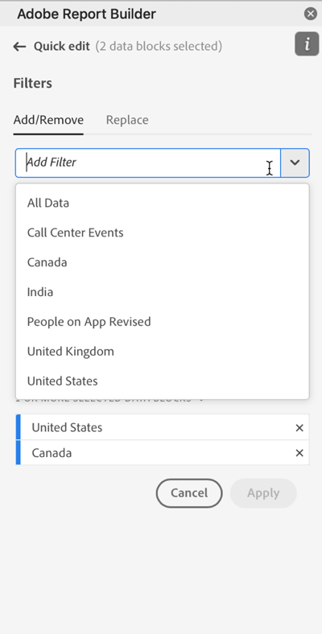
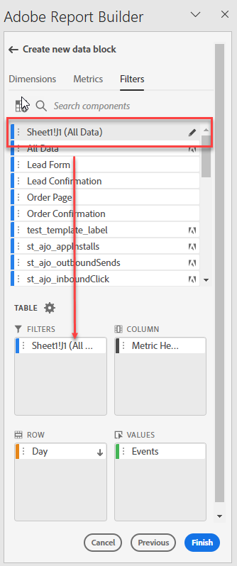

# Arbeta med segment i Report Builder

Du kan tillämpa segment när du skapar ett nytt datablock eller när du väljer alternativet **Redigera datablock** på kommandopanelen.

## Använda filter på ett datablock

Om du vill använda ett filter på hela datablocket dubbelklickar du på ett filter eller drar och släpper filter från komponentlistan i filteravsnittet i tabellen.

## Tillämpa filter på enskilda mätvärden

Om du vill använda filter på enskilda mätvärden drar och släpper du ett filter på ett mätvärde i tabellen. Du kan också klicka på ikonen **..** till höger om ett mått i tabellrutan och sedan välja **Filtermått**. Om du vill visa använda filter håller du pekaren över eller väljer ett mått i tabellrutan. Mätvärden med tillämpade filter visar en filterikon.

## Snabbredigeringsfilter

Du kan använda snabbredigeringspanelen för att lägga till, ta bort eller ersätta filter för befintliga datablock.

När du markerar ett cellintervall i kalkylbladet visas en sammanfattningslista med de filter som används av datablocken i markeringen på länken **Filter** på snabbredigeringspanelen.

Redigera filter med hjälp av snabbredigeringspanelen

1. Markera ett cellintervall från ett eller flera datablock.

   

1. Klicka på länken Filter för att öppna panelen Snabbredigering - filter.

   

### Lägga till eller ta bort ett filter

Du kan lägga till eller ta bort filter med alternativen Lägg till/ta bort.

1. Välj fliken **Lägg till/ta bort** på panelen Snabbredigeringsfilter.

   Alla filter som tillämpas på de markerade datablocken visas på panelen Snabbredigeringsfilter. Filter som används på alla datablock i markeringen visas under rubriken **Tillämpat på alla markerade datablock**. Filter som används på vissa, men inte alla, datablock listas under rubriken **Tillämpas på 1 eller flera markerade datablock**.

   När det finns flera filter i de markerade datablocken kan du söka efter specifika filter med sökfältet **Lägg till filter**.

   

1. Lägg till filter genom att välja filter i listrutan **Lägg till filter** .

   Listan med sökbara filter innehåller alla filter som är tillgängliga för datavyer som finns i ett eller flera av de markerade datablocken samt alla filter som är tillgängliga globalt i organisationen.

   Om du lägger till ett filter tillämpas filtret på alla datablock i markeringen.

1. Om du vill ta bort filter klickar du på borttagningsikonen **x** till höger om filter i listan **Filter som används** .

1. Klicka på **Använd** om du vill spara ändringarna och återgå till hubbpanelen.

   Report Builder visar ett meddelande som bekräftar de använda filterändringarna.

### Ersätta ett filter

Du kan ersätta ett befintligt filter med ett annat om du vill ändra hur data filtreras.

1. Välj fliken **Ersätt** på panelen Snabbredigeringsfilter.

   

1. Använd sökfältet **Söklista** för att hitta specifika filter.

1. Välj ett eller flera filter som du vill ersätta.

1. Sök efter ett eller flera filter i fältet Ersätt med.

   Om du väljer ett filter läggs det till i listan **Ersätt med**....

   

1. Klicka på **Använd**.

   Report Builder uppdaterar listan med filter så att den återspeglar ersättningen.

### Definiera datablocksfilter från cell

Datablock kan referera till filter från en cell. Flera datablock kan referera till samma cell för filter, vilket gör att du enkelt kan växla filter för flera datablock samtidigt.

Använda filter från en cell

1. Navigera till Steg 2 när du skapar eller redigerar datablock. Se [Skapa ett datablock](./create-a-data-block.md).
1. Klicka på fliken **Filter** för att definiera filter.
1. Klicka på **Skapa filter från cell**.

   

1. Markera cellen som du vill att datablocken ska referera till ett filter från.

1. Lägg till det filteralternativ som du vill lägga till i cellen genom att antingen dubbelklicka på filtret eller genom att dra och släppa det i avsnittet Filter som ingår.

   Obs! Endast ett alternativ kan markeras för den aktuella cellen åt gången.

   

1. Klicka på **Använd** för att skapa referenscellen.

1. Lägg till det nyligen skapade referenscellsfiltret i ditt datablock från fliken **Filter**.

   

1. Klicka på **Slutför**.

   Nu kan andra datablock referera till den här cellen i sina filter. Om du vill använda referenscellen som ett filter för andra datablock lägger du bara till cellreferensen i filtren på fliken Filter.

#### Använd referenscellen för att ändra filter för datablock

1. Markera referenscellen i kalkylbladet.

1. Klicka på länken under **Filter från cell** på snabbredigeringsmenyn.

   

1. Välj filtret i listrutan.

   

1. Klicka på **Använd**.
