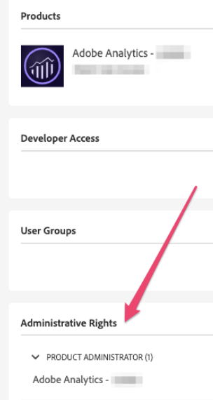

# Översikt över Reporting Activity Manager

{{release-limited-testing}}

The [!UICONTROL Reporting Activity Manager] är tillgängligt för administratörer.

Om din organisation försämrar rapporternas prestanda under perioder med hög rapporteringsbelastning kan du med Reporting Activity Manager själv diagnostisera och åtgärda kapacitetsproblem utan att behöva kontakta Adobe kundtjänst. Du kan enkelt hantera rapporteringsköer i ett enda gränssnitt och omedelbart agera &#x200B; &#x200B; för att förbättra användarnas upplevelse.

## Fördelar

Reporting Activity Manager ger följande fördelar:

* Gör att du kan övervaka och hantera rapporteringskapaciteten för varje anslutning i organisationen.
* Informerar dig i realtid om din nuvarande rapporteringskapacitet över alla dina anslutningar.
* Innehåller detaljerad rapportfrågeinformation om aktuella rapporteringsbegäranden, oavsett om de står i kö eller pågår.
* Gör att du kan optimera rapporteringskön genom att prioritera vissa och avbryta andra rapporteringsbegäranden för att frigöra kapacitet. Den besvarar frågor som: Är den här rapporten nödvändig just nu eller kan jag avbeställa den till förmån för mer brådskande rapporter?
* Gör att du kan begränsa framtida begäranden för en angiven tidsperiod. Du kan begränsa specifika begäranden eller du kan begränsa alla begäranden från en viss användare eller begäranden som är kopplade till ett visst projekt.

## Behörigheter

<!-- update for CJA -->

Om du vill hantera rapporteringsaktiviteten måste du ha behörigheten Analytics Product Administrator i Adobe Admin Console.

## Visa rapporteringsaktivitet

Mer information om hur du visar rapporteringsaktivitet i Rapporteringsaktivitetshanteraren finns i [Visa rapporteringsaktivitet i Rapporteringsaktivitetshanteraren](/help/reporting-activity-manager/reporting-activity.md).

## Avbryt rapporteringsbegäranden

Mer information om hur du avbryter rapportbegäranden i Rapporteringsaktivitetshanteraren finns i [Avbryt rapportbegäranden i Rapporteringsaktivitetshanteraren](/help/reporting-activity-manager/reporting-activity-cancel-requests.md).

## Frågor och svar {#faq}

| Fråga | Svar |
| --- | --- |
| Kan jag köpa ytterligare rapporteringskapacitet? | Den här funktionen kommer att vara tillgänglig inom den närmaste framtiden. |

{style="table-layout:auto"}
