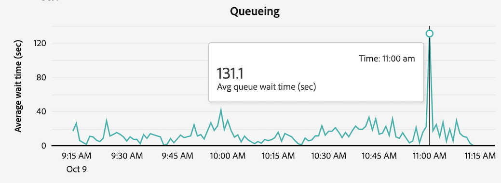

# Visa rapporteringsaktivitet i Rapporteringsaktivitetshanteraren

The [!UICONTROL Reporting Activity Manager] gör det möjligt för administratörer att snabbt diagnostisera och åtgärda problem med rapporttapaciteten under perioder med hög rapporteringsnivå.

Mer information om Reporting Activity Manager, inklusive viktiga fördelar och behörighetskrav, finns i [Översikt över Reporting Activity Manager](/help/reporting-activity-manager/reporting-activity-overview.md).

## Visa rapporteringsaktivitet för alla anslutningar {#view-all-report-suites}

1. I Customer Journey Analytics, gå till **[!UICONTROL Tools]** > **[!UICONTROL Reporting Activity Manager]**.

   En lista över dina aktiverade basanslutningar visas.

   

1. Expandera om du vill visa det totala antalet rapportbegäranden för alla anslutningar i organisationen [!UICONTROL **Visa mer**] för att visa [!UICONTROL **Månatliga rapportbegäranden**] diagram.

   Du kan visa antalet rapportförfrågningar i din organisation för den aktuella månaden och föregående månad.

   

1. (Valfritt) Du kan söka efter eller filtrera listan över anslutningar:

   * Använd sökfältet för att söka efter en viss anslutning. Börja skriva anslutningsnamnet eller ID:t och listan över anslutningar som uppdateras medan du skriver.

   * Välj [!UICONTROL **Filter**] icon  om du vill expandera listan med filteralternativ. Du kan filtrera efter [!UICONTROL **Favoriter**] eller [!UICONTROL **Status**].

     Om du vill markera en anslutning som favorit väljer du stjärnikonen till vänster om anslutningsnamnet.

     <!-- (does this option still exist?) 1. (Optional) Select **[!UICONTROL Refresh]** at the top-right to refresh the data. -->

1. Visa användningsinformation om varje anslutning. De data som visas i tabellen representerar rapporteringsaktiviteten för anslutningen när sidan senast lästes in.

   Följande kolumner är tillgängliga:

   | Gränssnittselement | Beskrivning |
   | --- | --- |
   | **[!UICONTROL Connection]** | Anslutningen vars rapporteringsaktivitet du övervakar. |
   | **[!UICONTROL Data Views]** | Visar alla datavyer som använder anslutningen. Datavykonfigurationen kan göra rapportförfrågningar mer komplicerade. |
   | **[!UICONTROL Capacity utilization]** | Procentandel av anslutningens rapporteringskapacitet som används i realtid. 
**Anteckning** En användningskapacitet som är 100 % innebär inte nödvändigtvis att du omedelbart bör avbryta rapporteringsbegäranden. 100 % användningskapacitet kan vara hälsosam om den genomsnittliga väntetiden är rimlig. Å andra sidan kan 100 % av användningskapaciteten tyda på ett problem om antalet begäranden som står i kö också ökar.
 |
   | **[!UICONTROL Queued requests]** | Antalet begäranden som väntar på att behandlas. <!-- ??? --> |
   | **[!UICONTROL Queue wait time]** | Genomsnittlig väntetid innan begäranden börjar bearbetas. <!-- ???? --> |
   | **[!UICONTROL Status]** | Möjliga statusvärden är: <ul><li>[!UICONTROL **Aktiv**] (blått): Rapporter har körts på anslutningen under de senaste två timmarna. De data som visas i tabellen representerar rapporteringskapaciteten för anslutningen när sidan senast lästes in.</li><li>[!UICONTROL **Inaktiv**] (grå): Inga rapporter har körts på anslutningen under de senaste två timmarna, så inga data visas för anslutningen.</li></ul> |

   {style="table-layout:auto"}

## Visa rapporteringsaktivitet för en enda anslutning

1. I Customer Journey Analytics väljer du [!UICONTROL **verktyg**] > [!UICONTROL **Rapporteringsaktivitetshanteraren**].

1. Markera den länkade titeln för anslutningen som du vill visa information om.

   Rapporteringsaktivitetsdata visas för anslutningen som du har valt.

1. (Valfritt) När en anslutning först läses in i Rapporteringsaktivitetshanteraren representerar de data som visas aktuella användningsmått. Om du vill se uppdaterade mätvärden efter den inledande inläsningen väljer du [!UICONTROL **Uppdatera**] om du vill uppdatera sidan manuellt.

   <!-- Need to update this screenshot:  -->

1. Använd tillgängliga diagram och tabeller för att förstå rapporteringsaktiviteten i anslutningen.

   * [Visa diagram](#view-graphs)

   * [Visa register](#view-table)

### Visa diagram

Följande diagram är tillgängliga så att du bättre kan förstå vad som händer i anslutningen.

Om diagrammen inte visas markerar du [!UICONTROL **Visa diagram**] -knappen.

#### Användningsdiagram {#utilization}

I användningsdiagrammet visas rapporteringsanvändning för den valda anslutningen under de senaste två timmarna.

Håll pekaren över diagrammet om du vill visa tidpunkter där procentandelen av användningskapaciteten var högst för den minuten.

* **X-axel**: Rapporteringsanvändningskapaciteten under de senaste två timmarna.
* **Y-axel**: Procentandel av rapportanvändningskapaciteten, per minut.

  

#### Diagram över distinkta användare

Diagrammet Distinkta användare visar rapporteringsaktiviteten för den valda anslutningen under de senaste två timmarna.

Håll pekaren över diagrammet om du vill visa tidpunkter där det högsta antalet användare var under den minuten.

* **X-axel**: Rapporteringsaktiviteten under den senaste 2-timmars tidsramen.
* **Y-axel**: Antalet användare som har gjort rapportförfrågningar, per minut.

  

#### Begärandiagram

I diagrammet Begäranden visas antalet bearbetade och köade begäranden för den valda anslutningen under de senaste två timmarna.

Håll pekaren över diagrammet om du vill visa tidpunkter där det högsta antalet förfrågningar för den minuten var högst.

* **X-axel**: Antalet bearbetade och köade begäranden under den senaste 2-timmars tidsramen.
* **Y-axel**: Antalet bearbetade begäranden (i grönt) och begäranden i kö (i lila), per minut.

  

#### Köar diagram

I ködiagrammet visas den genomsnittliga väntetiden (i sekunder) i kön för att rapportera begäranden för den valda anslutningen under de senaste två timmarna.

Håll pekaren över diagrammet om du vill visa tidpunkter där den maximala genomsnittliga väntetiden var högst för den minuten.

* **X-axel**: Genomsnittlig väntetid i kön för att rapportera begäranden under den senaste 2-timmarsperioden.
* **Y-axel**: Genomsnittlig väntetid (i sekunder).

  

### Visa register {#view-table}

Tänk på följande när du visar tabellen:

* Du kan välja att visa data genom att välja någon av följande flikar högst upp i datatabellen: [!UICONTROL **Begäran**], [!UICONTROL **Användare**], [!UICONTROL **Projekt**], eller [!UICONTROL **Program**].

* Du kan söka efter eller filtrera listan över anslutningar:

   * Använd sökfältet för att söka efter en viss anslutning. Börja skriva anslutningsnamnet eller ID:t och listan över anslutningar som uppdateras medan du skriver.

   * Välj [!UICONTROL **Filter**] icon  om du vill expandera listan med filteralternativ. Du kan filtrera efter [!UICONTROL **Status**], [!UICONTROL **Komplex**], [!UICONTROL **Program**], [!UICONTROL **Användare**], eller [!UICONTROL **Projekt**].

   * Du kan välja [!UICONTROL **Göm diagram**] om du bara vill visa tabellen.

#### Visa data på begäran

När du väljer [!UICONTROL **Begäran**] är följande kolumner tillgängliga i tabellen:

| Kolumn | Beskrivning |
| --- | --- |
| [!UICONTROL **ID för begäran**] | Ett unikt ID som kan användas för felsökning. Om du vill kopiera ID:t markerar du begäran och väljer sedan alternativet [!UICONTROL **Kopiera begärande-ID**]. |
| [!UICONTROL **Körning av tid**] | Hur länge begäran har körts. |
| [!UICONTROL **Starttid**] | När begäran började bearbetas (baserat på administratörens lokala tid). |
| [!UICONTROL **Väntetid**] | Hur länge begäran har väntat innan den bearbetas. Detta värde är vanligtvis&quot;0&quot; när det finns tillräckligt med kapacitet. |
| [!UICONTROL **Program**] | De program som stöds av [!UICONTROL Reporting Activity Manager] är: <ul><li>Analysis Workspace UI</li><li>Schemalagda projekt för arbetsyta</li><li>Report Builder</li><li>Skapa användargränssnitt: segment, beräknade värden, anteckningar, målgrupper osv.</li><li>API-anrop från 2.0-API:t</li><li>Intelligenta aviseringar<li>Fullständig tabellexport</li><li>Dela med alla länkar</li><li>Guidad analys</li><li>Alla andra program som frågar efter analysrapportmotorn</li></li></ul>
**Obs!** Om värdet för den här kolumnen är [!UICONTROL **Okänd**] innebär det att metadata för begäran inte är tillgängliga för användaren.
 |
| [!UICONTROL **Användare**] | Användaren som initierade begäran. 
**Obs!** Om värdet för den här kolumnen är [!UICONTROL **Okänd**] innebär det att metadata för begäran inte är tillgängliga för användaren.
 |
| [!UICONTROL **Projekt**] | Sparade namn på Workspace-projekt, API-rapport-ID:n och så vidare. (Metadata kan variera mellan olika program.)
**Obs!** Om värdet för den här kolumnen är [!UICONTROL **Okänd**] innebär det att projektet inte har sparats eller att metadata för begäran inte är tillgängliga för användaren.
 |
| [!UICONTROL **Status**] | Statusindikatorer: <ul><li>**Körs**: Begäran bearbetas för närvarande.</li><li>**Väntande**: Begäran väntar på att bearbetas.</li></ul> |
| [!UICONTROL **Komplex**] | Alla begäranden kräver inte samma tid för att behandlas. Komplexa begäranden kan ge en allmän uppfattning om hur lång tid som krävs för att behandla begäran. 
Möjliga värden är:
 <ul><li>[!UICONTROL **Låg**]</li><li>[!UICONTROL **Medel**]</li><li>[!UICONTROL **Hög**]</li></ul>Värdet påverkas av värdena i följande kolumner:<ul><li>[!UICONTROL **Månadsgränser**]</li><li>[!UICONTROL **Kolumner**]</li><li>[!UICONTROL **Segment**]</li></ul> |
| [!UICONTROL **Månadsgränser**] | Antalet månader som ingår i en begäran. Fler månadsgränser gör begäran ännu mer komplex. |
| [!UICONTROL **Kolumner**] | Antalet mått och uppdelningar i begäran. Fler kolumner ökar komplexiteten i begäran. |
| [!UICONTROL **Segment**] | Antalet segment som används i begäran. Fler segment ökar komplexiteten i begäran. |

{style="table-layout:auto"}

#### Visa data per användare

När du väljer [!UICONTROL **Användare**] är följande kolumner tillgängliga i tabellen:

| Kolumn | Beskrivning |
| --- | --- |
| [!UICONTROL **Användare**] | Användaren som initierade begäran. Om värdet för den här kolumnen är [!UICONTROL **Okänd**] innebär det att användaren är på ett inloggningsföretag där du inte har administratörsbehörighet. |
| [!UICONTROL **Antal begäranden**] | Antalet begäranden som initierats av användaren. |
| [!UICONTROL **Antal projekt**] | Antalet projekt som är associerade med användaren. <!-- ??? --> |
| [!UICONTROL **Program**] | De program som stöds av [!UICONTROL Reporting Activity Manager] är: <ul><li>Analysis Workspace UI</li><li>Schemalagda projekt för arbetsyta</li><li>Report Builder</li><li>Skapa användargränssnitt: segment, beräknade värden, anteckningar, målgrupper osv.</li><li>API-anrop från 2.0-API:t</li><li>Intelligenta aviseringar<li>Fullständig tabellexport</li><li>Dela med alla länkar</li><li>Guidad analys</li><li>Alla andra program som frågar efter analysrapportmotorn</li></li></ul> |
| [!UICONTROL **Genomsnittlig komplexitet**] | Den genomsnittliga komplexiteten för begäranden som initierats av användaren. 
Alla begäranden kräver inte samma tid för att behandlas. Komplexa begäranden kan ge en allmän uppfattning om hur lång tid som krävs för att behandla begäran.

Värdet i den här kolumnen baseras på en poäng som bestäms av värdena i följande kolumner:
<ul><li>[!UICONTROL **Genomsnittliga månadsgränser**]</li><li>[!UICONTROL **Genomsnittliga kolumner**]</li><li>[!UICONTROL **Genomsnittliga segment**]</li></ul> |
| [!UICONTROL **Genomsnittliga månadsgränser**] | Genomsnittligt antal månader som ingår i begäranden. Fler månadsgränser gör begäran ännu mer komplex. |
| [!UICONTROL **Genomsnittliga kolumner**] | Genomsnittligt antal mått och uppdelningar i inkluderade begäranden. Fler kolumner ökar komplexiteten i begäran. |
| [!UICONTROL **Genomsnittliga segment**] | Genomsnittligt antal segment som tillämpas på de inkluderade förfrågningarna. Fler segment ökar komplexiteten i begäran. |

{style="table-layout:auto"}

#### Visa data efter projekt

När du väljer [!UICONTROL **Projekt**] är följande kolumner tillgängliga i tabellen:

| Kolumn | Beskrivning |
| --- | --- |
| [!UICONTROL **Projekt**] | Det projekt där förfrågningarna initierades. |
| [!UICONTROL **Antal begäranden**] | Antalet begäranden som är associerade med projektet. |
| [!UICONTROL **Antal användare**] | Antalet användare som är associerade med projektet. <!-- ??? --> |
| [!UICONTROL **Program**] | De program som stöds av [!UICONTROL Reporting Activity Manager] är: <ul><li>Analysis Workspace UI</li><li>Schemalagda projekt för arbetsyta</li><li>Report Builder</li><li>Skapa användargränssnitt: segment, beräknade värden, anteckningar, målgrupper osv.</li><li>API-anrop från 2.0-API:t</li><li>Intelligenta aviseringar<li>Fullständig tabellexport</li><li>Dela med alla länkar</li><li>Guidad analys</li><li>Alla andra program som frågar efter analysrapportmotorn</li></li></ul> |
| [!UICONTROL **Genomsnittlig komplexitet**] | Den genomsnittliga komplexiteten hos begäranden som ingår i projektet. 
Alla begäranden kräver inte samma tid för att behandlas. Komplexa begäranden kan ge en allmän uppfattning om hur lång tid som krävs för att behandla begäran.

Värdet i den här kolumnen baseras på en poäng som bestäms av värdena i följande kolumner:
<ul><li>[!UICONTROL **Genomsnittliga månadsgränser**]</li><li>[!UICONTROL **Genomsnittliga kolumner**]</li><li>[!UICONTROL **Genomsnittliga segment**]</li></ul> |
| [!UICONTROL **Genomsnittliga månadsgränser**] | Genomsnittligt antal månader som ingår i begäranden. Fler månadsgränser gör begäran ännu mer komplex. |
| [!UICONTROL **Genomsnittliga kolumner**] | Genomsnittligt antal mått och uppdelningar i inkluderade begäranden. Fler kolumner ökar komplexiteten i begäran. |
| [!UICONTROL **Genomsnittliga segment**] | Genomsnittligt antal segment som tillämpas på de inkluderade förfrågningarna. Fler segment ökar komplexiteten i begäran. |

{style="table-layout:auto"}

#### Visa data efter program

När du väljer [!UICONTROL **Program**] är följande kolumner tillgängliga i tabellen:

| Kolumn | Beskrivning |
| --- | --- |
| [!UICONTROL **Program**] | Programmet där förfrågningarna initierades. |
| [!UICONTROL **Antal begäranden**] | Antalet begäranden som är associerade med programmet. |
| [!UICONTROL **Antal användare**] | Antalet användare som är associerade med programmet. <!--???--> |
| [!UICONTROL **Antal projekt**] | Antalet projekt som är associerade med programmet. <!--???--> |
| [!UICONTROL **Genomsnittlig komplexitet**] | Den genomsnittliga komplexiteten för begäranden som är associerade med programmet. 
Alla begäranden kräver inte samma tid för att behandlas. Komplexa begäranden kan ge en allmän uppfattning om hur lång tid som krävs för att behandla begäran.

Värdet i den här kolumnen baseras på en poäng som bestäms av värdena i följande kolumner:
Värdet i den här kolumnen baseras på en poäng som bestäms av värdena i följande kolumner:<ul><li>[!UICONTROL **Genomsnittliga månadsgränser**]</li><li>[!UICONTROL **Genomsnittliga kolumner**]</li><li>[!UICONTROL **Genomsnittliga segment**]</li></ul> |
| [!UICONTROL **Genomsnittliga månadsgränser**] | Genomsnittligt antal månader som ingår i begäranden. Fler månadsgränser gör begäran ännu mer komplex. |
| [!UICONTROL **Genomsnittliga kolumner**] | Genomsnittligt antal mått och uppdelningar i inkluderade begäranden. Fler kolumner ökar komplexiteten i begäran. |
| [!UICONTROL **Genomsnittliga segment**] | Genomsnittligt antal segment som tillämpas på de inkluderade förfrågningarna. Fler segment ökar komplexiteten i begäran. |

{style="table-layout:auto"}

<!-- 

## Frequently asked questions {#faq}

| Question | Answer |
| --- | --- |
| | |

{style="table-layout:auto"}

-->
