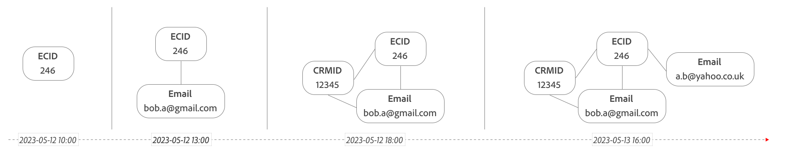

# Diagrambaserad utjämning

I diagrambaserade sammanfogningar anger du en händelsedatamängd samt det beständiga ID:t (cookie) och namnutrymmet för person-ID:t för den datauppsättningen. Diagrambaserad sammanfogning lägger till en ny kolumn för det sammanfogade ID:t i händelsedatamängden. Sedan används det beständiga ID:t för att fråga efter identitetsdiagrammet från Experience Platform Identity Service med det namnområde som anges för att uppdatera det sammanfogade ID:t.

>[!NOTE]
>
>Du måste kontrollera att datauppsättningen är [aktiverad för identitetstjänsten ](/help/stitching/faq.md#enable-a-dataset-for-the-identity-service).
>

## IdentityMap

Diagrambaserad sammanfogning stöder användning av fältgruppen [`identityMap` ](https://experienceleague.adobe.com/en/docs/experience-platform/xdm/schema/composition#identity) i följande scenarier:

- Använd den primära identiteten i `identityMap` namnutrymmen för att definiera persistentID:
   - Om flera primära identiteter hittas i olika namnutrymmen sorteras identiteterna i namnutrymmena lexigrafiskt och den första identiteten markeras.
   - Om flera primära identiteter hittas i ett och samma namnutrymme markeras den första lexikografiska tillgängliga primära identiteten.

  I exemplet nedan resulterar namnutrymmen och identiteter i en sorterad lista med primära identiteter och slutligen den valda identiteten.

  <table style="table-layout:auto">
     <tr>
       <th>Namnutrymmen</th>
       <th>Identitetslista</th>
     </tr>
     <tr>
       <td>ECID</td>
       <td><pre lang="json"><code>[ &nbsp;&nbsp;{"id": "ecid-3"}, &nbsp;&nbsp;{"id": "ecid-2", "primary": true}, &nbsp;&nbsp;{"id": "ecid-1", "primary": true} &nbsp;]</code></pre></td>
     </tr>
     <tr>
       <td>CCID</td>
       <td><pre lang="json"><code>[ &nbsp;&nbsp;{"id": "ccid-1"}, &nbsp;&nbsp;{"id": "ccid-2", "primary": true} ]</code></pre></td>
     </tr>
   </table>

  <table style="table-layout:auto">
    <tr>
      <th>Listan Sorterade identiteter</th>
      <th>Vald identitet</th>
    </tr>
    <tr>
      <td><pre lang="json"><code>PrimaryIdentities [ &nbsp;&nbsp;{"id": "ccid-2", "namespace": "CCID"}, &nbsp;&nbsp;{"id": "ecid-1", "namespace": "ECID"}, &nbsp;&nbsp;{"id": "ecid-2", "namespace": "ECID"} ] NonPrimaryIdentities [ &nbsp;&nbsp;{"id": "ccid-1", "namespace": "CCID"}, &nbsp;&nbsp;{"id": "ecid-3", "namespace": "ECID"} ]</code></pre></td>
      <td><pre lang="json"><code>"id": "ccid-2", "namespace": "CCID"</code></pre></td>
    </tr>
  </table>

- Använd namnområdet `identityMap` för att definiera persistentID:
   - Om flera värden för persistentID hittas i ett `identityMap`-namnområde används den första lexikografiska tillgängliga identiteten.

  I exemplet nedan har du valt ECID som namnutrymme att använda. Markeringen resulterar i en lista med sorterade identiteter och slutligen i den valda identiteten.

  <table style="table-layout:auto">
     <tr>
       <th>Namnutrymmen</th>
       <th>Identitetslista</th>
     </tr>
     <tr>
       <td>ECID</td>
       <td><pre lang="json"><code>[ &nbsp;&nbsp;{"id": "ecid-3"}, &nbsp;&nbsp;{"id": "ecid-2", "primary": true}, &nbsp;&nbsp;{"id": "ecid-1", "primary": true} ]</code></pre></td>
     </tr>
     <tr>
       <td>CCID</td>
       <td><pre lang="json"><code>[ &nbsp;&nbsp;{"id": "ccid-1"}, &nbsp;&nbsp;{"id": "ccid-2", "primary": true} ]</code></pre></td>
     </tr>
   </table>

  <table style="table-layout:auto">
    <tr>
      <th>Listan Sorterade identiteter</th>
      <th>Vald identitet</th>
    </tr>
    <tr>
      <td><pre lang="json"><code>[ &nbsp;&nbsp;"id": "ecid-1", &nbsp;&nbsp;"id": "ecid-2", &nbsp;&nbsp;"id": "ecid-3" ]</code></pre></td>
      <td><pre lang="json"><code>"id": "ecid-1", "namespace": "ECID"</code></pre></td>
    </tr>
  </table>

## Hur grafbaserad stygn fungerar

Med hjälp av häftning blir det minst två omgångar data i en given datauppsättning.

- **Liveutjämning**: försöker sammanfoga varje träff (händelse) när den kommer in, med det beständiga ID:t för att leta upp person-ID:t för det valda namnområdet genom att fråga efter identitetsdiagrammet. Om person-ID:t är tillgängligt från sökningen sammanfogas detta person-ID omedelbart.

- **Spela upp sammanfogning**: *spelar upp* data baserat på uppdaterade identiteter från identitetsdiagrammet. På den här scenen sammanfogas träffar från tidigare okända enheter (beständiga ID:n) när identitetsdiagrammet har matchat identiteten för ett namnutrymme. Uppspelningen bestäms av två parametrar: **frequency** och **lookback window**. Adobe erbjuder följande kombinationer av dessa parametrar:
   - **Daglig sökning efter en daglig frekvens**: Data spelas upp varje dag med ett 24-timmars uppslagsfönster. Det här alternativet har en fördel som innebär att det är mycket vanligare att spela upp filer, men oautentiserade profiler måste autentiseras samma dag som de besöker webbplatsen.
   - **Veckovis uppslag med en veckofrekvens**: Data spelas upp en gång i veckan med ett veckovisa uppslagsfönster (se [alternativ](#options)). Det här alternativet ger en fördel som gör att oautentiserade sessioner kan autentiseras mycket lättare. Ej sammanfogade data som är mindre än en vecka gamla bearbetas dock inte om förrän nästa veckovisa uppspelning.
   - **Veckovis uppspelning på en veckofrekvens**: Data spelas upp en gång i veckan med ett varannan vecka-uppslag (se [alternativ](#options)). Det här alternativet ger en fördel som gör att oautentiserade sessioner kan autentiseras mycket lättare. Ej sammanfogade data som är mindre än två veckor gamla bearbetas dock inte om förrän nästa veckovisa uppspelning.
   - **Månadsvis uppslag på en veckofrekvens**: Data spelas upp varje vecka med ett månadsuppslag (se [alternativ](#options)). Det här alternativet ger en fördel som gör att oautentiserade sessioner kan autentiseras mycket lättare. Ej sammanfogade data som är mindre än en månad gamla bearbetas dock inte om förrän nästa veckovisa uppspelning.

- **Sekretess**: När sekretessrelaterade begäranden tas emot, förutom att den begärda identiteten tas bort från källdatauppsättningen, måste alla sammanfogningar av den identiteten över oautentiserade händelser ångras. Identiteten måste också tas bort från identitetsdiagrammet för att förhindra att den specifika identiteten häftas med i framtiden.

  >[!IMPORTANT]
  >
  >Frigörandeprocessen, som en del av begäran om integritet, ändras i början av 2025. Den aktuella enhetsprocessen ändrar namn på händelser med den senaste versionen av kända identiteter. Denna omfördelning av händelser till en annan identitet kan få oönskade juridiska konsekvenser. För att åtgärda dessa problem uppdaterar den nya upplösningsprocessen från och med 2025 händelser som omfattas av sekretessposten med det beständiga ID:t.
  > 

Data utanför uppslagsfönstret spelas inte upp igen. En profil måste autentiseras inom ett angivet uppslagsfönster för att ett oautentiserat besök ska kunna identifieras tillsammans. När en enhet känns igen är den sydd från den punkten framåt.

Tänk på följande två identitetsdiagram för det beständiga ID:t `246` och `3579`, hur dessa identitetsdiagram uppdateras över tid och hur dessa uppdateringar påverkar stegen i diagrambaserad sammanfogning.

Du kan visa ett identitetsdiagram över tiden för en viss profil med [Identity Graph Viewer](https://experienceleague.adobe.com/en/docs/experience-platform/identity/features/identity-graph-viewer). Se även [Identitetstjänstens länkningslogik](https://experienceleague.adobe.com/en/docs/experience-platform/identity/features/identity-linking-logic) för att få en bättre förståelse för logiken som används vid länkning av identiteter.

### Steg 1: Liveutjämning

Livehäftning försöker häfta ihop varje händelse vid samlingen till känd information från identitetsdiagrammet.

+++ Information

| | Tid | Beständigt ID `ECID` | Namnområde  `Email`  | Stitched ID (after live stitch) |
|--:|---|---|---|---|
| 1 | 2023-05-12 11:00 | `246` | `246`  *undefined* | `246` |
| 2 | 2023-05-12 14:00 | `246` | `246`  `bob.a@gmail.com` | `bob.a@gmail.com` |
| 3 | 2023-05-12 15:00 | `246` | `246`  `bob.a@gmail.com` | `bob.a@gmail.com` |
| 4 | 2023-05-12 17:00 | `3579` | `3579`  *undefined* | `3579` |
| 5 | 2023-05-12 19:00 | `3579` | `3579`  `ted.w@gmail.com` | `ted.w@gmail.com` |
| 6 | 2023-05-13 15:00 | `246` | `246`  `bob.a@gmail.com` | `bob.a@gmail.com` |
| 7 | 2023-05-13 16:30 | `246` | `246`  `a.b@yahoo.co.uk` `246`  `bob.ab@gmail.com` | `a.b@yahoo.co.uk` |

{style="table-layout:auto"}

Du kan se hur det sammanslagna ID:t löses för varje händelse. Baserat på tidpunkten, det beständiga ID:t och sökningen av identitetsdiagrammet för det angivna namnutrymmet (samtidigt).
När sökningen matchar mer än ett sammanfogat ID (som för händelse 7) markeras det lexikografiska första ID som returneras av identitetsdiagrammet (`a.b@yahoo.co.uk` i exemplet).

+++

### Steg 2: Spela upp sammanfogning igen

Med jämna mellanrum (beroende på vilket uppslagsfönster som har valts) beräknas om sammanfogningar av historiska data baserat på den senaste versionen av identitetsdiagrammet vid tidpunkten för intervallet.

+++ Information

Med en replay-sammanslagning som inträffar 2023-05-13 16:30, med en 24-timmars uppslagsfönsterkonfiguration, sys vissa händelser i exemplet om (indikeras av ).

| | Tid | Beständigt ID `ECID` | Namnområde  `Email`  | Stitched ID   (after live stitch) | Stitched ID   (after replay 24 hours) |
|---|---|---|---|---|---|
| 2 | 2023-05-12 14:00 | `246` | `246`  `bob.a@gmail.com` | `bob.a@gmail.com` | `bob.a@gmail.com` |
| 3 | 2023-05-12 15:00 | `246` | `246`  `bob.a@gmail.com` | `bob.a@gmail.com` | `bob.a@gmail.com` |
|   | 2023-05-12 17:00 | `3579` | `3579`  `ted.w@gmail.com` | `3579` | `ted.w@gmail.com` |
|   | 2023-05-12 19:00 | `3579` | `3579`  `ted.w@gmail.com` | `ted.w@gmail.com` | `ted.w@gmail.com` |
|   | 2023-05-13 15:00 | `246` | `246`  `a.b@yahoo.co.uk` | `bob.a@gmail.com` | `a.b@yahoo.co.uk` |
|  7 | 2023-05-13 16:30 | `246` | `246`  `a.b@yahoo.co.uk` `246`  `bob.ab@gmail.com` | `a.b@yahoo.co.uk` | `a.b@yahoo.co.uk` |

{style="table-layout:auto"}

Med replay stitching på 2023-05-13 16:30, med en 7-dagars konfiguration av uppslagsfönstret, resys alla händelser från exemplet.

| | Tid | Beständigt ID `ECID` | Namnområde  `Email`  | Stitched ID   (after live stitch) | Stitched ID   (after replay 7 days) |
|---|---|---|---|---|---|
|   | 2023-05-12 11:00 | `246` | `246`  *undefined* | `246` | `a.b@yahoo.co.uk` |
|  2 | 2023-05-12 14:00 | `246` | `246`  `bob.a@gmail.com` | `bob.a@gmail.com` | `a.b@yahoo.co.uk` |
|   | 2023-05-12 15:00 | `246` | `246`  `bob.a@gmail.com` | `bob.a@gmail.com` | `a.b@yahoo.co.uk` |
|   | 2023-05-12 17:00 | `3579` | `3579`  `ted.w@gmail.com` | `3579` | `ted.w@gmail.com` |
|   | 2023-05-12 19:00 | `3579` | `3579`  `ted.w@gmail.com` | `ted.w@gmail.com` | `ted.w@gmail.com` |
|   | 2023-05-13 15:00 | `246` | `246`  `a.b@yahoo.co.uk` | `bob.a@gmail.com` | `a.b@yahoo.co.uk` |
|  7 | 2023-05-13 16:30 | `246` | `246`  `a.b@yahoo.co.uk` `246`  `bob.ab@gmail.com` | `a.b@yahoo.co.uk` | `a.b@yahoo.co.uk` |

{style="table-layout:auto"}

+++

### Steg 3: Begäran om sekretess

När du tar emot en begäran om sekretess, tas det sammanslagna ID:t bort i alla poster för den användare som omfattas av sekretessbegäran.

+++ Information

Följande tabell representerar samma data som ovan, men visar vilken effekt en sekretessbegäran (till exempel 2023-05-13 18:00) har på exempelhändelserna.

| | Tid | Beständigt ID `ECID` | Namnområde  `Email`  | Stitched ID (after privacy request) |
|--:|---|---|---|---|
|  1 | 2023-05-12 11:00 | `246` | `246`  `a.b@yahoo.co.uk` | `246` |
|  2 | 2023-05-12 14:00 | `246` | `246`  `a.b@yahoo.co.uk` | `246` |
|  3 | 2023-05-12 15:00 | `246` | `246`  `a.b@yahoo.co.uk` | `246` |
|  4 | 2023-05-12 17:00 | `3579` | `3579`  `ted.w@gmail.com` | `3579` |
|  5 | 2023-05-12 19:00 | `3579` | `3579`  `ted.w@gmail.com` | `3579` |
|  6 | 2023-05-13 15:00 | `246` | `246`  `a.b@yahoo.co.uk` | `246` |
|  7 | 2023-05-13 16:30 | `246` | `246`  `a.b@yahoo.co.uk` `246`  `bob.ab@gmail.com` | `246` |

{style="table-layout:auto"}

+++

## Förutsättningar

Följande krav gäller specifikt för diagrambaserad sammanfogning:

- Händelsedatauppsättningen i Adobe Experience Platform, som du vill använda sammanfogning på, måste ha en kolumn som identifierar en profil på varje rad, **beständigt ID**. Till exempel ett besökar-ID som genererats av ett Adobe Analytics AppMeasurement-bibliotek eller ett ECID som genererats av Experience Platform identitetstjänst.
- Det beständiga ID:t måste också vara [definierat som en identitet](https://experienceleague.adobe.com/en/docs/experience-platform/xdm/ui/fields/identity) i schemat.
- Identitetsdiagrammet från Experience Platform Identity Service måste ha ett namnutrymme (till exempel `Email` eller `Phone`) som du vill använda vid sammanfogning för att matcha **person-ID**. Mer information finns i [Experience Platform Identity Service](https://experienceleague.adobe.com/en/docs/experience-platform/identity/home).

>[!NOTE]
>
>Du behöver **inte** en kunddataplattformslicens i realtid för diagrambaserad sammanfogning. **Prime**-paketet eller senare av Customer Journey Analytics innehåller de Experience Platform Identity Service-berättiganden som krävs.

## Begränsningar

Följande begränsningar gäller specifikt för diagrambaserad sammanfogning:

- Tidsstämplar beaktas inte vid sökning efter person-ID med det angivna namnutrymmet. Det är alltså möjligt att ett beständigt ID sammanfogas med ett person-ID från en post som har en tidigare tidsstämpel.
- I scenarier med delade enheter, där namnutrymmet i diagrammet innehåller flera identiteter, används den första lexikografiska identiteten. Om namnutrymmesbegränsningar och -prioriteringar konfigureras som en del av releasen av regler för diagramlänkning, används den senast autentiserade användarens identitet. Mer information finns i [Delade enheter](/help/use-cases/stitching/shared-devices.md).
- I identitetsdiagrammet finns det en hård gräns på tre månader för att efterfylla identiteter. Du använder bakåtfyllnadsidentiteter om du inte använder ett Experience Platform-program, som Customer Data Platform i realtid, för att fylla i identitetsdiagrammet.
- [Identitetstjänstens skyddsprofiler](https://experienceleague.adobe.com/en/docs/experience-platform/identity/guardrails) gäller. Se till exempel följande [statiska begränsningar](https://experienceleague.adobe.com/en/docs/experience-platform/identity/guardrails#static-limits):
   - Maximalt antal identiteter i ett diagram: 50.
   - Maximalt antal länkar till en identitet för ett enskilt batchintag: 50.
   - Maximalt antal identiteter i en XDM-post för diagraminmatning: 20.
   - Minsta antal identiteter i en XDM-post för pejling: 2.
