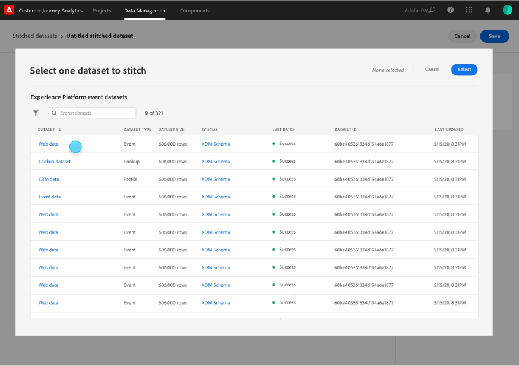

# Skapa och hantera sammanslagna datauppsättningar

{{select-package}}

Med hjälp av häftning kan administratörer sätta ihop identiteter på datauppsättningar som finns i Customer Journey Analytics. Med hjälp av datauppsättningar ökar exaktheten i en profils representation, vilket i slutänden ger bättre analys och rapportering.

Med sammanfogningsprocessen kan du definiera ett befintligt **beständigt ID** i en datauppsättning. Sätt sedan ihop den beständiga identifieraren för ett angivet uppspelningsfönster (varje dag, varje vecka) med det mest korrekta **person-ID** (person eller autentiserad identifierare) som är tillgängligt för den datauppsättningen. Exempel på personidentifierare är e-post, telefonnummer, CRM-id eller andra identiteter som lagras i diagrammet. Se [Översikt](overview.md) för mer information om häftning.

## Skapa

Om du vill börja sammanfoga fogar skapar du en eller flera sammanfogade datauppsättningar. Så här skapar du en sammanfogad datauppsättning:

1. Välj **[!UICONTROL ** Stitching **]** från **[!UICONTROL ** Data Management **]** i det övre fältet.

2. Välj [!UICONTROL Stitched datasets]Skapa sammanfogad datamängd **[!UICONTROL ** på skärmen **]**.

   Du får en dialogruta som förklarar ditt ansvar.

3. Välj **[!UICONTROL ** Fortsätt **]** om du accepterar dessa ansvarsområden.

   >[!NOTE]
   >
   >    Om du väljer **[!UICONTROL ** Avbryt **]** kan du inte skapa en sammansatt datauppsättning.

4. På skärmen [!UICONTROL Stitched datasets > Untitled stitched dataset]:

   1. Definiera ett **[!UICONTROL ** datauppsättningsnamn **]** och (valfritt) **[!UICONTROL ** Beskrivning **]**,

   2. Välj sandlådan i listan **[!UICONTROL ** Sandbox **]** där händelsedatamängden lagras.

      

   3. Välj knappen **[!UICONTROL ** Välj källdatauppsättning **]**.

      I popup-fönstret [!UICONTROL Select one dataset to stitch]:

      

      - Välj en datauppsättning och välj **[!UICONTROL ** Välj **]** för att fortsätta.

   4. Välj en beständig identifierare i listan **[!UICONTROL ** Beständigt ID **]**.

   5. Välj en personidentifierare i listan **[!UICONTROL ** Transient ID **]**.

      Du ser att en förhandsvisningspanel visas för att beräkna mättnadsgraden (antal gånger det finns ett värde för var och en av de angivna identifierarna över antalet händelser) under de senaste sju dagarna. När beräkningen är klar visas färgerna på panelen om de minimala villkoren för att fästa bilden uppfylls (grönt) eller inte uppfylls (rött).

      

      Minimivillkoren är:

      - beständig identifierarmättnad: frekvens >= 95 %

      - personidentifierarens mättnad: frekvens >= 5 %

        Om minimivillkoren uppfylls kan du experimentera med provvärden.

      - Välj **[!UICONTROL ** Skapa sydda demo-ID:n **]**.

        I dialogrutan [!UICONTROL Experiment with sample values] visas en tabell med exempelvärden för [!UICONTROL timestamp], [!UICONTROL Persistent ID], [!UICONTROL Transient ID], [!UICONTROL Stitched ID (Live)], [!UICONTROL Stitched ID (1-day replay)] och [!UICONTROL Stitched ID (7-day replay)].

            
            
            1.  Ange ett värde för **[!UICONTROL **Persistent ID**]**.
            
            2.  Välj **[!UICONTROL **Refresh stitched IDs**]** för att se effekten av sammanfogningsprocessen på data i datauppsättningen.
            
            3.  Välj **[!UICONTROL **Close**]** när du är klar med att experimentera med provvärden.
        

        Tillbaka på skärmen [!UICONTROL Stitched datasets > _Datauppsättningsnamn_]:

   6. Välj ett alternativ för frekvens och period för omräkning av historiska data från listan **[!UICONTROL ** Uppspelningsfönster **]**.

      Du kan välja mellan standardvärdet **[!UICONTROL ** Föregående dag, Varje dag **]** eller **[!UICONTROL ** Föregående 7 dagar, Varje vecka **]**.

   7. Välj ett värde i listan **[!UICONTROL ** Genomsnittligt antal dagliga händelser **]**.

   8. Ange ett värde (mellan `0` och `12`) i **[!UICONTROL ** Antal månader att fylla i igen **]**.

   9. Välj **[!UICONTROL ** Spara **]** om du vill spara den sammanslagna datauppsättningen och initiera sammanfogningen.

## Visa status

Du kan visa status för sammanfogning i listan [!UICONTROL Stitched datasets].

- Välj **[!UICONTROL ** Stitching **]** från **[!UICONTROL ** Data Management **]** i det övre fältet.

  Du ser en lista över sammanfogade datauppsättningar, som alla identifieras med [!UICONTROL Sandbox], [!UICONTROL Source dataset], [!UICONTROL Status], [!UICONTROL Backfill status], [!UICONTROL Owner] och [!UICONTROL Date created].

  

  Möjliga värden för [!UICONTROL Status] är:

  | Värde | Förklaring |
  |-----|-----|
  | **[!UICONTROL ** Köad **]** | Begäran tas emot och behandlas snart. |
  | **[!UICONTROL ** Skapande **]** pågår | Resurser och nyligen sammansatta datauppsättningar håller på att skapas. |
  | **[!UICONTROL ** Stitching pågår **]** | Det finns resurser och sammanfogade datauppsättningar och sammanfogning pågår |
  | **[!UICONTROL ** Fel **]** | Det är problem med att sy ihop. Ett schema kanske har ändrats mellan källdatauppsättningen och sammanfogade datauppsättningar, den dagliga volymen är för stor eller... (_**behöver mer information här..**_) |

  >[!INFO]
  >
  >    Varje gång en status ändras skickas ett meddelande med meddelandet **[!UICONTROL ** Den namngivna datauppsättningen _namnet på datauppsättningen_ har ändrats till status _statusnamnet _**]**.

  [!UICONTROL Backfill status] kan ha följande värden: 0 %, 25 %, 50 %, 75 % eller 100 %.

  Du kan välja informationsikonen om du vill visa ett popup-fönster med mer information om den valda sammanfogade datauppsättningen.

## Ta bort

>[!NOTE]
>
>Du kan bara ta bort datauppsättningar som har statusen [!UICONTROL Stitching in progress], [!UICONTROL Error] eller [!UICONTROL Queued].

Så här tar du bort en sammanfogad datauppsättning:

- Välj **[!UICONTROL **..**]** för den sammanslagna datauppsättningen och välj **[!UICONTROL ** Ta bort **]** på menyn.

  

Så här tar du bort flera sammanfogade data:

- Markera flera sammanfogade datauppsättningar med kryssrutan i början av varje listad datauppsättning.

- Välj **[!UICONTROL **..**]** från en av de markerade sammanslagna datauppsättningarna och välj **[!UICONTROL ** Ta bort **]** på menyn.
