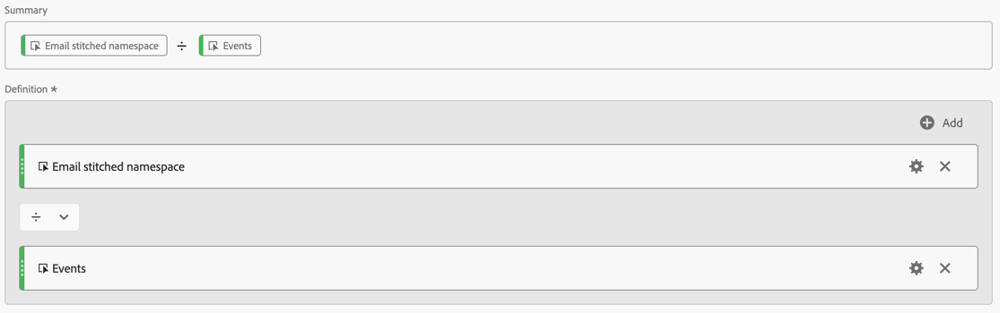

# Validera sammanfogning

Målet för [identitetssammanfogning](/help/stitching/overview.md) (eller helt enkelt sammanfogning) är att höja lämpligheten hos en händelsedatauppsättning för flerkanalsanalys. Den här höjden uppnås när alla rader med data i datauppsättningen innehåller den önskade högsta identitetsordningen som är tillgänglig. Med den här höjden kan du sedan:

* Skapa personcentrerade rapporter, utan att lämna anonyma människor.
* Anslut flera enheter till en enda person.
* Koppla samman en person över flera kanaler.

I den här artikeln beskrivs analysmetoder för att mäta förhöjningen på en eller flera nyskapade sammanfogade datauppsättningar och för att skapa trygghet i att sammanfogning ger dessa fördelar.

Analysmetoderna innehåller [inställningar för datavykomponenten](/help/data-views/component-settings/overview.md) som vanligtvis är tillgängliga för administratörer. Metoderna kräver också att analytiker, som arbetar i ett Analysis Workspace-projekt, skapar beräknade mätvärden och visualiseringar.

Även om dessa analysmetoder kan användas för både fältbaserad sammanfogning och grafbaserad sammanfogning, kanske vissa element inte finns i datauppsättningen, särskilt i ett grafbaserat sammanfogningsscenario. Dessa saknade element kan göra det svårt att beräkna hissar direkt i Analysis Workspace.

>[!NOTE]
>
>Sammanfogning (validering av) av en eller flera datauppsättningar bidrar i slutändan till bättre analyser och insikter. I den här artikeln beskrivs emellertid inte det övergripande värdet för en Customer Journey Analytics-konfiguration som har alla datauppsättningar i Experience Platform justerade mot samma ID-namnutrymme. Och att alla dessa datauppsättningar är väl sammanfogade för att kunna utföra analyser under hela kundresan.

## Krav för datavy

För mätplanen för sammanslagningsvalidering måste du se till att du har alla mått och mått som krävs från den sammanslagna datauppsättningen definierade i en datavy. Du måste verifiera att både `stitchedID.id`- och `stitchedId.namespace.code`-fälten har lagts till som dimensioner. Samtidigt som den sammanfogade datauppsättningen är en exakt kopia av den ursprungliga datauppsättningen läggs dessa två nya kolumner till i datauppsättningen vid sammanfogningen:

* Använd `stitchedID.namespace.code` för att definiera en **[!UICONTROL Stitched Namespace]**-dimension. Den här dimensionen innehåller namnområdet för identiteten som raden har höjts till, till exempel `Email`, `Phone`. Eller namnutrymmet som sammanslagningsprocessen återgår till, till exempel `ECID`.
  

* Använd `stitchedID.id` för att definiera en **[!UICONTROL Stitched ID value]**-dimension. Den här dimensionen innehåller identitetsens råvärde. Till exempel: hashade e-post, hashade telefon, ECID. Det här värdet används med **[!UICONTROL Stitched Namespace]**.
  

Dessutom måste du lägga till två sammanslagningsmått som baseras på förekomsten av värden i en dimension.

1. Använd fältet som innehåller Person-ID:t från den sammanslagna datauppsättningen för att konfigurera ett mätvärde som definierar om ett Person-ID har angetts. Lägg till det här person-ID:t även om du använder diagrambaserade häftningar som person-ID:t för att skapa en baslinje. Om person-ID:t inte finns i datauppsättningen är baslinjen 0 %.

   I exemplet nedan fungerar `personalEmail.address` som identitet och används för att skapa måttet **[!UICONTROL &#x200B; _Email set]**.
   

1. Använd fältet `stitchedID.namespae.code` för att skapa en **[!UICONTROL Email stitched namespace]**-dimension. Se till att du anger [Inkludera komponentinställningar för utelämna värden](/help/data-views/component-settings/include-exclude-values.md), så du bör bara ta hänsyn till värden i namnområdet som du försöker höja dataraderna till.
   1. Välj **[!UICONTROL Set include/exclude values]**.
   1. Välj **[!UICONTROL If all criteria are met]** som **[!UICONTROL Match]**.
   1. Ange **[!UICONTROL Equals]** `email` som **[!UICONTROL Criteria]** för att välja händelser som har höjts till e-postnamnområdet.

   

## Fasta dimensioner

När båda dimensionerna har lagts till i datavyn kan du använda [frihandstabeller](/help/analysis-workspace/visualizations/freeform-table/freeform-table.md) i Analysis Workspace för att kontrollera data som varje dimension har.

I tabellen **[!UICONTROL Stitched Namespace dimension**] visas vanligtvis två rader för varje datauppsättning. En rad som representerar när sammanfogningsprocessen måste använda reservmetoden (ECID). Den andra raden visar händelser som är associerade med det önskade ID-namnutrymmet (e-post).

För tabellen **[!UICONTROL Stitched ID dimension**] ser du de råvärden som kommer från händelserna. I den här tabellen ser du att värdena sammanfaller mellan det beständiga ID:t och det önskade person-ID:t.

## Enhetscentrerad eller personcentrerad rapportering

När du skapar en anslutning måste du definiera vilket fält eller vilken identitet som ska användas för person-ID:t. Om du t.ex. väljer ett enhets-ID som personnummer på en webbdatauppsättning skapar du enhetscentrerade rapporter och förlorar möjligheten att koppla dessa data till andra offlinekanaler. Om du väljer ett fält eller en identitet för flera kanaler, till exempel e-post, förlorar du i alla oautentiserade händelser. För att förstå detta måste ni ta reda på hur mycket av trafiken som är oautentiserad och hur mycket av trafiken som är autentiserad.

1. Skapa ett beräknat mått **[!UICONTROL Unauthenticated events over total]**. Definiera regeln i regelbyggaren enligt nedan:
   

1. Skapa ett beräknat mått **[!UICONTROL Email authentication rate]**, baserat på det **[!UICONTROL _Email set]**-mått som du definierade tidigare. Definiera regeln i regelbyggaren enligt nedan:
   

1. Använd det **[!UICONTROL Unauthenticated events over total]** beräknade måttet tillsammans med det **[!UICONTROL Email authentication rate]** beräknade måttet för att skapa en [Ring](/help/analysis-workspace/visualizations/donut.md)-visualisering. Visualiseringen visar antalet oautentiserade och autentiserade händelser i datauppsättningen.

   

## Häftnings-ID:n

Du vill mäta identifieringsprestanda före och efter sammanfogning. Om du vill göra det skapar du ytterligare tre beräknade mått:

1. Ett **[!UICONTROL Stitched authentication rate]** beräknat mått som beräknar antalet händelser där namnutrymmet som sammanfogats har angetts till önskad identitet över det totala antalet händelser. När du konfigurerade datavyn skapade du ett **[!UICONTROL Email stitched namespace]**-mått som innehöll ett filter som endast skulle räknas när en händelse har ett namnutrymme som är inställt på e-post. Det beräknade måttet använder det här **[!UICONTROL Email stitched namespace]**-måttet för att ge en indikation på vilken procentandel av data som har den önskade identiteten.
   

1. Ett **[!UICONTROL Percent increase]** beräknat mått som beräknar den råa procentuella ändringen mellan den aktuella identifieringsfrekvensen och den sammanslagna.
   

1. Ett **[!UICONTROL Lift]** beräknat mått som beräknar lyften mellan den aktuella identifieringsfrekvensen och den sammanslagna identifieringsfrekvensen.
   

## Slutsats

Om du kombinerar alla data i en Analysis Workspace Freeform-tabell kan du börja se effekten och värdet som sammanfogningen ger, inklusive:

* Aktuell autentiseringsfrekvens: Baslinjen för antalet händelser som redan har rätt person-ID över det totala antalet händelser.
* Stitched authentication rate: The new number of events that have the correct Person ID over the total number of events.
* Procentuell ökning: Den procentuella ökningen av råformat från den sammanslagna autentiseringsfrekvensen minus den aktuella autentiseringsfrekvensen för baslinjen.
* Lyft: Den procentuella förändringen jämfört med den aktuella autentiseringsfrekvensen för baslinjen.

Det viktigaste med den här artikeln är att den här typen av sammanslagningsvalidering och analys hjälper dig att:

* Ge en heltäckande anpassad bild av autentiseringseffektiviteten genom att jämföra den aktuella jämfört med sammanslagna hastigheter.
* Möjliggör tydlig mätning av förbättringen genom procentuella ökningar och lyft mätvärden.
* Hjälper till att identifiera den verkliga effekten av att fästa ihop vid användarautentisering.
* Skapa ett standardiserat sätt att kommunicera autentiseringsresultat mellan olika team.
* Tillåt datadrivna beslut om autentiseringsstrategi och optimering.

Dessa mätvärden ger tillsammans en fullständig bild av hur Customer Journey Analytics sammanfogning påverkar antalet lyckade autentiseringar och den övergripande personidentifieringsprestandan.
