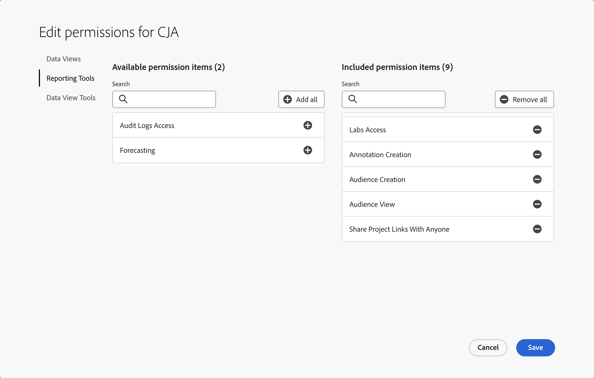

# Åtkomstkontroll

Tre behörighetsnivåer eller tre roller styr Customer Journey Analytics: produktadministratörsroll, administratörsroll för produktprofiler och åtkomst på användarnivå. I det här avsnittet förklaras de här rollerna mer ingående.

I den här artikeln beskrivs också mer detaljerade sätt att begränsa åtkomsten, t.ex. Workspace-kurering och radnivå samt åtkomstkontroll på värdenivå.

## Rollbaserad åtkomstkontroll

Följande rollbaserade åtkomstkontrollnivåer är tillgängliga.

### Produktadministratörsroll

Användare som har tilldelats rollen Produktadministratör får som standard de behörigheter som krävs för att utföra de flesta åtgärder inom Customer Journey Analytics. För vissa uppgifter krävs dock ytterligare behörigheter.

Lägga till en användare som produktadministratör:

1. Gå till [Admin Console](https://adminconsole.adobe.com/enterprise/).

1. Välj [!UICONTROL **Customer Journey Analytics**] > [!UICONTROL **Administratörer**] > [!UICONTROL **Lägg till administratör**].

   De användare som du har lagt till får standardbehörigheten [Produktadministratör](#product-admin-default-permissions). Du kan även ge dem [ytterligare behörigheter](#product-admin-additional-permissions) om det behövs.

#### Standardbehörigheter för produktadministratör

Produktadministratörer har behörighet att utföra de flesta uppgifter inom Customer Journey Analytics.

Produktadministratörer har som standard behörighet att utföra följande uppgifter:

* Skapa, uppdatera och ta bort datavyer
* Uppdatera och ta bort projekt, segment, beräknade värden, målgrupper, anteckningar eller segment som skapats av andra användare
* Dela Workspace-projekt med alla användare
* Hantera rapporteringsaktivitet i [Rapporteringsaktivitetshanteraren](/help/reporting-activity-manager/reporting-activity-overview.md)
* [Exportera fullständiga tabeller](/help/analysis-workspace/export/export-cloud.md) från Analysis Workspace

#### Ytterligare behörigheter för produktadministratör

Utöver att läggas till som produktadministratör i **Customer Journey Analytics-produktprofilen** i [Admin Console](https://adminconsole.adobe.com/enterprise/) krävs ytterligare behörigheter för att kunna utföra följande åtgärder i Customer Journey Analytics:

* Skapa, uppdatera och ta bort data [Anslutningar](/help/connections/overview.md)

  För att kunna utföra den här åtgärden måste användarna ingå i en **Experience Platform-produktprofil** som ger följande behörigheter:

  | Kategori | Behörighet | Beskrivning |
  |---|---|---|
  | [!UICONTROL Data Modeling] | [!UICONTROL View Schemas] | Skrivskyddad åtkomst till scheman och relaterade resurser. |
  | [!UICONTROL Data Modeling] | [!UICONTROL Manage Schemas] | Åtkomst för att läsa, skapa, redigera och ta bort scheman och relaterade resurser. |
  | [!UICONTROL Data Management] | [!UICONTROL View Datasets] | Skrivskyddad åtkomst för datauppsättningar och scheman. |
  | [!UICONTROL Data Management] | [!UICONTROL Manage Datasets] | Åtkomst för att läsa, skapa, redigera och ta bort datauppsättningar. Skrivskyddad åtkomst för scheman. |
  | [!UICONTROL Data Ingestion] | [!UICONTROL Manage Sources] | Tillgång till att läsa, skapa, redigera och inaktivera källor. |
  | [!UICONTROL Identity Management] | [!UICONTROL View Identity Namespaces] | Skrivskyddad åtkomst för identitetsnamnutrymmen. |

  Mer information om Experience Platform-behörigheter finns i [Hantera behörigheter för en produktprofil](https://experienceleague.adobe.com/sv/docs/experience-platform/access-control/ui/permissions).

* Om Adobe Journey Optimizer har integrerats med CJA där AJO Connections finns, måste även behörigheterna Journeys läggas till för att få åtkomst till Connections:

  | Kategori | Behörighet | Beskrivning |
  |---|---|---|
  | [!UICONTROL Journeys] | [!UICONTROL View Journeys Events, Data Sources and Actions] | Skrivskyddad åtkomst till resehändelser, anpassade reseåtgärder och datakällor för resan. |
  | [!UICONTROL Journeys] | [!UICONTROL Manage Journeys Events, Data Sources and Actions] | Läs, skapa, redigera och ta bort händelser, källor eller åtgärder. |
  | [!UICONTROL Journeys] | [!UICONTROL View Journeys] | Skrivskyddad åtkomst till resor. |
  | [!UICONTROL Journeys] | [!UICONTROL Manage Journeys] | Läs, skapa, redigera och ta bort resor. |

* Exportera datauppsättningar till [mål](https://experienceleague.adobe.com/sv/docs/experience-platform/destinations/ui/activate/export-datasets)

  För att kunna utföra den här åtgärden måste användarna ingå i en **Experience Platform-produktprofil** som ger följande behörigheter:

  | Kategori | Behörighet | Beskrivning |
  |---|---|---|
  | [!UICONTROL Destinations] | [!UICONTROL Manage Destinations] | Åtkomst för att läsa, skapa och ta bort målanslutningar och målkonton. |
  | [!UICONTROL Destinations] | [!UICONTROL Activate Destinations] | Tillåt användare att aktivera segment till befintliga mål. Aktiverar mappningssteget i aktiveringsarbetsflödet. Den här behörigheten kräver även att behörigheten Visa mål beviljas den användare som vill aktivera data till mål. |

  Mer information om Experience Platform-behörigheter finns i [Hantera behörigheter för en produktprofil](https://experienceleague.adobe.com/sv/docs/experience-platform/access-control/ui/permissions).

* Använd [BI-tillägget](../data-views/bi-extension.md)

  För användare att använda BI-tillägget, en produktadministratör

   * måste se till att Experience Platform-behörigheterna för användaren innehåller en roll som har frågetjänstresursen med alternativen Hantera frågor och Hantera frågetjänstintegrering. Mer information om Experience Platform-behörigheter finns i [Hantera behörigheter för en produktprofil](https://experienceleague.adobe.com/sv/docs/experience-platform/access-control/ui/permissions).

     | Kategori | Behörighet | Beskrivning |
     |---|---|---| 
     | [!UICONTROL Query Service] | [!UICONTROL Manage Queries] | Åtkomst att läsa, skapa, redigera och ta bort strukturerade SQL-frågor för plattformsdata. |
     | [!UICONTROL Query Service] | [!UICONTROL Manage Query Service Integration] | Åtkomst för att skapa, uppdatera och ta bort ej förfallande autentiseringsuppgifter för åtkomst till frågetjänsten. |

   * måste se till att rätt Customer Journey Analytics-behörigheter för användaren finns:
      * behörighet att få tillgång till relevanta datavyer. Se [!UICONTROL Data Views] i [Åtkomst på användarnivå](#user-level-access).
      * behörighet att komma åt Customer Journey Analytics BI-tillägget. Se [!UICONTROL Data View Tools] i [Åtkomst på användarnivå](#user-level-access).

### Administratörsroll för produktprofil

En produktprofil är en uppsättning behörigheter. Produktadministratörer skapar produktprofiler och kan tilldela produktprofiladministratörer för att hantera en eller flera produktprofiler. En produktprofiladministratör kan sedan:

* Hantera tilldelade produktprofiler. Du kan till exempel lägga till eller ta bort användare eller användargrupper och ändra behörigheter för produktprofilerna.

* I Customer Journey Analytics redigerar du datavyer som ingår i en tilldelad produktprofil. Produktprofiladministratörer kan inte skapa nya datavyer.

### Åtkomst på användarnivå

Tabellen nedan visar de viktigaste åtkomstbehörigheterna för olika Customer Journey Analytics-funktioner som du kan konfigurera för berörda användare. Du kan hantera olika nivåer av användaråtkomst via produktprofiler. En produktprofil innehåller ett antal behörigheter som du sedan kan tilldela till enskilda användare eller användargrupper.

Fliken **[!UICONTROL Permissions]** ingår i varje produktprofil i [Admin Console](https://adminconsole.adobe.com/enterprise/).

| Kategori | Behörighet | Beskrivning |
| --- | --- | ---|
| [!UICONTROL Data Views] | *datavyns namn* | Om du växlar **[!UICONTROL Auto-Include]** till **[!UICONTROL On]** kan användare som är en del av den här produktprofilen visa alla befintliga och nyligen skapade datavyer. Om den här inställningen är **[!UICONTROL Off]** kan du välja särskilda datavyer som användarna har åtkomst till. |
| [!UICONTROL Reporting Tools] | [!UICONTROL Analysis Workspace Access] | Låt användare få åtkomst till [Analysis Workspace](/help/analysis-workspace/home.md). |
| [!UICONTROL Reporting Tools] | [!UICONTROL Guided Analysis Access] | Låt användarna komma åt [Guidad analys](/help/guided-analysis/overview.md). |
| [!UICONTROL Reporting Tools] | [!UICONTROL Calculated Metrics Creation] | Låt användarna skapa [beräknade värden](/help/components/calc-metrics/calc-metr-overview.md). Användarna kan tagga, dela, ta bort, byta namn på, godkänna, avgodkänna endast de beräknade mätvärden som de skapar eller de beräknade mätvärden som delas med dem. |
| [!UICONTROL Reporting Tools] | [!UICONTROL Segment Creation] | Låt användare skapa [segment](/help/components/filters/filters-overview.md). Användare kan tagga, dela, ta bort, byta namn på, godkänna, inte godkänna enbart de segment som de skapar eller de segment som delas med dem. |
| [!UICONTROL Reporting Tools] | [!UICONTROL Labs Access] | Ge användarna åtkomst till fliken [Labs](/help/labs/labs.md) i Customer Journey Analytics. |
| [!UICONTROL Reporting Tools] | [!UICONTROL Annotation Creation] | Låt användarna skapa [anteckningar](/help/components/annotations/overview.md). Användare kan endast tagga, dela, ta bort och byta namn på de anteckningar de skapar eller anteckningar som delas med dem. |
| [!UICONTROL Reporting Tools] | [!UICONTROL Audience View] | Låt användarna visa [målgrupper](/help/components/audiences/audiences-overview.md). |
| [!UICONTROL Reporting Tools] | [!UICONTROL Audience Creation] | Låt användare skapa [målgrupper](/help/components/audiences/audiences-overview.md). |
| [!UICONTROL Reporting Tools] | [!UICONTROL Audit Logs Access] | Tvinga behörighetskontrollen för användargränssnittet för [API](https://developer.adobe.com/cja-apis/docs/endpoints/auditlogs/) och granskningsloggarna. |
| [!UICONTROL Reporting Tools] | [!UICONTROL Share Project Links With Anyone] | Låt användare [dela projekt med vem som helst.](https://experienceleague.adobe.com/sv/docs/analytics-platform/using/cja-workspace/curate-share/share-projects) |
| [!UICONTROL Reporting Tools] | [!UICONTROL Forecasting] | Ge användarna tillgång till funktionen [Prognoser](../analysis-workspace/c-forecast/forecasting.md) i Analysis Workspace |
| [!UICONTROL Reporting Tools] | [!UICONTROL AI Assistant: Product Knowledge] | Ge användarna tillgång till [AI-assistenten](../ai-assistant.md) för produktinformation. |
| [!UICONTROL Reporting Tools] | [!UICONTROL Intelligent Captions] | Låt användarna komma åt [Intelligenta bildtexter](/help/analysis-workspace/visualizations/intelligent-captions.md). |
| [!UICONTROL Data View Tools] | [!UICONTROL Full Table Export] | Låt användare [exportera fullständiga tabeller till molnet](/help/analysis-workspace/export/export-cloud.md). |
| [!UICONTROL Data View Tools] | [!UICONTROL CJA BI Extension] | Låt användare använda [BI-tillägget](../data-views/bi-extension.md). |

{style="table-layout:auto"}

## Projektstrukturering för Workspace

En annan åtkomstkontrollnivå kan användas på rapportnivå i Workspace. Du kan begränsa åtkomsten till specifika komponenter för vissa användare. Mer information om hur du begränsar komponenter (dimensioner, mått, segment, datumintervall) på Workspace-projektnivå och hur kurationen är kopplad till datavyer finns i [Kuratprojekt](/help/analysis-workspace/curate-share/curate.md).

## Ge åtkomst till enskilda mått eller mått

Du kan inte bevilja eller neka tillstånd för enskilda mått eller mått i Customer Journey Analytics på samma sätt som i traditionella Adobe Analytics. Mätvärden och dimensioner kan ändras i [datavyer](/help/data-views/data-views.md) och kan ändras i Customer Journey Analytics. Om du ändrar dem ändras även rapporteringen retroaktivt.

## Användningsexempel

Här följer några exempel som visar hur åtkomstkontroll kan användas i realtidsscenarier.

### Åtkomst från tredje part

Du kan ge produktprofilsadministration åtkomst till en gruppledare för en tredje part som ditt företag arbetar hos. Den här administratören kan lägga till användare i företagets team i den här produktprofilen. Den här produktprofiladministratören kan ge åtkomst till specifika datavyer och lägga till andra användare från tredje part i den här produktprofilen. Produktprofilens administratör kan ändra datavyer så att de passar tredjepartsteamets behov.

### Åtkomstkontroll på radnivå

Du vill ge användarna åtkomst till data från endast en dag. Så här begränsar du åtkomsten till de raderna:

1. Skapa ett segment i [!UICONTROL Settings] för en viss datavy, där [!UICONTROL Day] är lika med det datum som du vill att de ska ha dataåtkomst till. Mer information finns i [Skapa datavy](/help/data-views/create-dataview.md#settings-filters).
1. Spara datavyn, som använder segmentet på datadelen i datauppsättningarna i den underliggande anslutningen. Rader som inte passar in i segmentdefinitionen exkluderas automatiskt från datavyn och är inte tillgängliga för Analysis Workspace när den här datavyn används.
1. Skapa en ny [produktprofil](#product-profile-admin-role) i Admin Console, lägg till användare i produktprofilen och ta endast med den här specifika datavyn i produktprofilen.

### Åtkomstkontroll på värdenivå

Användare som har åtkomst till en datavy kan bara arbeta med de mått och mått som administratören har inkluderat i den här datavyn. Administratörer kan använda komponentinställningarna [Inkludera/exkludera funktioner](/help/data-views/component-settings/include-exclude-values.md) eller [Värdebuckning](../data-views/component-settings/value-bucketing.md) i en datavy för att exkludera eller aggregera vissa dimensionsvärden från en datavy.

Du kan till exempel skapa ett mätvärde som heter *Hypertension* i en datavy från en komponent som innehåller enskilda patientdata från datauppsättningen. Du använder värdepaketering för att bara ge åtkomst till paketerade värden, så att användarna av data inte ser de enskilda patientuppgifterna.

