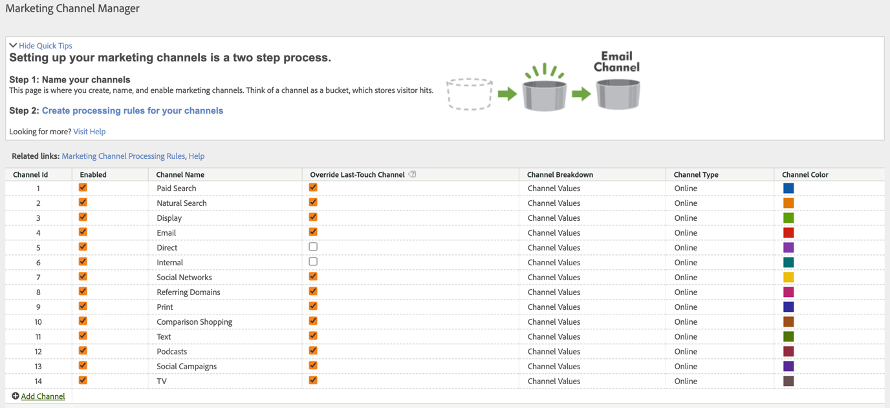

# Använd mått för marknadsföringskanaler i Adobe Experience Platform

Om din organisation använder [Källanslutning för analyser](https://experienceleague.adobe.com/docs/experience-platform/sources/connectors/adobe-applications/analytics.html) om du vill lägga in rapportsvitdata i Customer Journey Analytics kan du konfigurera en anslutning i Customer Journey Analytics för att rapportera om dimensionerna för marknadsföringskanalen.

## Förutsättningar

* Rapportsvitens data måste redan ha importerats till Adobe Experience Platform med [Källanslutning för analyser](https://experienceleague.adobe.com/docs/experience-platform/sources/connectors/adobe-applications/analytics.html). Andra datakällor stöds inte, eftersom marknadsföringskanaler använder bearbetningsregler i en Analytics-rapportserie.
* Bearbetningsregler för marknadsföringskanaler måste redan vara konfigurerade. Se [Bearbetningsregler för marknadsföringskanaler](https://experienceleague.adobe.com/docs/analytics/admin/admin-tools/manage-report-suites/edit-report-suite/marketing-channels/c-rules.html) i Adobe Analytics Components Guide.

## Schemaelement för marknadsföringskanal

När du har upprättat Analytics-källkopplingen för en önskad rapportsvit skapas ett XDM-schema åt dig. Det här schemat innehåller alla analysdimensioner och mätvärden som rådata. Dessa rådata innehåller inte attribuering eller beständighet. I stället kör varje händelse igenom regler för hantering av marknadsföringskanaler och registrerar den första regeln som den matchar. Du anger attribuering och beständighet när du skapar en datavy i Customer Journey Analytics.

1. [Skapa en anslutning](/help/connections/create-connection.md) som innehåller en datauppsättning baserad på Analytics-källkopplingen.
2. [Skapa en datavy](/help/data-views/create-dataview.md) som har följande dimensioner:
   * **`channel.typeAtSource`**: Motsvarar [Marknadsföringskanal](https://experienceleague.adobe.com/docs/analytics/components/dimensions/marketing-channel.html) dimension.
   * **`channel._id`**: Motsvarar [Marknadskanalsdetaljer](https://experienceleague.adobe.com/docs/analytics/components/dimensions/marketing-detail.html)
3. Ge varje dimension önskad attribueringsmodell och beständighet. Om du vill ha både den första och sista beröringsdimensionen drar du varje marknadsföringskanaldimension till komponentområdet flera gånger. Ge varje dimension önskad attribueringsmodell och beständighet. Adobe rekommenderar också att du ger varje dimension ett visningsnamn som gör det enklare att använda i Workspace.
4. Skapa datavyn.

Nu kan du använda dina mått för marknadsföringskanalen i Analysis Workspace.

>[!NOTE]
>
> Analyskällans koppling kräver att båda `channel.typeAtSource` (marknadsföringskanal) och `channel._id` (Information om marknadsföringskanal) ska fyllas i, annars överförs ingetdera till XDM ExperienceEvent. Om marknadsföringskanalinformationen är tom i källrapportsviten blir detta en tom `channel._id` och Analytics-källkopplingen är tom `channel.typeAtSource` också. Detta kan leda till att skillnader rapporteras mellan Adobe Analytics och Customer Journey Analytics.

## Bearbetnings- och arkitekturskillnader

>[!IMPORTANT]
>
>Det finns flera grundläggande dataskillnader mellan rapportsvitens data och plattformsdata. Adobe rekommenderar starkt att man justerar reglerna för hur marknadsföringskanalen i din rapportsvit hanteras för att underlätta en korrekt datainsamling i Platform.

>[!NOTE]
>
>För att maximera effekten av marknadsföringskanalerna för Attribution IQ och Customer Journey Analytics har vi publicerat några [reviderad bästa praxis](https://experienceleague.adobe.com/docs/analytics/components/marketing-channels/mchannel-best-practices.html).

Inställningarna för marknadsföringskanaler fungerar annorlunda mellan plattformsdata och rapportsvitsdata. Tänk på följande skillnader när du skapar marknadsföringskanaler för Customer Journey Analytics:

* **Är första sidan av besök**: Det här regelvillkoret är vanligt för flera standarddefinitioner av marknadsföringskanaler. Alla bearbetningsregler som innehåller det här villkoret ignoreras i Plattform (andra villkor i samma regel gäller fortfarande). Sessionerna bestäms vid datafrågetiden i stället för vid datainsamlingen, vilket förhindrar att den här specifika regelkriterierna används av plattformen. Adobe rekommenderar att man omvärderar alla regler för bearbetning av marknadsföringskanaler som innehåller villkoret&quot;Är första sidan i besöket&quot; och väljer alternativa strategier som uppfyller era mål.

  

* **Åsidosätt sista tryckkanalen**: Den här inställningen i Marketing Channel Manager förhindrar normalt att vissa kanaler får senaste beröringskanalkredit. Plattformen ignorerar den här inställningen, vilket gör att breda kanaler som &quot;Direkt&quot; eller &quot;Intern&quot; kan attributera mot mätvärden på potentiellt oönskade sätt. Adobe rekommenderar att du tar bort kanaler där alternativet Åsidosätt sista tryckkanalen inte är markerat.
   * Du kan ta bort marknadsföringskanalen &quot;Direkt&quot; i Marketing Channel Manager och sedan förlita dig på Customer Journey Analytics&#39;s No value&#39;-dimensionsobjekt för den kanalen. Du kan också byta namn på dimensionsobjektet till &quot;Direkt&quot; eller exkludera dimensionsobjektet helt när du konfigurerar en datavy.
   * Du kan också skapa en klassificering av marknadsföringskanaler, som klassificerar varje värde efter sig själv, förutom de kanaler som du vill utesluta i Customer Journey Analytics. Du kan sedan använda den här klassificeringsdimensionen när du skapar en datavy i stället för `channel.typeAtSource`.

  

* **Utgångsdatum för marknadsföringskanal**: Inställningen för den här interaktionsperioden avgör inaktivitetsperioden innan en person kan få en ny första beröringskanal i rapportsvitens data. Plattformen använder sina egna attribueringsinställningar, så den här inställningen ignoreras helt i Customer Journey Analytics.

  

## Jämföra data mellan Customer Journey Analytics och Adobe Analytics

Eftersom Adobe Experience Platform arkitektur skiljer sig från Adobe Analytics kan man inte vara säker på att resultatet matchar. Du kan dock använda följande tips för att göra jämförelsen enklare:

* Kontrollera att de arkitektoniska skillnader som anges ovan inte påverkar jämförelsen. Detta inkluderar borttagning av kanaler som inte åsidosätter den senaste beröringskanalen och borttagning av regelvillkor som är den första träffen av ett besök (session).
* Kontrollera att din anslutning använder samma rapportserie som Adobe Analytics. Om din anslutning till Customer Journey Analytics innehåller flera rapportsviter med egna regler för bearbetning av marknadsföringskanaler är det inte enkelt att jämföra den med Adobe Analytics. Du vill skapa en separat anslutning för varje rapportsserie för att jämföra data.
* Se till att du jämför samma datumintervall och att tidszonsinställningen i datavyn är densamma som rapportsvitens tidszon.
* Använd en anpassad attribueringsmodell när du visar rapportsvitens data. Använd till exempel [Marknadsföringskanal](https://experienceleague.adobe.com/docs/analytics/components/dimensions/marketing-channel.html) dimension med mätvärden som använder en icke-standardattribueringsmodell. Adobe rekommenderar att du inte jämför standardmåtten [Första beröringskanalen](https://experienceleague.adobe.com/docs/analytics/components/dimensions/first-touch-channel.html) eller [Senaste beröringskanal](https://experienceleague.adobe.com/docs/analytics/components/dimensions/last-touch-channel.html), eftersom de förlitar sig på attribuering som samlas in i rapportsviten. Customer Journey Analytics förlitar sig inte på rapportsvitens attribueringsdata, utan beräknas när en Customer Journey Analytics-rapport körs.
* Vissa mätvärden har ingen rimlig jämförelse på grund av skillnader i arkitektur mellan rapportsvitdata och plattformsdata. Exempel är besök/sessioner, personer/människor och förekomster/evenemang.
