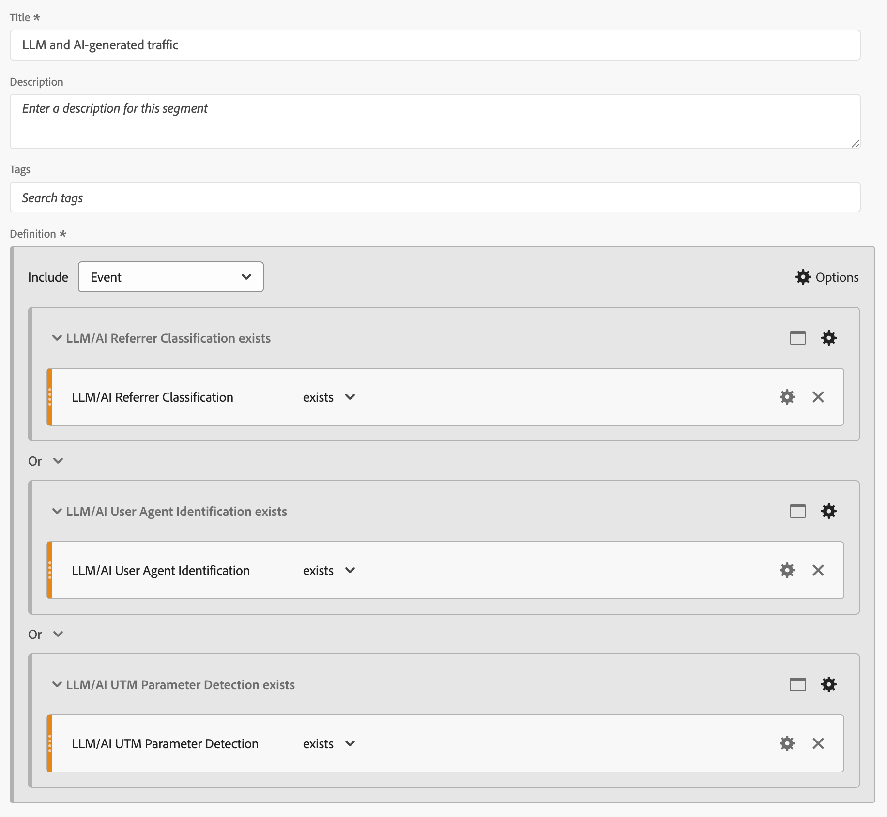

# Rapport om trafik som genererats av LLM och AI

I den här artikeln beskrivs hur du använder funktionen för Customer Journey Analytics-härledda fält som grund för att rapportera om trafik som genererats av LLM (Large Language Model) och AI.

>[!NOTE]
>
>Hur effektiva [identifieringsmetoderna](#detection-methods), [identifieringssignaturer](#detection-signatures) och [implementeringsstrategier](#implementation) är beror på din datainsamlingsmetod, Experience Platform datamängdstäckning och Customer Journey Analytics-implementering. Resultaten kan variera beroende på din tekniska miljö, datastyrningspolicy och implementeringsstrategi. När du använder Experience Edge måste du välja mellan att spela in strängen för råanvändaragenten eller att samla in enhetsinformation.
>

## Detektionsmetoder

För att upptäcka LLM och AI-genererad trafik ska man skilja mellan

* **LLM-crawler**: Samla in data för utbildning och hämtning av utökad generering (RAG).
* **AI-agenter**: Funktion som gränssnitt som utför åtgärder åt människor. AI-agenter föredrar att interagera via API:er, som åsidosätter spårningsmetoder för webbanalyser. Du kan ändå analysera en stor del av den AI-genererade trafiken via webbplatser.

Tre vanliga metoder för identifiering och övervakning av LLM- och AI-genererad trafik är:

* **Identifiering av användaragent**: När en begäran görs till servern extraheras HTTP-huvudet för användaragent och analyseras mot kända AI-crawler och agentmönster. Den här metoden på serversidan kräver åtkomst till HTTP-huvuden och är mest effektiv när den implementeras på datainsamlingsskiktet.
* **Referensklassificering**: HTTP-referensrubriken innehåller URL:en för den föregående webbsidan som länkade till den aktuella begäran. Det här sidhuvudet visar när användare klickar igenom till din webbplats från webbgränssnitt som ChatGPT eller Perplexity.
* **Identifiering av frågeparametrar**: AI-tjänster kan lägga till URL-parametrar (särskilt UTM-parametrar) till länkar. Dessa parametrar finns kvar i URL:en och kan identifieras med standardanalysimplementeringar, vilket gör URL-parametrarna värdefulla indikatorer även i spårningsscenarier på klientsidan.

Följande tabell visar hur detekteringsmetoderna kan användas i olika interaktionsscenarier för LLM och AI.

| Scenario | Identifiering av användaragent | Referensklassificering | Identifiering av frågeparametrar |
|---|---|---|---|
| **Utbildning av modell** | Agenten (`GPTBot`, `ClaudeBot` och mer) kan identifieras när loggning på serversidan implementeras. | Ingen klassificering är möjlig. AI-crawler genererar inte referenser under utbildning. | Det är omöjligt att upptäcka. AI-crawler lägger inte till parametrar under utbildning. |
| **Bläddrar bland agenter** | Agenten (`ChatGPT-User`, `claude-web`) kan identifieras när loggning på serversidan hämtar rubriker. | Klassificering är möjlig om agenten navigerar från ett AI-gränssnitt med bevarad referens. | Det går ibland att identifiera om AI-tjänsten lägger till spårningsparametrar. |
| **Hämta utökad generering (RAG) för att svara på frågan** | Agenten (`OAI-SearchBot`, `PerplexityBot`) kan identifieras med loggning på serversidan. | Normalt är ingen klassificering möjlig eftersom RAG-åtgärder ofta åsidosätter referensmekanismer. | Detektion är sällan möjlig om inte AI-leverantören specifikt har implementerat den. |
| **Användaren klickar igenom** | Agenten kan inte identifieras. AI-agenten visas som en vanlig användaragent. | Klassificering är möjlig när användare klickar på länkar från AI-gränssnitt ([chatgpt.com](https://chatgpt.com), [claude.ai](https://claude.ai) med flera). | Identifiering är möjlig när AI-tjänster lägger till UTM-parametrar till utgående länkar. |
| **Visningsvillkor för trafik** | Kräv loggningsintegrering på serversidan med Customer Journey Analytics eller taggning på serversidan för agentidentifiering. | Klassificeringen beror på AI-plattformens referensprinciper och korrekt HTTP-huvudöverföring. | Identifiering kräver parameterbevarande genom omdirigeringar och korrekt URL-parametersamling. |

### Utmaningar

LLM- och AI-agenter visar komplexa och föränderliga beteenden när de interagerar med digitala egenskaper. Dessa tekniker fungerar inkonsekvent på olika plattformar och versioner. Denna inkonsekvens skapar unika utmaningar för dataproffs. Beteendemönstren varierar avsevärt och beror på vilken AI-plattform, version och vilket interaktionsläge som används. Denna operativa mångfald komplicerar arbetet med att spåra och kategorisera trafik som genereras av LLM och AI inom standardanalysramverk. Den komplexa karaktären hos dessa interaktioner, i kombination med deras snabba utveckling, kräver nya detekterings- och klassificeringsmetoder för att upprätthålla dataintegriteten:

* **Delvis datainsamling**: Vissa nyare AI-agenter kör begränsade JavaScript, vilket resulterar i ofullständiga analysdata för implementeringar på klientsidan. Därför spåras vissa interaktioner medan andra interaktioner saknas.
* **Inkonsekventa sessionsdata**: AI-agenter kan köra JavaScript på olika sätt i sessioner och sidtyper. Denna skillnad skapar fragmenterade användarresor i Customer Journey Analytics för implementeringar på klientsidan.
* **Identifieringsproblem**: Med partiell spårning blir identifieringen otillförlitlig eftersom vissa kontaktytor kan vara osynliga för analys.

## Identifieringssignaturer

Från och med augusti 2025 kan följande specifika signaler identifieras för var och en av detekteringsmetoderna.

### Identifiering av användaragent

<table>
<thead>
<tr>
<th>Crawler</th>
<th>Användaragentsträng</th>
<th>Syfte/beteende</th>
</tr>
</thead>
<tbody>
<tr>
<td><strong>GPTBot</strong></td>
<td><code>Mozilla/5.0 AppleWebKit/537.36 (KHTML, like Gecko); compatible; GPTBot/1.1; +<a href="https://openai.com/gptbot" target="_blank" rel="noopener nofollow noreferrer">https://openai.com/gptbot</a></code></td>
<td><a href="https://platform.openai.com/docs/bots/" target="_blank" rel="noopener nofollow noreferrer">OpenAI:s primära crawler för utbildning av ChatGPT och språkmodeller</a></td>
</tr>
<tr>
<td><strong>ChatGPT-User</strong></td>
<td><code>Mozilla/5.0 AppleWebKit/537.36 (KHTML, like Gecko); compatible; ChatGPT-User/1.0; +<a href="https://openai.com/bot" target="_blank" rel="noopener nofollow noreferrer">https://openai.com/bot</a></code></td>
<td><a href="https://platform.openai.com/docs/bots/" target="_blank" rel="noopener nofollow noreferrer">Används när ChatGPT bläddrar bland webbplatser åt användare (äldre)</a></td>
</tr>
<tr>
<td><strong>ChatGPT-User v2</strong></td>
<td><code>Mozilla/5.0 AppleWebKit/537.36 (KHTML, like Gecko); compatible; ChatGPT-User/2.0; +<a href="https://openai.com/bot" target="_blank" rel="noopener nofollow noreferrer">https://openai.com/bot</a></code></td>
<td><a href="https://platform.openai.com/docs/bots/" target="_blank" rel="noopener nofollow noreferrer">ChatGPT:s uppdaterade version för hämtning på begäran och uppslag i svar</a></td>
</tr>
<tr>
<td><strong>OAI-SearchBot</strong></td>
<td><code>Mozilla/5.0 AppleWebKit/537.36 (KHTML, like Gecko); compatible; OAI-SearchBot/1.0; +<a href="https://openai.com/searchbot" target="_blank" rel="noopener nofollow noreferrer">https://openai.com/searchbot</a></code></td>
<td><a href="https://platform.openai.com/docs/bots/" target="_blank" rel="noopener nofollow noreferrer">ChatGPT:s sökfokuserade crawler för att hitta innehåll</a></td>
</tr>
<tr>
<td><strong>ClaudeBot</strong></td>
<td><code>Mozilla/5.0 AppleWebKit/537.36 (KHTML, like Gecko); compatible; ClaudeBot/1.0; +claudebot@anthropic.com</code></td>
<td><a href="https://support.claude.com/en/articles/8896518-does-anthropic-crawl-data-from-the-web-and-how-can-site-owners-block-the-crawler" target="_blank" rel="noopener nofollow noreferrer">Anthropic's crawler för utbildning och uppdatering av Claude AI Assist</a></td>
</tr>
<tr>
<td><strong>Claude-User</strong></td>
<td><code>Mozilla/5.0 AppleWebKit/537.36 (KHTML, like Gecko; compatible; Claude-User/1.0; +Claude-User@anthropic.com)</code></td>
<td><a href="https://support.claude.com/en/articles/8896518-does-anthropic-crawl-data-from-the-web-and-how-can-site-owners-block-the-crawler" target="_blank" rel="noopener nofollow noreferrer">Stöder Claude AI-användare när enskilda ställer frågor till Claude, kan de komma åt webbplatser med en Cl...</a></td>
</tr>
<tr>
<td><strong>Claude-SearchBot</strong></td>
<td><code>Mozilla/5.0 AppleWebKit/537.36 (KHTML, like Gecko; compatible; Claude-SearchBot/1.0; +Claude-SearchBot@anthropic.com)</code></td>
<td><a href="https://support.claude.com/en/articles/8896518-does-anthropic-crawl-data-from-the-web-and-how-can-site-owners-block-the-crawler" target="_blank" rel="noopener nofollow noreferrer">Navigerar på webben för att förbättra sökresultatskvaliteten för Claude AI-användare genom att analysera onlineinnehåll...</a></td>
</tr>
<tr>
<td><strong>PerplexityBot</strong></td>
<td><code>Mozilla/5.0 AppleWebKit/537.36 (KHTML, like Gecko; compatible; PerplexityBot/1.0; +<a href="https://www.perplexity.ai/perplexitybot" target="_blank" rel="noopener nofollow noreferrer">https://perplexity.ai/perplexitybot</a>)</code></td>
<td><a href="https://docs.perplexity.ai/guides/bots" target="_blank" rel="noopener nofollow noreferrer">Perplexity.ai's crawler för webbindexering i realtid</a></td>
</tr>
<tr>
<td><strong>Perplexity-User</strong></td>
<td><code>Mozilla/5.0 AppleWebKit/537.36 (KHTML, like Gecko; compatible; Perplexity-User/1.0; +<a href="https://www.perplexity.ai/useragent" target="_blank" rel="noopener nofollow noreferrer">https://www.perplexity.ai/useragent</a>)</code></td>
<td><a href="https://docs.perplexity.ai/guides/bots" target="_blank" rel="noopener nofollow noreferrer">Läser in sidor när användare klickar på Perplexitetcitationer (bypass robots.txt)</a></td>
</tr>
<tr>
<td><strong>Google-Extended</strong></td>
<td><code>Mozilla/5.0 (compatible; Google-Extended/1.0; +<a href="https://support.google.com/webmasters/answer/182072" target="_blank" rel="noopener nofollow noreferrer">http://www.google.com/bot.html</a>)</code></td>
<td><a href="https://blog.google/technology/ai/an-update-on-web-publisher-controls/" target="_blank" rel="noopener nofollow noreferrer">Google AI-fokuserade crawler för Gemini är åtskild från Googlebot-standard</a></td>
</tr>
<tr>
<td><strong>BingBot</strong></td>
<td><code>Mozilla/5.0 (compatible; BingBot/1.0; +<a href="http://www.bing.com/bot.html" target="_blank" rel="noopener nofollow noreferrer">http://www.bing.com/bot.html</a>)</code></td>
<td>Microsoft crawler som driver Bing Search and Bing Chat (Copilot)</td>
</tr>
<tr>
<td><strong>DuckAssistBot</strong></td>
<td><code>Mozilla/5.0 (compatible; DuckAssistBot/1.0; +<a href="https://duckduckgo.com/bot.html" target="_blank" rel="noopener nofollow noreferrer">http://www.duckduckgo.com/bot.html</a>)</code></td>
<td><a href="https://duckduckgo.com/duckduckgo-help-pages/results/duckassistbot" target="_blank" rel="noopener nofollow noreferrer">Klipper innehåll för DuckAssist, DuckDuckGo privata AI-svarsfunktion</a></td>
</tr>
<tr>
<td><strong>YouBot</strong></td>
<td><code>Mozilla/5.0 (compatible; YouBot (+<a href="http://www.you.com" target="_blank" rel="noopener nofollow noreferrer">http://www.you.com</a>))</code></td>
<td>Crawler bakom You.coms AI-sökning och webbläsarassistent</td>
</tr>
<tr>
<td><strong>meta-externalagent</strong></td>
<td><code>Mozilla/5.0 (compatible; meta-externalagent/1.1 (+<a href="https://developers.facebook.com/docs/sharing/webmasters/web-crawlers" target="_blank" rel="noopener nofollow noreferrer">https://developers.facebook.com/docs/sharing/webmasters/crawler</a>))</code></td>
<td><a href="https://developers.facebook.com/docs/sharing/webmasters/web-crawlers#identify-2" target="_blank" rel="noopener nofollow noreferrer">Meta robot för datainsamling till utbildning eller finjustering av LLM</a></td>
</tr>
<tr>
<td><strong>Amazonbot</strong></td>
<td><code>Mozilla/5.0 (Macintosh; Intel Mac OS X 10_10_1) AppleWebKit/600.2.5 (KHTML, like Gecko) Version/8.0.2 Safari/600.2.5 (Amazonbot/0.1; +<a href="https://developer.amazon.com/amazonbot" target="_blank" rel="noopener nofollow noreferrer">https://developer.amazon.com/support/amazonbot</a>)</code></td>
<td><a href="https://developer.amazon.com/amazonbot" target="_blank" rel="noopener nofollow noreferrer">Amazon crawler för sök- och AI-program</a></td>
</tr>
<tr>
<td><strong>Applebot</strong></td>
<td><code>Mozilla/5.0 (Macintosh; Intel Mac OS X 10_15_5) AppleWebKit/605.1.15 (KHTML, like Gecko) Version/13.1.1 Safari/605.1.15 (Applebot/0.1; +<a href="https://support.apple.com/kb/HT6619" target="_blank" rel="noopener nofollow noreferrer">http://www.apple.com/go/applebot</a>)</code></td>
<td><a href="https://support.apple.com/en-us/119829" target="_blank" rel="noopener nofollow noreferrer">Apple crawler för Spotlight, Siri och Safari</a></td>
</tr>
<tr>
<td><strong>Applebot-Extended</strong></td>
<td><code>Mozilla/5.0 (compatible; Applebot-Extended/1.0; +<a href="https://www.apple.com/bot.html" target="_blank" rel="noopener nofollow noreferrer">http://www.apple.com/bot.html</a>)</code></td>
<td><a href="https://support.apple.com/en-us/119829" target="_blank" rel="noopener nofollow noreferrer">Apple AI-fokuserade crawler för framtida AI-modeller (anmälan)</a></td>
</tr>
<tr>
<td><strong>Bytespider</strong></td>
<td><code>Mozilla/5.0 (compatible; Bytespider/1.0; +<a href="https://www.bytedance.com/bot.html" target="_blank" rel="noopener nofollow noreferrer">http://www.bytedance.com/bot.html</a>)</code></td>
<td>ByteDance's AI datainsamlare för TikTok och andra tjänster</td>
</tr>
<tr>
<td><strong>MistralAI-användare</strong></td>
<td><code>Mozilla/5.0 (compatible; MistralAI-User/1.0; +<a href="https://mistral.ai/bot" target="_blank" rel="noopener nofollow noreferrer">https://mistral.ai/bot</a>)</code></td>
<td><a href="https://docs.mistral.ai/robots/" target="_blank" rel="noopener nofollow noreferrer">Mistrals realtidsklocka för assistenten Le Chat</a></td>
</tr>
<tr>
<td><strong>cohere-ai</strong></td>
<td><code>Mozilla/5.0 (compatible; cohere-ai/1.0; +<a href="http://www.cohere.ai/bot.html" target="_blank" rel="noopener nofollow noreferrer">http://www.cohere.ai/bot.html</a>)</code></td>
<td>Samlar in textdata för Cohär språkmodeller</td>
</tr>
</tbody>
</table>

### Referensklassificering

<table>
<thead>
<tr>
<th><strong>Källa</strong></th>
<th><strong>Referent</strong></th>
<th><strong>Trafiktyp</strong></th>
</tr>
</thead>
<tbody>
<tr>
<td>ChatGPT</td>
<td>chatgpt.com</td>
<td>Direkttrafik från ChatGPT-gränssnittet</td>
</tr>
<tr>
<td>Claude</td>
<td>claude.ai</td>
<td>Trafik från Anthropics Claude-gränssnitt</td>
</tr>
<tr>
<td>Google Gemini</td>
<td>gemini.google.com</td>
<td>Trafik från Google AI-assistent</td>
</tr>
<tr>
<td>Microsoft Copilot</td>
<td>copilot.microsoft.com</td>
<td>Trafik från Microsoft AI-assistent</td>
</tr>
<tr>
<td>Microsoft Copilot</td>
<td>m365.cloud.microsoft</td>
<td>Trafik från Microsoft AI-assistent (molntjänster i Microsoft 365)</td>
</tr>
<tr >
<td>Perplexitet AI</td>
<td>perplexity.ai</td>
<td>Trafik från AI-sökning med citat</td>
</tr>
<tr>
<td>Meta AI</td>
<td>meta.ai</td>
<td>Trafik från Meta AI-assistent</td>
</tr>
</tbody>
</table>

### Identifiering av frågeparametrar

<table>
<thead>
<tr>
<th><strong>LLM-tjänst</strong></th>
<th>Exempel-URL</th>
<th><strong>Frågeparameter</strong></th>
<th><strong>Exempelvärde</strong></th>
</tr>
</thead>
<tbody>
<tr>
<td>ChatGPT</td>
<td ><a href="https://www.yoursite.com/product?utm_source=chatgpt.com" target="_blank" rel="noopener nofollow noreferrer">https://www.yoursite.com/product?utm_source=chatgpt.com</a></td>
<td>utm_source</td>
<td>chatgpt.com</td>
</tr>
<tr>
<td>Perplexitet</td>
<td><a href="https://www.yoursite.com/article?utm_source=perplexity" target="_blank" rel="noopener nofollow noreferrer">https://www.yoursite.com/article?utm_source=perplexity</a></td>
<td>utm_source</td>
<td>perplexitet</td>
</tr>
</tbody>
</table>

## Implementering

Du kan rapportera om LLM- och AI-genererad trafik i en typisk Customer Journey Analytics-konfiguration ([anslutning](/help/connections/overview.md), [datavyer](/help/data-views/data-views.md) och [arbetsyteprojekt](/help/analysis-workspace/home.md)) genom att konfigurera och konfigurera [härledda fält](#derived-fields), [segment](#segments) och [arbetsyteprojekt](#workspace-project) .

### Härledda fält

Om du vill konfigurera identifieringsmetoder och identifieringssignaler använder du härledda fält som grund. Definiera till exempel härledda fält för [identifiering av användaragent](#user-agent-identification), [identifiering av frågeparametrar](#query-parameter-detection) och [klassificering av referent](#referrer-classification).

#### Identifiering av användaragent för LLM/AI

Använd de härledda fältsfunktionerna [Fall när](/help/data-views/derived-fields/derived-fields.md#case-when) för att definiera ett härlett fält som identifierar LLM/AI-användaragenter.

{zoomable="yes"}

#### Identifiering av frågeparametrar för LLM/AI

Använd de härledda fältsfunktionerna [URL Parse](/help/data-views/derived-fields/derived-fields.md#url-parse) och [Classify](/help/data-views/derived-fields/derived-fields.md#classify) för att definiera ett härlett fält som identifierar frågeparametrar.

{zoomable="yes"}

#### Klassificering av LLM/AI-referens

Använd de härledda fältsfunktionerna [URL Parse](/help/data-views/derived-fields/derived-fields.md#url-parse) och [Classify](/help/data-views/derived-fields/derived-fields.md#classify) för att definiera ett härlett fält som klassificerar referenser.

{zoomable="yes"}

### Segment

Skapa dedikerade segment som hjälper dig att identifiera händelser, sessioner eller personer som relaterar till LLM och AI-genererad trafik. Använd till exempel de härledda fälten som du skapade tidigare för att definiera ett segment som identifierar LLM- och AI-genererad trafik.

{zoomable="yes"}

### Workspace-projekt

Använd de härledda fälten och segmenten för att rapportera och analysera om trafik som genereras av LLM och AI. Se till exempel det kommenterade projektet nedan.

{zoomable="yes"}

>[!MORELIKETHIS]
>
>Denna artikel baseras på bloggartikeln [Spåra och analysera LLM och AI-genererad trafik i Adobe Customer Journey Analytics](https://experienceleaguecommunities.adobe.com/t5/adobe-analytics-blogs/tracking-and-analyzing-llm-and-ai-generated-traffic-in-adobe/ba-p/771967).
>
>
