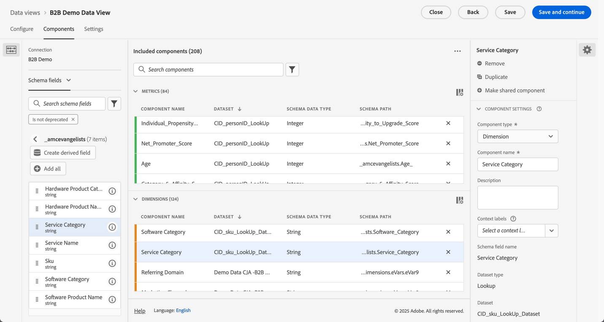

# Installation för B2B edition

I den här artikeln beskrivs en typisk konfiguration av Customer Journey Analytics B2B edition som stöder följande användningsområden:

* [Optimera kontomarknadsföring](optimize-account-marketing.md)
* [Utöka nyckelkonton](grow-key-accounts.md)
* [Skapa produktvärde](build-product-value.md)

>[!NOTE]
>
>De demonstrationsdata och skärmbilder som används i dessa fall är avsedda endast som illustrationer och speglar inte verkliga data.

## Referens för lösningsdesign

Innan du konfigurerar Customer Journey Analytics B2B edition måste du se till att du har en lämplig designreferens för lösningar som dokumenterar alla fält du samlar in.

Ett exempel på en designreferens kan se ut så här:

+++ Händelsedimensioner

| Dimension name |
|---|
| Konto-ID |
| Kontonamn |
| ID för inköpsgrupp |
| Call Center |
| Representativt ID för callcenter |
| Samtals-ID |
| Kampanjspårningskod |
| Innehålls-ID |
| Innehållstyp |
| Data Source |
| Enhetstyp |
| Händelseinformation |
| Händelsenamn |
| Tratt |
| Interaktionskanal |
| Lead-ID |
| Marknadsföringskanal |
| ID för marknadsföringshändelse |
| Typ av marknadsföringshändelse |
| ID för affärsmöjlighet |
| Sida |
| Sidinformation |
| Refererande domän |
| Säljare-ID |
| Namn på försäljningsstadium |
| Försäljningsfasnummer |
| Platsavsnitt |
| SKU |
| Dotterkonto-ID |
| Undersöknings-ID |
| Enkät om nöjda kunder |
| Typ av undersökning |
| Användar-ID |

+++

+++ Händelsemått

| Måttnamn | Händelsetyp |
|---|---|
| Skapande av konto: Slutfört | Räknare |
| Skapa konto: Start | Räknare |
| Samtalskostnad | Valuta |
| Samtalslängd | Räknare |
| Nöjda samtal | Numeriskt |
| Samtalsundersökningar har slutförts | Räknare |
| Samtal | Räknare |
| Closed-Lost | Räknare |
| Closed-Won | Räknare |
| Innehållsvyer | Räknare |
| Visa klick för avtalsstorlek | Räknare |
| Visa exponeringar | Räknare |
| E-post studsade | Räknare |
| E-post klickad | Räknare |
| E-post levererad | Räknare |
| E-post öppnad | Räknare |
| E-post skickad | Räknare |
| Närvaro vid händelse | Räknare |
| Händelseregistrering: Slutförd | Räknare |
| Händelseregistrering: Steg 1 | Räknare |
| Händelseregistrering: Steg 2 | Räknare |
| Händelseregistrering: Steg 3 | Räknare |
| Numeriskt inkommande samtal om global nöjdhet | Räknare |
| Lead-formulär: Fullständigt | Räknare |
| Leadformulär: Steg 1 | Räknare |
| Leadformulär: Steg 2 | Räknare |
| Lead genererad | Räknare |
| Leadkvalificering | Räknare |
| Möten | Räknare |
| MQL diskvalificerat | Räknare |
| MQL Kvalificerad | Räknare |
| Behöver utvärderas | Räknare |
| Förhandling | Räknare |
| Hantering av invändningar | Räknare |
| Möjligheter | Räknare |
| Skapande av affärsmöjlighet | Räknare |
| Beställningar | Räknare |
| Utgående samtal | Räknare |
| Uppföljning efter försäljning | Räknare |
| Inlämning av förslag | Räknare |
| Avslutade intäkter | Valuta |
| Avslutade intäkter | Valuta |
| Försäljningskontaktsamtal | Räknare |
| Försäljningsfasen har startats | Räknare |
| SMS-klickningar | Räknare |
| SMS skickat | Räknare |
| Klickningar i sociala medier | Räknare |
| Social Impression | Räknare |
| Lösningspresentation | Räknare |
| SQL har diskvalificerats | Räknare |
| SQL-kvalificerat | Räknare |
| Enheter (visa inte) | Räknare |
| VoC Survey Satisfaction Score | Numeriskt |
| VoC-undersökningar har slutförts | Räknare |

+++

+++ Personposter

| Fältnamn för datavy | Fälttyp |
|---|---|
| Ålder | Mått |
| Åldersgrupp | Dimension |
| Tillhörighetsnivå för kategori 1 | Dimension |
| Tillhörighetspoäng för kategori 1 | Mått |
| Tillhörighetsnivå för kategori 2 | Dimension |
| Tillhörighetspoäng för kategori 2 | Mått |
| Tillhörighetsnivå för kategori 3 | Dimension |
| Tillhörighetspoäng för kategori 3 | Mått |
| Tillhörighetsnivå för kategori 4 | Dimension |
| Tillhörighetspoäng för kategori 4 | Mått |
| Tillhörighetsnivå för kategori 5 | Dimension |
| Tillhörighetspoäng för kategori 5 | Mått |
| Samtycke till Advertising | Dimension |
| Samtycke till all kommunikation | Dimension |
| Godkänn direkt e-post | Dimension |
| E-post för samtycke | Dimension |
| Samtyckesmobiltelefon | Dimension |
| Samtycke till Personalization | Dimension |
| Samtyckesdelningsdata | Dimension |
| Godkänn SMS | Dimension |
| E-post | Dimension |
| Förnamn | Dimension |
| Kön | Dimension |
| Enskild ort | Dimension |
| Enskild CLTV-nivå | Dimension |
| Enskilda CLTV-poäng | Mått |
| Enskilt land | Dimension |
| Enskild telefon | Dimension |
| Postnummer | Dimension |
| Individuell benägenhet att köpa | Dimension |
| Individuell benägenhet att köpa poäng | Mått |
| Individuell benägenhet för att uppnå kurandenivå | Dimension |
| Individuell benägenhet att få Churn-poäng | Mått |
| Individuell benägenhet att uppgradera | Dimension |
| Individuell möjlighet att uppgradera poäng | Mått |
| Enskild stat | Dimension |
| Enskild gatuadress | Dimension |
| Befattning | Dimension |
| Efternamn | Dimension |
| Net Promoter Score | Mått |
| Status för Net Promoter | Dimension |
| Rolltyp | Dimension |

+++

+++ Kontoposter

| Fältnamn för datavy | Fälttyp |
|---|---|
| Årsintäkt | Mått |
| Företagets ort | Dimension |
| Företagets CLTV-nivå | Dimension |
| CLTV Score för företag | Mått |
| Företag | Dimension |
| Företagsnamn | Dimension |
| Telefon, företag | Dimension |
| Företagets postnummer | Dimension |
| Företagets benägenhet att köpa | Dimension |
| Företagets benägenhet att köpa poäng | Mått |
| Företagets benägenhet att ändra kursnivå | Dimension |
| Företagets benägenhet för Churn-poäng | Mått |
| Företagets potential att uppgradera nivån | Dimension |
| Företagets benägenhet att uppgradera poäng | Mått |
| Företagsstorlek | Dimension |
| Företag | Dimension |
| Adress till företag | Dimension |
| Bransch | Dimension |
| Antal anställda | Mått |
| Partnerpublik - Maskinvaruinköp | Dimension |
| Partnerpublik - snabb tillväxt | Dimension |
| Partnerpublik - tjänster krävs | Dimension |
| Partner Audience - Software Shoppers | Dimension |
| Intäktsintervall | Dimension |
| Webbplats | Dimension |

+++

+++ SKU-poster

| Fältnamn för datavy | Fälttyp |
|---|---|
| Maskinvaruproduktkategori | Dimension |
| Namn på maskinvaruprodukt | Dimension |
| Tjänstkategori | Dimension |
| Tjänstnamn | Dimension |
| Programvaruproduktkategori | Dimension |
| Programvaruproduktnamn | Dimension |

+++

## Scheman och datauppsättningar

De data som har stöd för lösningsdesignreferensen struktureras med följande scheman och datauppsättningar.

### Händelsedata

Händelsens mått och mått stöds via ett tidsseriebaserat (händelsebaserat) schema och en eller flera datauppsättningar som innehåller händelsedata.

<!--For example: the Account ID field is mapped to **[!UICONTROL Account ID]**. See below for a preview of the data typically available in such a dataset.

-->

### Persondata

Personposterna stöds via ett postbaserat (profilbaserat) schema och en eller flera datauppsättningar som innehåller persondata. Nedan finns ett exempel på persondata (baserat på exemplets designreferens) som vanligtvis finns i en sådan datauppsättning.

### Kontodata

Kontoposterna stöds via ett postbaserat (sökning) schema och en eller flera datauppsättningar som innehåller kontodata. Nedan finns ett exempel på kontodata (som baseras på exemplets designreferens) som vanligtvis finns i en sådan datauppsättning.

### SKU-data

SKU-posterna stöds via ett postbaserat (uppslagsbaserat) schema och en eller flera datauppsättningar som innehåller SKU-data. Nedan finns ett exempel på SKU-data (som baseras på exemplets designreferens) som vanligtvis finns i en sådan datauppsättning.

## Anslutning

Definiera en kontobaserad anslutning i Customer Journey Analytics för att importera och koppla poster från datauppsättningarna event, account, person och SKU.

1. [Skapa en ny anslutning](/help/connections/create-connection.md) i Customer Journey Analytics.
1. Ange ett beskrivande namn och en beskrivning för anslutningen.
1. Välj  **[!UICONTROL Account]** som **[!UICONTROL Primary ID]**.
1. Markera alla **[!UICONTROL Optional containers]**.
1. Välj önskad sandlåda och uppskatta det genomsnittliga antalet dagliga händelser.

   

1. Välj **[!UICONTROL Add datasets]** och lägg till de B2B-datauppsättningar som innehåller data för händelser, konton, personer och SKU:er.

   

1. Välj **[!UICONTROL Next]** om du vill konfigurera inställningarna för var och en av de markerade datauppsättningarna.
1. För händelsedatauppsättningen måste du välja rätt fält som motsvarar identiteterna för **[!UICONTROL Account ID]**, **[!UICONTROL Global Account ID]**, **[!UICONTROL Opportunity ID]**, **[!UICONTROL Buying Group ID]** och **[!UICONTROL Person ID]**.

   

1. Bläddra nedåt för att konfigurera datauppsättningen för kontoposter. Se till att du väljer rätt identifierare (**[!UICONTROL Account_ID]**) för att matcha kontot med behållaren **[!UICONTROL Global Account]**. Välj rätt identifierare (**[!UICONTROL Account_ID]**) som **[!UICONTROL Global Account field]**.

   

1. Bläddra nedåt för att konfigurera personpostens datauppsättning. Kontrollera att du har valt rätt nyckel (**[!UICONTROL Person_ID]**) för att matcha personen med behållaren **[!UICONTROL Person]**. Välj lämplig identitet (**[!UICONTROL Profile_Account_ID_Individual]**) som matchar fältet **[!UICONTROL Global Account]**.

   

1. Bläddra nedåt för att konfigurera datauppsättningen för SKU-poster. Kontrollera att du har valt rätt nyckel (**[!UICONTROL Sku]**). Välj **[!UICONTROL Match by field]** eftersom ingen behållare är konfigurerad eller tillgänglig för dessa data. Välj SKU-fältet i händelsedatamängden (**[!UICONTROL SKU (event datasets)]**) som matchande nyckel.

   

1. Välj **[!UICONTROL Add datasets]** om du vill spara datauppsättningarna och deras konfigurerade inställningar.

1. Välj **[!UICONTROL Save]** om du vill spara anslutningen.

## Datavy

När data har importerats i Customer Journey Analytics vill du skapa en datavy som innehåller alla komponenter som du har definierat i designreferensen för lösningen.

### Konfigurera

1. [Skapa en ny datavy](/help/data-views/data-views.md) i Customer Journey Analytics.
1. Markera anslutningen som du skapade tidigare (till exempel: **[!UICONTROL B2B Demo Connection (ExL)]**).
1. Ange ett namn för datavyn. Till exempel: `B2B Demo Data view (ExL)` och eventuellt en beskrivning.
1. Du kan också byta namn på behållarna. Eller håll fast med standardbehållarnamnen.

   
1. Välj **[!UICONTROL Save and continue]**.

### Komponenter

Som standard ingår redan alla [standardkomponenter](/help/data-views/component-reference.md) i datavyn. Dessa standardkomponenter innehåller de B2B-specifika värdena för konton, inköpsgrupper, globala konton och säljprojekt.

1. Lägg till alla händelsedimensioner som du har definierat i [lösningsdesignreferensen](#solution-design-reference) i dimensionskomponenterna i datavyn. Till exempel fältet **[!UICONTROL Event Name]** som representerar dimensionen **[!UICONTROL Event Name]**. Kontrollera att du har konfigurerat dimensionskomponenten via de tillgängliga [komponentinställningarna](/help/data-views/component-settings/overview.md).

   

1. Lägg till alla händelsemått som du har definierat i [lösningsdesignreferensen](#solution-design-reference) i måttkomponenterna i datavyn. Till exempel fältet **[!UICONTROL SQL Qualified]** som representerar måttet **[!UICONTROL SQL Qualified]**. Kontrollera att du har konfigurerat dimensionskomponenten via de tillgängliga [komponentinställningarna](/help/data-views/component-settings/overview.md).

   

1. Lägg till alla kontodimensioner som du har definierat i [lösningsdesignreferensen](#solution-design-reference) till dimensionskomponenterna i datavyn. Till exempel fältet **[!UICONTROL Industry]** som representerar dimensionen **[!UICONTROL Industry]**. Kontrollera att du har konfigurerat dimensionskomponenten via de tillgängliga [komponentinställningarna](/help/data-views/component-settings/overview.md).

   

1. Lägg till alla kontomått som du har definierat i [lösningsdesignreferensen](#solution-design-reference) i måttkomponenterna i datavyn. Till exempel fältet **[!UICONTROL Number_of_Employees]** som representerar måttet **[!UICONTROL Number_of_Employees]**. Kontrollera att du har konfigurerat dimensionskomponenten via de tillgängliga [komponentinställningarna](/help/data-views/component-settings/overview.md).

   

1. Lägg till alla persondimensioner som du har definierat i [lösningsdesignreferensen](#solution-design-reference) till dimensionskomponenterna i datavyn. Till exempel fältet **[!UICONTROL Category_1_Affinity_Level]** som representerar dimensionen **[!UICONTROL Category_1_Affinity_Level]**. Kontrollera att du har konfigurerat dimensionskomponenten via de tillgängliga [komponentinställningarna](/help/data-views/component-settings/overview.md).

   

1. Lägg till alla personmått som du har definierat i [lösningsdesignreferensen](#solution-design-reference) i måttkomponenterna i datavyn. Till exempel fältet **[!UICONTROL Category_1_Affinity_Score]** som representerar måttet **[!UICONTROL Category_1_Affinity_Score]**. Kontrollera att du har konfigurerat dimensionskomponenten via de tillgängliga [komponentinställningarna](/help/data-views/component-settings/overview.md).

   

1. Lägg till alla SKU-dimensioner som du har definierat i [lösningsdesignreferensen](#solution-design-reference) till dimensionskomponenterna i datavyn. Till exempel fältet **[!UICONTROL Service Category]** som representerar dimensionen **[!UICONTROL Service Category]**. Kontrollera att du har konfigurerat dimensionskomponenten via de tillgängliga [komponentinställningarna](/help/data-views/component-settings/overview.md).

   

1. Välj **[!UICONTROL Save and Continue]**.

### Inställningar

1. Du kan också definiera specifika [inställningar](/help/data-views/create-dataview.md#settings-1) för datavyn:

   * Lägg till segment i datavyn.
   * Använd ett (beräknat) mått för att definiera sessionsinställningar.

1. Välj **[!UICONTROL Save and continue]**.

## Segment

Du kan förbereda ett eller flera B2B-specifika behållarbaserade segment som du kan använda i ditt Workspace-projekt.

Exempel:

* Konton med händelseregistreringssegment.

  

* Amerikanska konton med köpgrupper och affärssegment på nivå 5.

  

## Övriga

Du kan även definiera andra komponenter för dina användningsfall, som [beräknade värden](/help/components/calc-metrics/calc-metr-overview.md), [datumintervall](/help/components/date-ranges/overview.md) eller [varningar](/help/components/c-intelligent-alerts/intelligent-alerts.md).
