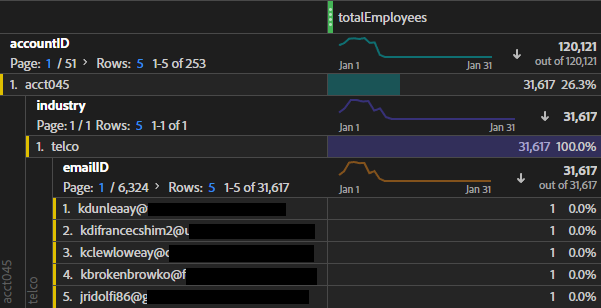

# Lägg till data på kontonivå som en uppslagsdatauppsättning

Det här B2B-användningsexemplet visar hur du anger data på kontonivå i stället för på personnivå för analys. Kontonivåanalys kan ge svar på frågor som

* Vilket företagsnamn matchas med det här kontot?
* Hur många anställda är kopplade till det här kontot/företaget?
* Vilka roller visas i det här kontot?
* Hur fungerar det här kontot tillsammans med en viss marknadsföringskampanj jämfört med ett annat konto?
* Beter sig vissa roller (t.ex. IT-chef) på ett konto annorlunda än samma roll på ett annat konto?

Du uppnår allt detta genom att lägga in kontonivåinformationen som en [sökning](/help/technotes/glossary.md) datauppsättning.

Du skapar först ett uppslagsschema i Adobe Experience Platform och skapar sedan en uppslagstabelldataset genom att importera CSV-baserade kontonivådata. Sedan fortsätter du att skapa en anslutning i Customer Journey Analytics (Customer Journey Analytics) som kombinerar olika datauppsättningar, inklusive den sökning som du har skapat. Därefter skapar du en datavy och kan till slut använda alla dessa data i Workspace.

>[!NOTE]
>
>Uppslagstabeller kan vara upp till 1 GB stora.

## 1. Skapa sökschema (Experience Platform)

Skapa ett eget schema för [sökning](/help/technotes/glossary.md) tabellen ser till att den datauppsättning som används är tillgänglig i Customer Journey Analytics med rätt inställningar (posttyp). Bästa praxis är att [skapa en anpassad schemaklass](https://experienceleague.adobe.com/docs/experience-platform/xdm/tutorials/create-schema-ui.html#create-new-class) anropas för&quot;Sök efter&quot;, tom för alla element, som kan återanvändas för alla uppslagstabeller.

## 2. Skapa uppslagsdatauppsättning (Experience Platform)

När schemat har skapats måste du skapa en uppslagsdatauppsättning från det schemat, i Experience Platform. Den här sökdatauppsättningen innehåller marknadsföringsinformation på kontonivå, t.ex. företagsnamn, totalt antal anställda, domännamn, vilken bransch de tillhör, årsomsättning, oavsett om de är nuvarande kunder i Experience Platform eller inte, vilket försäljningsstadium de befinner sig i, vilket team på kontot som använder Customer Journey Analytics, osv.

1. I Adobe Experience Platform går du till **[!UICONTROL Data Management > Datasets]**.
1. Klicka på **[!UICONTROL + Create dataset]**.
1. Klicka på **[!UICONTROL Create dataset from schema]**.
1. Välj klassen Lookup Schema som du skapade.
1. Klicka på **[!UICONTROL Next]**.
1. Ge datauppsättningen ett namn (i vårt exempel B2B Info) och ge en beskrivning.
1. Klicka på **[!UICONTROL Finish]**.

## 3. Infoga data i Experience Platform

Instruktioner om hur du [Mappa en CSV-fil till ett XDM-schema](https://experienceleague.adobe.com/docs/experience-platform/ingestion/tutorials/map-a-csv-file.html) bör vara till hjälp om du använder en CSV-fil.

[Andra metoder](https://experienceleague.adobe.com/docs/experience-platform/ingestion/home.html) finns också tillgängliga.

Det tar cirka 2 till 4 timmar att introducera data och upprätta sökningen, beroende på storleken på söktabellen.

## 4. Kombinera datauppsättningar i en anslutning (Customer Journey Analytics)

I det här exemplet kombinerar vi tre datauppsättningar i en anslutning mellan Customer Journey Analytics:

| Namn på datauppsättning | Beskrivning | Klassen Adobe Experience Platform Schema | Information om datauppsättning |
| --- | --- | --- | --- |
| B2B-komprimering | Innehåller klickströmsdata på händelsenivå på kontonivån. Den innehåller till exempel e-post-ID och motsvarande konto-ID samt marknadsföringsnamn för att köra marknadsföringsannonser. Det innehåller även visningar för dessa annonser per användare. | Baserat på schemaklassen XDM ExperienceEvent | The `emailID` används som primär identitet och tilldelas en `Customer ID` namnutrymme. Därför visas den som standard **[!UICONTROL Person ID]** i Customer Journey Analytics.  |
| B2B-profil | Den här profildatauppsättningen ger dig mer information om användarna på ett konto, t.ex. deras jobbtitel, vilket konto de tillhör, deras LinkedIn-profil osv. | Baserat på schemaklassen XDM Individual Profile | Välj `emailID` som primärt ID i det här schemat. |
| B2B-information | Se&quot;Skapa uppslagsdatauppsättning&quot; ovan. | B2BAccount (anpassad sökschemaklass) | Relationen mellan `accountID` och datauppsättningen B2B-Impressions har automatiskt skapats genom att datauppsättningen B2B-information kopplas till datauppsättningen B2B-Impression i Customer Journey Analytics, vilket beskrivs i stegen nedan.  |

Så här kombinerar du datauppsättningarna:

1. I Customer Journey Analytics väljer du **[!UICONTROL Connections]** -fliken.
1. Markera de datauppsättningar (i vårt exempel de tre ovan) som du vill kombinera.
1. För datauppsättningen B2B-information väljer du `accountID` som ska användas i din uppslagstabell. Välj sedan dess matchande nyckel (motsvarande dimension), även `accountID` i din händelsedatamängd.
1. Klicka på **[!UICONTROL Next]**.
1. Namnge och beskriv anslutningen och konfigurera den enligt [dessa instruktioner](/help/connections/create-connection.md).
1. Klicka på **[!UICONTROL Save]**.

## 5. Skapa en datavy från den här anslutningen.

Följ instruktionerna på [skapa datavyer](/help/data-views/create-dataview.md).

* Lägg till alla komponenter (mått och mått) som du behöver från datauppsättningarna.

## 6. Analysera data i Workspace

Nu kan du skapa Workspace-projekt baserat på data från alla tre datauppsättningarna.

Du kan till exempel hitta svar på svaren i inledningen:

* Dela upp e-post-ID efter kontoID för att ta reda på vilket företag ett e-post-ID tillhör.
* Hur många anställda mappas till ett specifikt konto-ID?
* Vilken bransch tillhör ett konto-ID?

