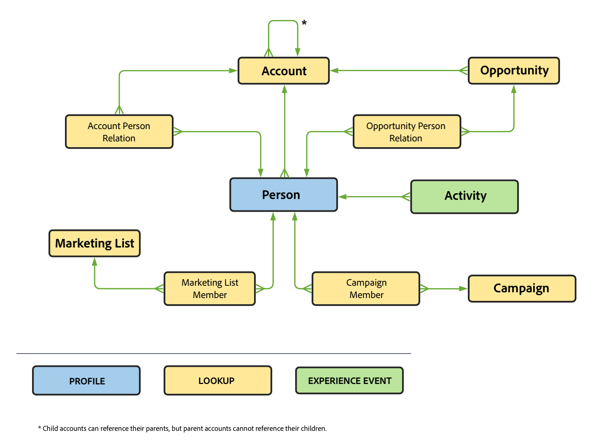

# Ett exempel på ett B2B-projekt

I den här artikeln beskrivs, med hjälp av exempel, hur du konfigurerar, konfigurerar och rapporterar B2B-data i Customer Journey Analytics.

## Anslutning

Definiera anslutningen så att den inkluderar alla relevanta B2B-datauppsättningar från Experience Platform. Detta inkluderar de viktiga uppslagsdatauppsättningar som krävs i en vanlig B2B-konfiguration i Experience Platform. Se [Lägg till data på kontonivå som en uppslagsdatauppsättning](b2b.md) för mer information.

Datauppsättningar som du kan överväga att lägga till i anslutningen:

| Datauppsättning | Schema | Schematyp | Basklass | Beskrivning |
|---|---|---|---|---|
| B2B-aktivitetsdatauppsättning | B2B-aktivitetsschema | Händelse | XDM ExperienceEvent | En ExperienceEvent är ett faktaregister över vad som inträffat, inklusive tidpunkten och identiteten för den berörda personen. ExperienceEvents kan antingen vara explicita (direkt observerbara mänskliga åtgärder) eller implicita (upphöjda utan en direkt mänsklig åtgärd) och registreras utan aggregering eller tolkning. De är viktiga för tidsdomänanalys eftersom de gör det möjligt att observera och analysera förändringar som inträffar under ett visst tidsfönster och att jämföra flera tidsfönster för att spåra trender. |
| Persondatauppsättning för B2B | Personschema för B2B | Profil | Individuell XDM-profil | En enskild XDM-profil utgör en unik representation av både identifierade och delvis identifierade individers attribut och intressen. Mindre identifierade profiler får endast innehålla anonyma beteendesignaler, t.ex. cookies, medan högidentifierade profiler kan innehålla detaljerad personlig information som namn, födelsedatum, plats och e-postadress. När en profil växer blir den ett robust arkiv med personuppgifter, identifieringsinformation, kontaktuppgifter och kommunikationsinställningar för en individ. |
| Datamängd för B2B-kampanjmedlem | Schema för B2B-kampanjmedlem | Sök | XDM Business Campaign-medlemmar | XDM Business Campaign-medlemmar är en XDM-klass (Experience Data Model) som beskriver en kontakt eller ett lead som är kopplat till en företagskampanj. |
| B2B-kontodatauppsättning | B2B-kontoschema | Sök | XDM Business Account | XDM Business Account är en XDM-klass (Experience Data Model) som används som standard och som hämtar de minsta nödvändiga egenskaperna för ett företagskonto. |
| Relationsdatauppsättning för B2B-kontoperson | Relationsschema för B2B-kontoperson | Sök | XDM Business Account Person Relation | XDM Business Account Person Relation är en XDM-klass (Standard Experience Data Model) som fångar de minsta nödvändiga egenskaperna för en person som är kopplad till ett företagskonto. |
| Datamängd för B2B-säljprojekt | B2B-säljprojekt | Sök | XDM - affärsmöjlighet | XDM Business Opportunity är en XDM-klass (Experience Data Model) som samlar in de minsta nödvändiga egenskaperna för en affärsmöjlighet. |
| Datamängd för relationsdata för B2B-säljprojekt | Affärsschema för person i B2B-säljprojekt | Sök | XDM - affärsmöjlighet, personrelation | XDM Business Opportunity Person Relation är en XDM-klass (Standard Experience Data Model) som fångar de minsta nödvändiga egenskaperna för en person som är associerad med en affärsmöjlighet. |
| Kampanjdata för B2B | B2B-kampanjschema | Sök | XDM Business Campaign | XDM Business Campaign är en XDM-standardklass (Experience Data Model) som fångar de minsta nödvändiga egenskaperna för en företagskampanj. |
| Datamängd för B2B-marknadsföringslista | Schema för B2B-marknadsföringslista | Sök | XDM-marknadsföringslista | XDM Business Marketing List är en XDM-standardklass (Experience Data Model) som fångar upp de minsta nödvändiga egenskaperna för en marknadsföringslista. Med marknadsföringslistor kan ni prioritera kunder som är mest benägna att köpa er produkt. |
| Datauppsättning för medlemmar i B2B-marknadsföringslista | Schema för medlemmar i B2B-marknadsföringslista | Sök | XDM Marketing List-medlemmar | XDM Business Marketing List-medlemmar är en XDM-klass (Experience Data Model) som beskriver medlemmar, personer eller kontakter som är kopplade till en marknadsföringslista. |

Förhållandet mellan uppslagsscheman, profilschemat och händelseschemat definieras i B2B-inställningarna i Experience Platform. Se scheman i [Real-time Customer Data Platform B2B Edition](https://experienceleague.adobe.com/docs/experience-platform/rtcdp/schemas/b2b.html) och [Definiera en många-till-ett-relation mellan två scheman i Real-time Customer Data Platform B2B Edition](https://experienceleague.adobe.com/docs/experience-platform/xdm/tutorials/relationship-b2b.html) för mer information.

För varje uppslagsdatauppsättning som du lägger till i anslutningen måste du uttryckligen definiera relationen till en händelsedatauppsättning med hjälp av nyckel och matchningsnyckel i dialogrutan Redigera datauppsättning. Exempel:

Tabellen nedan innehåller en exempelöversikt över [!UICONTROL Person ID], [!UICONTROL Key]och [!UICONTROL Matching key] värden för var och en av datauppsättningarna.

| Datauppsättning | Person-ID | Nyckel | Matchande nyckel (i händelsedatamängd) |
|---|---|---|---|
| B2B-aktivitetsdatauppsättning | `personKey.sourceKey` | | |
| Persondatauppsättning för B2B | `b2b.personKey.sourceKey` | | |
| B2B-kontodatauppsättning | | `accountKey.sourceKey` | *_organizationID*`.interactions.accountKey.sourceKey` |
| Datamängd för B2B-säljprojekt | | `accountKey.sourceKey` | *_organizationID*`.interactions.accountKey.sourceKey` |
| Kampanjdata för B2B | | `campaignKey.sourceKey` | *_organizationID*`.interactions.campaignKey.sourceKey` |
| Datamängd för B2B-marknadsföringslista | | `listKey.sourceKey` | `listOperations.listKey.sourceKey` |

{style="table-layout:auto"}

I tabellen *_organizationID*`.interaction.*`, refererar till den anpassade fältgruppen som du har lagt till i B2B-aktivitetsschemat för att definiera relationen till B2B-kontot och B2B-säljprojektsschemat. The `listOperations.listKey.sourceKey` refererar till fältgruppen Lägg till i lista som lagts till i B2B-aktivitetsschemat för att spåra när en person läggs till i en viss lista.

Se [Lägga till och konfigurera datauppsättningar](../../connections/create-connection.md) om du vill ha mer information om hur du konfigurerar inställningar för en datauppsättning.

## Datavy

För att få tillgång till relevanta B2B-dimensioner och mätvärden när du skapar ett Workspace-projekt måste du definiera datavyn därefter.

Det här avsnittet innehåller rekommendationer och förslag om vilka dimensioner och mått som ska inkluderas när du definierar [komponenter](../../data-views/create-dataview.md#components) för B2B-datauppsättningar i datavyn.

För varje komponent anges namn, schematyp, schemasökväg och (om tillämpligt) information om konfigurationen.

+++ B2B-aktivitetsdatauppsättning

### Mätvärden

| Komponentnamn | Datatypen Schema | Schemasökväg | Konfiguration |
|---|---|---|---|
| Lägg till i kampanj | Sträng | `eventType` | **[!UICONTROL Set include/exclude values]** **[!UICONTROL Case sensitive]** Matcha:**[!UICONTROL If all criteria are met]**  Kriterier: **[!UICONTROL Equals]** `leadOperation.addToCampaign` |
| Lägg till i affärsmöjlighet | Sträng | `eventType` | **[!UICONTROL Set include/exclude values]** **[!UICONTROL Case sensitive]** Matcha:**[!UICONTROL If all criteria are met]**  Kriterier: **[!UICONTROL Equals]** `opportunityEvent.addToOpportunity` |
| Programmet stängdes | Sträng | `eventType` | **[!UICONTROL Set include/exclude values]** **[!UICONTROL Case sensitive]** Matcha:**[!UICONTROL If all criteria are met]**  Kriterier: **[!UICONTROL Equals]** `application.close` |
| Programstart | Sträng | `eventType` | **[!UICONTROL Set include/exclude values]** **[!UICONTROL Case sensitive]** Matcha:**[!UICONTROL If all criteria are met]**  Kriterier: **[!UICONTROL Equals]** `application.launch` |
| Kampanjström | Sträng | `eventType` | **[!UICONTROL Set include/exclude values]** **[!UICONTROL Case sensitive]** Matcha:**[!UICONTROL If all criteria are met]**  Kriterier: **[!UICONTROL Equals]** ` leadOperation.changeCampaignStream` |
| Utcheckning | Sträng | `eventType` | **[!UICONTROL Set include/exclude values]** **[!UICONTROL Case sensitive]** Matcha:**[!UICONTROL If all criteria are met]**  Kriterier: **[!UICONTROL Equals]** `commerce.checkouts` |
| Konvertera lead | Sträng | `eventType` | **[!UICONTROL Set include/exclude values]** **[!UICONTROL Case sensitive]** Matcha:**[!UICONTROL If all criteria are met]**  Kriterier: **[!UICONTROL Equals]** `leadOperation.convertLead` |
| E-post klickad | Sträng | `eventType` | **[!UICONTROL Set include/exclude values]** **[!UICONTROL Case sensitive]** Matcha:**[!UICONTROL If all criteria are met]**  Kriterier: **[!UICONTROL Equals]** `directMarketing.emailClicked` |
| E-post levererad | Sträng | `eventType` | **[!UICONTROL Set include/exclude values]** **[!UICONTROL Case sensitive]** Matcha:**[!UICONTROL If all criteria are met]**  Kriterier: **[!UICONTROL Equals]** `directMarketing.emailDelivered` |
| E-post öppnad | Sträng | `eventType` | **[!UICONTROL Set include/exclude values]** **[!UICONTROL Case sensitive]** Matcha:**[!UICONTROL If all criteria are met]**  Kriterier: **[!UICONTROL Equals]** `directMarketing.emailOpened` |
| E-post skickad | Sträng | eventType | **[!UICONTROL Set include/exclude values]** **[!UICONTROL Case sensitive]** Matcha:**[!UICONTROL If all criteria are met]**  Kriterier: **[!UICONTROL Equals]** `directMarketing.emailSent` |
| Avbeställ e-post | Sträng | `eventType` | **[!UICONTROL Set include/exclude values]** **[!UICONTROL Case sensitive]** Matcha:**[!UICONTROL If all criteria are met]**  Kriterier: **[!UICONTROL Equals]** `directMarketing.emailUnsubscribed` |
| Formulär ifyllt | Sträng | `eventType` | **[!UICONTROL Set include/exclude values]** **[!UICONTROL Case sensitive]** Matcha:**[!UICONTROL If all criteria are met]**  Kriterier: **[!UICONTROL Equals]** `web.formFilledOut` |
| Formuläret har startats | Sträng | `web.fillOutForm.webFormName` | |
| Leads | Sträng | eventType | **[!UICONTROL Set include/exclude values]** **[!UICONTROL Case sensitive]** Matcha:**[!UICONTROL If all criteria are met]**  Kriterier: **[!UICONTROL Equals]** `leadOperation.newLead` |
| Affärsmöjligheten har uppdaterats | Sträng | `eventType` | **[!UICONTROL Set include/exclude values]** **[!UICONTROL Case sensitive]** Matcha:**[!UICONTROL If all criteria are met]**  Kriterier: **[!UICONTROL Equals]** `opportunityEvent.opportunityUpdated` |
| Pris | Dubbel | *_organizationID*`.interactions.products.price` |  |
| Prioritet | Heltal | `leadOperation.changeScore.priority` |  |
| Lägg till produktlista | Sträng | `eventType` | **[!UICONTROL Set include/exclude values]** **[!UICONTROL Case sensitive]** Matcha:**[!UICONTROL If all criteria are met]**  Kriterier: **[!UICONTROL Equals]** `commerce.productListAdds.value` |
| Prod List Open | Sträng | `eventType` | **[!UICONTROL Set include/exclude values]** **[!UICONTROL Case sensitive]** Matcha:**[!UICONTROL If all criteria are met]**  Kriterier: **[!UICONTROL Equals]** `commerce.productListOpens.value` |
| Prod-vy | Sträng | `eventType` | **[!UICONTROL Set include/exclude values]** **[!UICONTROL Case sensitive]** Matcha:**[!UICONTROL If all criteria are met]**  Kriterier: **[!UICONTROL Equals]** `commerce.productViews.value` |
| Inköp | Sträng | `eventType` | **[!UICONTROL Set include/exclude values]** **[!UICONTROL Case sensitive]** Matcha:**[!UICONTROL If all criteria are met]**  Kriterier: **[!UICONTROL Equals]** `commerce.purchases.value` |
| Ta bort från affärsmöjlighet | Sträng | `eventType` | **[!UICONTROL Set include/exclude values]** **[!UICONTROL Case sensitive]** Matcha:**[!UICONTROL If all criteria are met]**  Kriterier: **[!UICONTROL Equals]** `opportunityEvent.removeFromOpportunity` |
| Spara för senare | Sträng | eventType | **[!UICONTROL Set include/exclude values]** **[!UICONTROL Case sensitive]** Matcha:**[!UICONTROL If all criteria are met]**  Kriterier: **[!UICONTROL Equals]** `commerce.productViews.value` |

{style="table-layout:auto"}

### Mått

| Komponentnamn | Datatypen Schema | Schemasökväg | Konfiguration |
|---|---|---|---|
| Kontonyckel (källnyckel) | Sträng | *_organizationID*`.Interactions.accountKey.sourceKey` | |
| Konverterad status | Sträng | `leadOperation.convertLead.convertedStatus` | |
| Händelsetyp | Sträng | `eventType` | |
| Formulärnamn | Sträng | `leadOperation.newLead.formName` | |
| Identifierare | Sträng | `_id` | |
| Har skickat meddelande | Boolean | `leadOperation.convertLead.isSentNotificationEmail` | |
| Nyckelord | Sträng | `search.keywords` | |
| List-ID | Sträng | `listOperations.listID` | |
| Listnamn | Sträng | `leadOperation.newLead.listName` | |
| Sidnamn | Sträng | `web.webPageDetails.name` | |
| Personnyckel (källnyckel) | Sträng | `personKey.sourceKey` | |
| Producerad av | Sträng | produceradAv | |
| Produktnamn | Sträng | *_organizationID*`.Interactions.products.name` | |
| Roll | Sträng | `opportunityEvent.role` | |
| Tidsstämpel | Datum-tid | `timestamp` | Datum-Tid-format: **[!UICONTROL Day]** |
| URL | Sträng | `web.webPageDetails.URL` | |
| Namn på webbformulär | Sträng | `web.fillOutForm.webFormName` | |
| Produkt-URL | Sträng | *_organizationID*`.Interactions.products.url` | |

{style="table-layout:auto"}

+++

+++ Persondatauppsättning för B2B

### Mätvärden

Inga måttkomponenter har definierats som en del av den här datauppsättningen.

### Mått

| Komponentnamn | Datatypen Schema | Schemasökväg | Konfiguration |
|---|---|---|---|
| Senaste aktivitetsdatum | Datum-tid | `extSourceSystemAudit.lastActivityDate` | Datum-Tid-format: **[!UICONTROL Day]** |
| Person-ID | Sträng | `personID` | |

{style="table-layout:auto"}

+++

+++  Datauppsättning för B2B-säljprojekt

### Mätvärden

| Komponentnamn | Datatypen Schema | Schemasökväg | Konfiguration |
|---|---|---|---|
| Förväntade intäkter | Dubbel | `expectedRevenue.amount` | Beteende: **[!UICONTROL Count values]** |
| Affärsmöjlighet - belopp | Dubbel | `opportunityAmount.amount` | Beteende: **[!UICONTROL Count values]** |
| Affärsmöjlighet - sluten bok | Sträng | `opportunityStage` | **[!UICONTROL Set include/exclude values]** **[!UICONTROL Case sensitive]** Matcha:**[!UICONTROL If all criteria are met]**  Kriterier: **[!UICONTROL Equals]** `Closed - Booked` |
| Affärsmöjlighet - potentiell kund | Sträng | `opportunityStage` | **[!UICONTROL Set include/exclude values]** **[!UICONTROL Case sensitive]** Matcha:**[!UICONTROL If all criteria are met]**  Kriterier: **[!UICONTROL Equals]** `Prospect` |
| Affärsmöjlighet - kvalificering | Sträng | `opportunityStage` | **[!UICONTROL Set include/exclude values]** **[!UICONTROL Case sensitive]** Matcha:**[!UICONTROL If all criteria are met]**  Kriterier: **[!UICONTROL Equals]** `Opportunity Qualification` |
| Affärsmöjlighet - lösningsdefinition | Sträng | `opportunityStage` | **[!UICONTROL Set include/exclude values]** **[!UICONTROL Case sensitive]** Matcha:**[!UICONTROL If all criteria are met]**  Kriterier: **[!UICONTROL Equals]** `Solution Definition and Validation` |

{style="table-layout:auto"}

### Mått

| Komponentnamn | Datatypen Schema | Schemasökväg | Konfiguration |
|---|---|---|---|
| Stängd flagga | Boolean | `isClosed` | |
| Företags-ID | Sträng | `opportunityID` | |
| Prognoskategori | Sträng | `forecastCategoryName` | |
| Senaste aktivitetsdatum | Datum-tid | `lastActivityDate` | Datum-/tidsformat: **[!UICONTROL Day]** |
| Leadkälla | Sträng | `leadSource` | |
| Affärsmöjlighetens namn | Sträng | `opportunityName` | |
| Status för affärsmöjlighet | Sträng | `opportunityStage` | |
| Won-flagga | Boolean | `isWon` | |

{style="table-layout:auto"}

+++

+++ Datamängd för B2B-kampanj

### Mätvärden

| Komponentnamn | Datatypen Schema | Schemasökväg | Konfiguration |
|---|---|---|---|
| Kampanjkostnad | Dubbel | `actualCost.amount` | |

{style="table-layout:auto"}

### Mått

| Komponentnamn | Datatypen Schema | Schemasökväg | Konfiguration |
|---|---|---|---|
| Kampanj-ID | Sträng | `campaignID` | |
| Kampanjnamn | Sträng | `campaignName` | |
| Startdatum för kampanj | Datum-tid | `campaignStartDate` | Datum-/tidsformat: **[!UICONTROL Day]** |
| Kanalnamn | Sträng | `channelName` | |
| Överordnat kampanj-ID | Sträng | `parentCampaignID` | |

{style="table-layout:auto"}

+++

+++ Datamängd för B2B-konto

### Mätvärden

| Komponentnamn | Datatypen Schema | Schemasökväg | Konfiguration |
|---|---|---|---|
| Årsintäkt | Dubbel | `accountOrganization.annualRevenue.amount` | |
| Antal anställda | Heltal | `accountOrganization.numberOfEmployees` | |

{style="table-layout:auto"}

### Mått

| Komponentnamn | Datatypen Schema | Schemasökväg | Konfiguration |
|---|---|---|---|
| Konto-ID | Sträng | `accountID` | |
| Kontotyp | Sträng | `accountType` | |
| Ort | Sträng | `accountBillingAddress.city` | |
| Land | Sträng | `accountBillingAddress.country` | |
| Bransch | Sträng | `accountOrganization.industry` | |
| Län | Sträng | `accountBillingAddress.region` | |
| Käll-ID | Sträng | `accountKey.sourceID` | |
| Källinstans-ID | Sträng | `accountKey.sourceInstanceID` | |
| Källnyckel | Sträng | `accountKey.sourceKey` | |
| Källtyp | Sträng | `accountKey.sourceType` | |

{style="table-layout:auto"}

+++

+++ Datauppsättning för B2B-kampanjmedlem

### Mätvärden

| Komponentnamn | Datatypen Schema | Schemasökväg | Konfiguration |
|---|---|---|---|
| Studsade | Lång | *_organizationID*`.campaignBounced` | Beteende: **[!UICONTROL Count values]** |
| Klickat | Lång | *_organizationID*`.campaignClicked` | Beteende: **[!UICONTROL Count values]** |
| Öppnad | Lång | *_organizationID*`.CampaignOpened` | Beteende: **[!UICONTROL Count values]** |
| Skickat | Lång | *_organizationID*`.campaignSent` | Beteende: **[!UICONTROL Count values]** |
| Prenumererat | Lång | *_organizationID*`.campaignSubscribed` | Beteende: **[!UICONTROL Count values]** |
| Registrering av webbinarier | Lång | *_organizationID*`.Registrations` | Beteende: **[!UICONTROL Count values]** |

{style="table-layout:auto"}

### Mått

| Komponentnamn | Datatypen Schema | Schemasökväg | Konfiguration |
|---|---|---|---|
| Kampanj-ID | Sträng | `campaignID` | |
| Kampanjmedlems-ID | Sträng | `campaignMemberID` | |
| Status för kampanjmedlem | Sträng | `memberStatus` | |
| Statusorsak för kampanjmedlem | Sträng | `memberStatusReason` | |
| Skapad den | Datum-tid | `extSourceSystemAudit.createdDate` | Datum-/tidsformat: **[!UICONTROL Day]** |
| Första svarsdatum | Sträng | `firstRespondedDate` | Datum-/tidsformat: **[!UICONTROL Day]** |
| Lyckades | Boolean | `hasReachedSuccess` | |
| Har svarat | Boolean | `hasResponded` | |
| Senaste status | Sträng | `lastStatus` | |
| Senast uppdaterat | Datum-tid | `extSourceSystemAudit.lastUpdatedDate` | Datum-/tidsformat: **[!UICONTROL Day]** |
| Medlemskapsdatum | Datum-tid | `membershipDate` | Datum-/tidsformat: **[!UICONTROL Day]** |
| Näringsliv | Sträng | `nurtureCadence` | |
| Strukturspårsnamn | Sträng | `nurtureTrackName` | |
| Person-ID | Sträng | `personID` | |
| Datum för lyckat resultat | Datum-tid | `reachedSuccessDate` | Datum-/tidsformat: **[!UICONTROL Day]** |
| Registrerings-ID för webbinarium | Sträng | `webinarRegistrationID` | |
| Registrerings-URL för webbinarium | Sträng | `webinarConfirmationUrl` | |
| isExforsted | Boolean | isExforsted | |

{style="table-layout:auto"}

+++

<!--
### B2B Marketing List Member dataset

The B2B Marketing List Member dataset contains member of marketing lists.

-->

## Arbetsyta

Med komponenterna korrekt definierade kan du nu skapa specifika B2B-visualiseringar i Workspace-projektet.

Nedan visas ett exempelprojekt som är beroende av anslutningen och datavyn som beskrivs ovan. Mer information finns i beskrivningarna för varje visualisering.

+++ Exempel på projekt

+++
