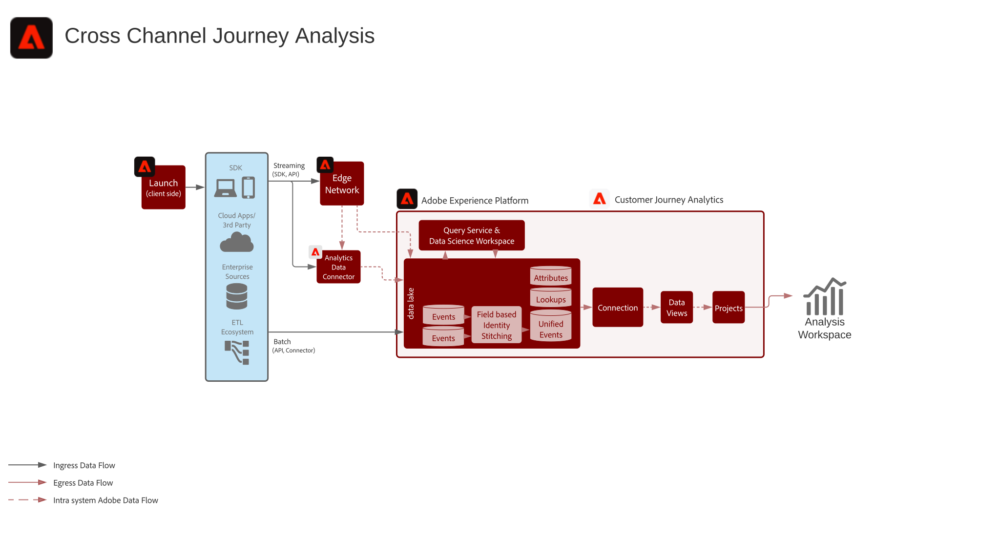

# Reseanalys över flera kanaler

Få en samlad bild av kundernas beteende i olika kanaler genom att samla data från olika webb-, mobil- och offlineegenskaper. Ni kan till exempel använda den här konsoliderade vyn för att analysera kundinteraktioner på både dator och mobil för att förstå kundbeteenden och få insikter för att optimera digitala kundupplevelser. Ni kan också analysera kundinteraktioner över alla kanaler, inklusive digitala och offlinekanaler som supportinteraktioner och köp i butiken, för att bättre förstå och optimera kundresan.

## Arkitektur

## Implementeringssteg

1. [Skapa ](https://experienceleague.adobe.com/docs/experience-platform/xdm/tutorials/create-schema-ui.html) scheman för data som ska importeras.
1. [Skapa ](https://experienceleague.adobe.com/docs/platform-learn/tutorials/data-ingestion/create-datasets-and-ingest-data.html) datauppsättningar för data som ska importeras.
1. [Importera data till Experience Platform](https://experienceleague.adobe.com/docs/platform-learn/tutorials/data-ingestion/understanding-data-ingestion.html).
1. Använd ett gemensamt namnområdes-ID för datauppsättningar eller använd [Cross-Channel Analytics](/help/connections/cca/overview.md) för att länka samman personer. Observera att Customer Journey Analytics för närvarande inte använder profiltjänsten eller identitetstjänsten Experience Platform för sammanfogning.
1. Utför alla anpassade dataförberedelser för att säkerställa en gemensam nyckel över tidsseriens datauppsättningar som ska importeras till Customer Journey Analytics.
1. Ge sökdata ett primärt ID som kan kopplas till ett fält i händelsedata. Räknas som rader i licensiering.
1. Ange samma primära ID för profildata som det primära ID:t för händelsedata.
1. Konfigurera en dataanslutning för import av data från Experience Platform till Customer Journey Analytics.
1. [Skapa en ](/help/data-views/create-dataview.md) datavy på anslutningen för att välja de mått och mätvärden som ska inkluderas i vyn. Attribution- och allokeringsinställningar konfigureras också i datavyn. Dessa inställningar beräknas vid rapporttillfället.
1. Skapa ett projekt för att konfigurera kontrollpaneler och rapporter i Analysis Workspace.

## Överväganden

När du skapar det här arbetsflödet bör du tänka på följande.

* För att kunna analysera data över flera kanaler krävs samma ID-namnutrymme för alla poster.
* Unionsprocessen för att sammanfoga olika datauppsättningar kräver en gemensam primärnyckel för personen/enheten i alla datauppsättningar.
* Sekundära nyckelbaserade föreningar stöds för närvarande inte.
* Den fältbaserade identitetssammanfogningsprocessen gör det möjligt att skriva in identiteter på nytt i rader baserat på efterföljande tillfälliga ID-poster, till exempel ett autentiserings-ID. Detta gör det möjligt att lösa olika poster till ett enda ID för analys på personnivå i stället för på enhets- eller cookienivå.
* Objekt och attribut i samma XDM-fält sammanfogas till en dimension i Customer Journey Analytics. Om du vill sammanfoga flera attribut från olika datauppsättningar till samma Customer Journey Analytics-dimension, ska datauppsättningarna referera till samma XDM-fält eller -schema.
