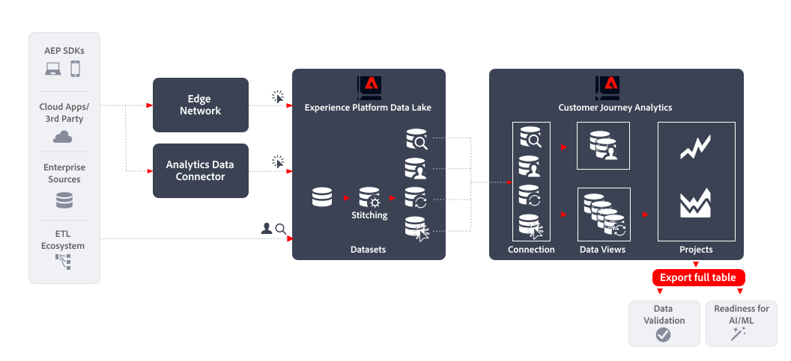

# Exportera fullständig tabell

I den här artikeln beskrivs hur [!DNL Customer Journey Analytics BI extension] kan användas för att implementera följande [användningsfall vid dataexport](overview.md):

- Dataverifiering
- Beredskap för AI/ML

## Introduktion

Exportera data med [!DNL Customer Journey Analytics Full Table Export] Med kan du exportera data från frihandstabeller i Customer Journey Analytics Analysis Workspace.

## Mer information

Du kan direkt exportera allt innehåll i frihandstabeller som du skapar i Analysis Workspace till angivna molnmål med funktionen Exportera hela tabeller.

Mer information finns i den detaljerade dokumentationen om [Exportera Customer Journey Analytics-rapporter till molnet](/help/analysis-workspace/export/export-cloud.md).

