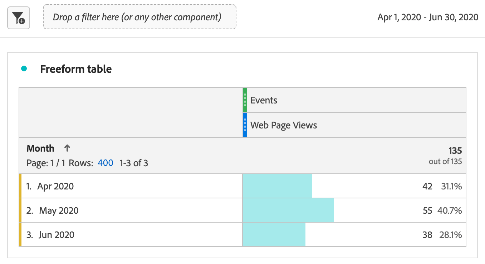

# Rapport om Marketo Engage-data

Ni kan utnyttja tillgängliga Marketo Engage datamängder i Experience Platform för att tillhandahålla värdefulla analyser och rapporteringslösningar till B2B-marknadsförare. Rapportera sedan om dessa datauppsättningar i Customer Journey Analytics.

Tänk på följande:

* Marketo Engage rapportering är bäst för att mäta och optimera marknadsföringsprogram direkt i Marketo och är snabb, prediktiv och marknadsföringsvänlig.
* Customer Journey Analytics erbjuder en mycket bredare, anpassningsbar analyslösning för kundresor som omfattar flera kanaler, produkter och affärsenheter, inklusive, men inte begränsat till, Marketo-data.

Mer information finns i [Rapportjämförelse](#reporting-comparison).

>[!NOTE]
>
>Du kan överväga att använda [Customer Journey Analytics B2B edition](/help/getting-started/cja-b2b-edition.md) för att få ut mycket mer av Marketo Engage-data. Du kan kombinera Marketo Engage-datauppsättningar med konto- och uppslagsdatauppsättningar. Och rapportera konto- och affärsmöjlighetsnivå i Customer Journey Analytics B2B edition.
>

Så här rapporterar du Marketo Engage-data i Customer Journey Analytics:

+++ &#x200B;1. Mappa Marketo källdatafält till deras XDM-mål

Mappa objekten [Personer](https://experienceleague.adobe.com/en/docs/experience-platform/sources/connectors/adobe-applications/mapping/marketo) och [Aktiviteter](https://experienceleague.adobe.com/en/docs/experience-platform/sources/connectors/adobe-applications/mapping/marketo) till deras respektive målfält för XDM-schemat.

+++

+++ &#x200B;2. Infoga Marketo-data i Adobe Experience Platform

Använd [Marketo Engage-anslutningen](https://experienceleague.adobe.com/en/docs/experience-platform/sources/connectors/adobe-applications/marketo/marketo) för att hämta data från Marketo till Experience Platform och hålla dessa data uppdaterade med plattformsanslutna program.

+++

+++ &#x200B;3. Konfigurera en anslutning till datauppsättningen i Customer Journey Analytics

För att kunna rapportera om Experience Platform datauppsättningar måste du först upprätta en anslutning mellan datauppsättningar i Experience Platform och Customer Journey Analytics. Se [Skapa eller redigera en anslutning](https://experienceleague.adobe.com/en/docs/analytics-platform/using/cja-connections/create-connection).

+++

+++ &#x200B;4. Skapa en eller flera datavyer

En [datavy](/help/data-views/data-views.md) är en behållare som är specifik för Customer Journey Analytics och som gör att du kan avgöra hur data från en anslutning ska tolkas. Här anges alla mått och mätvärden som är tillgängliga i Analysis Workspace - i det här fallet mått och mått som är specifika för Marketo. Det anger också vilka kolumner som måtten och mätvärdena hämtar data från. Datavyer definieras som förberedelser för rapportering i Analysis Workspace.

+++ 

+++ &#x200B;5. Rapportera i Analysis Workspace

Ett exempel du kan utforska är: Hur många webbsidesbesök av leads gjorde du i april-juni 2020?

1. Öppna [Analytics Workspace](/help/analysis-workspace/home.md) och skapa ett nytt projekt.
Kunder med B2B/B2P CDP kan göra analyser i B2C-stil i Customer Journey Analytics. B2B-objekt är ännu inte tillgängliga.

1. Skapa ett [segment](/help/components/segments/seg-create.md) för webbsidesvyer enligt följande - Händelsetyp = web.webpagedetails.pageViews:

   

1. Dra in segmentet som du skapade i frihandstabellen - webbsidesvyer och dra sedan in datumintervallet för månad. Den här åtgärden ger dig möjlighet att besöka webbsidor med hjälp av leads varje månad:

   

1. Eller dra in följande dimensioner: personnyckel eller e-postadress till arbetet. Den här åtgärden ger dig möjlighet att besöka webbsidor per lead:

   

Marketo Engage data i Customer Journey Analytics kan skilja sig från vad du ser i de rapporter som finns i Marketo Engage.

+++

## Rapportjämförelse

I följande jämförelse mellan rapporter i Customer Journey Analytics och Marketo Engage beskrivs några viktiga skillnader i analysfunktioner, flexibilitet, sanningskällor och användningsfall.

### Customer Journey Analytics

Customer Journey Analytics är ett avancerat verktyg för flerkanalsanalys som bygger på Adobe Experience Platform. Customer Journey Analytics är utformat för företagsteam som behöver kraftfulla, flexibla och anpassningsbara rapporter över digitala och offlinedatakällor.

#### Nyckelfunktioner

* **Datakällor**: Kan kombinera flera datauppsättningar (webb, CRM, e-post, callcenter, offline, Marketo, osv.) för 360-graders kundreserapportering.
* **Självbetjäningsanalys**: Dra och släpp-arbetsyta med mycket interaktiva, anpassningsbara instrumentpaneler och visualiseringar.
* **Avancerad attribuering**: Stöder komplexa, multi-touch och anpassade attribueringsmodeller för alla anslutna data, inte bara marknadsföringsprogram.
* **Målgrupps- och kundvägsanalys**: Djupsegmentering, kohort och kundvägsanalys över kundresor.
* **Användbara insikter**: Aktiverar datadriven orkestrering (till exempel skicka insikter tillbaka till marknadsförings- eller personaliseringsmotorer).
* **Företagsskala**: Passar för organisationer som behöver företagsstyrning, flera varumärken och stora datavolymer.

#### Vanliga användningsfall för Customer Journey Analytics

* Avancerad kartläggning av kundresan över flera kanaler och kontaktytor.
* Komplex segmentering och blandning av data online och offline.
* Anpassade KPI-kontrollpaneler för ledningsnivå och operativ rapportering.
* Modellering av heolistisk attribuering (inte bara digital eller e-post).

### Marketo Engage

Marketo Engage erbjuder rapporter i appen med fokus på nyckeltal för automatiserad marknadsföring, program- och kampanjmätning samt analyser av marknadsföringseffekt. All denna rapportering är direkt kopplad till aktiviteter inom Marketo.

#### Nyckelfunktioner

* **Intern marknadsföringsanalys**: Standardrapporter för e-post, landningssidor, kampanjer, leads, säljprojekt och intäktsattribuering (första, sista, multitouch).
* **Avancerad BI-analys (tillägg)**: Dra och släpp, skapa anpassade rapporter genom att peka och klicka för att analysera program-/konto-/lead-data (se den senaste avancerade BI Analytics-översikten).
* **Fördefinierade instrumentpaneler**: För kampanjresultat, kanaleffektivitet, pipeline/intäktsbidrag.
* **Program- och kanalanalys**: Attribution och ROI specific to Marketo-managed travel.
* **Marknadsföringscentrerad**: Fokuserar på användare som behöver genomskinlighet i marknadsföringsversionen av funnel: e-poststatistik, formulär, smarta kampanjer och intäktseffekter.

#### Vanliga användningsfall för Marketo Engage

* Spåra och optimera e-post, program och kampanjresultat.
* Attribut leder och leder till marknadsföringstaktik.
* Övervaka engagemangstrender och få leads.
* Dela insikter med sälj- och marknadsföringsteam utan datateknikresurser.
* Få tillgång till körklara, marknadsföringsvänliga rapporter.

Se nedan för en snabb jämförelse av rapportfunktioner mellan Marketo Engage och Customer Journey Analytics:

| Funktion | Marketo Engage | Customer Journey Analytics |
|---|---|---|
| **Primärt fokus** | Marknadsföringsprogram och kampanjfokuserad rapportering. | Holistisk, flerkanalig resa och beteendeanalys och rapportering. |
| **Datakällor** | Data som genereras i och via Marketo Engage. | Kombinerar data från alla Experience Platform-aktiverade data, inklusive Marketo, webbplatser, mobilappar, offlinekanaler med mera. |
| **Attribution** | Enkel och flerberöringsattribuering av Marketo-data. | Anpassad flerkanalsattribuering av alla data som finns i lösningen. |
| **Anpassad rapportering och flexibilitet** | Avancerad BI (tillägg) för program- och kontodjupdykningar. | Mycket flexibelt när det gäller hur du bygger anpassade arbetsytor, kontrollpaneler eller rapporter med hjälp av alla tillgängliga data. |
| **Målgruppsanalys** | Filtrera och segmentera programlistor, engagemang och smarta listor. | Omfattande visualiseringar av individer och resor, målgruppspapper och segmentöverlappningsanalyser. |
| **Avsedda användare** | Marknadsförare, marknadsoperatörer, efterfrågegenererande arbetare, intäktsmän. | Analytiker, datavetare, marknadsföringsstrateger, kundupplevelseproffs. |
| **Måttborttagning av dubbletter** | För resultatrapporter för e-postmeddelanden dedupliceras mätvärdena automatiskt av lead-ID, kampanj-ID och resurs-ID för e-post. Om flera e-postmeddelanden skapas från samma e-postresurs skickas till samma lead från samma program räknas dessa e-postmeddelanden endast som ett. | Utan ytterligare filter och mätvärden rapporteras e-postrapporteringsdata som ett totalt antal e-postprestanda utan [metrisk deduplicering](/help/data-views/component-settings/metric-deduplication.md). |

{style="table-layout:fixed"}
