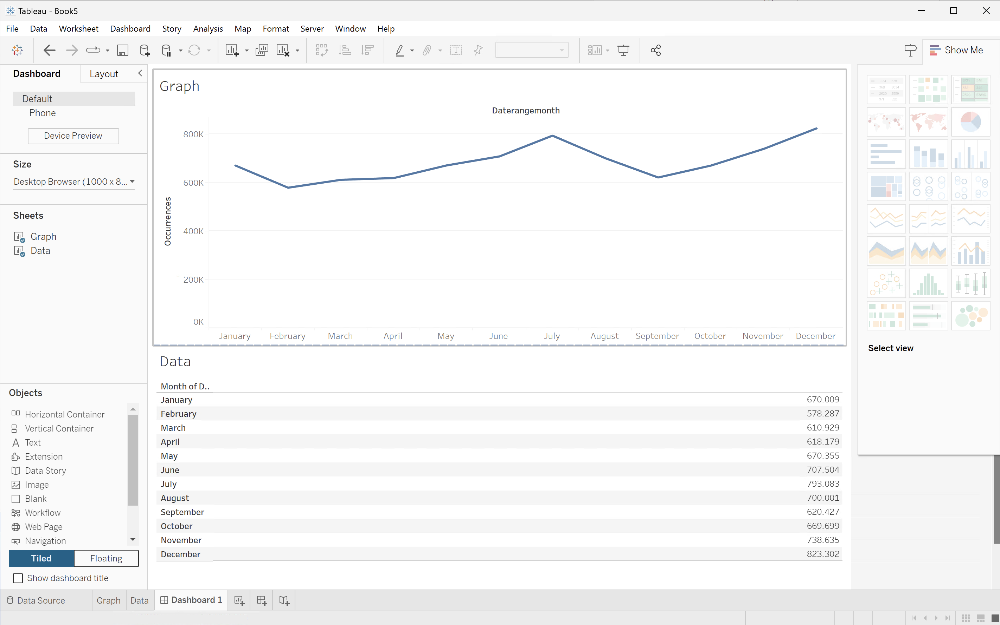
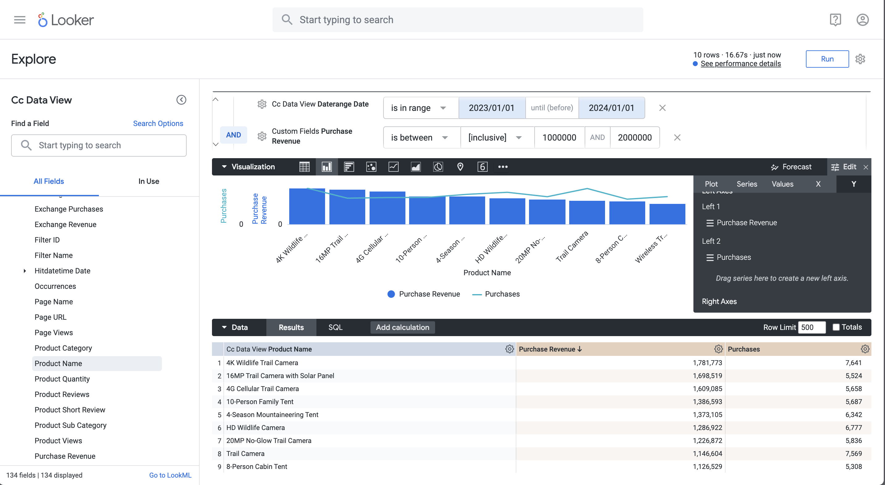
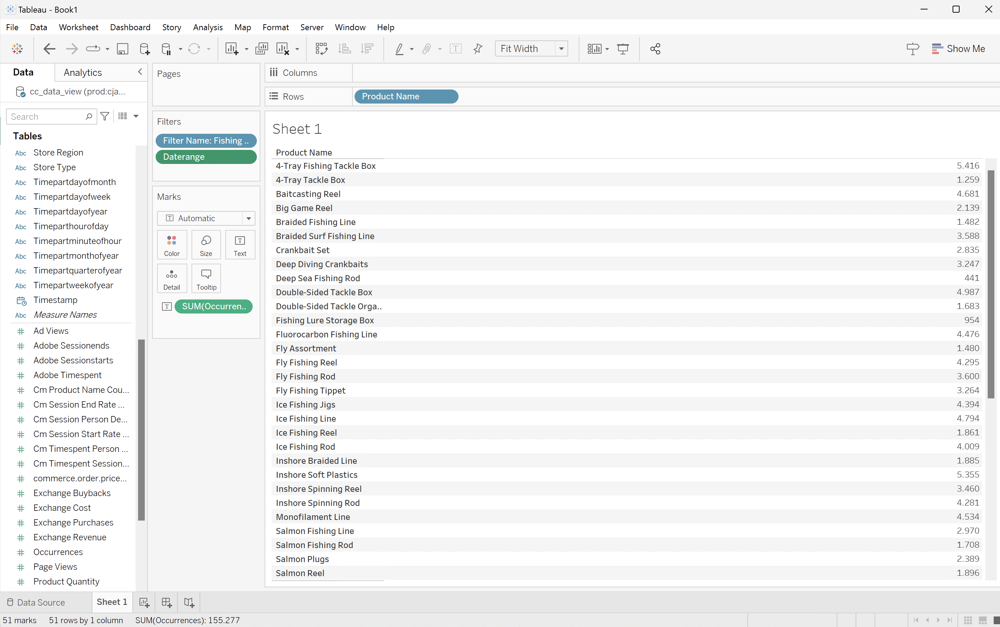
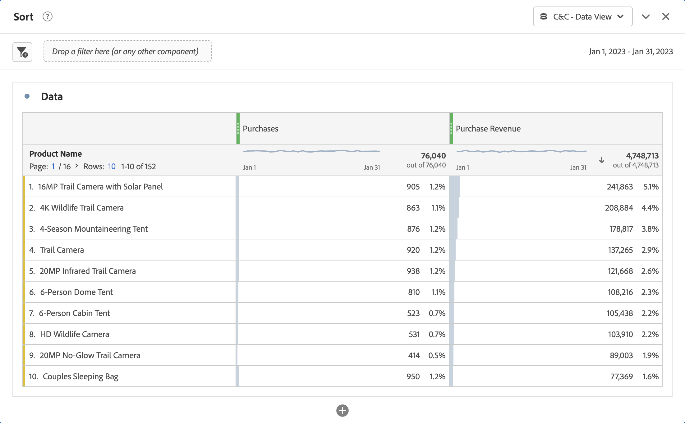

# Användningsexempel för BI-tillägg

I den här artikeln beskrivs hur du slutför ett antal användningsfall med Customer Journey Analytics BI-tillägget. I varje exempel förklaras Customer Journey Analytics-funktionaliteten, följt av information om alla BI-verktyg som stöds:

* **Power BI Desktop**. Den version som används är 2.137.1102.0 (64 bitar) (oktober 2024).
* **Skrivbord för surfplatta**. Den version som används är 2024.1.5 (20241.24.0705.0334), 64 bitar.
* **Looker**. Online version 25.0.23, tillgänglig via [looker.com](https://looker.com){target="_blank"}

Följande användningsfall dokumenteras:

* **Anslut**
   * [Visa och koppla data](#connect-and-validate)

* **Rapportera och analysera**
   * [Daglig trend](#daily-trend)
   * [Trend varje timme](#hourly-trend)
   * [Månadstrender](#monthly-trend)
   * [Enkel dimension rankad](#single-dimension-ranked)
   * [Flera dimensioner rankade](#multiple-dimension-ranked)
   * [Räkna distinkta dimensionsvärden](#count-distinct-dimension-values)
   * [Använd datumintervallnamn för att filtrera](#use-date-range-names-to-filter)
   * [Använd filternamn för att filtrera](#use-filter-names-to-filter)
   * [Använd dimensionsvärden för att filtrera](#use-dimension-values-to-filter)
   * [Sortera](#sort)
   * [Gränser](#limits)

* **Förstå**

   * [Omformningar](#transformations)
   * [Visualiseringar](#visualizations)
   * [Caveats](#caveats)

I **connect**-användningsexemplet fokuseras på hur du ansluter BI-verktyg med Customer Journey Analytics BI-tillägget.

**rapport- och analysexemplen** instruerar dig hur du kan uppnå liknande Customer Journey Analytics-visualiseringar i de BI-verktyg som stöds för närvarande.

**Använd**-användningsexemplen innehåller mer information om:

* Transformeringar som inträffar när du använder BI-verktyg för att rapportera och analysera.
* Visualiseringslikheter och skillnader mellan Customer Journey Analytics- och BI-verktyg.
* Omslag till alla BI-verktyg som du bör känna till.


## Anslut och validera

I det här användningsexemplet ställs anslutningen in från BI-verktyget till Customer Journey Analytics, tillgängliga datavyer listas och en datavy väljs som ska användas.

+++ Customer Journey Analytics

Instruktionerna avser en exempelmiljö med följande objekt:

* Datavy: **[!UICONTROL C&C - Data View]** ??.
* Dimensioner: **[!UICONTROL Product Name]** ?? och **[!UICONTROL Product Category]** ?..
* Mätvärden: **[!UICONTROL Purchase Revenue]** ?? och **[!UICONTROL Purchases]** ?..
* Filter: **[!UICONTROL Fishing Products]** ??.

{zoomable="yes"}

När du går igenom användningsexemplen ersätter du de här exempelobjekten med objekt som passar just din miljö.

+++

+++ BI-verktyg

>[!BEGINTABS]

>[!TAB Power BI Desktop]

1. Få åtkomst till de nödvändiga autentiseringsuppgifterna och parametrarna från användargränssnittet för Experience Platform Query Service.

   1. Navigera till din Experience Platform-sandlåda.
   1. Välj  **[!UICONTROL Queries]** i den vänstra listen.
   1. Välj fliken **[!UICONTROL Credentials]** i gränssnittet **[!UICONTROL Queries]**.
   1. Välj `prod:cja` i listrutan **[!UICONTROL Database]**.

      {zoomable="yes"}

1. Starta Power BI Desktop.
   1. Välj **[!UICONTROL Get data from other sources]** i huvudgränssnittet.
   1. I dialogrutan **[!UICONTROL Get Data]**:
      {zoomable="yes"}
      1. Sök efter och välj **[!UICONTROL PostgreSQL database]**.
      1. Välj **[!UICONTROL Connect]**.
   1. I dialogrutan **[!UICONTROL PostgreSQL database]**:
      {zoomable="yes"}
      1. Använd  om du vill kopiera och klistra in värdena **[!UICONTROL Host]** och **[!UICONTROL Port]** från panelen Experience Platform **[!UICONTROL Query]** **[!UICONTROL Expiring Credentials]**, avgränsade med `:` som värde för **[!UICONTROL Server]**. Till exempel: `examplecompany.platform-query.adobe.io:80`.
      1. Använd  om du vill kopiera och klistra in värdet **[!UICONTROL Database]** från panelen **[!UICONTROL Query]** **[!UICONTROL Expiring Credentials]** i Experience Platform. Lägg till `?FLATTEN` i värdet som du klistrar in. Exempel: `prod:cja?FLATTEN`.
      1. Välj **[!UICONTROL DirectQuery]** som **[!UICONTROL Data connectivity mode]**.
      1. Välj **[!UICONTROL OK]**.
   1. I dialogrutan **[!UICONTROL PostgreSQL database]** - **[!UICONTROL Database]**:
      {zoomable="yes"}
      1. Använd  om du vill kopiera värdena **[!UICONTROL Username]** och **[!UICONTROL Password]** från panelen Experience Platform **[!UICONTROL Query]** **[!UICONTROL Expiring Credentials]** i fälten **[!UICONTROL User name]** och **[!UICONTROL Password]**. Om du använder en [icke-förfallande autentiseringsuppgift](https://experienceleague.adobe.com/en/docs/experience-platform/query/ui/credentials?lang=en#use-credential-to-connect) ska du använda lösenordet för dina icke-förfallande autentiseringsuppgifter.
      1. Kontrollera att listrutan för **[!UICONTROL Select which level to apply these settings to]** är inställd på **[!UICONTROL Server]** som du har definierat tidigare.
      1. Välj **[!UICONTROL Connect]**.
   1. I dialogrutan **[!UICONTROL Navigator]** hämtas datavyer. Den här hämtningen kan ta en stund. När du har hämtat det här ser du följande i Power BI Desktop.
      {zoomable="yes"}
      1. Välj **[!UICONTROL public.cc_data_view]** i listan i den vänstra panelen.
      1. Du har två alternativ:
         1. Välj **[!UICONTROL Load]** om du vill fortsätta och slutföra konfigurationen.
         1. Välj **[!UICONTROL Transform Data]**. En dialogruta visas där du kan välja att använda omformningar som en del av konfigurationen.
            {zoomable="yes"}
            * Välj **[!UICONTROL Close & Apply]**.
   1. Efter en stund visas **[!UICONTROL public.cc_data_view]** i rutan **[!UICONTROL Data]**. Välj  om du vill visa mått och mått.
      {zoomable="yes"}


### Till FLATTEN eller inte

Power BI Desktop stöder följande scenarier för parametern `FLATTEN`. Mer information finns i [Förenkla kapslade data](https://experienceleague.adobe.com/en/docs/experience-platform/query/key-concepts/flatten-nested-data).

| FLATTEN-parameter | Exempel | Stöds | Anmärkningar |
|---|---|:---:|---|
| Ingen | `prod:cja` |  | |
| `?FLATTEN` | `prod:cja?FLATTEN` |  | **Rekommenderat alternativ att använda!** |
| `%3FFLATTEN` | `prod:cja%3FFLATTEN` |  | Power BI Desktop visar fel: **[!UICONTROL We couldn't authenticate with the credentials provided. Please try again.]** |

### Mer information

* [Förutsättningar](/help/data-views/bi-extension.md#prerequisites)
* [Handbok för autentiseringsuppgifter](https://experienceleague.adobe.com/en/docs/experience-platform/query/ui/credentials)
* [Anslut Power BI till frågetjänsten](https://experienceleague.adobe.com/en/docs/experience-platform/query/clients/power-bi).


>[!TAB Skrivbord för Tablet PC]

1. Få åtkomst till de nödvändiga autentiseringsuppgifterna och parametrarna från användargränssnittet för Experience Platform Query Service.

   1. Navigera till din Experience Platform-sandlåda.
   1. Välj  **[!UICONTROL Queries]** i den vänstra listen.
   1. Välj fliken **[!UICONTROL Credentials]** i gränssnittet **[!UICONTROL Queries]**.
   1. Välj `prod:cja` i listrutan **[!UICONTROL Database]**.

      {zoomable="yes"}

1. Starta Tableu.
   1. Välj **[!UICONTROL PostgreSQL]** från den vänstra listen under **[!UICONTROL To a Server]**. Om den inte är tillgänglig väljer du **[!UICONTROL More...]** och väljer **[!UICONTROL PostgreSQL]** i **[!UICONTROL Installed Connectors]**.
      {zoomable="yes"}
   1. I dialogrutan **[!UICONTROL PostgreSQL]** går du till fliken **[!UICONTROL General]**:
      {zoomable="yes"}
      1. Använd  för att kopiera och klistra in **[!UICONTROL Host]** från Experience Platform **[!UICONTROL Query]** **[!UICONTROL Expiring Credentials]**-panelen till **[!UICONTROL Server]**.
      1. Använd  för att kopiera och klistra in **[!UICONTROL Port]** från Experience Platform **[!UICONTROL Query]** **[!UICONTROL Expiring Credentials]**-panelen till **[!UICONTROL Port]**.
      1. Använd  för att kopiera och klistra in **[!UICONTROL Database]** från Experience Platform **[!UICONTROL Query]** **[!UICONTROL Expiring Credentials]**-panelen till **[!UICONTROL Database]**. Lägg till `%3FFLATTEN` i värdet som du klistrar in. Till exempel: `prod:cja%3FFLATTEN`.
      1. Välj **[!UICONTROL Username and Password]** i listrutan **[!UICONTROL Authentication]**.
      1. Använd  för att kopiera och klistra in **[!UICONTROL Username]** från Experience Platform **[!UICONTROL Query]** **[!UICONTROL Expiring Credentials]**-panelen till **[!UICONTROL Username]**.
      1. Använd  för att kopiera och klistra in **[!UICONTROL Password]** från Experience Platform **[!UICONTROL Query]** **[!UICONTROL Expiring Credentials]**-panelen till **[!UICONTROL Password]**. Om du använder en [icke-förfallande autentiseringsuppgift](https://experienceleague.adobe.com/en/docs/experience-platform/query/ui/credentials?lang=en#use-credential-to-connect) ska du använda lösenordet för dina icke-förfallande autentiseringsuppgifter.
      1. Kontrollera att **[!UICONTROL Require SSL]** är markerad.
      1. Välj **[!UICONTROL Sign In]**.

      Du ser en **[!UICONTROL Progressing Request]**-dialogruta medan Skrivbord på Tablet PC verifierar anslutningen.
   1. I huvudfönstret visas på sidan **[!UICONTROL Data Source]** i den vänstra rutan:
      * Namnet på anslutningen, under **[!UICONTROL Connections]**.
      * Namnet på databasen, under **[!UICONTROL Database]**.
      * En lista med tabeller, under **[!UICONTROL Table]**.
        {zoomable="yes"}
      1. Dra **[!UICONTROL cc_data_view]**-posten och släpp posten i huvudvyn som läser **[!UICONTROL Drag tables]** här.
   1. I huvudfönstret visas information om datavyn **[!UICONTROL cc_data_view]**.
      {zoomable="yes"}

### Till FLATTEN eller inte

Tableu Desktop stöder följande scenarier för parametern `FLATTEN`. Mer information finns i [Förenkla kapslade data](https://experienceleague.adobe.com/en/docs/experience-platform/query/key-concepts/flatten-nested-data).

| FLATTEN-parameter | Exempel | Stöds | Anmärkningar |
|---|---|:---:|---|
| Ingen | `prod:cja` |  | |
| `?FLATTEN` | `prod:cja?FLATTEN` |  | |
| `%3FFLATTEN` | `prod:cja%3FFLATTEN` |  | **Rekommenderat alternativ för**. Obs! `%3FFLATTEN` är en URL-kodad version av `?FLATTEN`. |

### Mer information

* [Förutsättningar](/help/data-views/bi-extension.md#prerequisites)
* [Handbok för autentiseringsuppgifter](https://experienceleague.adobe.com/en/docs/experience-platform/query/ui/credentials)
* [Anslut skrivbordet till frågetjänsten](https://experienceleague.adobe.com/en/docs/experience-platform/query/clients/tableau).


>[!TAB Sökare]

1. Få åtkomst till de nödvändiga autentiseringsuppgifterna och parametrarna från användargränssnittet för Experience Platform Query Service.

   1. Navigera till din Experience Platform-sandlåda.
   1. Välj  **[!UICONTROL Queries]** i den vänstra listen.
   1. Välj fliken **[!UICONTROL Credentials]** i gränssnittet **[!UICONTROL Queries]**.
   1. Välj `prod:cja` i listrutan **[!UICONTROL Database]**.

      {zoomable="yes"}

1. Logga in på Looker

   1. Välj **[!UICONTROL Admin]** i den vänstra listen.
   1. Välj **[!UICONTROL Connections]**.
   1. Välj **[!UICONTROL Add Connection]**.
   1. I **[!UICONTROL Connect your database to Looker screen]**.

      {zoomable="yes"}

      1. Ange en **[!UICONTROL Name]** för din anslutning, till exempel `Example Looker Connection`.
      1. Kontrollera att **[!UICONTROL All Projects]** är markerat som **[!UICONTROL Connection Scope]**.
      1. Välj **[!UICONTROL PostgreSQL 9.5+]** som dialekt.
      1. Använd  om du vill kopiera och klistra in värdet **[!UICONTROL Host]** från panelen Experience Platform **[!UICONTROL Query]** **[!UICONTROL Expiring Credentials]** som värde för **[!UICONTROL Host]**. Till exempel: `examplecompany.platform-query.adobe.io`.
      1. Använd  om du vill kopiera och klistra in värdet **[!UICONTROL Port]** från panelen Experience Platform **[!UICONTROL Query]** **[!UICONTROL Expiring Credentials]** som värde för **[!UICONTROL Port]**. Till exempel: `80`.
      1. Använd  om du vill kopiera och klistra in värdet **[!UICONTROL Database]** från panelen Experience Platform **[!UICONTROL Query]** **[!UICONTROL Expiring Credentials]** som värde för **[!UICONTROL Database]**. Lägg till `%3FFLATTEN` i värdet som du klistrar in. Exempel: `prod:cja%3FFLATTEN`.
      1. Använd  om du vill kopiera och klistra in värdet **[!UICONTROL Username]** från panelen Experience Platform **[!UICONTROL Query]** **[!UICONTROL Expiring Credentials]** som värde för **[!UICONTROL Username]**.
      1. Använd  om du vill kopiera och klistra in värdet **[!UICONTROL Password]** från panelen Experience Platform **[!UICONTROL Query]** **[!UICONTROL Expiring Credentials]** som värde för **[!UICONTROL Password]**.
      1. Välj **[!UICONTROL Expand all]** vid **[!UICONTROL Optional Settings]**.
      1. Ange **[!UICONTROL Max connections]** per nod till `5`.
      1. Kontrollera att **[!UICONTROL SSL]** är aktiverat.
      1. Välj **[!UICONTROL Test]** om du vill testa anslutningen. En banderoll visas högst upp på skärmen med ett meddelande som **[!UICONTROL Success, can connect JDBC ....]**.
      1. Välj **[!UICONTROL Connect]** om du vill upprätta och spara anslutningen.
   1. Den nya anslutningen visas i gränssnittet **[!UICONTROL Connections]**.
   1. Välj **¥** från **[!UICONTROL Admin]** om du vill gå till huvudnavigeringen i den vänstra listen.
   1. Välj **[!UICONTROL Develop]**.
   1. Välj **[!UICONTROL Projects]**.
   1. Välj **[!UICONTROL New Model]** i LookML-projekt.
   1. För att vara säker på att du inte påverkar andra användare. Välj Ange utvecklingsläge när du uppmanas till det.
   1. I **[!UICONTROL Create Model]**-upplevelsen:
      1. I **[!UICONTROL ➊ Select Database Connection]**:
         1. Välj din databasanslutning i **[!UICONTROL Select database connection]**. Till exempel: **[!UICONTROL example_looker_connection]**.
         1. Namnge projektet i **[!UICONTROL Create a new LookML Project for this model]**. För `example: example_looker_project`.
         1. Välj **[!UICONTROL Next]**.
      1. I **[!UICONTROL ➋ Select Tables]**:
         1. Välj **[!UICONTROL public]** och kontrollera sedan att datavyn för Customer Journey Analytics är markerad. Till exempel:  **[!UICONTROL cc_data_view]**.
         1. Välj **[!UICONTROL Next]**.
      1. I **[!UICONTROL ➌ Select Primary Keys]**:
         1. Välj **[!UICONTROL Next]**.
      1. I **[!UICONTROL ➍ Select Explores to Create]**:
         1. Se till att du väljer vyn. Till exempel: **[!UICONTROL cc_data_view.view]**.
         1. Välj **[!UICONTROL Next]**.
      1. I **[!UICONTROL ➎ Enter Model Name]**:
         1. Ge modellen ett namn. Till exempel: `example_looker_model`.
      1. Välj **[!UICONTROL Complete and Explore Data]**.

   Du omdirigeras till **[!UICONTROL Explore]**-gränssnittet för Looker, redo att utforska data.


### Till FLATTEN eller inte

Looker stöder följande scenarier för parametern `FLATTEN`. Mer information finns i [Förenkla kapslade data](https://experienceleague.adobe.com/en/docs/experience-platform/query/key-concepts/flatten-nested-data).

| FLATTEN-parameter | Exempel | Stöds | Anmärkningar |
|---|---|:---:|---|
| Ingen | `prod:cja` |  | |
| `?FLATTEN` | `prod:cja?FLATTEN` |  | |
| `%3FFLATTEN` | `prod:cja%3FFLATTEN` |  | **Rekommenderat alternativ för**. Obs! `%3FFLATTEN` är en URL-kodad version av `?FLATTEN`. |

### Mer information

* [Förutsättningar](/help/data-views/bi-extension.md#prerequisites)
* [Handbok för autentiseringsuppgifter](https://experienceleague.adobe.com/en/docs/experience-platform/query/ui/credentials)

>[!ENDTABS]

+++


## Daglig trend

I det här fallet vill du visa en tabell och en enkel radvisualisering som visar en daglig trend för förekomster (händelser) från 1 januari 2023 till 31 januari 2023.

+++ Customer Journey Analytics

Ett exempel på **[!UICONTROL Daily Trend]**-panel för användningsfallet:

{zoomable="yes"}

+++

+++ BI-verktyg

>[!PREREQUISITES]
>
>Kontrollera att du har verifierat en [lyckad anslutning och kan visa och använda datavyer](#connect-and-validate) för BI-verktyget som du vill testa det här användningsfallet för.
>

>[!BEGINTABS]

>[!TAB Power BI Desktop]

1. I rutan **[!UICONTROL Data]**:
   1. Välj **[!UICONTROL daterangeday]**.
   1. Välj **[!UICONTROL ∑ occurrences]**.

   En tabell visas med förekomsterna för den aktuella månaden. Förstora visualiseringen för bättre synlighet.

1. I rutan **[!UICONTROL Filters]**:

   1. Välj **[!UICONTROL daterangeday is (All)]** från **[!UICONTROL Filters on this visual]**.
   1. Välj **[!UICONTROL Advanced filtering]** som **[!UICONTROL Filter type]**.
   1. Definiera filtret för **[!UICONTROL Show items when the value]** **[!UICONTROL is on or after]** `1/1/2023` **[!UICONTROL And]** **[!UICONTROL is before]** `2/1/2023.` Du kan använda kalenderikonen för att välja och välja datum.
   1. Välj **[!UICONTROL Apply filter]**.

   Tabellen uppdateras med det använda **[!UICONTROL daterangeday]**-filtret.

1. I rutan **[!UICONTROL Visualizations]** väljer du **[!UICONTROL Line chart]**-visualisering.

   En linjediagramvisualisering ersätter tabellen och använder samma data som tabellen. Ditt Power BI-skrivbord ska se ut så här nedan.

   {zoomable="yes"}

1. Visualisering av linjediagram:

   1. Välj .
   1. Välj **[!UICONTROL Show as a table]** på snabbmenyn.

   Huvudvyn uppdateras för att visa både en radvisualisering och en tabell. Ditt Power BI-skrivbord ska se ut så här nedan.

   {zoomable="yes"}

>[!TAB Skrivbord för Tablet PC]

1. Välj fliken **[!UICONTROL Sheet 1]** längst ned för att växla från vyn **[!UICONTROL Data source]**. I vyn **[!UICONTROL Sheet 1]**:
   1. Dra posten **[!UICONTROL Daterange]** från listan **[!UICONTROL Tables]** i rutan **[!UICONTROL Data]** och släpp posten på hyllan **[!UICONTROL Filters]**.
   1. I dialogrutan **[!UICONTROL Filters Field \[Daterange\]]** väljer du **[!UICONTROL Range of Dates]** och sedan **[!UICONTROL Next >]**.
   1. I dialogrutan **[!UICONTROL Filter \[Daterange]]** väljer du **[!UICONTROL Range of dates]** och anger en punkt på `01/01/2023` - `01/02/2023`.

      {zoomable="yes"}

   1. Dra och släpp **[!UICONTROL Daterangeday]** från listan **[!UICONTROL Tables]** i rutan **[!UICONTROL Data]** och släpp posten i fältet bredvid **[!UICONTROL Columns]**.
      * Välj **[!UICONTROL Day]** i listrutan **[!UICONTROL Daterangeday]** så att värdet uppdateras till **[!UICONTROL DAY(Daterangeday)]**.
   1. Dra och släpp **[!UICONTROL Occurrences]** från listan **[!UICONTROL Tables (*Måttnamn *)]**i rutan **[!UICONTROL Data]**och släpp posten i fältet bredvid **[!UICONTROL Rows]**. Värdet konverteras automatiskt till **[!UICONTROL SUM(Occurrences)]**.
   1. Ändra **[!UICONTROL Standard]** till **[!UICONTROL Entire View]** på den nedrullningsbara menyn **[!UICONTROL Fit]** i verktygsfältet.

      Ditt skrivbord ska se ut så här nedan.

      {zoomable="yes"}

1. Välj **[!UICONTROL Duplicate]** på snabbmenyn på fliken **[!UICONTROL Sheet 1]** om du vill skapa ett andra blad.
1. Välj **[!UICONTROL Rename]** på snabbmenyn på fliken **[!UICONTROL Sheet 1]** om du vill byta namn på bladet till `Graph`.
1. Välj **[!UICONTROL Rename]** på snabbmenyn på fliken **[!UICONTROL Sheet 1 (2)]** om du vill byta namn på bladet till `Data`.
1. Kontrollera att bladet **[!UICONTROL Data]** är markerat. I vyn **[!UICONTROL Data]**:
   1. Välj **[!UICONTROL Show me]** längst upp till höger och välj **[!UICONTROL Text table]** (övre vänstra visualiseringen) för att ändra innehållet i datavyn till en tabell.
   1. Välj **[!UICONTROL Swap Rows and Columns]** i verktygsfältet.
   1. Ändra **[!UICONTROL Standard]** till **[!UICONTROL Entire View]** på den nedrullningsbara menyn **[!UICONTROL Fit]** i verktygsfältet.

      Ditt skrivbord ska se ut så här nedan.

      {zoomable="yes"}

1. Skapa en ny **[!UICONTROL Dashboard 1]**-vy genom att klicka på flikknappen **[!UICONTROL New Dashboard]** (längst ned). I vyn **[!UICONTROL Dashboard 1]**:
   1. Dra och släpp **[!UICONTROL Graph]**-bladet från **[!UICONTROL Sheets]**-hyllan till **[!UICONTROL Dashboard 1]**-vyn som läser *Drop sheets här*.
   1. Dra och släpp **[!UICONTROL Data]**-bladet från **[!UICONTROL Sheets]**-hyllan nedanför **[!UICONTROL Graph]**-bladet till **[!UICONTROL Dashboard 1]**-vyn.
   1. Markera bladet **[!UICONTROL Data]** i vyn och ändra **[!UICONTROL Entire View]** till **[!UICONTROL Fix Width]**.

      Ditt skrivbord ska se ut så här nedan.

      {zoomable="yes"}


>[!TAB Sökare]

1. Kontrollera att du har en ren konfiguration i gränssnittet **[!UICONTROL Explore]** för Looker. Om inte väljer du  **[!UICONTROL Remove fields and filters]**.
1. Välj **[!UICONTROL + Filter]** under **[!UICONTROL Filters]**.
1. I dialogrutan **[!UICONTROL Add Filter]**:
   1. Välj **[!UICONTROL ‣ Cc Data View]**
   1. Välj **[!UICONTROL ‣ Daterange Date]** och sedan **[!UICONTROL Daterange Date]** i listan med fält.
      {zoomable="yes"}
1. Ange filtret **[!UICONTROL Cc Data View Daterange Date]** som **[!UICONTROL is in range]** **[!UICONTROL 2023/01/01]** **[!UICONTROL until (before)]** **[!UICONTROL 2023/02/01]**.
1. Från avsnittet **[!UICONTROL Cc Data View]** i den vänstra listen,
   1. Välj **[!UICONTROL ‣ Daterange Date]** och sedan **[!UICONTROL Date]** i listan med **[!UICONTROL DIMENSIONS]**.
   1. Välj **[!UICONTROL Count]** under **[!UICONTROL MEASURES]** i den vänstra listen (längst ned).
1. Välj **[!UICONTROL Run]**.
1. Välj **[!UICONTROL ‣ Visualization]** om du vill visa radinvisualiseringen.

En visualisering och en tabell som liknar den visas nedan.

{zoomable="yes"}

>[!ENDTABS]

+++


## Trend varje timme

I det här fallet vill du visa en tabell och en enkel radvisualisering som visar en timtrend för förekomster (händelser) för 1 januari 2023.

+++ Customer Journey Analytics

Ett exempel på **[!UICONTROL Hourly Trend]**-panel för användningsfallet:

{zoomable="yes"}

+++

+++ BI-verktyg

>[!PREREQUISITES]
>
>Kontrollera att du har verifierat [en lyckad anslutning, kan visa datavyer och använda en datavy](#connect-and-validate) för BI-verktyget som du vill testa det här användningsfallet för.
>

>[!BEGINTABS]

>[!TAB Power BI Desktop]

 Power BI förstår **inte** hur datum- och tidsfält ska hanteras, så dimensioner som **[!UICONTROL daterangehour]** och **[!UICONTROL daterangeminute]** stöds inte.

>[!TAB Skrivbord för Tablet PC]

1. Välj fliken **[!UICONTROL Sheet 1]** längst ned om du vill växla från **[!UICONTROL Data source]**. I vyn **[!UICONTROL Sheet 1]**:
   1. Dra posten **[!UICONTROL Daterange]** från listan **[!UICONTROL Tables]** i rutan **[!UICONTROL Data]** och släpp posten på hyllan **[!UICONTROL Filters]**.
   1. I dialogrutan **[!UICONTROL Filters Field \[Daterange\]]** väljer du **[!UICONTROL Range of Dates]** och sedan **[!UICONTROL Next >]**.
   1. I dialogrutan **[!UICONTROL Filter \[Daterange]]** väljer du **[!UICONTROL Range of dates]** och anger en punkt på `01/01/2023` - `02/01/2023`.

      {zoomable="yes"}

   1. Dra och släpp **[!UICONTROL Daterangehour]** från listan **[!UICONTROL Tables]** i rutan **[!UICONTROL Data]** och släpp posten i fältet bredvid **[!UICONTROL Columns]**.
      * Välj **[!UICONTROL More]** > **[!UICONTROL Hours]** i listrutan **[!UICONTROL Daterangeday]** så att värdet uppdateras till **[!UICONTROL HOUR(Daterangeday)]**.
   1. Dra och släpp **[!UICONTROL Occurrences]** från listan **[!UICONTROL Tables (*Måttnamn *)]**i rutan **[!UICONTROL Data]**och släpp posten i fältet bredvid **[!UICONTROL Rows]**. Värdet konverteras automatiskt till **[!UICONTROL SUM(Occurrences)]**.
   1. Ändra **[!UICONTROL Standard]** till **[!UICONTROL Entire View]** på den nedrullningsbara menyn **[!UICONTROL Fit]** i verktygsfältet.

      Ditt skrivbord ska se ut så här nedan.

      {zoomable="yes"}

1. Välj **[!UICONTROL Duplicate]** på snabbmenyn på fliken **[!UICONTROL Sheet 1]** om du vill skapa ett andra blad.
1. Välj **[!UICONTROL Rename]** på snabbmenyn på fliken **[!UICONTROL Sheet 1]** om du vill byta namn på bladet till `Graph`.
1. Välj **[!UICONTROL Rename]** på snabbmenyn på fliken **[!UICONTROL Sheet 1 (2)]** om du vill byta namn på bladet till `Data`.
1. Kontrollera att bladet **[!UICONTROL Data]** är markerat. I vyn **[!UICONTROL Data]**:
   1. Välj **[!UICONTROL Show me]** längst upp till höger och välj **[!UICONTROL Text table]** (övre vänstra visualiseringen) för att ändra innehållet i datavyn till en tabell.
   1. Dra **[!UICONTROL HOUR(Daterangeday)]** från **[!UICONTROL Columns]** till **[!UICONTROL Rows]**.
   1. Ändra **[!UICONTROL Standard]** till **[!UICONTROL Entire View]** på den nedrullningsbara menyn **[!UICONTROL Fit]** i verktygsfältet.

      Ditt skrivbord ska se ut så här nedan.

      {zoomable="yes"}

1. Skapa en ny **[!UICONTROL Dashboard 1]**-vy genom att klicka på tabbknappen **[!UICONTROL New Dashboard]** (längst ned). I vyn **[!UICONTROL Dashboard 1]**:
   1. Dra och släpp **[!UICONTROL Graph]**-bladet från **[!UICONTROL Sheets]**-hyllan till **[!UICONTROL Dashboard 1]**-vyn som läser *Drop sheets här*.
   1. Dra och släpp **[!UICONTROL Data]**-bladet från **[!UICONTROL Sheets]**-hyllan nedanför **[!UICONTROL Graph]**-bladet till **[!UICONTROL Dashboard 1]**-vyn.
   1. Markera bladet **[!UICONTROL Data]** i vyn och ändra **[!UICONTROL Entire View]** till **[!UICONTROL Fix Width]**.

      **[!UICONTROL Dashboard 1]**-vyn ska se ut så här nedan.

      {zoomable="yes"}


>[!TAB Sökare]


1. Kontrollera att du har en ren konfiguration i gränssnittet **[!UICONTROL Explore]** för Looker. Om inte väljer du  **[!UICONTROL Remove fields and filters]**.
1. Välj **[!UICONTROL + Filter]** under **[!UICONTROL Filters]**.
1. I dialogrutan **[!UICONTROL Add Filter]**:
   1. Välj **[!UICONTROL ‣ Cc Data View]**
   1. Välj **[!UICONTROL ‣ Daterange Date]** och sedan **[!UICONTROL Daterange Date]** i listan med fält.
      {zoomable="yes"}
1. Ange filtret **[!UICONTROL Cc Data View Daterange Date]** som **[!UICONTROL is in range]** **[!UICONTROL 2023/01/01]** **[!UICONTROL until (before)]** **[!UICONTROL 2023/01/02]**.
1. Från avsnittet **[!UICONTROL Cc Data View]** i den vänstra listen,
   1. Välj **[!UICONTROL ‣ Daterangehour Date]** och sedan **[!UICONTROL Time]** i listan med **[!UICONTROL DIMENSIONS]**.
   1. Välj **[!UICONTROL Count]** under **[!UICONTROL MEASURES]** i den vänstra listen (längst ned).
1. Välj **[!UICONTROL Run]**.
1. Välj **[!UICONTROL ‣ Visualization]** om du vill visa radinvisualiseringen.

En visualisering och en tabell som liknar den visas nedan.

{zoomable="yes"}

>[!ENDTABS]

+++


## Månadstrender

I det här fallet vill du visa en tabell och en enkel radvisualisering som visar en månatlig trend för händelser för 2023.

+++ Customer Journey Analytics

Ett exempel på **[!UICONTROL Monthly Trend]**-panel för användningsfallet:

{zoomable="yes"}

+++

+++ BI-verktyg

>[!PREREQUISITES]
>
>Kontrollera att du har verifierat [en lyckad anslutning, kan visa datavyer och använda en datavy](#connect-and-validate) för BI-verktyget som du vill testa det här användningsfallet för.
>

>[!BEGINTABS]

>[!TAB Power BI Desktop]

1. I rutan **[!UICONTROL Data]**:
   1. Välj **[!UICONTROL daterangemonth]**.
   1. Välj **[!UICONTROL ∑ occurrences]**.

   En tabell visas med förekomsterna för den aktuella månaden. Förstora visualiseringen för bättre synlighet.

1. I rutan **[!UICONTROL Filters]**:

   1. Välj **[!UICONTROL daterangemonth is (All)]** från **[!UICONTROL Filters on this visual]**.
   1. Välj **[!UICONTROL Advanced filtering]** som **[!UICONTROL Filter type]**.
   1. Definiera filtret för **[!UICONTROL Show items when the value]** **[!UICONTROL is on or after]** `1/1/2023` **[!UICONTROL And]** **[!UICONTROL is before]** `1/1/2024.` Du kan använda kalenderikonen för att välja och välja datum.
   1. Välj **[!UICONTROL Apply filter]**.

   Tabellen uppdateras med det använda **[!UICONTROL daterangemonth]**-filtret.

1. I rutan **[!UICONTROL Visualizations]**:

   1. Välj visualisering för **[!UICONTROL Line chart]**.

   En linjediagramvisualisering ersätter tabellen och använder samma data som tabellen. Ditt Power BI-skrivbord ska se ut så här nedan.

   {zoomable="yes"}

1. Visualisering av linjediagram:

   1. Välj .
   1. Välj **[!UICONTROL Show as a table]** på snabbmenyn.

   Huvudvyn uppdateras för att visa både en radvisualisering och en tabell. Ditt Power BI-skrivbord ska se ut så här nedan.

   {zoomable="yes"}

>[!TAB Skrivbord för Tablet PC]

1. Välj fliken **[!UICONTROL Sheet 1]** längst ned om du vill växla från **[!UICONTROL Data source]**. I vyn **[!UICONTROL Sheet 1]**:
   1. Dra posten **[!UICONTROL Daterange]** från listan **[!UICONTROL Tables]** i rutan **[!UICONTROL Data]** och släpp posten på hyllan **[!UICONTROL Filters]**.
   1. I dialogrutan **[!UICONTROL Filters Field \[Daterange\]]** väljer du **[!UICONTROL Range of Dates]** och sedan **[!UICONTROL Next >]**.
   1. I dialogrutan **[!UICONTROL Filter \[Daterange]]** väljer du **[!UICONTROL Range of dates]** och anger en punkt på `01/01/2023` - `01/01/2024`.

      {zoomable="yes"}

   1. Dra och släpp **[!UICONTROL Daterangeday]** från listan **[!UICONTROL Tables]** i rutan **[!UICONTROL Data]** och släpp posten i fältet bredvid **[!UICONTROL Columns]**.
      * Välj **[!UICONTROL MONTH]** i listrutan **[!UICONTROL Daterangeday]** så att värdet uppdateras till **[!UICONTROL MONTH(Daterangeday)]**.
   1. Dra och släpp **[!UICONTROL Occurrences]** från listan **[!UICONTROL Tables (*Måttnamn *)]**i rutan **[!UICONTROL Data]**och släpp posten i fältet bredvid **[!UICONTROL Rows]**. Värdet konverteras automatiskt till **[!UICONTROL SUM(Occurrences)]**.
   1. Ändra **[!UICONTROL Standard]** till **[!UICONTROL Entire View]** på den nedrullningsbara menyn **[!UICONTROL Fit]** i verktygsfältet.

      Ditt skrivbord ska se ut så här nedan.

      {zoomable="yes"}

1. Välj **[!UICONTROL Duplicate]** på snabbmenyn på fliken **[!UICONTROL Sheet 1]** om du vill skapa ett andra blad.
1. Välj **[!UICONTROL Rename]** på snabbmenyn på fliken **[!UICONTROL Sheet 1]** om du vill byta namn på bladet till `Graph`.
1. Välj **[!UICONTROL Rename]** på snabbmenyn på fliken **[!UICONTROL Sheet 1 (2)]** om du vill byta namn på bladet till `Data`.
1. Kontrollera att bladet **[!UICONTROL Data]** är markerat. I datavyn:
   1. Välj **[!UICONTROL Show me]** längst upp till höger och välj **[!UICONTROL Text table]** (övre vänstra visualiseringen) för att ändra innehållet i datavyn till en tabell.
   1. Dra **[!UICONTROL MONTH(Daterangeday)]** från **[!UICONTROL Columns]** till **[!UICONTROL Rows]**.
   1. Ändra **[!UICONTROL Standard]** till **[!UICONTROL Entire View]** på den nedrullningsbara menyn **[!UICONTROL Fit]** i verktygsfältet.

      Ditt skrivbord ska se ut så här nedan.

      {zoomable="yes"}

1. Skapa en ny **[!UICONTROL Dashboard 1]**-vy genom att klicka på tabbknappen **[!UICONTROL New Dashboard]** (längst ned). I vyn **[!UICONTROL Dashboard 1]**:
   1. Dra och släpp **[!UICONTROL Graph]**-bladet från **[!UICONTROL Sheets]**-hyllan till **[!UICONTROL Dashboard 1]**-vyn som läser *Drop sheets här*.
   1. Dra och släpp **[!UICONTROL Data]**-bladet från **[!UICONTROL Sheets]**-hyllan nedanför **[!UICONTROL Graph]**-bladet till **[!UICONTROL Dashboard 1]**-vyn.
   1. Markera bladet **[!UICONTROL Data]** i vyn och ändra **[!UICONTROL Entire View]** till **[!UICONTROL Fix Width]**.

      Ditt skrivbord ska se ut så här nedan.

      {zoomable="yes"}


>[!TAB Sökare]

1. Kontrollera att du har en ren konfiguration i gränssnittet **[!UICONTROL Explore]** för Looker. Om inte väljer du  **[!UICONTROL Remove fields and filters]**.
1. Välj **[!UICONTROL + Filter]** under **[!UICONTROL Filters]**.
1. I dialogrutan **[!UICONTROL Add Filter]**:
   1. Välj **[!UICONTROL ‣ Cc Data View]**
   1. Välj **[!UICONTROL ‣ Daterange Date]** och sedan **[!UICONTROL Daterange Date]** i listan med fält.
      {zoomable="yes"}
1. Ange filtret **[!UICONTROL Cc Data View Daterange Date]** som **[!UICONTROL is in range]** **[!UICONTROL 2023/01/01]** **[!UICONTROL until (before)]** **[!UICONTROL 2024/01/01]**.
1. Från vänster **[!UICONTROL Cc Data View]**-räl,
   1. Välj **[!UICONTROL ‣ Daterangemonth Date]** och sedan **[!UICONTROL Month]** i listan med **[!UICONTROL DIMENSIONS]**.
   1. Välj **[!UICONTROL Count]** under **[!UICONTROL MEASURES]** i den vänstra listen (längst ned).
1. Välj **[!UICONTROL Run]**.
1. Välj **[!UICONTROL ‣ Visualization]** om du vill visa radinvisualiseringen.

En visualisering och en tabell som liknar den visas nedan.

{zoomable="yes"}

>[!ENDTABS]

+++


## Enkel dimension rankad

I det här fallet vill du visa en tabell och en enkel fältvisualisering som visar köp- och inköpsintäkter för produktnamn under 2023.

+++ Customer Journey Analytics

Ett exempel på **[!UICONTROL Single Dimension Ranked]**-panel för användningsfallet:

{zoomable="yes"}
+++

+++ BI-verktyg

>[!PREREQUISITES]
>
>Kontrollera att du har verifierat [en lyckad anslutning, kan visa datavyer och använda en datavy](#connect-and-validate) för BI-verktyget som du vill testa det här användningsfallet för.
>

>[!BEGINTABS]

>[!TAB Power BI Desktop]

1. I rutan **[!UICONTROL Data]**:
   1. Välj **[!UICONTROL daterange]**.
   1. Välj **[!UICONTROL product_name]**.
   1. Välj **[!UICONTROL ∑ purchase_revenue]**.
   1. Välj **[!UICONTROL ∑ purchases]**.

   En tom tabell visas endast med kolumnrubrikerna för det markerade elementet. Förstora visualiseringen för bättre synlighet.

1. I rutan **[!UICONTROL Filters]**:

   1. Välj **[!UICONTROL daterange is (All)]** från **[!UICONTROL Filters on this visual]**.
   1. Välj **[!UICONTROL Relative date]** som **[!UICONTROL Filter type]**.
   1. Definiera filtret för **[!UICONTROL Show items when the value]** **[!UICONTROL is in the last]** `1` **[!UICONTROL calendar years]**.
   1. Välj **[!UICONTROL Apply filter]**.

   Tabellen uppdateras med det använda **[!UICONTROL daterange]**-filtret.

1. I rutan **[!UICONTROL Visualization]**:

   1. Använd  för att ta bort **[!UICONTROL daterange]** från **[!UICONTROL Columns]**.
   1. Dra **[!UICONTROL Sum of purchases_revenue]** under **[!UICONTROL Sum of purchases]** i **[!UICONTROL Columns]**.

1. I tabellvisualiseringen:

   1. Välj **[!UICONTROL Sum of purchase_revenue]** om du vill sortera produktnamnen i fallande inköpsintäktsordning. Ditt Power BI-skrivbord ska se ut så här nedan.

   {zoomable="yes"}

1. I rutan **[!UICONTROL Filters]**:

   1. Välj **[!UICONTROL product_name is (All)]**.
   1. Ange **[!UICONTROL Filter type]** till **[!UICONTROL Top N]**.
   1. Definiera filtret för **[!UICONTROL Show items]** **[!UICONTROL Top]** `10` **[!UICONTROL By value]**.
   1. Dra och släpp **[!UICONTROL purchase_revenue]** i **[!UICONTROL By value]** **[!UICONTROL Add data fields here]**.
   1. Välj **[!UICONTROL Apply filter]**.

   Tabellen uppdateras med värden för inköpsintäkter synkroniserat med frihandstabellens visualisering i Analysis Workspace.

1. I rutan **[!UICONTROL Visualizations]**:

   1. Välj visualisering för **[!UICONTROL Line and stacked column chart]**.

   En visualisering av ett linjediagram och ett skiktat stapeldiagram ersätter tabellen med samma data som tabellen.

1. Dra och släpp **[!UICONTROL purchases]** på **[!UICONTROL Line y-axis]** i rutan **[!UICONTROL Visualizations]**.

   Linjediagrammet och det staplade stapeldiagrammet uppdateras. Ditt Power BI-skrivbord ska se ut så här nedan.

   {zoomable="yes"}

1. Visualisering av linjediagram och skiktade stapeldiagram:

   1. Välj .
   1. Välj **[!UICONTROL Show as a table]** på snabbmenyn.

   Huvudvyn uppdateras för att visa både en radvisualisering och en tabell.

   {zoomable="yes"}

>[!TAB Skrivbord för Tablet PC]

1. Välj fliken **[!UICONTROL Sheet 1]** längst ned om du vill växla från **[!UICONTROL Data source]**. I vyn **[!UICONTROL Sheet 1]**:
   1. Dra posten **[!UICONTROL Daterange]** från listan **[!UICONTROL Tables]** i rutan **[!UICONTROL Data]** och släpp posten på hyllan **[!UICONTROL Filters]**.
   1. I dialogrutan **[!UICONTROL Filters Field \[Daterange\]]** väljer du **[!UICONTROL Range of Dates]** och sedan **[!UICONTROL Next >]**.
   1. I dialogrutan **[!UICONTROL Filter \[Daterange]]** väljer du **[!UICONTROL Range of dates]** och anger en punkt på `01/01/2023` - `31/12/2023`. Välj **[!UICONTROL Apply]** och **[!UICONTROL OK]**.

      {zoomable="yes"}

   1. Dra och släpp **[!UICONTROL Product Name]** från listan **[!UICONTROL Tables]** i rutan **[!UICONTROL Data]** och släpp posten i fältet bredvid **[!UICONTROL Rows]**.
   1. Dra och släpp **[!UICONTROL Purchases]** från listan **[!UICONTROL Tables (*Måttnamn *)]**i rutan **[!UICONTROL Data]**och släpp posten i fältet bredvid **[!UICONTROL Rows]**. Värdet konverteras automatiskt till **[!UICONTROL SUM(Purchases)]**.
   1. Dra och släpp **[!UICONTROL Purchase Revenue]** från listan **[!UICONTROL Tables (*Måttnamn *)]**i rutan **[!UICONTROL Data]**och släpp posten i fältet intill **[!UICONTROL Columns]**och vänster från **[!UICONTROL SUM(Purchases)]**. Värdet konverteras automatiskt till **[!UICONTROL SUM(Purchase Revenue)]**.
   1. Om du vill beställa båda diagrammen i fallande inköpsintäktsordning för du muspekaren över rubriken **[!UICONTROL Purchase Revenue]** och väljer sorteringsikonen.
   1. Om du vill begränsa antalet poster i diagrammen väljer du **[!UICONTROL SUM(Purchase Revenue)]** i **[!UICONTROL Rows]** och väljer **[!UICONTROL Filter]** i listrutan.
   1. I dialogrutan **[!UICONTROL Filter \[Purchase Revenue\]]** väljer du **[!UICONTROL Range of values]** och anger lämpliga värden. Till exempel: `1,000,000` - `2,000,000`. Välj **[!UICONTROL Apply]** och **[!UICONTROL OK]**.
   1. Om du vill konvertera de två stapeldiagrammen till ett dubbelkombinationsdiagram väljer du **[!UICONTROL SUM(Purchases)]** i **[!UICONTROL Rows]** och väljer **[!UICONTROL Dual Axis]** i listrutan. Stolpdiagrammen omformas till en punktdiagram.
   1. Så här ändrar du punktdiagram till ett stapeldiagram:
      1. Välj **[!UICONTROL SUM(Purchases)]** i området **[!UICONTROL Marks]** och välj **[!UICONTROL Line]** i listrutan.
      1. Välj **[!UICONTROL SUM(Purchase Revenue)]** i området **[!UICONTROL Marks]** och välj **[!UICONTROL Bar]** i listrutan.

   Ditt skrivbord ska se ut så här nedan.

   {zoomable="yes"}

1. Välj **[!UICONTROL Duplicate]** på snabbmenyn på fliken **[!UICONTROL Sheet 1]** om du vill skapa ett andra blad.
1. Välj **[!UICONTROL Rename]** på snabbmenyn på fliken **[!UICONTROL Sheet 1]** om du vill byta namn på bladet till `Data`.
1. Välj **[!UICONTROL Rename]** på snabbmenyn på fliken **[!UICONTROL Sheet 1 (2)]** om du vill byta namn på bladet till `Graph`.
1. Kontrollera att bladet **[!UICONTROL Data]** är markerat.
   1. Välj **[!UICONTROL Show me]** längst upp till höger och välj **[!UICONTROL Text table]** (övre vänstra visualiseringen) för att ändra innehållet i de två diagrammen till en tabell.
   1. Om du vill beställa inköpsintäkt i fallande ordning för du över **[!UICONTROL Purchase Revenue]** i tabellen och väljer .
   1. Välj **[!UICONTROL Entire View]** i listrutan **[!UICONTROL Fit]**.

   Ditt skrivbord ska se ut så här nedan.

   {zoomable="yes"}

1. Skapa en ny **[!UICONTROL Dashboard 1]**-vy genom att klicka på tabbknappen **[!UICONTROL New Dashboard]** (längst ned). I vyn **[!UICONTROL Dashboard 1]**:
   1. Dra och släpp **[!UICONTROL Graph]**-bladet från **[!UICONTROL Sheets]**-hyllan till **[!UICONTROL Dashboard 1]**-vyn som läser *Drop sheets här*.
   1. Dra och släpp **[!UICONTROL Data]**-bladet från **[!UICONTROL Sheets]**-hyllan nedanför **[!UICONTROL Graph]**-bladet till **[!UICONTROL Dashboard 1]**-vyn.
   1. Markera bladet **[!UICONTROL Data]** i vyn och ändra **[!UICONTROL Entire View]** till **[!UICONTROL Fix Width]**.

   **[!UICONTROL Dashboard 1]**-vyn ska se ut så här nedan.

   {zoomable="yes"}


>[!TAB Sökare]

1. Kontrollera att du har en ren konfiguration i gränssnittet **[!UICONTROL Explore]** för Looker. Om inte väljer du  **[!UICONTROL Remove fields and filters]**.
1. Välj **[!UICONTROL + Filter]** under **[!UICONTROL Filters]**.
1. I dialogrutan **[!UICONTROL Add Filter]**:
   1. Välj **[!UICONTROL ‣ Cc Data View]**
   1. Välj **[!UICONTROL ‣ Daterange Date]** och sedan **[!UICONTROL Daterange Date]** i listan med fält.
      {zoomable="yes"}
1. Ange filtret **[!UICONTROL Cc Data View Daterange Date]** som **[!UICONTROL is in range]** **[!UICONTROL 2023/01/01]** **[!UICONTROL until (before)]** **[!UICONTROL 2024/01/01]**.
1. Välj **[!UICONTROL Product Name]** i avsnittet **[!UICONTROL ‣ Cc Data View]** i den vänstra listen.
1. Från avsnittet **[!UICONTROL ‣ Custom Fields]** i den vänstra listen:
   1. Välj **[!UICONTROL Custom Measure]** i listrutan **[!UICONTROL + Add]**.
   1. I dialogrutan **[!UICONTROL Create custom measure]**:
      1. Välj **[!UICONTROL Purchase Revenue]** i listrutan **[!UICONTROL Field to measure]**.
      1. Välj **[!UICONTROL Sum]** i listrutan **[!UICONTROL Measure type]**.
      1. Ange ett anpassat fältnamn för **[!UICONTROL Name]**. Till exempel: `Purchase Revenue`.
      1. Välj fliken **[!UICONTROL Field details]**.
      1. Välj **[!UICONTROL Decimals]** i listrutan **[!UICONTROL Format]** och kontrollera att `0` anges i **[!UICONTROL Decimals]**.
         {zoomable="yes"}
      1. Välj **[!UICONTROL Save]**.
   1. Välj **[!UICONTROL Custom Measure]** en gång till i listrutan **[!UICONTROL + Add]**. I dialogrutan **[!UICONTROL Create custom]**:
      1. Välj **[!UICONTROL Purchases]** i listrutan **[!UICONTROL Field to measure]**.
      1. Välj **[!UICONTROL Sum]** i listrutan **[!UICONTROL Measure type]**.
      1. Ange ett anpassat fältnamn för **[!UICONTROL Name]**. Till exempel: `Sum of Purchases`.
      1. Välj fliken **[!UICONTROL Field details]**.
      1. Välj **[!UICONTROL Decimals]** i listrutan **[!UICONTROL Format]** och kontrollera att `0` anges i **[!UICONTROL Decimals]**.
      1. Välj **[!UICONTROL Save]**.
   1. Båda fälten läggs automatiskt till i datavyn.
1. Välj **[!UICONTROL + Filter]** om du vill lägga till ytterligare **[!UICONTROL Filters]** och begränsa data.
1. I dialogrutan **[!UICONTROL Add Filter]** väljer du **[!UICONTROL ‣ Custom Fields]** och sedan **[!UICONTROL Purchase Revenue]**.
1. Gör lämpliga markeringar och ange de föreslagna värdena, så att filtret läser **[!UICONTROL is between inclusive]** `1000000` **[!UICONTROL AND]** `2000000`.
1. Välj **[!UICONTROL Run]**.
1. Välj **[!UICONTROL ‣ Visualization]** om du vill visa radinvisualiseringen.
1. Välj **[!UICONTROL Edit]** i **[!UICONTROL Visualization]** för att uppdatera visualiseringen. I popup-dialogrutan:
   1. Välj fliken **[!UICONTROL Series]**.
   1. Bläddra ned för att se **[!UICONTROL Purchases]** och ändra **[!UICONTROL Type]** till **[!UICONTROL Line]**.
   1. Välj fliken **[!UICONTROL Y]**.
   1. Dra **[!UICONTROL Purchases]** från behållaren **[!UICONTROL Left 1]** till den plats där den läser **[!UICONTROL *Dra serien hit för att skapa en ny vänsteraxel *]**. Den här åtgärden skapar en **[!UICONTROL Left 2]**-behållare.
      {zoomable="yes"}
   1. Välj  bredvid **[!UICONTROL Edit]** för att dölja popup-dialogrutan

En visualisering och en tabell som liknar den visas nedan.

{zoomable="yes"}

>[!ENDTABS]

+++


## Flera dimensioner rankade

I det här fallet vill du visa en tabell som delar upp inköpsinkomster och inköp för produktnamn inom produktkategorier under 2023. Dessutom vill du använda visualiseringar för att illustrera både produktkategorifördelningen och bidragen till produktnamn inom varje produktkategori.

+++ Customer Journey Analytics

Ett exempel på **[!UICONTROL Multiple Dimension Ranked]**-panel för användningsfallet:

{zoomable="yes"}

+++

+++ BI-verktyg

>[!PREREQUISITES]
>
>Kontrollera att du har verifierat [en lyckad anslutning, kan visa datavyer och använda en datavy](#connect-and-validate) för BI-verktyget som du vill testa det här användningsfallet för.
>

>[!BEGINTABS]

>[!TAB Power BI Desktop]

1. Om du vill vara säker på att datumintervallet gäller för alla visualiseringar drar och släpper du **[!UICONTROL daterangeday]** från rutan **[!UICONTROL Data]** till **[!UICONTROL Filters on this page]**.
   1. Välj **[!UICONTROL daterangeday is (All)]** från **[!UICONTROL Filters on this page]**.
   1. Välj **[!UICONTROL Relative date]** som **[!UICONTROL Filter type]**.
   1. Definiera filtret för **[!UICONTROL Show items when the value]** **[!UICONTROL is in the last]** `1` **[!UICONTROL calendar years]**.
   1. Välj **[!UICONTROL Apply filter]**.

1. I rutan **[!UICONTROL Data]**:
   1. Välj **[!UICONTROL datarangeday]**.
   1. Välj **[!UICONTROL product_category]**.
   1. Välj **[!UICONTROL product_name]**.
   1. Välj **[!UICONTROL ∑ purchase_revenue]**
   1. Välj **[!UICONTROL ∑ purchases]**

1. Om du vill ändra det lodräta stapeldiagrammet till en tabell kontrollerar du att tabellen är markerad och väljer **[!UICONTROL Matrix]** i rutan **[!UICONTROL Visualizations]**.
   * Dra **[!UICONTROL product_name]** från **[!UICONTROL Columns]** och släpp fältet under **[!UICONTROL product_categor]**y i **[!UICONTROL Rows]** i rutan **[!UICONTROL Visualization]**.

1. Om du vill begränsa antalet produkter som visas i tabellen väljer du **[!UICONTROL product_name is (All)]** i rutan **[!UICONTROL Filters]**.

   1. Välj **[!UICONTROL Advanced filtering]**.
   1. Välj **[!UICONTROL Filter type]** **[!UICONTROL Top N]** **[!UICONTROL Show items]** **[!UICONTROL Top]** `15` **[!UICONTROL By Value]**.
   1. Dra **[!UICONTROL purchases]** från rutan **[!UICONTROL Data]** till rutan **[!UICONTROL Add data fields here]**.
   1. Välj **[!UICONTROL Apply filter]**.

1. Om du vill förbättra läsbarheten väljer du **[!UICONTROL View]** på den översta menyn, väljer **[!UICONTROL Page View]** > **[!UICONTROL Actual size]** och ändrar storlek på tabellvisualiseringen.

1. Om du vill dela upp varje kategori i tabellen väljer du **[!UICONTROL +]** på produktkategorinivå. Ditt Power BI-skrivbord ska se ut så här nedan.

   {zoomable="yes"}

1. Välj **[!UICONTROL Home]** på den översta menyn och välj **[!UICONTROL New visual]**. En ny visuell vy läggs till i rapporten.

1. I rutan **[!UICONTROL Data]**:
   1. Välj **[!UICONTROL product_category]**.
   1. Välj **[!UICONTROL product_name]**.
   1. Välj **[!UICONTROL purchase_revenue]**.

1. Om du vill ändra det visuella objektet markerar du stapeldiagrammet och väljer **[!UICONTROL Treemap]** i rutan **[!UICONTROL Visualizations]**.
1. Se till att **[!UICONTROL product_category]** visas under **[!UICONTROL Category]** och att **[!UICONTROL product_name]** visas under **[!UICONTROL Details]** i rutan **[!UICONTROL Visualizations]**.

   Ditt Power BI-skrivbord ska se ut så här nedan.

   {zoomable="yes"}

1. Välj **[!UICONTROL Home]** på den översta menyn och välj **[!UICONTROL New visual]**. En ny visuell vy läggs till i rapporten.

1. I rutan **[!UICONTROL Data]**:
   1. Välj **[!UICONTROL product_category]**.
   1. Välj **[!UICONTROL purchase_revenue]**.
   1. Välj **[!UICONTROL purchase]**.

1. I rutan **[!UICONTROL Visualizations]**:
   1. Välj **[!UICONTROL Line and stacked column chart]** om du vill ändra visualiseringen.
   1. Dra **[!UICONTROL sum_of_purchases]** från **[!UICONTROL Column y-axis]** till **[!UICONTROL Line y-axis]**.

1. Blanda om de enskilda visualiseringarna i rapporten.

   Ditt Power BI-skrivbord ska se ut så här nedan.

   {zoomable="yes"}


>[!TAB Skrivbord för Tablet PC]

1. Välj fliken **[!UICONTROL Sheet 1]** längst ned om du vill växla från **[!UICONTROL Data source]**. I vyn **[!UICONTROL Sheet 1]**:
   1. Dra posten **[!UICONTROL Daterange]** från listan **[!UICONTROL Tables]** i rutan **[!UICONTROL Data]** och släpp posten på hyllan **[!UICONTROL Filters]**.
   1. I dialogrutan **[!UICONTROL Filters Field \[Daterange\]]** väljer du **[!UICONTROL Range of Dates]** och sedan **[!UICONTROL Next >]**.
   1. I dialogrutan **[!UICONTROL Filter \[Daterange]]** väljer du **[!UICONTROL Relative dates]**, väljer **[!UICONTROL Years]** och anger **[!UICONTROL Previous year]**. Välj **[!UICONTROL Apply]** och **[!UICONTROL OK]**.

      Ditt skrivbord ska se ut så här nedan.

      {zoomable="yes"}

   1. Dra **[!UICONTROL Product Category]** och släpp intill **[!UICONTROL Columns]**.
   1. Dra **[!UICONTROL Purchase Revenue]** och släpp intill **[!UICONTROL Rows]**. Värdet ändras till **[!UICONTROL SUM(Purchase Revenue)]**.
   1. Dra inköp och släpp bredvid **[!UICONTROL Rows]**. Värdet ändras till **[!UICONTROL SUM(Purchases)]**.
   1. Välj **[!UICONTROL SUM(Purchases)]** och välj **[!UICONTROL Dual Axis]** i listrutan.
   1. Välj **[!UICONTROL SUM(Purchases)]** i **[!UICONTROL Marks]** och välj **[!UICONTROL Line]** i listrutan.
   1. Välj **[!UICONTROL SUM(Purchase Revenue)]** i **[!UICONTROL Marks]** och välj **[!UICONTROL Bar]** i listrutan.
   1. Välj **[!UICONTROL Entire View]** på menyn **[!UICONTROL Fit]**.
   1. Markera rubriken **[!UICONTROL Purchase Revenue]** i diagrammet och kontrollera att inköpsinkomsterna är i stigande ordning.

      Ditt skrivbord ska se ut så här nedan.

      {zoomable="yes"}

1. Byt namn på aktuellt **[!UICONTROL Sheet 1]**-blad till `Category`.
1. Välj **[!UICONTROL New Worksheet]** om du vill skapa ett nytt blad och ändra namnet till `Data`.

   1. Dra posten **[!UICONTROL Daterange]** från listan **[!UICONTROL Tables]** i rutan **[!UICONTROL Data]** och släpp posten på hyllan **[!UICONTROL Filters]**.
   1. I dialogrutan **[!UICONTROL Filters Field \[Daterange\]]** väljer du **[!UICONTROL Range of Dates]** och sedan **[!UICONTROL Next >]**.
   1. I dialogrutan **[!UICONTROL Filter \[Daterange]]** väljer du **[!UICONTROL Relative dates]**, väljer **[!UICONTROL Years]** och anger **[!UICONTROL Previous year]**. Välj **[!UICONTROL Apply]** och **[!UICONTROL OK]**.
   1. Dra **[!UICONTROL Purchase Revenue]** från rutan **[!UICONTROL Data]** till **[!UICONTROL Columns]**. Värdet ändras till **[!UICONTROL SUM(Purchase Revenue)]**.
   1. Dra **[!UICONTROL Purchase]** från **[!UICONTROL Data]**-rutan till **[!UICONTROL Columns]**, intill **[!UICONTROL Purchase Revenue]**. Värdet ändras till **[!UICONTROL SUM(Purchases)]**.
   1. Dra **[!UICONTROL Product Category]** från rutan **[!UICONTROL Data]** till **[!UICONTROL Rows]**.
   1. Dra **[!UICONTROL Product Name]** från rutan **[!UICONTROL Data]** till **[!UICONTROL Rows]**, bredvid **[!UICONTROL Product Category]**.
   1. Om du vill ändra de två vågräta staplarna till en tabell väljer du **[!UICONTROL Text Table]** från **[!UICONTROL Show Me]**.
   1. Om du vill begränsa antalet produkter väljer du **[!UICONTROL Purchases]** i **[!UICONTROL Measure Values]**. Välj **[!UICONTROL Filter]** i listrutan.
   1. I dialogrutan **[!UICONTROL Filter \[Purchases\]]** väljer du **[!UICONTROL At least]** och anger `7000`. Välj **[!UICONTROL Apply]** och **[!UICONTROL OK]**.
   1. Välj **[!UICONTROL Fit Width]** i listrutan **[!UICONTROL the]** Anpassa.

      Ditt skrivbord ska se ut så här nedan.

      {zoomable="yes"}

1. Välj **[!UICONTROL New worksheet]** om du vill skapa ett nytt blad och ändra namnet till **[!UICONTROL Treemap]**.
   1. Dra posten **[!UICONTROL Daterange]** från listan **[!UICONTROL Tables]** i rutan **[!UICONTROL Data]** och släpp posten på hyllan **[!UICONTROL Filters]**.
   1. I dialogrutan **[!UICONTROL Filters Field \[Daterange\]]** väljer du **[!UICONTROL Range of Dates]** och sedan **[!UICONTROL Next >]**.
   1. I dialogrutan **[!UICONTROL Filter \[Daterange]]** väljer du **[!UICONTROL Relative dates]**, väljer **[!UICONTROL Years]** och anger **[!UICONTROL Previous year]**. Välj **[!UICONTROL Apply]** och **[!UICONTROL OK]**.
   1. Dra **[!UICONTROL Purchase Revenue]** från rutan **[!UICONTROL Data]** till **[!UICONTROL Rows]**. Värdena ändras till **[!UICONTROL SUM(Purchase Revenue)]**.
   1. Dra **[!UICONTROL Purchase]** från rutan **[!UICONTROL Data]** till **[!UICONTROL Rows]**, bredvid **[!UICONTROL Purchase Revenue]**. Värdet ändras till **[!UICONTROL SUM(Purchases)]**.
   1. Dra **[!UICONTROL Product Category]** från rutan **[!UICONTROL Data]** till **[!UICONTROL Columns]**.
   1. Dra **[!UICONTROL Product Name]** från rutan **[!UICONTROL Data]** till **[!UICONTROL Columns]**.
   1. Om du vill ändra de två vertikala stapeldiagrammen till en treemap väljer du **[!UICONTROL Treemap]** från **[!UICONTROL Show Me]**.
   1. Om du vill begränsa antalet produkter väljer du **[!UICONTROL Purchases]** i **[!UICONTROL Measure Values]**. Välj **[!UICONTROL Filter]** i listrutan.
   1. I dialogrutan **[!UICONTROL Filter \[Purchases\]]** väljer du **[!UICONTROL At least]** och anger `7000`. Välj **[!UICONTROL Apply]** och **[!UICONTROL OK]**.
   1. Välj **[!UICONTROL Fit Width]** i listrutan **[!UICONTROL Fit]**.

      Ditt skrivbord ska se ut så här nedan.

      {zoomable="yes"}

1. Skapa en ny **[!UICONTROL Dashboard 1]**-vy genom att klicka på tabbknappen **[!UICONTROL New Dashboard]** (längst ned). I vyn **[!UICONTROL Dashboard 1]**:
   1. Dra och släpp **[!UICONTROL Category]**-bladet från **[!UICONTROL Sheets]**-hyllan till **[!UICONTROL Dashboard 1]**-vyn som läser *Drop sheets här*.
   1. Dra och släpp **[!UICONTROL Treemap]**-bladet från **[!UICONTROL Sheets]**-hyllan under **[!UICONTROL Category]**-bladet i vyn **[!UICONTROL Dashboard 1]**.
   1. Dra och släpp **[!UICONTROL Data]**-bladet från **[!UICONTROL Sheets]**-hyllan under **[!UICONTROL Treemap]**-bladet i vyn **[!UICONTROL Dashboard 1]**.
   1. Ändra storlek på alla blad i vyn.

   **[!UICONTROL Dashboard 1]**-vyn ska se ut så här nedan.

   {zoomable="yes"}


>[!TAB Sökare]

1. Kontrollera att du har en ren konfiguration i gränssnittet **[!UICONTROL Explore]** för Looker. Om inte väljer du  **[!UICONTROL Remove fields and filters]**.
1. Välj **[!UICONTROL + Filter]** under **[!UICONTROL Filters]**.
1. I dialogrutan **[!UICONTROL Add Filter]**:
   1. Välj **[!UICONTROL ‣ Cc Data View]**
   1. Välj **[!UICONTROL ‣ Daterange Date]** och sedan **[!UICONTROL Daterange Date]** i listan med fält.
      {zoomable="yes"}
1. Ange filtret **[!UICONTROL Cc Data View Daterange Date]** som **[!UICONTROL is in range]** **[!UICONTROL 2023/01/01]** **[!UICONTROL until (before)]** **[!UICONTROL 2024/01/01]**.
1. Från avsnittet **[!UICONTROL ‣ Cc Data View]** i den vänstra listen:
   1. Välj **[!UICONTROL Product Category]**.
   1. Välj **[!UICONTROL Product Name]**.
1. Från avsnittet **[!UICONTROL ‣ Custom Fields]** i den vänstra listen:
   1. Välj **[!UICONTROL Custom Measure]** i listrutan **[!UICONTROL + Add]**.
   1. I dialogrutan **[!UICONTROL Create custom measure]**:
      1. Välj **[!UICONTROL Purchase Revenue]** i listrutan **[!UICONTROL Field to measure]**.
      1. Välj **[!UICONTROL Sum]** i listrutan **[!UICONTROL Measure type]**.
      1. Ange ett anpassat fältnamn för **[!UICONTROL Name]**. Till exempel: `Sum of Purchase Revenue`.
      1. Välj fliken **[!UICONTROL Field details]**.
      1. Välj **[!UICONTROL Decimals]** i listrutan **[!UICONTROL Format]** och kontrollera att `0` anges i **[!UICONTROL Decimals]**.
         {zoomable="yes"}
      1. Välj **[!UICONTROL Save]**.
   1. Välj **[!UICONTROL Custom Measure]** en gång till i listrutan **[!UICONTROL + Add]**. I dialogrutan **[!UICONTROL Create custom]**:
      1. Välj **[!UICONTROL Purchases]** i listrutan **[!UICONTROL Field to measure]**.
      1. Välj **[!UICONTROL Sum]** i listrutan **[!UICONTROL Measure type]**.
      1. Ange ett anpassat fältnamn för **[!UICONTROL Name]**. Till exempel: `Sum of Purchases`.
      1. Välj fliken **[!UICONTROL Field details]**.
      1. Välj **[!UICONTROL Decimals]** i listrutan **[!UICONTROL Format]** och kontrollera att `0` anges i **[!UICONTROL Decimals]**.
      1. Välj **[!UICONTROL Save]**.
   1. Båda fälten läggs automatiskt till i datavyn.
1. Välj **[!UICONTROL + Filter]** i avsnittet **[!UICONTROL Filters]**. I dialogrutan **[!UICONTROL Add Filter]**. Välj **[!UICONTROL ‣ Custom Fields]** och sedan **[!UICONTROL Purchase Revenue]**.
1. Välj **[!UICONTROL is >]** och ange `800000` för att begränsa resultaten.
1. Välj **[!UICONTROL Run]**.
1. Välj **[!UICONTROL ‣ Visualization]** om du vill visa radinvisualiseringen.
1. Välj **[!UICONTROL Edit]** i **[!UICONTROL Visualization]** för att uppdatera visualiseringen. I popup-dialogrutan:
   1. Välj fliken **[!UICONTROL Plot]**.
   1. Rulla ned och välj **[!UICONTROL Edit Chart Config]**.
   1. Ändra JSON i **[!UICONTROL Chart Config (Override)]** som i skärmbilden nedan och välj sedan **[!UICONTROL Preview]**.

      {zoomable="yes"}

   1. Välj **[!UICONTROL Apply]**.
   1. Välj  bredvid **[!UICONTROL Edit]** för att dölja popup-dialogrutan

En visualisering och en tabell som liknar den visas nedan.

{zoomable="yes"}

>[!ENDTABS]

+++


## Räkna distinkta dimensionsvärden

I det här fallet vill du ha det tydliga antalet produktnamn som rapporterades i januari 2023.

+++ Customer Journey Analytics

Om du vill rapportera ett distinkt antal produktnamn anger du ett beräknat mått i Customer Journey Analytics, med **[!UICONTROL Title]** `Product Name (Count Distinct)` och **[!UICONTROL External Id]** `product_name_count_distinct`.

{zoomable="yes"}

Du kan sedan använda det måttet i en **[!UICONTROL Count Distinct Dimension Values]**-panel för följande användningsfall:

{zoomable="yes"}

+++

+++ BI-verktyg

>[!PREREQUISITES]
>
>Kontrollera att du har verifierat [en lyckad anslutning, kan visa datavyer och använda en datavy](#connect-and-validate) för BI-verktyget som du vill testa det här användningsfallet för.
>

>[!BEGINTABS]

>[!TAB Power BI Desktop]

1. Om du vill vara säker på att datumintervallet gäller för alla visualiseringar drar och släpper du **[!UICONTROL daterangeday]** från rutan **[!UICONTROL Data]** till **[!UICONTROL Filters]** på den här sidan.
   1. Välj **[!UICONTROL daterangeday is (All)]** från **[!UICONTROL Filters on this page]**.
   1. Välj **[!UICONTROL Advanced filtering]** som **[!UICONTROL Filter type]**.
   1. Definiera filtret för **[!UICONTROL Show items when the value]** **[!UICONTROL is on or after]** `1/1/2023` **[!UICONTROL And]** **[!UICONTROL is before]** `2/1/2023`.
   1. Välj **[!UICONTROL Apply filter]**.

1. I rutan **[!UICONTROL Data]**:
   1. Välj **[!UICONTROL datarangeday]**.
   1. Välj **[!UICONTROL ∑ cm_product_name_count_distinct]**, som är det beräknade måttet som definieras i Customer Journey Analytics.

1. Om du vill ändra det lodräta stapeldiagrammet till en tabell kontrollerar du att diagrammet är markerat och väljer **[!UICONTROL Table]** i rutan **[!UICONTROL Visualizations]**.

   Ditt Power BI-skrivbord ska se ut så här nedan.

   {zoomable="yes"}

1. Välj tabellvisualisering. Välj **[!UICONTROL Copy]** > **[!UICONTROL Copy visual]** på snabbmenyn.
1. Klistra in visualiseringen med **[!UICONTROL ctrl-v]**. Den exakta kopian av visualiseringen överlappar den ursprungliga. Flytta den åt höger i rapportområdet.
1. Om du vill ändra den kopierade visualiseringen från en tabell till ett kort väljer du **[!UICONTROL Card]** från **[!UICONTROL Visualizations]**.

   Ditt Power BI-skrivbord ska se ut så här nedan.

   {zoomable="yes"}

Du kan också använda funktionen för antal som skiljer sig från Power BI.

1. Välj dimensionen **[!UICONTROL product_name]**.
1. Använd funktionen **[!UICONTROL Count (Distinct)]** på dimensionen **[!UICONTROL product_name]** i **[!UICONTROL Columns]**.

   {zoomable="yes"}


>[!TAB Skrivbord för Tablet PC]

1. Välj fliken **[!UICONTROL Sheet 1]** längst ned om du vill växla från **[!UICONTROL Data source]**. I vyn **[!UICONTROL Sheet 1]**:
   1. Dra posten **[!UICONTROL Daterange]** från listan **[!UICONTROL Tables]** i rutan **[!UICONTROL Data]** och släpp posten på hyllan **[!UICONTROL Filters]**.
   1. I dialogrutan **[!UICONTROL Filter Field \[Daterange\]]** väljer du **[!UICONTROL Range of Dates]** och sedan **[!UICONTROL Next >]**.
   1. I dialogrutan **[!UICONTROL Filter \[Daterange]]** väljer du **[!UICONTROL Range of dates]** och sedan `01/01/2023` - `31/1/2023`. Välj **[!UICONTROL Apply]** och **[!UICONTROL OK]**.
   1. Dra **[!UICONTROL Cm Product Name Count Distinct]** till **[!UICONTROL Rows]**. Värdet ändras till **[!UICONTROL SUM(Cm Product Name Count Distinct)]**. Det här fältet är det beräknade mått som du har definierat i Customer Journey Analytics.
   1. Dra **[!UICONTROL Daterangeday]** och släpp intill **[!UICONTROL Columns]**. Välj **[!UICONTROL Daterangeday]** och välj **[!UICONTROL Day]** i listrutan.
   1. Om du vill ändra radinvisualiseringen till en tabell väljer du **[!UICONTROL Text Table]** från **[!UICONTROL Show Me]**.
   1. Välj **[!UICONTROL Swap Rows and Columns]** i verktygsfältet.
   1. Välj **[!UICONTROL Fit Width]** i listrutan **[!UICONTROL Fit]**.

      Ditt skrivbord ska se ut så här nedan.

      {zoomable="yes"}

1. Välj **[!UICONTROL Duplicate]** på snabbmenyn på fliken **[!UICONTROL Sheet 1]** om du vill skapa ett andra blad.
1. Välj **[!UICONTROL Rename]** på snabbmenyn på fliken **[!UICONTROL Sheet 1]** om du vill byta namn på bladet till `Data`.
1. Välj **[!UICONTROL Rename]** på snabbmenyn på fliken **[!UICONTROL Sheet 1 (2)]** om du vill byta namn på bladet till `Card`.

1. Kontrollera att du har valt vyn **[!UICONTROL Card]**.
1. Välj **[!UICONTROL DAY(Daterangeday)]** och välj **[!UICONTROL Month]** i listrutan. Värdet ändras till **[!UICONTROL MONTH(Daterangeday)]**.
1. Välj **[!UICONTROL SUM(Cm Product Name Count Distinct)]** i **[!UICONTROL Marks]** och välj **[!UICONTROL Format]** i listrutan.
1. Om du vill ändra teckenstorleken väljer du **[!UICONTROL Font]** i **[!UICONTROL Default]** i rutan **[!UICONTROL Format SUM(CM Product Name Count Distinct)]** och väljer **[!UICONTROL 72]** som teckenstorlek.
1. Om du vill justera talet väljer du **[!UICONTROL Automatic]** bredvid **[!UICONTROL Alignment]** och anger **[!UICONTROL Horizontal]** till centrerad.
1. Om du vill använda heltal markerar du **[!UICONTROL 123.456]** bredvid **[!UICONTROL Numbers]** och väljer **[!UICONTROL Number (Custom)]**. Ange **[!UICONTROL Decimal places]** till `0`.

   Ditt skrivbord ska se ut så här nedan.

   {zoomable="yes"}

1. Skapa en ny **[!UICONTROL Dashboard 1]**-vy genom att klicka på tabbknappen **[!UICONTROL New Dashboard]** (längst ned). I vyn **[!UICONTROL Dashboard 1]**:
   1. Dra och släpp **[!UICONTROL Card]**-bladet från **[!UICONTROL Sheets]**-hyllan till **[!UICONTROL Dashboard 1]**-vyn som läser *Drop sheets här*.
   1. Dra och släpp **[!UICONTROL Data]**-bladet från **[!UICONTROL Sheets]**-hyllan under **[!UICONTROL Card]**-bladet i vyn **[!UICONTROL Dashboard 1]**.

   **[!UICONTROL Dashboard 1]**-vyn ska se ut så här nedan.

   {zoomable="yes"}


Du kan också använda funktionen för att räkna distinkt från skrivbordet i Tableu.

1. Använd **[!UICONTROL Product Name]** i stället för **[!UICONTROL Cm Product Name Count Distinct]**.
1. Använd **[!UICONTROL Measure]** > **[!UICONTROL Count (Distinct)]** på **[!UICONTROL Product Name]** i **[!UICONTROL Marks]**.

   {zoomable="yes"}


>[!TAB Sökare]

1. Kontrollera att du har en ren konfiguration i gränssnittet **[!UICONTROL Explore]** för Looker. Om inte väljer du  **[!UICONTROL Remove fields and filters]**.
1. Välj **[!UICONTROL + Filter]** under **[!UICONTROL Filters]**.
1. I dialogrutan **[!UICONTROL Add Filter]**:
   1. Välj **[!UICONTROL ‣ Cc Data View]**
   1. Välj **[!UICONTROL ‣ Daterange Date]** och sedan **[!UICONTROL Daterange Date]** i listan med fält.
      {zoomable="yes"}
1. Ange filtret **[!UICONTROL Cc Data View Daterange Date]** som **[!UICONTROL is in range]** **[!UICONTROL 2023/01/01]** **[!UICONTROL until (before)]** **[!UICONTROL 2023/02/01]**.
1. Från avsnittet **[!UICONTROL ‣ Cc Data View]** i den vänstra listen:
   1. Välj **[!UICONTROL Daterange Date]** och sedan **[!UICONTROL Date]**.
   1. Välj **[!UICONTROL Aggregate ‣ Count Distinct]** på snabbmenyn **⋮ mer** på **[!UICONTROL Product Name]**.
      {zoomable="yes"}
1. Välj **[!UICONTROL Run]**.
1. Välj **[!UICONTROL ‣ Visualization]** och välj 6︎⃣ i verktygsfältet för att visa visualisering av ett enstaka värde.

En visualisering och en tabell som liknar den visas nedan.

{zoomable="yes"}

>[!ENDTABS]

+++


## Använd datumintervallnamn för att filtrera

I det här fallet vill du använda ett datumintervall som du har definierat i Customer Journey Analytics för att filtrera och rapportera om händelser (händelser) under det senaste året.

+++ Customer Journey Analytics

Om du vill rapportera med hjälp av ett datumintervall anger du ett datumintervall i Customer Journey Analytics, med **[!UICONTROL Title]** `Last Year 2023`.

{zoomable="yes"}

Du kan sedan använda det datumintervallet i en exempelpanel **[!UICONTROL Using Date Range Names To Filter]** för följande användningsfall:

{zoomable="yes"}

Observera hur datumintervallet som definieras i visualiseringen av frihandstabellen åsidosätter datumintervallet som tillämpas på panelen.

+++

+++ BI-verktyg

>[!PREREQUISITES]
>
>Kontrollera att du har verifierat [en lyckad anslutning, kan visa datavyer och använda en datavy](#connect-and-validate) för BI-verktyget som du vill testa det här användningsfallet för.
>

>[!BEGINTABS]

>[!TAB Power BI Desktop]

1. I rutan **[!UICONTROL Data]**:
   1. Välj **[!UICONTROL daterangemonth]**.
   1. Välj **[!UICONTROL daterangeName]**.
   1. Välj **[!UICONTROL ∑ occurrences]**.

   En visualisering visar **[!UICONTROL Error fetching data for this visual]**.

1. I rutan **[!UICONTROL Filters]**:

   1. Välj **[!UICONTROL daterangeName is (All)]** från **[!UICONTROL Filters on this visual]**.
   1. Välj **[!UICONTROL Basic filtering]** som **[!UICONTROL Filter type]**.
   1. Under fältet **[!UICONTROL Search]** väljer du **[!UICONTROL Last Year 2023]**, som är namnet på ditt datumintervall som definieras i Customer Journey Analytics.
   1. Välj  om du vill ta bort **[!UICONTROL daterangeName]** från **[!UICONTROL Columns]**.

   Tabellen uppdateras med det använda **[!UICONTROL daterangeName]**-filtret. Ditt Power BI-skrivbord ska se ut så här nedan.

   {zoomable="yes"}

>[!TAB Skrivbord för Tablet PC]

1. Välj fliken **[!UICONTROL Sheet 1]** längst ned om du vill växla från **[!UICONTROL Data source]**. I vyn **[!UICONTROL Sheet 1]**:
   1. Dra posten **[!UICONTROL Daterange Name]** från listan **[!UICONTROL Tables]** i hyllan **[!UICONTROL Filters]**.
   1. Kontrollera att **[!UICONTROL Select from list]** är markerat i dialogrutan **[!UICONTROL Filter \[Daterange Name\]]** och välj **[!UICONTROL Last Year 2023]** i listan. Välj **[!UICONTROL Apply]** och **[!UICONTROL OK]**.
   1. Dra **[!UICONTROL Daterangemonth]**-posten från listan **[!UICONTROL Tables]** och släpp posten i fältet intill **[!UICONTROL Rows]**. Välj **[!UICONTROL Daterangemonth]** och välj **[!UICONTROL Month]**. Värdet ändras till **[!UICONTROL MONTH(Daterangemonth)]**.
   1. Dra **[!UICONTROL Occurrences]**-posten från listan **[!UICONTROL Tables]** och släpp posten i fältet intill **[!UICONTROL Columns]**. Värdet ändras till **[!UICONTROL SUM(Occurrences)]**.
   1. Välj **[!UICONTROL Text Table]** från **[!UICONTROL Show Me]**.
   1. Välj **[!UICONTROL Swap Rows and Columns]** i verktygsfältet.
   1. Välj **[!UICONTROL Fit Width]** i listrutan **[!UICONTROL Fit]**.

      Ditt skrivbord ska se ut så här nedan.

      {zoomable="yes"}

>[!TAB Sökare]

1. Kontrollera att du har en ren konfiguration i gränssnittet **[!UICONTROL Explore]** för Looker. Om inte väljer du  **[!UICONTROL Remove fields and filters]**.
1. Välj **[!UICONTROL + Filter]** under **[!UICONTROL Filters]**.
1. I dialogrutan **[!UICONTROL Add Filter]**:
   1. Välj **[!UICONTROL ‣ Cc Data View]**
   1. Välj **[!UICONTROL ‣ Daterange Name]** i listan med fält.
1. Ange filtret **[!UICONTROL Cc Data View Daterange Name]** som **[!UICONTROL is]** och välj **[!UICONTROL Last Year 2023]** i listan med värden.
1. Från avsnittet **[!UICONTROL ‣ Cc Data View]** i den vänstra listen:
   1. Välj **[!UICONTROL Daterange Month]** och sedan **[!UICONTROL Month]**.
   1. Välj **[!UICONTROL Count]** under **[!UICONTROL MEASURES]** i den vänstra listen (längst ned).
1. Välj **[!UICONTROL Run]**.
1. Välj **[!UICONTROL ‣ Visualization]**.

En visualisering och en tabell som liknar den visas nedan.

{zoomable="yes"}

>[!ENDTABS]

+++


## Använd filternamn för att filtrera

I det här fallet vill du använda ett befintligt filter för produktkategorin Fiske som du har definierat i Customer Journey Analytics. Filtrera och rapportera om produktnamn och förekomster (händelser) under januari 2023.

+++ Customer Journey Analytics

Kontrollera filtret som du vill använda i Customer Journey Analytics.

{zoomable="yes"}

Du kan sedan använda det filtret i en exempelpanel **[!UICONTROL Using Date Range Names To Filter]** för att använda skiftläget:

{zoomable="yes"}

+++

+++ BI-verktyg

>[!PREREQUISITES]
>
>Kontrollera att du har verifierat [en lyckad anslutning, kan visa datavyer och använda en datavy](#connect-and-validate) för BI-verktyget som du vill testa det här användningsfallet för.
>

>[!BEGINTABS]

>[!TAB Power BI Desktop]

1. I rutan **[!UICONTROL Data]**:
   1. Välj **[!UICONTROL daterange]**.
   1. Välj **[!UICONTROL filterName]**.
   1. Välj **[!UICONTROL product_name]**.
   1. Välj **[!UICONTROL ∑ occurrences]**.

En visualisering visar **[!UICONTROL Error fetching data for this visual]**.

1. I rutan **[!UICONTROL Filters]**:

   1. Välj **[!UICONTROL filterName is (All)]** från **[!UICONTROL Filters on this visual]**.
   1. Välj **[!UICONTROL Basic filtering]** som **[!UICONTROL Filter type]**.
   1. Under fältet **[!UICONTROL Search]** väljer du **[!UICONTROL Fishing Products]**, som är namnet på det befintliga filtret som definierats i Customer Journey Analytics.
   1. Välj **[!UICONTROL daterange is (All)]** från **[!UICONTROL Filters on this visual]**.
   1. Välj **[!UICONTROL Advanced filtering]** som **[!UICONTROL Filter type]**.
   1. Definiera filtret för **[!UICONTROL Show items when the value]** **[!UICONTROL is on or after]** `1/1/2023` **[!UICONTROL And]** **[!UICONTROL is before]** `2/1/2023`.
   1. Välj  om du vill ta bort **[!UICONTROL filterName]** från **[!UICONTROL Columns]**.
   1. Välj  om du vill ta bort **[!UICONTROL daterange]** från **[!UICONTROL Columns]**.

   Tabellen uppdateras med det använda **[!UICONTROL filterName]**-filtret. Ditt Power BI-skrivbord ska se ut så här nedan.

   {zoomable="yes"}


>[!TAB Skrivbord för Tablet PC]

1. Välj fliken **[!UICONTROL Sheet 1]** längst ned om du vill växla från **[!UICONTROL Data source]**. I vyn **[!UICONTROL Sheet 1]**:
   1. Dra posten **[!UICONTROL Filter Name]** från listan **[!UICONTROL Tables]** i hyllan **[!UICONTROL Filters]**.
   1. Kontrollera att **[!UICONTROL Select from list]** är markerat i dialogrutan **[!UICONTROL Filter \[Filter Name\]]** och välj **[!UICONTROL Fishing Products]** i listan. Välj **[!UICONTROL Apply]** och **[!UICONTROL OK]**.
   1. Dra **[!UICONTROL Daterange]**-posten från listan **[!UICONTROL Tables]** i hyllan **[!UICONTROL Filters]**.
   1. I dialogrutan **[!UICONTROL Filter Field \[Daterange\]]** väljer du **[!UICONTROL Range of Dates]** och sedan **[!UICONTROL Next >]**.
   1. I dialogrutan **[!UICONTROL Filter \[Daterange]]** väljer du **[!UICONTROL Range of dates]** och sedan `01/01/2023` - `01/02/2023`. Välj **[!UICONTROL Apply]** och **[!UICONTROL OK]**.
   1. Dra **[!UICONTROL Product Name]** från listan **[!UICONTROL Tables]** till **[!UICONTROL Rows]**.
   1. Dra **[!UICONTROL Occurrences]**-posten från listan **[!UICONTROL Tables]** och släpp posten i fältet intill **[!UICONTROL Columns]**. Värdet ändras till **[!UICONTROL SUM(Occurrences)]**.
   1. Välj **[!UICONTROL Text Table]** från **[!UICONTROL Show Me]**.
   1. Välj **[!UICONTROL Fit Width]** i listrutan **[!UICONTROL Fit]**.

      Ditt skrivbord ska se ut så här nedan.

      {zoomable="yes"}

>[!TAB Sökare]

1. Kontrollera att du har en ren konfiguration i gränssnittet **[!UICONTROL Explore]** för Looker. Om inte väljer du  **[!UICONTROL Remove fields and filters]**.
1. Välj **[!UICONTROL + Filter]** under **[!UICONTROL Filters]**.
1. I dialogrutan **[!UICONTROL Add Filter]**:
   1. Välj **[!UICONTROL ‣ Cc Data View]**
   1. Välj **[!UICONTROL ‣ Daterange Date]** och sedan **[!UICONTROL Daterange Date]** i listan med fält.
      {zoomable="yes"}
1. Ange filtret **[!UICONTROL Cc Data View Daterange Date]** som **[!UICONTROL is in range]** **[!UICONTROL 2023/01/01]** **[!UICONTROL until (before)]** **[!UICONTROL 2023/02/01]**.
1. Välj **[!UICONTROL + Filter]** under **[!UICONTROL Filters]** om du vill lägga till ytterligare ett filter.
1. I dialogrutan **[!UICONTROL Add Filter]**:
   1. Välj **[!UICONTROL ‣ Cc Data View]**
   1. Välj **[!UICONTROL ‣ Filter name]** i listan med fält.
1. Kontrollera **[!UICONTROL is]** markeringen för filtret.
1. Välj **[!UICONTROL Fishing Products]** i listan över möjliga värden.
1. Från avsnittet **[!UICONTROL ‣ Cc Data View]** i den vänstra listen:
   1. Välj **[!UICONTROL Product Name]**.
   1. Välj **[!UICONTROL Count]** under **[!UICONTROL MEASURES]** i den vänstra listen (längst ned).
1. Välj **[!UICONTROL Run]**.
1. Välj **[!UICONTROL ‣ Visualization]**.

En visualisering och en tabell som liknar den visas nedan.

{zoomable="yes"}

>[!ENDTABS]

+++


## Använd dimensionsvärden för att filtrera

Du skapar ett nytt filter i Customer Journey Analytics som filtrerar produkter i jaktproduktkategorin. Sedan vill du använda det nya filtret för att rapportera produktnamn och förekomster (händelser) för produkter i jaktkategorin under januari 2023.

+++ Customer Journey Analytics

Skapa ett nytt filter med **[!UICONTROL Title]** `Hunting Products` i Customer Journey Analytics.

{zoomable="yes"}

Du kan sedan använda det filtret i en exempelpanel **[!UICONTROL Using Dimension Values To Filter]** för att använda skiftläget:

{zoomable="yes"}

+++

+++ BI-verktyg

>[!PREREQUISITES]
>
>Kontrollera att du har verifierat [en lyckad anslutning, kan visa datavyer och använda en datavy](#connect-and-validate) för BI-verktyget som du vill testa det här användningsfallet för.
>

>[!BEGINTABS]

>[!TAB Power BI Desktop]

1. Välj **[!UICONTROL Home]** på menyn och välj sedan **[!UICONTROL Refresh]** i verktygsfältet. Du måste uppdatera anslutningen för att kunna plocka upp det nya filtret som du just definierade i Customer Journey Analytics.

1. I rutan **[!UICONTROL Data]**:
   1. Välj **[!UICONTROL daterange]**.
   1. Välj **[!UICONTROL filterName]**.
   1. Välj **[!UICONTROL product_name]**.
   1. Välj **[!UICONTROL ∑ occurrences]**.

En visualisering visar **[!UICONTROL Error fetching data for this visual]**.

1. I rutan **[!UICONTROL Filters]**:
   1. Välj **[!UICONTROL filterName is (All)]** från **[!UICONTROL Filters on this visual]**.
   1. Välj **[!UICONTROL Basic filtering]** som **[!UICONTROL Filter type]**.
   1. Under fältet **[!UICONTROL Search]** väljer du **[!UICONTROL Hunting Products]**, som är namnet på det befintliga filtret som definierats i Customer Journey Analytics.
   1. Välj **[!UICONTROL daterange is (All)]** från **[!UICONTROL Filters on this visual]**.
   1. Välj **[!UICONTROL Advanced filtering]** som **[!UICONTROL Filter type]**.
   1. Definiera filtret för **[!UICONTROL Show items when the value]** **[!UICONTROL is on or after]** `1/1/2023` **[!UICONTROL And]** **[!UICONTROL is before]** `2/1/2023`.
   1. Välj  om du vill ta bort **[!UICONTROL filterName]** från **[!UICONTROL Columns]**.
   1. Välj  om du vill ta bort **[!UICONTROL daterange]** från **[!UICONTROL Columns]**.

   Tabellen uppdateras med det använda **[!UICONTROL filterName]**-filtret. Ditt Power BI-skrivbord ska se ut så här nedan.

   {zoomable="yes"}


>[!TAB Skrivbord för Tablet PC]

1. I vyn **[!UICONTROL Data Source]**, under **[!UICONTROL Data]**, på snabbmenyn på **[!UICONTROL cc_data_view(prod:cja%3FFLATTEN)]**, väljer du **[!UICONTROL Refresh]**. Du måste uppdatera anslutningen för att kunna plocka upp det nya filtret som du just definierade i Customer Journey Analytics.
1. Välj fliken **[!UICONTROL Sheet 1]** längst ned om du vill växla från **[!UICONTROL Data source]**. I vyn **[!UICONTROL Sheet 1]**:
   1. Dra posten **[!UICONTROL Filter Name]** från listan **[!UICONTROL Tables]** i hyllan **[!UICONTROL Filters]**.
   1. Kontrollera att **[!UICONTROL Select from list]** är markerat i dialogrutan **[!UICONTROL Filter \[Filter Name\]]** och välj **[!UICONTROL Hunting Products]** i listan. Välj **[!UICONTROL Apply]** och **[!UICONTROL OK]**.
   1. Dra **[!UICONTROL Daterange]**-posten från listan **[!UICONTROL Tables]** i hyllan **[!UICONTROL Filters]**.
   1. I dialogrutan **[!UICONTROL Filter Field \[Daterange\]]** väljer du **[!UICONTROL Range of Dates]** och sedan **[!UICONTROL Next >]**.
   1. I dialogrutan **[!UICONTROL Filter \[Daterange]]** väljer du **[!UICONTROL Range of dates]** och sedan `01/01/2023` - `1/2/2023`. Välj **[!UICONTROL Apply]** och **[!UICONTROL OK]**.
   1. Dra **[!UICONTROL Product Name]** från listan **[!UICONTROL Tables]** till **[!UICONTROL Rows]**.
   1. Dra **[!UICONTROL Occurrences]**-posten från listan **[!UICONTROL Tables]** och släpp posten i fältet intill **[!UICONTROL Columns]**. Värdet ändras till **[!UICONTROL SUM(Occurrences)]**.
   1. Välj **[!UICONTROL Text Table]** från **[!UICONTROL Show Me]**.
   1. Välj **[!UICONTROL Fit Width]** i listrutan **[!UICONTROL Fit]**.

      Ditt skrivbord ska se ut så här nedan.

      {zoomable="yes"}

>[!TAB Sökare]

1. I 1. Uppdatera anslutningen i **[!UICONTROL Explore]**-gränssnittet för Looker. Välj  **[!UICONTROL Clear cache and refresh]**.
1. Kontrollera att du har en ren konfiguration i gränssnittet **[!UICONTROL Explore]** för Looker. Om inte väljer du  **[!UICONTROL Remove fields and filters]**.
1. Välj **[!UICONTROL + Filter]** under **[!UICONTROL Filters]**.
1. I dialogrutan **[!UICONTROL Add Filter]**:
   1. Välj **[!UICONTROL ‣ Cc Data View]**
   1. Välj **[!UICONTROL ‣ Daterange Date]** och sedan **[!UICONTROL Daterange Date]** i listan med fält.
      {zoomable="yes"}
1. Ange filtret **[!UICONTROL Cc Data View Daterange Date]** som **[!UICONTROL is in range]** **[!UICONTROL 2023/01/01]** **[!UICONTROL until (before)]** **[!UICONTROL 2023/02/01]**.
1. Välj **[!UICONTROL + Filter]** under **[!UICONTROL Filters]** om du vill lägga till ytterligare ett filter.
1. I dialogrutan **[!UICONTROL Add Filter]**:
   1. Välj **[!UICONTROL ‣ Cc Data View]**
   1. Välj **[!UICONTROL ‣ Product Category]** i listan med fält.
1. Kontrollera **[!UICONTROL is]** som markering för filtret.
1. Välj **[!UICONTROL Hunting Products]** i listan över möjliga värden.
1. Från avsnittet **[!UICONTROL ‣ Cc Data View]** i den vänstra listen:
   1. Välj **[!UICONTROL Product Name]**.
   1. Välj **[!UICONTROL Count]** under **[!UICONTROL MEASURES]** i den vänstra listen (längst ned).
1. Välj **[!UICONTROL Run]**.

Du bör se en liknande tabell som nedan.

{zoomable="yes"}

>[!ENDTABS]

+++


## Sortera

I det här fallet vill du rapportera om inköpsinkomster och inköp för produktnamn under januari 2023, sorterade i fallande inköpsintäktsorder.

+++ Customer Journey Analytics

Ett exempel på **[!UICONTROL Sort]**-panel för användningsfallet:

{zoomable="yes"}

+++

+++ BI-verktyg

>[!PREREQUISITES]
>
>Kontrollera att du har verifierat [en lyckad anslutning, kan visa datavyer och använda en datavy](#connect-and-validate) för BI-verktyget som du vill testa det här användningsfallet för.
>

>[!BEGINTABS]

>[!TAB Power BI Desktop]

1. I rutan **[!UICONTROL Data]**:
   1. Välj **[!UICONTROL daterange]**.
   1. Välj **[!UICONTROL product_namr]**.
   1. Välj **[!UICONTROL ∑ purchase_revenue]**.
   1. Välj **[!UICONTROL ∑ purchases]**.

1. I rutan **[!UICONTROL Filters]**:
   1. Välj **[!UICONTROL daterange is (All)]** från **[!UICONTROL Filters on this visual]**.
   1. Välj **[!UICONTROL Advanced filtering]** som **[!UICONTROL Filter type]**.
   1. Definiera filtret för **[!UICONTROL Show items when the value]** **[!UICONTROL is on or after]** `1/1/2023` **[!UICONTROL And]** **[!UICONTROL is before]** `2/1/2023`.

1. I rutan Visualiseringar:
   1. Välj  om du vill ta bort daterange från kolumner.
   1. Dra **[!UICONTROL Sum of purchase_revenue]** längst ned på **[!UICONTROL Column]** objekt.

1. I rapporten väljer du **[!UICONTROL Sum of purchase_revenue]** för att sortera tabellen i fallande ordning efter inköpsintäkt.

   Ditt Power BI-skrivbord ska se ut så här nedan.

   {zoomable="yes"}

Frågan som körs av Power BI Desktop med BI-tillägget innehåller inte någon `sort`-sats. Avsaknaden av en `sort`-sats tyder på att sorteringen körs på klientsidan.

```sql
select "_"."product_name",
    "_"."a0",
    "_"."a1"
from 
(
    select "rows"."product_name" as "product_name",
        sum("rows"."purchases") as "a0",
        sum("rows"."purchase_revenue") as "a1"
    from 
    (
        select "_"."daterangeName",
            "_"."daterange",
            "_"."filterId",
            "_"."filterName",
            "_"."timestamp",
            "_"."affiliate_name",
            "_"."affiliate_url",
            "_"."commerce.order.priceTotal",
            "_"."customer_city",
            "_"."customer_region",
            "_"."daterangeday",
            "_"."daterangefifteenminute",
            "_"."daterangefiveminute",
            "_"."daterangehour",
            "_"."daterangeminute",
            "_"."daterangemonth",
            "_"."daterangequarter",
            "_"."daterangesecond",
            "_"."daterangethirtyminute",
            "_"."daterangeweek",
            "_"."daterangeyear",
            "_"."hitdatetime",
            "_"."page_name",
            "_"."page_url",
            "_"."product_category",
            "_"."product_name",
            "_"."product_short_review",
            "_"."product_subCategory",
            "_"."referrer_url",
            "_"."search_engine",
            "_"."search_keywords",
            "_"."store_city",
            "_"."store_name",
            "_"."store_region",
            "_"."store_type",
            "_"."timepartdayofmonth",
            "_"."timepartdayofweek",
            "_"."timepartdayofyear",
            "_"."timeparthourofday",
            "_"."timepartminuteofhour",
            "_"."timepartmonthofyear",
            "_"."timepartquarterofyear",
            "_"."timepartweekofyear",
            "_"."cm_session_end_rate_defaultmetric",
            "_"."cm_session_person_defaultmetric",
            "_"."cm_session_start_rate_defaultmetric",
            "_"."cm_timespent_person_defaultmetric",
            "_"."cm_timespent_session_defaultmetric",
            "_"."cm_product_name_count_distinct",
            "_"."ad_views",
            "_"."adobe_sessionends",
            "_"."adobe_sessionstarts",
            "_"."adobe_timespent",
            "_"."exchange_buybacks",
            "_"."exchange_cost",
            "_"."exchange_purchases",
            "_"."exchange_revenue",
            "_"."occurrences",
            "_"."page_views",
            "_"."product_quantity",
            "_"."product_reviews",
            "_"."product_views",
            "_"."purchase_revenue",
            "_"."purchases",
            "_"."visitors",
            "_"."visits"
        from "public"."cc_data_view" "_"
        where "_"."daterange" < date '2023-02-01' and "_"."daterange" >= date '2023-01-01'
    ) "rows"
    group by "product_name"
) "_"
where not "_"."a0" is null or not "_"."a1" is null
limit 1000001
```


>[!TAB Skrivbord för Tablet PC]

1. Välj fliken **[!UICONTROL Sheet 1]** längst ned om du vill växla från **[!UICONTROL Data source]**. I vyn **[!UICONTROL Sheet 1]**:
   1. Dra **[!UICONTROL Daterange]**-posten från listan **[!UICONTROL Tables]** i hyllan **[!UICONTROL Filters]**.
   1. I dialogrutan **[!UICONTROL Filter Field \[Daterange\]]** väljer du **[!UICONTROL Range of Dates]** och sedan **[!UICONTROL Next >]**.
   1. I dialogrutan **[!UICONTROL Filter \[Daterange]]** väljer du **[!UICONTROL Range of dates]** och sedan `01/01/2023` - `1/2/2023`. Välj **[!UICONTROL Apply]** och **[!UICONTROL OK]**.
   1. Dra **[!UICONTROL Product Name]** från listan **[!UICONTROL Tables]** och släpp posten i fältet intill **[!UICONTROL Rows]**.
   1. Dra **[!UICONTROL Purchases]**-posten från listan **[!UICONTROL Tables]** och släpp posten i fältet intill **[!UICONTROL Columns]**. Värdet ändras till **[!UICONTROL SUM(Purchases)]**.
   1. Dra **[!UICONTROL Purchase Revenue]**-posten från listan **[!UICONTROL Tables]** och släpp posten i fältet intill **[!UICONTROL Columns]**, intill **[!UICONTROL SUM(Purchases)]**. Värdet ändras till **[!UICONTROL SUM(Purchase Revenue)]**.
   1. Välj **[!UICONTROL Text Table]** från **[!UICONTROL Show Me]**.
   1. Välj **[!UICONTROL Fit Width]** i listrutan **[!UICONTROL Fit]**.
   1. Markera kolumnrubriken **[!UICONTROL Purchase Revenue]** och sortera tabellen i den här kolumnen i fallande ordning.

      Ditt skrivbord ska se ut så här nedan.

      {zoomable="yes"}

Frågan som körs av Tableau Desktop med BI-tillägget innehåller inte någon `sort`-sats. Avsaknaden av den här `sort`-satsen tyder på att sorteringen körs på klientsidan.

```sql
SELECT CAST("cc_data_view"."product_name" AS TEXT) AS "product_name",
  SUM("cc_data_view"."occurrences") AS "sum:occurrences:ok",
  SUM("cc_data_view"."purchase_revenue") AS "sum:purchase_revenue:ok",
  SUM("cc_data_view"."purchases") AS "sum:purchases:ok"
FROM "public"."cc_data_view" "cc_data_view"
WHERE (("cc_data_view"."daterange" >= (DATE '2023-01-01')) AND ("cc_data_view"."daterange" <= (DATE '2023-02-01')))
GROUP BY 1
```

>[!TAB Sökare]

1. Uppdatera anslutningen i **[!UICONTROL Explore]**-gränssnittet för Looker. Välj  **[!UICONTROL Clear cache and refresh]**.
1. Kontrollera att du har en ren konfiguration i gränssnittet **[!UICONTROL Explore]** för Looker. Om inte väljer du  **[!UICONTROL Remove fields and filters]**.
1. Välj **[!UICONTROL + Filter]** under **[!UICONTROL Filters]**.
1. I dialogrutan **[!UICONTROL Add Filter]**:
   1. Välj **[!UICONTROL ‣ Cc Data View]**
   1. Välj **[!UICONTROL ‣ Daterange Date]** och sedan **[!UICONTROL Daterange Date]** i listan med fält.
      {zoomable="yes"}
1. Ange filtret **[!UICONTROL Cc Data View Daterange Date]** som **[!UICONTROL is in range]** **[!UICONTROL 2023/01/01]** **[!UICONTROL until (before)]** **[!UICONTROL 2023/02/01]**.
1. Välj **[!UICONTROL Product Name]** i avsnittet **[!UICONTROL ‣ Cc Data View]** i den vänstra listen.
1. Från avsnittet **[!UICONTROL ‣ Custom Fields]** i den vänstra listen:
   1. Välj **[!UICONTROL Custom Measure]** i listrutan **[!UICONTROL + Add]**.
   1. I dialogrutan **[!UICONTROL Create custom measure]**:
      1. Välj **[!UICONTROL Purchase Revenue]** i listrutan **[!UICONTROL Field to measure]**.
      1. Välj **[!UICONTROL Sum]** i listrutan **[!UICONTROL Measure type]**.
      1. Ange ett anpassat fältnamn för **[!UICONTROL Name]**. Till exempel: `Sum of Purchase Revenue`.
      1. Välj fliken **[!UICONTROL Field details]**.
      1. Välj **[!UICONTROL Decimals]** i listrutan **[!UICONTROL Format]** och kontrollera att `0` anges i **[!UICONTROL Decimals]**.
         {zoomable="yes"}
      1. Välj **[!UICONTROL Save]**.
1. Se till att du väljer **[!UICONTROL ↓]** (**[!UICONTROL Descending, Sort Order: 1]**) i kolumnen **[!UICONTROL Purchase Revenue]**.
1. Välj **[!UICONTROL Run]**.
1. Välj **[!UICONTROL ‣ Visualization]**.

En visualisering och en tabell som liknar den visas nedan.

{zoomable="yes"}


Frågan som genereras av Looker med BI-tillägget inkluderar `ORDER BY`, vilket betyder att sorteringen utförs med Looker och BI-tillägget.

```sql
-- Looker Query Context '{"user_id":6,"history_slug":"fc83573987b999306eaf6e1a3f2cde70","instance_slug":"71d4667f0b76c0011463658f45c3f7a3"}' 
SELECT
    cc_data_view."product_name"  AS "cc_data_view.product_name",
    COALESCE(SUM(CAST(( cc_data_view."purchase_revenue"  ) AS DOUBLE PRECISION)), 0) AS "purchase_revenue"
FROM
    "public"."cc_data_view" AS "cc_data_view"
WHERE ((( cc_data_view."daterange"  ) >= (DATE_TRUNC('day', DATE '2023-01-31')) AND ( cc_data_view."daterange"  ) < (DATE_TRUNC('day', DATE '2023-02-01'))))
GROUP BY
    1
ORDER BY
    2 DESC
FETCH NEXT 500 ROWS ONLY
```

>[!ENDTABS]

+++

## Gränser

I det här fallet vill du rapportera de fem vanligaste förekomsterna av produktnamn under 2023.

+++ Customer Journey Analytics

Ett exempel på **[!UICONTROL Limit]**-panel för användningsfallet:

{zoomable="yes"}

+++

+++ BI-verktyg

>[!PREREQUISITES]
>
>Kontrollera att du har verifierat [en lyckad anslutning, kan visa datavyer och använda en datavy](#connect-and-validate) för BI-verktyget som du vill testa det här användningsfallet för.
>

>[!BEGINTABS]

>[!TAB Power BI Desktop]

1. I rutan **[!UICONTROL Data]**:
   1. Välj **[!UICONTROL daterange]**.
   1. Välj **[!UICONTROL product_name]**.
   1. Välj **[!UICONTROL ∑ occurrences]**.

1. I rutan **[!UICONTROL Filters]**:
   1. Välj **[!UICONTROL daterange is (All)]** från **[!UICONTROL Filters on this visual]**.
   1. Välj **[!UICONTROL Relative date]** som **[!UICONTROL Filter type]**.
   1. Definiera filtret för **[!UICONTROL Show items when the value]** **[!UICONTROL is in the last]** `1` **[!UICONTROL calendar years]**.
   1. Välj **[!UICONTROL Apply filter]**.
   1. Välj **[!UICONTROL product_name is (All)]** från **[!UICONTROL Filters on this visual]**.
   1. Välj **[!UICONTROL Top N]** som **[!UICONTROL Filter type]**.
   1. Välj **[!UICONTROL Show Items]** **[!UICONTROL Top]** `5` **[!UICONTROL By value]**.
   1. Dra och släpp **[!UICONTROL ∑ occurrences]** från rutan **[!UICONTROL Data]** och släpp den på **[!UICONTROL Add data fields here]**.
   1. Välj **[!UICONTROL Apply filter]**.

1. I visualiseringsfönstret:
   * Välj  om du vill ta bort daterange från kolumner.

   Ditt Power BI-skrivbord ska se ut så här nedan.

   {zoomable="yes"}

Frågan som körs av Power BI Desktop med BI-tillägget innehåller en `limit`-sats, men inte den som förväntades. Gränsen för de fem högsta förekomsterna tillämpas av Power BI Desktop med explicit produktnamnsresultat.

```sql
select "_"."product_name",
    "_"."a0"
from 
(
    select "rows"."product_name" as "product_name",
        sum("rows"."occurrences") as "a0"
    from 
    (
        select "_"."daterangeName",
            "_"."daterange",
            "_"."filterId",
            "_"."filterName",
            "_"."timestamp",
            "_"."affiliate_name",
            "_"."affiliate_url",
            "_"."commerce.order.priceTotal",
            "_"."customer_city",
            "_"."customer_region",
            "_"."daterangeday",
            "_"."daterangefifteenminute",
            "_"."daterangefiveminute",
            "_"."daterangehour",
            "_"."daterangeminute",
            "_"."daterangemonth",
            "_"."daterangequarter",
            "_"."daterangesecond",
            "_"."daterangethirtyminute",
            "_"."daterangeweek",
            "_"."daterangeyear",
            "_"."hitdatetime",
            "_"."page_name",
            "_"."page_url",
            "_"."product_category",
            "_"."product_name",
            "_"."product_short_review",
            "_"."product_subCategory",
            "_"."referrer_url",
            "_"."search_engine",
            "_"."search_keywords",
            "_"."store_city",
            "_"."store_name",
            "_"."store_region",
            "_"."store_type",
            "_"."timepartdayofmonth",
            "_"."timepartdayofweek",
            "_"."timepartdayofyear",
            "_"."timeparthourofday",
            "_"."timepartminuteofhour",
            "_"."timepartmonthofyear",
            "_"."timepartquarterofyear",
            "_"."timepartweekofyear",
            "_"."cm_session_end_rate_defaultmetric",
            "_"."cm_session_person_defaultmetric",
            "_"."cm_session_start_rate_defaultmetric",
            "_"."cm_timespent_person_defaultmetric",
            "_"."cm_timespent_session_defaultmetric",
            "_"."cm_product_name_count_distinct",
            "_"."ad_views",
            "_"."adobe_sessionends",
            "_"."adobe_sessionstarts",
            "_"."adobe_timespent",
            "_"."exchange_buybacks",
            "_"."exchange_cost",
            "_"."exchange_purchases",
            "_"."exchange_revenue",
            "_"."occurrences",
            "_"."page_views",
            "_"."product_quantity",
            "_"."product_reviews",
            "_"."product_views",
            "_"."purchase_revenue",
            "_"."purchases",
            "_"."visitors",
            "_"."visits"
        from "public"."cc_data_view" "_"
        where (("_"."product_name" in ('Saltwater Monofilament Line', 'Pop-Up Beach Tent', 'Instant Pop-Up Tent', 'Envelop Sleeping Bag', 'Waterproof Tackle Bag')) and "_"."daterange" < date '2024-01-01') and "_"."daterange" >= date '2023-01-01'
    ) "rows"
    group by "product_name"
) "_"
where not "_"."a0" is null
limit 1000001
```

>[!TAB Skrivbord för Tablet PC]

1. Välj fliken **[!UICONTROL Sheet 1]** längst ned om du vill växla från **[!UICONTROL Data source]**. I vyn **[!UICONTROL Sheet 1]**:
   1. Dra **[!UICONTROL Daterange]**-posten från listan **[!UICONTROL Tables]** i hyllan **[!UICONTROL Filters]**.
   1. I dialogrutan **[!UICONTROL Filter Field \[Daterange\]]** väljer du **[!UICONTROL Range of Dates]** och sedan **[!UICONTROL Next >]**.
   1. I dialogrutan **[!UICONTROL Filter \[Daterange]]** väljer du **[!UICONTROL Relative dates]**, väljer **[!UICONTROL Years]** och väljer **[!UICONTROL Previous years]**. Välj **[!UICONTROL Apply]** och **[!UICONTROL OK]**.
   1. Dra **[!UICONTROL Product Name]** från listan **[!UICONTROL Tables]** till **[!UICONTROL Rows]**.
   1. Dra **[!UICONTROL Occurrences]**-posten från listan **[!UICONTROL Tables]** och släpp posten i fältet intill **[!UICONTROL Columns]**. Värdet ändras till **[!UICONTROL SUM(Occurrences)]**.
   1. Välj **[!UICONTROL Text Table]** från **[!UICONTROL Show Me]**.
   1. Välj **[!UICONTROL Fit Width]** i listrutan **[!UICONTROL Fit]**.
   1. Välj **[!UICONTROL Product Name]** i **[!UICONTROL Rows]**. Välj **[!UICONTROL Filter]** i listrutan.
      1. Välj fliken **[!UICONTROL Top]** i dialogrutan **[!UICONTROL Filter \[Product Name\]]**.
      1. Välj **[!UICONTROL By field:]** **[!UICONTROL Top]** `5` **[!UICONTROL by Occurrences]** **[!UICONTROL Sum]**.
      1. Välj **[!UICONTROL Apply]** och **[!UICONTROL OK]**.

          Tabellen försvinner. Att välja de fem främsta produktnamnen efter förekomster fungerar **inte** korrekt med det här filtret.
      1. Välj **[!UICONTROL Product Name]** i **[!UICONTROL Filter]**-hyllan och välj **[!UICONTROL Remove]** i listrutan. Tabellen visas igen.
   1. Välj **[!UICONTROL SUM(Occurrences)]** i **[!UICONTROL Marks]**-hyllan. Välj **[!UICONTROL Filter]** i listrutan.
      1. Välj **[!UICONTROL At least]** i dialogrutan **[!UICONTROL Filter \[Occurrences\]]**.
      1. Ange `47.799` som värde. Detta värde garanterar att endast de fem översta objekten visas i tabellen. Välj **[!UICONTROL Apply]** och **[!UICONTROL OK]**.

         Ditt skrivbord ska se ut så här nedan.

         {zoomable="yes"}

Som framgår ovan misslyckas den här frågan som körs av Tableau Desktop när du definierar ett Top 5 instances-filter på produktnamn.

```sql
SELECT CAST("cc_data_view"."product_name" AS TEXT) AS "product_name",
  SUM("cc_data_view"."occurrences") AS "sum:occurrences:ok"
FROM "public"."cc_data_view" "cc_data_view"
  INNER JOIN (
  SELECT CAST("cc_data_view"."product_name" AS TEXT) AS "product_name",
    SUM("cc_data_view"."occurrences") AS "$__alias__0"
  FROM "public"."cc_data_view" "cc_data_view"
  GROUP BY 1
  ORDER BY 2 DESC,
    1 ASC
  LIMIT 5
) "t0" ON (CAST("cc_data_view"."product_name" AS TEXT) = "t0"."product_name")
WHERE (("cc_data_view"."daterange" >= (TIMESTAMP '2023-01-01 00:00:00.000')) AND ("cc_data_view"."daterange" < (TIMESTAMP '2024-01-01 00:00:00.000')))
GROUP BY 1
```

Frågan som körs av Tableau Desktop, när ett av de fem vanligaste filtren definieras för förekomster, visas nedan. Gränsen visas inte i frågan och används på klientsidan.

```sql
SELECT CAST("cc_data_view"."product_name" AS TEXT) AS "product_name",
  SUM("cc_data_view"."occurrences") AS "sum:occurrences:ok"
FROM "public"."cc_data_view" "cc_data_view"
WHERE (("cc_data_view"."daterange" >= (TIMESTAMP '2023-01-01 00:00:00.000')) AND ("cc_data_view"."daterange" < (TIMESTAMP '2024-01-01 00:00:00.000')))
GROUP BY 1
```

>[!TAB Sökare]

1. Uppdatera anslutningen i **[!UICONTROL Explore]**-gränssnittet för Looker. Välj  **[!UICONTROL Clear cache and refresh]**.
1. Kontrollera att du har en ren konfiguration i gränssnittet **[!UICONTROL Explore]** för Looker. Om inte väljer du  **[!UICONTROL Remove fields and filters]**.
1. Välj **[!UICONTROL + Filter]** under **[!UICONTROL Filters]**.
1. I dialogrutan **[!UICONTROL Add Filter]**:
   1. Välj **[!UICONTROL ‣ Cc Data View]**
   1. Välj **[!UICONTROL ‣ Daterange Date]** och sedan **[!UICONTROL Daterange Date]** i listan med fält.
      {zoomable="yes"}
1. Ange filtret **[!UICONTROL Cc Data View Daterange Date]** som **[!UICONTROL is in range]** **[!UICONTROL 2023/01/01]** **[!UICONTROL until (before)]** **[!UICONTROL 2024/01/01]**.
1. Från avsnittet **[!UICONTROL ‣ Cc Data View]** i den vänstra listen:
   1. Välj **[!UICONTROL Product Name]**.
   1. Välj **[!UICONTROL Count]** under **[!UICONTROL MEASURES]** i den vänstra listen (längst ned).
1. Se till att du väljer **[!UICONTROL ↓]** (**[!UICONTROL Descending, Sort Order: 1]**) i kolumnen **[!UICONTROL Purchase Revenue]**.
1. Se till att du väljer **[!UICONTROL ↓]** (**[!UICONTROL Descending, Sort Order: 1]**) i kolumnen **[!UICONTROL Purchase Revenue]**.
1. Välj **[!UICONTROL Run]**.
1. Välj **[!UICONTROL ‣ Visualization]**.

En visualisering och en tabell som liknar den visas nedan.

{zoomable="yes"}

Frågan som genereras av Looker med BI-tillägget inkluderar `FETCH NEXT 5 ROWS ONLY`, vilket innebär att gränsen körs via Looker och BI-tillägget.

```sql
-- Looker Query Context '{"user_id":6,"history_slug":"a8f3b1ebd5712413ca1ae695090f70db","instance_slug":"71d4667f0b76c0011463658f45c3f7a3"}' 
SELECT
    cc_data_view."product_name"  AS "cc_data_view.product_name",
    COUNT(*) AS "cc_data_view.count"
FROM
    "public"."cc_data_view" AS "cc_data_view"
WHERE ((( cc_data_view."daterange"  ) >= (DATE_TRUNC('day', DATE '2023-01-31')) AND ( cc_data_view."daterange"  ) < (DATE_TRUNC('day', DATE '2024-01-01'))))
GROUP BY
    1
ORDER BY
    2 DESC
FETCH NEXT 5 ROWS ONLY
```

>[!ENDTABS]

+++

## Omformningar

Du vill förstå omformningarna av Customer Journey Analytics-objekt som dimensioner, mått, filter, beräknade värden och datumintervall med de olika BI-verktygen.

+++ Customer Journey Analytics

I Customer Journey Analytics definierar du i en [datavy](/help/data-views/data-views.md), som och hur komponenter i dina datauppsättningar visas som [dimensions](/help/components/dimensions/overview.md) och [metrics](/help/components/apply-create-metrics.md). Definitionen av mått och mått visas för BI-verktygen med BI-tillägget.
Du använder komponenter som [Filter](/help/components/filters/filters-overview.md), [Beräknade mätvärden](/help/components/calc-metrics/calc-metr-overview.md) och [Datumintervall](/help/components/date-ranges/overview.md) som en del av dina Workspace-projekt. Dessa komponenter visas också för BI-verktygen med BI-tillägget.

+++

+++ BI-verktyg

>[!PREREQUISITES]
>
>Kontrollera att du har verifierat [en lyckad anslutning, kan visa datavyer och använda en datavy](#connect-and-validate) för BI-verktyget som du vill testa det här användningsfallet för.
>

>[!BEGINTABS]

>[!TAB Power BI Desktop]

Customer Journey Analytics-objekten är tillgängliga i rutan **[!UICONTROL Data]** och hämtas från tabellen som du har valt i Power BI Desktop. Exempel: **[!UICONTROL public.cc_data_view]**. Tabellnamnet är detsamma som det externa ID som du har definierat för datavyn i Customer Journey Analytics. Datavy med till exempel **[!UICONTROL Title]** `C&C - Data View` och **[!UICONTROL External ID]** `cc_data_view`.

**Dimensioner**
Dimensioner från Customer Journey Analytics identifieras av [!UICONTROL Component ID] . [!UICONTROL Component ID] definieras i datavyn för Customer Journey Analytics. Dimensionen **[!UICONTROL Product Name]** i Customer Journey Analytics har till exempel [!UICONTROL Component ID] **[!UICONTROL product_name]** som är namnet på dimensionen i Power BI Desktop.
Datumintervallsdimensioner från Customer Journey Analytics, som **[!UICONTROL Day]**, **[!UICONTROL Week]**, **[!UICONTROL Month]** och mer, är tillgängliga som **[!UICONTROL daterangeday]**, **[!UICONTROL daterangeweek]**, **[!UICONTROL daterangemonth]** med flera.

**Mätvärden**
Mätvärden från Customer Journey Analytics identifieras av [!UICONTROL Component ID] . [!UICONTROL Component ID] definieras i datavyn för Customer Journey Analytics. Måttet **[!UICONTROL Purchase Revenue]** i Customer Journey Analytics har till exempel [!UICONTROL Component ID] **[!UICONTROL purchase_revenue]** som är namnet på måttet i Power BI Desktop. En **[!UICONTROL ∑]** indikerar mått. När du använder ett mätvärde i en visualisering får måttet det nya namnet **[!UICONTROL Sum of *metric *]**.

**Filter**
Filter som du definierar i Customer Journey Analytics är tillgängliga som en del av fältet **[!UICONTROL filterName]** . När du använder ett **[!UICONTROL filterName]**-fält i Power BI Desktop kan du ange vilket filter som ska användas.

**Beräknade mått**
Beräknade mätvärden som du definierar i Customer Journey Analytics identifieras av den [!UICONTROL External ID] som du har definierat för det beräknade mätvärdet. Det beräknade måttet **[!UICONTROL Product Name (Count Distinct)]** har till exempel [!UICONTROL External ID] **[!UICONTROL product_name_count_distinct]** och visas som **[!UICONTROL cm_product_name_count_distinc]**t i Power BI Desktop.

**Datumintervall**
Datumintervall som du definierar i Customer Journey Analytics är tillgängliga som en del av fältet **[!UICONTROL daterangeName]** . När du använder ett **[!UICONTROL daterangeName]**-fält kan du ange vilket datumintervall som ska användas.

**Anpassade omformningar**
Power BI Desktop har anpassade omvandlingsfunktioner med [DAX (Data Analysis Expressions)](https://learn.microsoft.com/en-us/dax/dax-overview). Du vill till exempel köra [Single dimension rankad](#single-dimension-ranked) med produktnamn i gemener.

1. Välj fältvisualisering i rapportvyn.
1. Välj **[!UICONTROL product_name]** i datapanelen.
1. Välj **[!UICONTROL New column]** i verktygsfältet.
1. I formelredigeraren definierar du en ny kolumn med namnet `product_name_lower`, som `product_name_lower = LOWER('public.cc_data_view[product_name])`.
   {zoomable="yes"}
1. Se till att du väljer den nya kolumnen **[!UICONTROL product_name_lower]** i rutan **[!UICONTROL Data]** i stället för kolumnen **[!UICONTROL product_name]**.
1. Välj **[!UICONTROL Report as Table]** från  i tabellvisualiseringen.

   Ditt Power BI-skrivbord ska se ut så här nedan.
   {zoomable="yes"}

Den anpassade omvandlingen resulterar i en uppdatering av SQL-frågor. Se hur funktionen `lower` används i SQL-exemplet nedan:

```sql
select "_"."product_name_lower",
    "_"."a0",
    "_"."a1"
from 
(
    select "rows"."product_name_lower" as "product_name_lower",
        sum("rows"."purchases") as "a0",
        sum("rows"."purchase_revenue") as "a1"
    from 
    (
        select "_"."daterange" as "daterange",
            "_"."product_name" as "product_name",
            "_"."purchase_revenue" as "purchase_revenue",
            "_"."purchases" as "purchases",
            lower("_"."product_name") as "product_name_lower"
        from 
        (
            select "_"."daterange",
                "_"."product_name",
                "_"."purchase_revenue",
                "_"."purchases"
            from 
            (
                select "daterange",
                    "product_name",
                    "purchase_revenue",
                    "purchases"
                from "public"."cc_data_view" "$Table"
            ) "_"
            where ("_"."daterange" < date '2024-01-01' and "_"."daterange" >= date '2023-01-01') and ("_"."product_name" in ('4G Cellular Trail Camera', '4K Wildlife Trail Camera', 'Wireless Trail Camera', '8-Person Cabin Tent', '20MP No-Glow Trail Camera', 'HD Wildlife Camera', '4-Season Mountaineering Tent', 'Trail Camera', '16MP Trail Camera with Solar Panel', '10-Person Family Tent'))
        ) "_"
    ) "rows"
    group by "product_name_lower"
) "_"
where not "_"."a0" is null or not "_"."a1" is null
limit 1000001
```

>[!TAB Skrivbord för Tablet PC]

Customer Journey Analytics-objekten är tillgängliga i sidlisten **[!UICONTROL Data]** när du arbetar i ett blad. Och hämtas från tabellen som du har valt som en del av sidan **[!UICONTROL Data source]** i Tableau. Exempel: **[!UICONTROL cc_data_view]**. Tabellnamnet är detsamma som det externa ID som du har definierat för datavyn i Customer Journey Analytics. Datavy med till exempel **[!UICONTROL Title]** `C&C - Data View` och **[!UICONTROL External ID]** `cc_data_view`.

**Dimensioner**
Dimensioner från Customer Journey Analytics identifieras av [!UICONTROL Component name] . [!UICONTROL Component name] definieras i datavyn för Customer Journey Analytics. Dimensionen **[!UICONTROL Product Name]** i Customer Journey Analytics har till exempel en [!UICONTROL Component name] **[!UICONTROL Product Name]** som är namnet på dimensionen i Tableau. Alla dimensioner identifieras av **[!UICONTROL Abc]**.
Datumintervallsdimensioner från Customer Journey Analytics, som **[!UICONTROL Day]**, **[!UICONTROL Week]**, **[!UICONTROL Month]** och mer, är tillgängliga som **[!UICONTROL Daterangeday]**, **[!UICONTROL Daterangeweek]**, **[!UICONTROL Daterangemonth]** med flera. När du använder en datumintervalldimension måste du välja en lämplig definition av datum och tid som ska användas på den datumintervalldimensionen i listrutan. Exempel: **[!UICONTROL Year]**, **[!UICONTROL Quarter]**, **[!UICONTROL Month]**, **[!UICONTROL Day]**.

**Mätvärden**
Mätvärden från Customer Journey Analytics identifieras av [!UICONTROL Component Name] . [!UICONTROL Component Name] definieras i datavyn för Customer Journey Analytics. Måttet **[!UICONTROL Purchase Revenue]** i Customer Journey Analytics har till exempel [!UICONTROL Component Name] **[!UICONTROL Purchase Revenue]** som är namnet på måttet i Tableau. Alla mått identifieras av **[!UICONTROL #]**. När du använder ett mätvärde i en visualisering får måttet det nya namnet **[!UICONTROL Sum(*metric *)]**.

**Filter**
Filter som du definierar i Customer Journey Analytics är tillgängliga som en del av fältet **[!UICONTROL Filter Name]** . När du använder ett **[!UICONTROL Filter Name]**-fält i Tableau kan du ange vilket filter som ska användas.

**Beräknade mått**
Beräknade mätvärden som du definierar i Customer Journey Analytics identifieras av den [!UICONTROL Title] som du har definierat för det beräknade mätvärdet. Det beräknade måttet **[!UICONTROL Product Name (Count Distinct)]** har till exempel [!UICONTROL Title] **[!UICONTROL Product Name (Count Distinct)]** och visas som **[!UICONTROL Cm Product Name Count Distinct]** i Tableau.

**Datumintervall**
Datumintervall som du definierar i Customer Journey Analytics är tillgängliga som en del av fältet **[!UICONTROL Daterange Name]** . När du använder ett **[!UICONTROL Daterange Name]**-fält kan du ange vilket datumintervall som ska användas.

**Anpassade omformningar**
Tableu Desktop har anpassade omformningsfunktioner som använder [Beräknade fält](https://help.tableau.com/current/pro/desktop/en-us/calculations_calculatedfields_create.htm). Du vill till exempel köra [Single dimension rankad](#single-dimension-ranked) med produktnamn i gemener.

1. Välj **[!UICONTROL Analysis]** > **[!UICONTROL Create Calculated Field]** på huvudmenyn.
   1. Definiera **[!UICONTROL Lowercase Product Name]** med funktionen `LOWER([Product Name])`.
      {zoomable="yes"}
   1. Välj **[!UICONTROL OK]**.
1. Markera bladet **[!UICONTROL Data]**.
   1. Dra **[!UICONTROL Lowercase Product Name]** från **[!UICONTROL Tables]** och släpp posten i fältet intill **[!UICONTROL Rows]**.
   1. Ta bort **[!UICONTROL Product Name]** från **[!UICONTROL Rows]**.
1. Välj vyn **[!UICONTROL Dashboard 1]**.

Ditt skrivbord ska se ut så här nedan.

{zoomable="yes"}

Den anpassade omvandlingen resulterar i en uppdatering av SQL-frågor. Se hur funktionen `LOWER` används i SQL-exemplet nedan:

```sql
SELECT LOWER(CAST(CAST("cc_data_view"."product_name" AS TEXT) AS TEXT)) AS "Calculation_1562467608097775616",
  SUM("cc_data_view"."purchase_revenue") AS "sum:purchase_revenue:ok",
  SUM("cc_data_view"."purchases") AS "sum:purchases:ok"
FROM "public"."cc_data_view" "cc_data_view"
WHERE (("cc_data_view"."daterange" >= (DATE '2023-01-01')) AND ("cc_data_view"."daterange" <= (DATE '2023-12-31')))
GROUP BY 1
HAVING ((SUM("cc_data_view"."purchase_revenue") >= 999999.99999998999) AND (SUM("cc_data_view"."purchase_revenue") <= 2000000.00000002))
```

>[!TAB Sökare]

Customer Journey Analytics-objekten är tillgängliga i gränssnittet **[!UICONTROL Explore]**. Och hämtas som en del av konfigurationen av anslutningen, projektet och modellen i Looker. Exempel: **[!UICONTROL cc_data_view]**. Vyns namn är detsamma som det externa ID som du har definierat för datavyn i Customer Journey Analytics. Datavy med till exempel **[!UICONTROL Title]** `C&C - Data View` och **[!UICONTROL External ID]** `cc_data_view`.

**Dimensioner**
Dimensioner från Customer Journey Analytics visas som **[!UICONTROL DIMENSION]** i den **[!UICONTROL Cc Data View]** vänstra listen. Dimensionen definieras i datavyn för Customer Journey Analytics. Dimensionen **[!UICONTROL Product Name]** i Customer Journey Analytics har till exempel en **[!UICONTROL DIMENSION]** **[!UICONTROL Product Name]** som är namnet på dimensionen i Looker.
Datumintervallsdimensioner från Customer Journey Analytics, som **[!UICONTROL Day]**, **[!UICONTROL Week]**, **[!UICONTROL Month]** och mer, är tillgängliga som **[!UICONTROL Daterangeday Date]**, **[!UICONTROL Daterangeweek Date]**, **[!UICONTROL Daterangemonth Date]** med flera.  När du använder en datumintervalldimension måste du välja en lämplig definition av datum och tid. Exempel: **[!UICONTROL Year]**, **[!UICONTROL Quarter]**, **[!UICONTROL Month]**, **[!UICONTROL Date]**.

**Mätvärden**
Mätvärden från Customer Journey Analytics listas som **[!UICONTROL DIMENSION]** i den **[!UICONTROL Cc Data View]** vänstra listen. Måttet **[!UICONTROL Purchase Revenue]** i Customer Journey Analytics har till exempel **[!UICONTROL DIMENSION]** **[!UICONTROL Purchase Revenue]**. Om du vill använda som mätvärde skapar du ett anpassat måttfält så som visas i exemplen ovan, eller använder kortkommandot för en dimension. Välj till exempel **[!UICONTROL ⋮]**, **[!UICONTROL Aggregate]** och sedan **[!UICONTROL Sum]**.

**Filter**
Filter som du definierar i Customer Journey Analytics är tillgängliga som en del av fältet **[!UICONTROL Filter Name]** . När du använder ett **[!UICONTROL Filter Name]**-fält i Looker kan du ange vilket filter som ska användas.

**Beräknade mått**
Beräknade mätvärden som du definierar i Customer Journey Analytics identifieras av den [!UICONTROL Title] som du har definierat för det beräknade mätvärdet. Det beräknade måttet **[!UICONTROL Product Name (Count Distinct)]** har till exempel [!UICONTROL Title] **[!UICONTROL Product Name (Count Distinct)]** och visas som **[!UICONTROL Cm Product Name Count Distinct]** i Looker.

**Datumintervall**
Datumintervall som du definierar i Customer Journey Analytics är tillgängliga som en del av fältet **[!UICONTROL Daterange Name]** . När du använder ett **[!UICONTROL Daterange Name]**-fält kan du ange vilket datumintervall som ska användas.

**Anpassade omformningar**
Looker tillhandahåller anpassade omformningsfunktioner med hjälp av anpassade fältbyggare, vilket visas ovan. Du vill till exempel köra [Single dimension rankad](#single-dimension-ranked) med produktnamn i gemener.

1. Från avsnittet **[!UICONTROL ‣ Custom Fields]** i den vänstra listen:
   1. Välj **[!UICONTROL Custom Dimension]** i listrutan **[!UICONTROL + Add]**.
   1. Ange `lower(${cc_data_view.product_name})` i textområdet **[!UICONTROL Expression]**. Du får hjälp med rätt syntax när du börjar skriva `Product Name`.
      {zoomable="yes"}
   1. Ange `product name` som **[!UICONTROL Name]**.
   1. Välj **[!UICONTROL Save]**.

Du bör se en liknande tabell som nedan.

{zoomable="yes"}


Den anpassade omvandlingen resulterar i en uppdatering av SQL-frågor. Se hur funktionen `LOWER` används i SQL-exemplet nedan:

```sql
SELECT
    LOWER((cc_data_view."product_name")) AS "product_name",
    COALESCE(SUM(CAST(( cc_data_view."purchase_revenue"  ) AS DOUBLE PRECISION)), 0) AS "sum_of_purchase_revenue",
    COALESCE(SUM(CAST(( cc_data_view."purchases"  ) AS DOUBLE PRECISION)), 0) AS "sum_of_purchases"
FROM public.cc_data_view  AS cc_data_view
WHERE ((( cc_data_view."daterange"  ) >= (DATE_TRUNC('day', DATE '2023-01-01')) AND ( cc_data_view."daterange"  ) < (DATE_TRUNC('day', DATE '2024-01-01'))))
GROUP BY
    1
ORDER BY
    2 DESC
FETCH NEXT 500 ROWS ONLY
```

>[!ENDTABS]

+++


## Visualiseringar

Du vill förstå hur de visualiseringar som finns i Customer Journey Analytics kan skapas på liknande sätt med de tillgängliga visualiseringarna i BI-verktygen.

+++ Customer Journey Analytics

Customer Journey Analytics har ett antal visualiseringar. Se [Visualiseringar](/help/analysis-workspace/visualizations/freeform-analysis-visualizations.md) för en introduktion och en översikt över alla möjliga visualiseringar.

+++

+++ BI-verktyg

>[!BEGINTABS]

>[!TAB Power BI Desktop]

### Jämförelse

För de flesta visualiseringar från Customer Journey Analytics erbjuder Power BI Desktop likvärdiga upplevelser. Se tabellen nedan.

| Ikon | Customer Journey Analytics visualisering | Power BI datorvisualisering |
| :---: | --- | ---| 
|  | [Område](/help/analysis-workspace/visualizations/area.md) | [Ytdiagram, staplat ytdiagram och 100 % ytdiagram](https://learn.microsoft.com/en-us/power-bi/visuals/power-bi-visualization-types-for-reports-and-q-and-a#area-charts-basic-layered-and-stacked) |
|  | [Bar](/help/analysis-workspace/visualizations/bar.md) | [Grupperat kolumndiagram](https://learn.microsoft.com/en-us/power-bi/visuals/power-bi-visualization-types-for-reports-and-q-and-a#bar-and-column-charts) |
|  | [Stapel staplad](/help/analysis-workspace/visualizations/bar.md) | [Staplat stapeldiagram och staplat 100 % stapeldiagram](https://learn.microsoft.com/en-us/power-bi/visuals/power-bi-visualization-types-for-reports-and-q-and-a#bar-and-column-charts) |
| </p> | [Punkt](/help/analysis-workspace/visualizations/bullet-graph.md) |  |
|  | [Kohortabell](/help/analysis-workspace/visualizations/cohort-table/cohort-analysis.md) |  |
|  | [Kombination](/help/analysis-workspace/visualizations/combo-charts.md) | [Stapeldiagram, stapeldiagram, linjediagram och grupperade stapeldiagram](https://learn.microsoft.com/en-us/power-bi/visuals/power-bi-visualization-types-for-reports-and-q-and-a#combo-charts) |
|  | [Ringdiagram](/help/analysis-workspace/visualizations/donut.md) | [Diagram ](https://learn.microsoft.com/en-us/power-bi/visuals/power-bi-visualization-types-for-reports-and-q-and-a#doughnut-charts) |
|  | [Utfall](/help/analysis-workspace/visualizations/fallout/fallout-flow.md) | [Tratt](https://learn.microsoft.com/en-us/power-bi/visuals/power-bi-visualization-types-for-reports-and-q-and-a#funnel-charts). |
|  | [Flöde](/help/analysis-workspace/visualizations/c-flow/flow.md) | Dispositionsträd? |
| </p> | [Frihandstabell](/help/analysis-workspace/visualizations/freeform-table/freeform-table.md) | [Tabell](https://learn.microsoft.com/en-us/power-bi/visuals/power-bi-visualization-types-for-reports-and-q-and-a#tables) och [Matris](https://learn.microsoft.com/en-us/power-bi/visuals/power-bi-visualization-types-for-reports-and-q-and-a#matrix) |
|  | [Histogram](/help/analysis-workspace/visualizations/histogram.md) |  |
|  | [Vågrätt fält](/help/analysis-workspace/visualizations/horizontal-bar.md) | [Grupperat stapeldiagram](https://learn.microsoft.com/en-us/power-bi/visuals/power-bi-visualization-types-for-reports-and-q-and-a#bar-and-column-charts) |
|  | [Vågrätt fält staplat](/help/analysis-workspace/visualizations/horizontal-bar.md) | [Staplat stapeldiagram och staplat liggande stapeldiagram till 100 %](https://learn.microsoft.com/en-us/power-bi/visuals/power-bi-visualization-types-for-reports-and-q-and-a#bar-and-column-charts) |
|  | [Researbetsyta](/help/analysis-workspace/visualizations/journey-canvas/journey-canvas.md) | [Delningsträd](https://learn.microsoft.com/en-us/power-bi/visuals/power-bi-visualization-types-for-reports-and-q-and-a#decomposition-tree) |
|  | [Sammanfattning av nyckelmått](/help/analysis-workspace/visualizations/key-metric.md) |  |
|  | [Linjediagram](/help/analysis-workspace/visualizations/line.md) | [Linjediagram](https://learn.microsoft.com/en-us/power-bi/visuals/power-bi-visualization-types-for-reports-and-q-and-a#line-charts) |
|  | [Spridning](/help/analysis-workspace/visualizations/scatterplot.md) | [Punktdiagram](https://learn.microsoft.com/en-us/power-bi/visuals/power-bi-visualization-types-for-reports-and-q-and-a#scatter) |
|  | [Avsnittshuvud](/help/analysis-workspace/visualizations/section-header.md) | [Textruta](https://learn.microsoft.com/en-us/power-bi/paginated-reports/report-design/textbox/add-move-or-delete-a-text-box-report-builder-and-service) |
|  | [Sammanfattningsändring](/help/analysis-workspace/visualizations/summary-number-change.md) | [Kort](https://learn.microsoft.com/en-us/power-bi/visuals/power-bi-visualization-types-for-reports-and-q-and-a#cards) |
| </p> | [Sammanfattningsnummer](/help/analysis-workspace/visualizations/summary-number-change.md) | [Kort](https://learn.microsoft.com/en-us/power-bi/visuals/power-bi-visualization-types-for-reports-and-q-and-a#cards) |
|  | [Text](/help/analysis-workspace/visualizations/text.md) | [Textruta](https://learn.microsoft.com/en-us/power-bi/paginated-reports/report-design/textbox/add-move-or-delete-a-text-box-report-builder-and-service) |
|  | [Treemap-diagram](/help/analysis-workspace/visualizations/treemap.md)<p> | [Treemap-diagram](https://learn.microsoft.com/en-us/power-bi/visuals/power-bi-visualization-types-for-reports-and-q-and-a#treemaps) |
|  | [Venn](/help/analysis-workspace/visualizations/venn.md) | |


### Detaljgranska

Power BI har stöd för ett [detaljerat läge](https://learn.microsoft.com/en-us/power-bi/consumer/end-user-drill) för att utforska detaljerad information om vissa visualiseringar. I exemplet nedan analyserar du inköpsinkomster för produktkategorier. På snabbmenyn för ett fält som representerar en produktkategori kan du välja **[!UICONTROL Drill down]**.

{zoomable="yes"}

Detaljgranska uppdaterar visualiseringen med inköpsintäkter för produkter i den valda produktkategorin.

{zoomable="yes"}

Detaljnivån resulterar i följande SQL-fråga som använder en `WHERE`-sats:

```sql
select "_"."product_category" as "c25",
    "_"."product_name" as "c26",
    "_"."a0" as "a0"
from 
(
    select "_"."product_category",
        "_"."product_name",
        "_"."a0"
    from 
    (
        select "_"."product_category",
            "_"."product_name",
            "_"."a0"
        from 
        (
            select "rows"."product_category" as "product_category",
                "rows"."product_name" as "product_name",
                sum("rows"."purchase_revenue") as "a0"
            from 
            (
                select "_"."product_category",
                    "_"."product_name",
                    "_"."purchase_revenue"
                from "public"."cc_data_view" "_"
                where ("_"."daterange" >= date '2023-01-01' and "_"."product_category" = 'Fishing') and "_"."daterange" < date '2024-01-01'
            ) "rows"
            group by "product_category",
                "product_name"
        ) "_"
        where not "_"."a0" is null
    ) "_"
) "_"
order by "_"."product_category",
        "_"."product_name"
limit 1001
```

>[!TAB Skrivbord för Tablet PC]

### Jämförelse

För de flesta visualiseringar från Customer Journey Analytics erbjuder Tableau Desktop likvärdiga upplevelser. Se tabellen nedan.

| Ikon | Customer Journey Analytics visualisering | Power BI datorvisualisering |
| :---: | --- | ---| 
|  | [Område](/help/analysis-workspace/visualizations/area.md) | [Ytdiagram](https://help.tableau.com/current/pro/desktop/en-us/qs_area_charts.htm) |
|  | [Bar](/help/analysis-workspace/visualizations/bar.md) | [Stolpdiagram](https://help.tableau.com/current/pro/desktop/en-us/buildexamples_bar.htm) |
|  | [Stapel staplad](/help/analysis-workspace/visualizations/bar.md) |  |
| </p> | [Punkt](/help/analysis-workspace/visualizations/bullet-graph.md) | [Punktdiagram](https://help.tableau.com/current/pro/desktop/en-us/qs_bullet_graphs.htm) |
|  | [Kohortabell](/help/analysis-workspace/visualizations/cohort-table/cohort-analysis.md) |  |
|  | [Kombination](/help/analysis-workspace/visualizations/combo-charts.md) | [Kombinationsdiagram](https://help.tableau.com/current/pro/desktop/en-us/qs_combo_charts.htm) |
|  | [Ringdiagram](/help/analysis-workspace/visualizations/donut.md) | |
|  | [Utfall](/help/analysis-workspace/visualizations/fallout/fallout-flow.md) | |
|  | [Flöde](/help/analysis-workspace/visualizations/c-flow/flow.md) |  |
| </p> | [Frihandstabell](/help/analysis-workspace/visualizations/freeform-table/freeform-table.md) | [Texttabell](https://help.tableau.com/current/pro/desktop/en-us/buildexamples_text.htm) |
|  | [Histogram](/help/analysis-workspace/visualizations/histogram.md) | [Histogram](https://help.tableau.com/current/pro/desktop/en-us/buildexamples_histogram.htm) |
|  | [Vågrätt fält](/help/analysis-workspace/visualizations/horizontal-bar.md) | [Stolpdiagram](https://help.tableau.com/current/pro/desktop/en-us/buildexamples_bar.htm) |
|  | [Vågrätt fält staplat](/help/analysis-workspace/visualizations/horizontal-bar.md) | [Stolpdiagram](https://help.tableau.com/current/pro/desktop/en-us/buildexamples_bar.htm) |
|  | [Researbetsyta](/help/analysis-workspace/visualizations/journey-canvas/journey-canvas.md) | |
|  | [Sammanfattning av nyckelmått](/help/analysis-workspace/visualizations/key-metric.md) |  |
|  | [Linjediagram](/help/analysis-workspace/visualizations/line.md) | [Linjediagram](https://help.tableau.com/current/pro/desktop/en-us/buildexamples_line.htm) |
|  | [Spridning](/help/analysis-workspace/visualizations/scatterplot.md) | [Spridningspunkt](https://help.tableau.com/current/pro/desktop/en-us/buildexamples_scatter.htm) |
|  | [Avsnittshuvud](/help/analysis-workspace/visualizations/section-header.md) |  |
|  | [Sammanfattningsändring](/help/analysis-workspace/visualizations/summary-number-change.md) | |
| </p> | [Sammanfattningsnummer](/help/analysis-workspace/visualizations/summary-number-change.md) | |
|  | [Text](/help/analysis-workspace/visualizations/text.md) | |
|  | [Treemap-diagram](/help/analysis-workspace/visualizations/treemap.md)<p> | [Treemap-diagram](https://help.tableau.com/current/pro/desktop/en-us/buildexamples_treemap.htm) |
|  | [Venn](/help/analysis-workspace/visualizations/venn.md) | |


### Detaljgranska

Tableau stöder [detaljerat läge](https://learn.microsoft.com/en-us/power-bi/consumer/end-user-drill) via [hierarkier](https://help.tableau.com/current/pro/desktop/en-us/qs_hierarchies.htm). I exemplet nedan skapar du en hierarki när du markerar fältet **[!UICONTROL Product Name]** i **[!UICONTROL Tables]** och drar det över **[!UICONTROL Product Category]**. På snabbmenyn för ett fält som representerar en produktkategori kan du sedan välja **[!UICONTROL + Drill down]**.

{zoomable="yes"}

Detaljgranska uppdaterar visualiseringen med inköpsintäkter för produkter i den valda produktkategorin.

{zoomable="yes"}

Detaljnivån resulterar i följande SQL-fråga som använder en GROUP BY-sats:

```sql
SELECT CAST("cc_data_view"."product_category" AS TEXT) AS "product_category",
  CAST("cc_data_view"."product_name" AS TEXT) AS "product_name",
  SUM("cc_data_view"."purchase_revenue") AS "sum:purchase_revenue:ok"
FROM "public"."cc_data_view" "cc_data_view"
WHERE (("cc_data_view"."daterange" >= (TIMESTAMP '2023-01-01 00:00:00.000')) AND ("cc_data_view"."daterange" < (TIMESTAMP '2024-01-01 00:00:00.000')))
GROUP BY 1,
  2
```

Frågan begränsar **inte** resultaten till den valda produktkategorin. Endast visualiseringen visar den valda produktkategorin.

{zoomable="yes"}

Du kan också skapa en detaljerad kontrollpanel där ett visuellt värde är resultatet av markeringen i ett annat visuellt läge. I exemplet nedan används visualiseringen **[!UICONTROL Product Categories]** som ett filter för att uppdatera tabellen **[!UICONTROL Product Names]**. Det här visualiseringsfiltret är bara för klienten och leder inte till någon ytterligare SQL-fråga.

{zoomable="yes"}


>[!TAB Sökare]

### Jämförelse

För de flesta visualiseringar från Customer Journey Analytics erbjuder Looker likvärdiga upplevelser. Se tabellen nedan.

| Ikon | Customer Journey Analytics visualisering | Power BI datorvisualisering |
| :---: | --- | ---| 
|  | [Område](/help/analysis-workspace/visualizations/area.md) | [Ytdiagram](https://cloud.google.com/looker/docs/area-options) |
|  | [Bar](/help/analysis-workspace/visualizations/bar.md) | [Stolpdiagram](https://cloud.google.com/looker/docs/bar-options) |
|  | [Stapel staplad](/help/analysis-workspace/visualizations/bar.md) | [Stolpdiagram](https://cloud.google.com/looker/docs/bar-options) |
| </p> | [Punkt](/help/analysis-workspace/visualizations/bullet-graph.md) | [Punktdiagram](https://cloud.google.com/looker/docs/bullet-chart) |
|  | [Kohortabell](/help/analysis-workspace/visualizations/cohort-table/cohort-analysis.md) |  |
|  | [Kombination](/help/analysis-workspace/visualizations/combo-charts.md) | [Anpassa visualiseringar](https://cloud.google.com/looker/docs/creating-visualizations#customizing_visualizations_with_chart_settings) |
|  | [Ringdiagram](/help/analysis-workspace/visualizations/donut.md) | [Ringdiagram](https://cloud.google.com/looker/docs/donut-multiples-options) |
|  | [Utfall](/help/analysis-workspace/visualizations/fallout/fallout-flow.md) | [Tratt](https://cloud.google.com/looker/docs/funnel-options) |
|  | [Flöde](/help/analysis-workspace/visualizations/c-flow/flow.md) | [Sankey](https://cloud.google.com/looker/docs/sankey) |
| </p> | [Frihandstabell](/help/analysis-workspace/visualizations/freeform-table/freeform-table.md) | [Tabell](https://cloud.google.com/looker/docs/table-options) |
|  | [Histogram](/help/analysis-workspace/visualizations/histogram.md) | |
|  | [Vågrätt fält](/help/analysis-workspace/visualizations/horizontal-bar.md) | [Stolpdiagram](https://cloud.google.com/looker/docs/bar-options) |
|  | [Vågrätt fält staplat](/help/analysis-workspace/visualizations/horizontal-bar.md) | [Stolpdiagram](https://cloud.google.com/looker/docs/bar-options) |
|  | [Researbetsyta](/help/analysis-workspace/visualizations/journey-canvas/journey-canvas.md) |  |
|  | [Sammanfattning av nyckelmått](/help/analysis-workspace/visualizations/key-metric.md) |  |
|  | [Linjediagram](/help/analysis-workspace/visualizations/line.md) | [Linjediagram](https://cloud.google.com/looker/docs/line-options) |
|  | [Spridning](/help/analysis-workspace/visualizations/scatterplot.md) | [Spridningsdiagram](https://cloud.google.com/looker/docs/scatter-options) |
|  | [Avsnittshuvud](/help/analysis-workspace/visualizations/section-header.md) |  |
|  | [Sammanfattningsändring](/help/analysis-workspace/visualizations/summary-number-change.md) | [Enkelt värde](https://cloud.google.com/looker/docs/single-value-options) |
| </p> | [Sammanfattningsnummer](/help/analysis-workspace/visualizations/summary-number-change.md) | [Enkelt värde](https://cloud.google.com/looker/docs/single-value-options) |
|  | [Text](/help/analysis-workspace/visualizations/text.md) | [Enkelt värde](https://cloud.google.com/looker/docs/single-value-options) |
|  | [Treemap-diagram](/help/analysis-workspace/visualizations/treemap.md) | [Treemap-diagram](https://cloud.google.com/looker/docs/treemap) |
|  | [Venndiagram](/help/analysis-workspace/visualizations/venn.md) | [Venndiagram](https://cloud.google.com/looker/docs/venn) |

>[!ENDTABS]

+++


## Caveats

Var och en av de BI-verktyg som stöds har några kavattningar i arbetet med Customer Journey Analytics BI-tillägget.

+++ BI-verktyg

>[!BEGINTABS]

>[!TAB Power BI Desktop]

* Power BI Desktop Advanced datumintervallfiltrering är exklusiv.  För slutdatumet måste du välja ett som är efter dagen som du vill rapportera på. Exempel: **[!UICONTROL is on or after]** `1/1/2023` **[!UICONTROL and before]** `1/2/2023`.
* Power BI Skrivbord är som standard **[!UICONTROL Import]** när du skapar en anslutning. Kontrollera att du använder **[!UICONTROL Direct Query]**.
* Power BI Desktop visar dataomvandlingar via Power Query.  Power Query fungerar i första hand med Import-typanslutningar så många omformningar som du använder som datum- eller strängfunktioner ger ett felmeddelande om att du måste växla till en Import-typanslutning.  Om du behöver omforma data vid frågetillfället bör du använda härledda dimensioner och mätvärden så att Power BI inte behöver göra själva omformningarna.
* Power BI Desktop förstår inte hur typkolumner för datum och tid ska hanteras. Därför stöds inte **[!UICONTROL daterange*X *]**-dimensioner som **[!UICONTROL daterangehour]**och **[!UICONTROL daterangeminute]**.
* Power BI Desktop försöker som standard skapa flera anslutningar med hjälp av fler sessioner i frågetjänsten.  Gå till Power BI-inställningarna för ditt projekt och inaktivera parallella frågor.
* Power BI Desktop sköter all sortering och begränsning på klientsidan. Power BI Desktop har också olika semantik för toppfiltrering av *X* som innehåller bundna värden. Du kan alltså inte skapa samma sortering och begränsning som i Analysis Workspace.
* I tidigare versioner av Power BI Desktop, oktober 2024-versionen, bryts PostgreSQL-datakällor. Se till att du använder den version som omnämns i den här artikeln.

>[!TAB Skrivbord för Tablet PC]

* Datumfiltreringen för Tableu är exklusiv. För slutdatumet måste du välja ett som är efter dagen som du vill rapportera på.
* När du lägger till ett datum- eller datum-/tidsmått som **[!UICONTROL Daterangemonth]** på raderna i ett blad, radbryts fältet i en **[!UICONTROL YEAR()]**-funktion.  För att få det du vill ha måste du markera dimensionen och välja den datumfunktion som du vill använda i listrutan.  Ändra till exempel **[!UICONTROL Year]** till **[!UICONTROL Month]** när du försöker använda **[!UICONTROL Daterangemonth]**.
* Det är inte uppenbart att resultaten begränsas till de övre *X* i skrivbordet i Tableu. Du kan begränsa resultaten explicit eller använda ett beräkningsfält och funktionen **[!UICONTROL INDEX()]**.  Om du lägger till ett översta *X*-filter i en dimension genereras komplex SQL med hjälp av en inre koppling som inte stöds.

>[!TAB Sökare]

* Looker har ett maximalt antal anslutningar per nod som måste vara mellan 5 och 100.  Du kan inte ange värdet 1.  Den här inställningen innebär att en Looker-anslutning alltid använder minst 5 av de tillgängliga frågetjänstsessionerna.
* Med Looker kan du skapa ett projekt med en vy som baseras på en Customer Journey Analytics datavy. Looker skapar sedan en modell baserad på de mått och mätvärden som är tillgängliga i datavyn med LookerML.  Den här projektvyn uppdateras inte automatiskt så att den matchar källan.  Om du ändrar eller lägger till mått, mått, beräknade värden eller filter i CJA-datavyn visas inte dessa ändringar automatiskt i Looker.  Du måste uppdatera projektvyn manuellt eller skapa ett nytt projekt.
* Uppslagets användarupplevelse i datum- eller datum-/tidsfält som **[!UICONTROL Daterange Date]** eller **[!UICONTROL Daterangeday Date]** är förvirrande.
* Lookers datumintervall är exklusivt i stället för inkluderande.  **[!UICONTROL until (before)]** är grått, så du kanske missar den aspekten.  För slutdagen måste du välja en som ligger efter den dag du vill rapportera på.
* Looker behandlar inte automatiskt mätvärden.  När du väljer ett mätvärde försöker Looker som standard att behandla mätvärdet som en dimension i frågan.  Om du vill behandla en mätmetod som en mätmetod måste du skapa ett anpassat fält enligt bilden ovan. Som genväg kan du välja **[!UICONTROL ⋮]**, markera **[!UICONTROL Aggregate]** och sedan välja **[!UICONTROL Sum]**.

>[!ENDTABS]

+++
