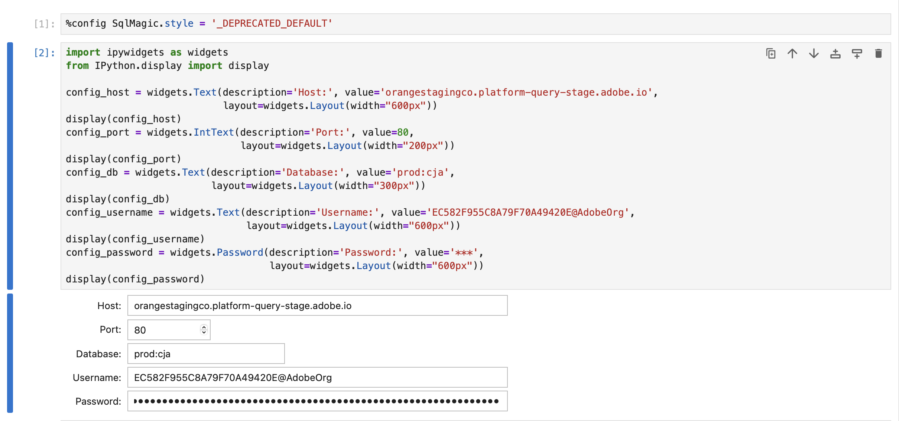

# Anslut och validera


I det här användningsexemplet ställs anslutningen in från BI-verktyget till Customer Journey Analytics, tillgängliga datavyer listas och en datavy väljs som ska användas.

+++ Customer Journey Analytics

Instruktionerna avser en exempelmiljö med följande objekt:

* Datavy: **[!UICONTROL C&C - Data View]** 🅐.
* Dimensioner: **[!UICONTROL Product Name]** 🅑 och **[!UICONTROL Product Category]** 🅒.
* Mått: **[!UICONTROL Purchase Revenue]** 🅓 och **[!UICONTROL Purchases]** 🅔.
* Filter: **[!UICONTROL Fishing Products]** 🅕.


När du går igenom användningsexemplen ersätter du de här exempelobjekten med objekt som passar just din miljö.

+++

+++ BI-verktyg

>[!BEGINTABS]

>[!TAB Power BI Desktop]

1. Få åtkomst till de nödvändiga autentiseringsuppgifterna och parametrarna från användargränssnittet för Experience Platform Query Service.

   1. Navigera till din Experience Platform-sandlåda.
   1. Välj  **[!UICONTROL Queries]** i den vänstra listen.
   1. Välj fliken **[!UICONTROL Credentials]** i gränssnittet **[!UICONTROL Queries]**.
   1. Välj `prod:cja` i listrutan **[!UICONTROL Database]**.

      

1. Starta Power BI Desktop.
   1. Välj **[!UICONTROL Get data from other sources]** i huvudgränssnittet.
   1. I dialogrutan **[!UICONTROL Get Data]**:
      
      1. Sök efter och välj **[!UICONTROL PostgreSQL database]**.
      1. Välj **[!UICONTROL Connect]**.
   1. I dialogrutan **[!UICONTROL PostgreSQL database]**:
      
      1. Använd  om du vill kopiera och klistra in värdena **[!UICONTROL Host]** och **[!UICONTROL Port]** från panelen Experience Platform **[!UICONTROL Query]** **[!UICONTROL Expiring Credentials]**, avgränsade med `:` som värde för **[!UICONTROL Server]**. Till exempel: `examplecompany.platform-query.adobe.io:80`.
      1. Använd  om du vill kopiera och klistra in värdet **[!UICONTROL Database]** från panelen **[!UICONTROL Query]** **[!UICONTROL Expiring Credentials]** i Experience Platform. Lägg till `?FLATTEN` i värdet som du klistrar in. Exempel: `prod:cja?FLATTEN`.
      1. Välj **[!UICONTROL DirectQuery]** som **[!UICONTROL Data connectivity mode]**.
      1. Välj **[!UICONTROL OK]**.
   1. I dialogrutan **[!UICONTROL PostgreSQL database]** - **[!UICONTROL Database]**:
      
      1. Använd  om du vill kopiera värdena **[!UICONTROL Username]** och **[!UICONTROL Password]** från panelen Experience Platform **[!UICONTROL Query]** **[!UICONTROL Expiring Credentials]** i fälten **[!UICONTROL User name]** och **[!UICONTROL Password]**. Om du använder en [icke-förfallande autentiseringsuppgift](https://experienceleague.adobe.com/sv/docs/experience-platform/query/ui/credentials?lang=en#use-credential-to-connect) ska du använda lösenordet för dina icke-förfallande autentiseringsuppgifter.
      1. Kontrollera att listrutan för **[!UICONTROL Select which level to apply these settings to]** är inställd på **[!UICONTROL Server]** som du har definierat tidigare.
      1. Välj **[!UICONTROL Connect]**.
   1. I dialogrutan **[!UICONTROL Navigator]** hämtas datavyer. Den här hämtningen kan ta en stund. När du har hämtat det här ser du följande i Power BI Desktop.
      
      1. Välj **[!UICONTROL public.cc_data_view]** i listan i den vänstra panelen.
      1. Du har två alternativ:
         1. Välj **[!UICONTROL Load]** om du vill fortsätta och slutföra konfigurationen.
         1. Välj **[!UICONTROL Transform Data]**. En dialogruta visas där du kan välja att använda omformningar som en del av konfigurationen.
            
            * Välj **[!UICONTROL Close & Apply]**.
   1. Efter en stund visas **[!UICONTROL public.cc_data_view]** i rutan **[!UICONTROL Data]**. Välj  om du vill visa mått och mått.
      


## Till FLATTEN eller inte

Power BI Desktop stöder följande scenarier för parametern `FLATTEN`. Mer information finns i [Förenkla kapslade data](https://experienceleague.adobe.com/sv/docs/experience-platform/query/key-concepts/flatten-nested-data).

| FLATTEN-parameter | Exempel | Stöds | Anmärkningar |
|---|---|:---:|---|
| Ingen | `prod:cja` |  | |
| `?FLATTEN` | `prod:cja?FLATTEN` |  | **Rekommenderat alternativ att använda!** |
| `%3FFLATTEN` | `prod:cja%3FFLATTEN` |  | Power BI Desktop visar fel: **[!UICONTROL We couldn't authenticate with the credentials provided. Please try again.]** |

### Mer information

* [Förutsättningar](/help/data-views/bi-extension.md#prerequisites)
* [Handbok för autentiseringsuppgifter](https://experienceleague.adobe.com/sv/docs/experience-platform/query/ui/credentials)
* [Anslut Power BI till frågetjänsten](https://experienceleague.adobe.com/sv/docs/experience-platform/query/clients/power-bi).


>[!TAB Skrivbord för Tablet PC]

1. Få åtkomst till de nödvändiga autentiseringsuppgifterna och parametrarna från användargränssnittet för Experience Platform Query Service.

   1. Navigera till din Experience Platform-sandlåda.
   1. Välj  **[!UICONTROL Queries]** i den vänstra listen.
   1. Välj fliken **[!UICONTROL Credentials]** i gränssnittet **[!UICONTROL Queries]**.
   1. Välj `prod:cja` i listrutan **[!UICONTROL Database]**.

      

1. Starta Tableu.
   1. Välj **[!UICONTROL PostgreSQL]** från den vänstra listen under **[!UICONTROL To a Server]**. Om den inte är tillgänglig väljer du **[!UICONTROL More...]** och väljer **[!UICONTROL PostgreSQL]** i **[!UICONTROL Installed Connectors]**.
      
   1. I dialogrutan **[!UICONTROL PostgreSQL]** går du till fliken **[!UICONTROL General]**:
      
      1. Använd  för att kopiera och klistra in **[!UICONTROL Host]** från Experience Platform **[!UICONTROL Query]** **[!UICONTROL Expiring Credentials]**-panelen till **[!UICONTROL Server]**.
      1. Använd  för att kopiera och klistra in **[!UICONTROL Port]** från Experience Platform **[!UICONTROL Query]** **[!UICONTROL Expiring Credentials]**-panelen till **[!UICONTROL Port]**.
      1. Använd  för att kopiera och klistra in **[!UICONTROL Database]** från Experience Platform **[!UICONTROL Query]** **[!UICONTROL Expiring Credentials]**-panelen till **[!UICONTROL Database]**. Lägg till `%3FFLATTEN` i värdet som du klistrar in. Till exempel: `prod:cja%3FFLATTEN`.
      1. Välj **[!UICONTROL Username and Password]** i listrutan **[!UICONTROL Authentication]**.
      1. Använd  för att kopiera och klistra in **[!UICONTROL Username]** från Experience Platform **[!UICONTROL Query]** **[!UICONTROL Expiring Credentials]**-panelen till **[!UICONTROL Username]**.
      1. Använd  för att kopiera och klistra in **[!UICONTROL Password]** från Experience Platform **[!UICONTROL Query]** **[!UICONTROL Expiring Credentials]**-panelen till **[!UICONTROL Password]**. Om du använder en [icke-förfallande autentiseringsuppgift](https://experienceleague.adobe.com/sv/docs/experience-platform/query/ui/credentials?lang=en#use-credential-to-connect) ska du använda lösenordet för dina icke-förfallande autentiseringsuppgifter.
      1. Kontrollera att **[!UICONTROL Require SSL]** är markerad.
      1. Välj **[!UICONTROL Sign In]**.

      Du ser en **[!UICONTROL Progressing Request]**-dialogruta medan Skrivbord på Tablet PC verifierar anslutningen.
   1. I huvudfönstret visas på sidan **[!UICONTROL Data Source]** i den vänstra rutan:
      * Namnet på anslutningen, under **[!UICONTROL Connections]**.
      * Namnet på databasen, under **[!UICONTROL Database]**.
      * En lista med tabeller, under **[!UICONTROL Table]**.
        
      1. Dra **[!UICONTROL cc_data_view]**-posten och släpp posten i huvudvyn som läser **[!UICONTROL Drag tables]** här.
   1. I huvudfönstret visas information om datavyn **[!UICONTROL cc_data_view]**.
      

## Till FLATTEN eller inte

Tableu Desktop stöder följande scenarier för parametern `FLATTEN`. Mer information finns i [Förenkla kapslade data](https://experienceleague.adobe.com/sv/docs/experience-platform/query/key-concepts/flatten-nested-data).

| FLATTEN-parameter | Exempel | Stöds | Anmärkningar |
|---|---|:---:|---|
| Ingen | `prod:cja` |  | |
| `?FLATTEN` | `prod:cja?FLATTEN` |  | |
| `%3FFLATTEN` | `prod:cja%3FFLATTEN` |  | **Rekommenderat alternativ för**. Obs! `%3FFLATTEN` är en URL-kodad version av `?FLATTEN`. |

## Mer information

* [Förutsättningar](/help/data-views/bi-extension.md#prerequisites)
* [Handbok för autentiseringsuppgifter](https://experienceleague.adobe.com/sv/docs/experience-platform/query/ui/credentials)
* [Anslut skrivbordet till frågetjänsten](https://experienceleague.adobe.com/sv/docs/experience-platform/query/clients/tableau).


>[!TAB Sökare]

1. Få åtkomst till de nödvändiga autentiseringsuppgifterna och parametrarna från användargränssnittet för Experience Platform Query Service.

   1. Navigera till din Experience Platform-sandlåda.
   1. Välj  **[!UICONTROL Queries]** i den vänstra listen.
   1. Välj fliken **[!UICONTROL Credentials]** i gränssnittet **[!UICONTROL Queries]**.
   1. Välj `prod:cja` i listrutan **[!UICONTROL Database]**.

      

1. Logga in på Looker

   1. Välj **[!UICONTROL Admin]** i den vänstra listen.
   1. Välj **[!UICONTROL Connections]**.
   1. Välj **[!UICONTROL Add Connection]**.
   1. I **[!UICONTROL Connect your database to Looker screen]**.

      

      1. Ange en **[!UICONTROL Name]** för din anslutning, till exempel `Example Looker Connection`.
      1. Kontrollera att **[!UICONTROL All Projects]** är markerat som **[!UICONTROL Connection Scope]**.
      1. Välj **[!UICONTROL PostgreSQL 9.5+]** som dialekt.
      1. Använd  om du vill kopiera och klistra in värdet **[!UICONTROL Host]** från panelen Experience Platform **[!UICONTROL Query]** **[!UICONTROL Expiring Credentials]** som värde för **[!UICONTROL Host]**. Till exempel: `examplecompany.platform-query.adobe.io`.
      1. Använd  om du vill kopiera och klistra in värdet **[!UICONTROL Port]** från panelen Experience Platform **[!UICONTROL Query]** **[!UICONTROL Expiring Credentials]** som värde för **[!UICONTROL Port]**. Till exempel: `80`.
      1. Använd  om du vill kopiera och klistra in värdet **[!UICONTROL Database]** från panelen Experience Platform **[!UICONTROL Query]** **[!UICONTROL Expiring Credentials]** som värde för **[!UICONTROL Database]**. Lägg till `%3FFLATTEN` i värdet som du klistrar in. Exempel: `prod:cja%3FFLATTEN`.
      1. Använd  om du vill kopiera och klistra in värdet **[!UICONTROL Username]** från panelen Experience Platform **[!UICONTROL Query]** **[!UICONTROL Expiring Credentials]** som värde för **[!UICONTROL Username]**.
      1. Använd  om du vill kopiera och klistra in värdet **[!UICONTROL Password]** från panelen Experience Platform **[!UICONTROL Query]** **[!UICONTROL Expiring Credentials]** som värde för **[!UICONTROL Password]**.
      1. Välj **[!UICONTROL Expand all]** vid **[!UICONTROL Optional Settings]**.
      1. Ange **[!UICONTROL Max connections]** per nod till `5`.
      1. Kontrollera att **[!UICONTROL SSL]** är aktiverat.
      1. Välj **[!UICONTROL Test]** om du vill testa anslutningen. En banderoll visas högst upp på skärmen med ett meddelande som **[!UICONTROL Success, can connect JDBC ....]**.
      1. Välj **[!UICONTROL Connect]** om du vill upprätta och spara anslutningen.
   1. Den nya anslutningen visas i gränssnittet **[!UICONTROL Connections]**.
   1. Välj **¥** från **[!UICONTROL Admin]** om du vill gå till huvudnavigeringen i den vänstra listen.
   1. Välj **[!UICONTROL Develop]**.
   1. Välj **[!UICONTROL Projects]**.
   1. Välj **[!UICONTROL New Model]** i LookML-projekt.
   1. För att vara säker på att du inte påverkar andra användare. Välj Ange utvecklingsläge när du uppmanas till det.
   1. I **[!UICONTROL Create Model]**-upplevelsen:
      1. I **[!UICONTROL ➊ Select Database Connection]**:
         1. Välj din databasanslutning i **[!UICONTROL Select database connection]**. Till exempel: **[!UICONTROL example_looker_connection]**.
         1. Namnge projektet i **[!UICONTROL Create a new LookML Project for this model]**. För `example: example_looker_project`.
         1. Välj **[!UICONTROL Next]**.
      1. I **[!UICONTROL ➋ Select Tables]**:
         1. Välj **[!UICONTROL public]** och kontrollera sedan att datavyn för Customer Journey Analytics är markerad. Till exempel:  **[!UICONTROL cc_data_view]**.
         1. Välj **[!UICONTROL Next]**.
      1. I **[!UICONTROL ➌ Select Primary Keys]**:
         1. Välj **[!UICONTROL Next]**.
      1. I **[!UICONTROL ➍ Select Explores to Create]**:
         1. Se till att du väljer vyn. Till exempel: **[!UICONTROL cc_data_view.view]**.
         1. Välj **[!UICONTROL Next]**.
      1. I **[!UICONTROL ➎ Enter Model Name]**:
         1. Ge modellen ett namn. Till exempel: `example_looker_model`.
      1. Välj **[!UICONTROL Complete and Explore Data]**.

   Du omdirigeras till **[!UICONTROL Explore]**-gränssnittet för Looker, redo att utforska data.


## Till FLATTEN eller inte

Looker stöder följande scenarier för parametern `FLATTEN`. Mer information finns i [Förenkla kapslade data](https://experienceleague.adobe.com/sv/docs/experience-platform/query/key-concepts/flatten-nested-data).

| FLATTEN-parameter | Exempel | Stöds | Anmärkningar |
|---|---|:---:|---|
| Ingen | `prod:cja` |  | |
| `?FLATTEN` | `prod:cja?FLATTEN` |  | |
| `%3FFLATTEN` | `prod:cja%3FFLATTEN` |  | **Rekommenderat alternativ för**. Obs! `%3FFLATTEN` är en URL-kodad version av `?FLATTEN`. |

## Mer information

* [Förutsättningar](/help/data-views/bi-extension.md#prerequisites)
* [Handbok för autentiseringsuppgifter](https://experienceleague.adobe.com/sv/docs/experience-platform/query/ui/credentials)


>[!TAB Jupyter-anteckningsbok]

1. Få åtkomst till de nödvändiga autentiseringsuppgifterna och parametrarna från användargränssnittet för Experience Platform Query Service.

   1. Navigera till din Experience Platform-sandlåda.
   1. Välj  **[!UICONTROL Queries]** i den vänstra listen.
   1. Välj fliken **[!UICONTROL Credentials]** i gränssnittet **[!UICONTROL Queries]**.
   1. Välj `prod:cja` i listrutan **[!UICONTROL Database]**.

      

1. Kontrollera att du har konfigurerat en dedikerad virtuell Python-miljö för att köra din Jupyter-miljö för bärbara datorer.
1. Kontrollera att du har installerat de nödvändiga biblioteken i din virtuella miljö:
   * ipytonsql: `pip install ipython-sql`.
   * psykopg2-binär: `pip install psycopg-binary`.
   * sqlalchemy: pip `install sqlalchemy`.

1. Starta Jupyter-anteckningsbok från din virtuella miljö: `jupyter notebook`.
1. Skapa en ny anteckningsbok eller hämta [den här exempelanteckningsboken](../assets/BI-Extension.ipynb.zip).
1. I den första cellen anger och kör du:

   ```
   %config SqlMagic.style = '_DEPRECATED_DEFAULT'
   ```

1. Ange konfigurationsparametrarna för anslutningen i en ny cell. Använd  om du vill kopiera och klistra in värden från panelen Experience Platform **[!UICONTROL Query]** **[!UICONTROL Expiring Credentials]** till de värden som krävs för konfigurationsparametrarna. Exempel:

   ```
   import ipywidgets as widgets
   from IPython.display import display
   
   config_host = widgets.Text(description='Host:', value='example.platform-query-stage.adobe.io',
                           layout=widgets.Layout(width="600px"))
   display(config_host)
   config_port = widgets.IntText(description='Port:', value=80,
                              layout=widgets.Layout(width="200px"))
   display(config_port)
   config_db = widgets.Text(description='Database:', value='prod:cja',
                         layout=widgets.Layout(width="300px"))
   display(config_db)
   config_username = widgets.Text(description='Username:', value='EC582F955C8A79F70A49420E@AdobeOrg',
                               layout=widgets.Layout(width="600px"))
   display(config_username)
   config_password = widgets.Password(description='Password:', value='***',
                                   layout=widgets.Layout(width="600px"))
   display(config_password)
   ```

1. Kör cellen.
1. Använd  för att kopiera och klistra in lösenordet från panelen Experience Platform **[!UICONTROL Query]** **[!UICONTROL Expiring Credentials]** till fältet **[!UICONTROL Password]** i Jupyter Notebook.

   

1. I en ny cell anger du programsatserna för att läsa in SQL-tillägget, det bibliotek som krävs och ansluta till Customer Journey Analytics.

   ```python
   %load_ext sql
   from sqlalchemy import create_engine
   %sql postgresql://{config_username.value}:{config_password.value}@{config_host.value}:{config_port.value}/{config_db.value}?sslmode=require
   ```

   Kör skalet. Du ska inte se några utdata, men cellen ska köras utan någon varning.

   

1. I ett nytt anrop anger du programsatserna för att få en lista över tillgängliga datavyer baserade på anslutningen.

   ```python
   %%sql
   SELECT n.nspname as "Schema",
      c.relname as "Name",
      CASE c.relkind WHEN 'r' THEN 'table' WHEN 'v' THEN 'view' WHEN 'm' THEN 'materialized view' WHEN 'i' THEN 'index' WHEN 'S' THEN 'sequence' WHEN 's' THEN 'special' WHEN 't' THEN 'TOAST table' WHEN 'f' THEN 'foreign table' WHEN 'p' THEN 'partitioned table' WHEN 'I' THEN 'partitioned index' END as "Type",
      pg_catalog.pg_get_userbyid(c.relowner) as "Owner"
   FROM pg_catalog.pg_class c
   LEFT JOIN pg_catalog.pg_namespace n ON n.oid = c.relnamespace
   WHERE c.relkind IN ('v','')
      AND n.nspname <> 'pg_catalog'
      AND n.nspname !~ '^pg_toast'
      AND n.nspname <> 'information_schema'
      AND pg_catalog.pg_table_is_visible(c.oid)
      AND c.relname NOT LIKE '%test%'
      AND c.relname NOT LIKE '%ajo%'
   ORDER BY 1,2;
   ```

   Kör skalet. Du bör se utdatamodeller som liknar skärmbilden nedan.

    för anteckningsbok för jupyter

   Du bör se **[!UICONTROL cc_data_view]** i listan med datavyer.

## Till FLATTEN eller inte

Jupyter Notebook stöder följande scenarier för parametern `FLATTEN`. Mer information finns i [Förenkla kapslade data](https://experienceleague.adobe.com/sv/docs/experience-platform/query/key-concepts/flatten-nested-data).

| FLATTEN-parameter | Exempel | Stöds | Anmärkningar |
|---|---|:---:|---|
| Ingen | `prod:cja` |  | |
| `?FLATTEN` | `prod:cja?FLATTEN` |  | |
| `%3FFLATTEN` | `prod:cja%3FFLATTEN` |  | **Rekommenderat alternativ för**. Obs! `%3FFLATTEN` är en URL-kodad version av `?FLATTEN`. |

## Mer information

* [Förutsättningar](/help/data-views/bi-extension.md#prerequisites)
* [Handbok för autentiseringsuppgifter](https://experienceleague.adobe.com/sv/docs/experience-platform/query/ui/credentials)

>[!TAB RStudio]

1. Få åtkomst till de nödvändiga autentiseringsuppgifterna och parametrarna från användargränssnittet för Experience Platform Query Service.

   1. Navigera till din Experience Platform-sandlåda.
   1. Välj  **[!UICONTROL Queries]** i den vänstra listen.
   1. Välj fliken **[!UICONTROL Credentials]** i gränssnittet **[!UICONTROL Queries]**.
   1. Välj `prod:cja` i listrutan **[!UICONTROL Database]**.

      

1. Starta RStudio.
1. Skapa en ny R Markdown-fil eller hämta [det här exemplet på R-markeringsfil](../assets/BI-Extension.Rmd.zip).
1. I ditt första segment anger du följande programsatser mellan ` ` ``{r} ` och ` `` ` `. Använd  om du vill kopiera och klistra in värden från panelen Experience Platform **[!UICONTROL Query]** **[!UICONTROL Expiring Credentials]** till de värden som krävs för de olika parametrarna, till exempel `host`, `dbname` och `user`. Exempel:

   ```R
   library(rstudioapi)
   library(DBI)
   library(dplyr)
   library(tidyr)
   library(RPostgres)
   library(ggplot2)
   
   host <- rstudioapi::showPrompt(title = "Host", message = "Host", default = "orangestagingco.platform-query-stage.adobe.io")
   dbname <- rstudioapi::showPrompt(title = "Database", message = "Database", default = "prod:cja?FLATTEN")
   user <- rstudioapi::showPrompt(title = "Username", message = "Username", default = "EC582F955C8A79F70A49420E@AdobeOrg")
   password <- rstudioapi::askForPassword(prompt = "Password")
   ```

1. Kör segmentet. Du uppmanas att ange **[!UICONTROL Host]**, **[!UICONTROL Database]** och **[!UICONTROL User]**. Acceptera bara de värden du har angett som en del av föregående steg.
1. Använd  om du vill kopiera och klistra in lösenordet från panelen Experience Platform **[!UICONTROL Query]** **[!UICONTROL Expiring Credentials]** till dialogrutan **[!UICONTROL Password]** i RStudio.

   

1. Skapa ett nytt segment och ange följande programsatser mellan ` ` `` {r} ` och ` `` ` `.

   ```R
   con <- dbConnect(
      RPostgres::Postgres(),
      host = host,
      port = 80,
      dbname = dbname,
      user = user,
      password = password,
      sslmode = 'require'
   )
   ```

1. Kör segmentet. Du bör inte se några utdata om anslutningen lyckas.


1. Skapa ett nytt segment och ange följande programsatser mellan ` ` `` {r} ` och ` `` ` `.

   ```R
   views <- dbListTables(con)
   print(views)
   ```

1. Kör segmentet. Du bör se `character(0)` som den enda utdatafilen.


1. Skapa ett nytt segment och ange följande programsatser mellan ` ` `` {r} ` och ` `` ` `.

   ```R
   glimpse(dv)
   ```

1. Kör segmentet. Du bör se utdatamodeller som liknar skärmbilden nedan.

   

## Till FLATTEN eller inte

RStudio stöder följande scenarier för parametern `FLATTEN`. Mer information finns i [Förenkla kapslade data](https://experienceleague.adobe.com/sv/docs/experience-platform/query/key-concepts/flatten-nested-data).

| FLATTEN-parameter | Exempel | Stöds | Anmärkningar |
|---|---|:---:|---|
| Ingen | `prod:cja` |  | |
| `?FLATTEN` | `prod:cja?FLATTEN` |  | **Rekommenderat alternativ för**. |
| `%3FFLATTEN` | `prod:cja%3FFLATTEN` |  | |

## Mer information

* [Förutsättningar](/help/data-views/bi-extension.md#prerequisites)
* [Handbok för autentiseringsuppgifter](https://experienceleague.adobe.com/sv/docs/experience-platform/query/ui/credentials)

>[!ENDTABS]

+++
