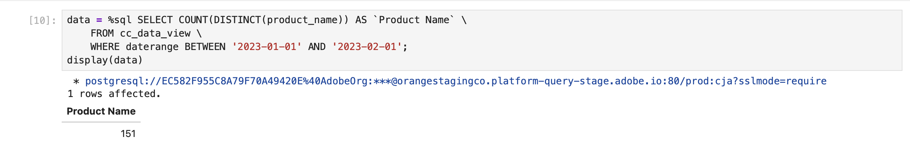

# Räkna distinkta värdedimensioner


I det här fallet vill du ha det tydliga antalet produktnamn som rapporterades i januari 2023.

+++ Customer Journey Analytics

Om du vill rapportera ett distinkt antal produktnamn anger du ett beräknat mått i Customer Journey Analytics, med **[!UICONTROL Title]** `Product Name (Count Distinct)` och **[!UICONTROL External Id]** `product_name_count_distinct`.


Du kan sedan använda det måttet i en **[!UICONTROL Count Distinct Dimension Values]**-panel för följande användningsfall:


+++

+++ BI-verktyg

>[!PREREQUISITES]
>
>Kontrollera att du har verifierat [en lyckad anslutning, kan visa datavyer och använda en datavy](connect-and-validate.md) för BI-verktyget som du vill testa det här användningsfallet för.
>

>[!BEGINTABS]

>[!TAB Power BI Desktop]

1. Om du vill vara säker på att datumintervallet gäller för alla visualiseringar drar och släpper du **[!UICONTROL daterangeday]** från rutan **[!UICONTROL Data]** till **[!UICONTROL Filters]** på den här sidan.
   1. Välj **[!UICONTROL daterangeday is (All)]** från **[!UICONTROL Filters on this page]**.
   1. Välj **[!UICONTROL Advanced filtering]** som **[!UICONTROL Filter type]**.
   1. Definiera filtret för **[!UICONTROL Show items when the value]** **[!UICONTROL is on or after]** `1/1/2023` **[!UICONTROL And]** **[!UICONTROL is before]** `2/1/2023`.
   1. Välj **[!UICONTROL Apply filter]**.

1. I rutan **[!UICONTROL Data]**:
   1. Välj **[!UICONTROL datarangeday]**.
   1. Välj **[!UICONTROL sum cm_product_name_count_distinct]**, som är det beräknade måttet som definieras i Customer Journey Analytics.

1. Om du vill ändra det lodräta stapeldiagrammet till en tabell kontrollerar du att diagrammet är markerat och väljer **[!UICONTROL Table]** i rutan **[!UICONTROL Visualizations]**.

   Ditt Power BI-skrivbord ska se ut så här nedan.

   

1. Välj tabellvisualisering. Välj **[!UICONTROL Copy]** > **[!UICONTROL Copy visual]** på snabbmenyn.
1. Klistra in visualiseringen med **[!UICONTROL ctrl-v]**. Den exakta kopian av visualiseringen överlappar den ursprungliga. Flytta den åt höger i rapportområdet.
1. Om du vill ändra den kopierade visualiseringen från en tabell till ett kort väljer du **[!UICONTROL Card]** från **[!UICONTROL Visualizations]**.

   Ditt Power BI-skrivbord ska se ut så här nedan.

   

Du kan också använda funktionen för antal som skiljer sig från Power BI.

1. Välj dimensionen **[!UICONTROL product_name]**.
1. Använd funktionen **[!UICONTROL Count (Distinct)]** på dimensionen **[!UICONTROL product_name]** i **[!UICONTROL Columns]**.

   


>[!TAB Skrivbord för Tablet PC]

1. Välj fliken **[!UICONTROL Sheet 1]** längst ned om du vill växla från **[!UICONTROL Data source]**. I vyn **[!UICONTROL Sheet 1]**:
   1. Dra posten **[!UICONTROL Daterange]** från listan **[!UICONTROL Tables]** i rutan **[!UICONTROL Data]** och släpp posten på hyllan **[!UICONTROL Filters]**.
   1. I dialogrutan **[!UICONTROL Filter Field \[Daterange\]]** väljer du **[!UICONTROL Range of Dates]** och sedan **[!UICONTROL Next >]**.
   1. I dialogrutan **[!UICONTROL Filter \[Daterange\]]** väljer du **[!UICONTROL Range of dates]** och sedan `01/01/2023` - `31/1/2023`. Välj **[!UICONTROL Apply]** och **[!UICONTROL OK]**.
   1. Dra **[!UICONTROL Cm Product Name Count Distinct]** till **[!UICONTROL Rows]**. Värdet ändras till **[!UICONTROL SUM(Cm Product Name Count Distinct)]**. Det här fältet är det beräknade mått som du har definierat i Customer Journey Analytics.
   1. Dra **[!UICONTROL Daterangeday]** och släpp intill **[!UICONTROL Columns]**. Välj **[!UICONTROL Daterangeday]** och välj **[!UICONTROL Day]** i listrutan.
   1. Om du vill ändra radinvisualiseringen till en tabell väljer du **[!UICONTROL Text Table]** från **[!UICONTROL Show Me]**.
   1. Välj **[!UICONTROL Swap Rows and Columns]** i verktygsfältet.
   1. Välj **[!UICONTROL Fit Width]** i listrutan **[!UICONTROL Fit]**.

      Ditt skrivbord ska se ut så här nedan.

      

1. Välj **[!UICONTROL Duplicate]** på snabbmenyn på fliken **[!UICONTROL Sheet 1]** om du vill skapa ett andra blad.
1. Välj **[!UICONTROL Rename]** på snabbmenyn på fliken **[!UICONTROL Sheet 1]** om du vill byta namn på bladet till `Data`.
1. Välj **[!UICONTROL Rename]** på snabbmenyn på fliken **[!UICONTROL Sheet 1 (2)]** om du vill byta namn på bladet till `Card`.

1. Kontrollera att du har valt vyn **[!UICONTROL Card]**.
1. Välj **[!UICONTROL DAY(Daterangeday)]** och välj **[!UICONTROL Month]** i listrutan. Värdet ändras till **[!UICONTROL MONTH(Daterangeday)]**.
1. Välj **[!UICONTROL SUM(Cm Product Name Count Distinct)]** i **[!UICONTROL Marks]** och välj **[!UICONTROL Format]** i listrutan.
1. Om du vill ändra teckenstorleken väljer du **[!UICONTROL Format SUM(CM Product Name Count Distinct)]** i **[!UICONTROL Font]** i rutan **[!UICONTROL Default]** och väljer **[!UICONTROL 72]** som teckenstorlek.
1. Om du vill justera talet väljer du **[!UICONTROL Automatic]** bredvid **[!UICONTROL Alignment]** och anger **[!UICONTROL Horizontal]** till centrerad.
1. Om du vill använda heltal markerar du **[!UICONTROL 123.456]** bredvid **[!UICONTROL Numbers]** och väljer **[!UICONTROL Number (Custom)]**. Ange **[!UICONTROL Decimal places]** till `0`.

   Ditt skrivbord ska se ut så här nedan.

   

1. Skapa en ny **[!UICONTROL New Dashboard]**-vy genom att klicka på tabbknappen **[!UICONTROL Dashboard 1]** (längst ned). I vyn **[!UICONTROL Dashboard 1]**:
   1. Dra och släpp **[!UICONTROL Card]**-bladet från **[!UICONTROL Sheets]**-hyllan till **[!UICONTROL Dashboard 1]**-vyn som läser *Drop sheets här*.
   1. Dra och släpp **[!UICONTROL Data]**-bladet från **[!UICONTROL Sheets]**-hyllan under **[!UICONTROL Card]**-bladet i vyn **[!UICONTROL Dashboard 1]**.

   **[!UICONTROL Dashboard 1]**-vyn ska se ut så här nedan.

   


Du kan också använda funktionen för att räkna distinkt från skrivbordet i Tableu.

1. Använd **[!UICONTROL Product Name]** i stället för **[!UICONTROL Cm Product Name Count Distinct]**.
1. Använd **[!UICONTROL Measure]** > **[!UICONTROL Count (Distinct)]** på **[!UICONTROL Product Name]** i **[!UICONTROL Marks]**.

   


>[!TAB Sökare]

1. Kontrollera att du har en ren konfiguration i gränssnittet **[!UICONTROL Explore]** för Looker. Om inte väljer du  **[!UICONTROL Remove fields and filters]**.
1. Välj **[!UICONTROL + Filter]** under **[!UICONTROL Filters]**.
1. I dialogrutan **[!UICONTROL Add Filter]**:
   1. Välj **[!UICONTROL ‣ Cc Data View]**
   1. Välj **[!UICONTROL ‣ Daterange Date]** och sedan **[!UICONTROL Daterange Date]** i listan med fält.
      
1. Ange filtret **[!UICONTROL Cc Data View Daterange Date]** som **[!UICONTROL is in range]** **[!UICONTROL 2023/01/01]** **[!UICONTROL until (before)]** **[!UICONTROL 2023/02/01]**.
1. Från avsnittet **[!UICONTROL ‣ Cc Data View]** i den vänstra listen:
   1. Välj **[!UICONTROL Daterange Date]** och sedan **[!UICONTROL Date]**.
   1. Välj **[!UICONTROL Aggregate ‣ Count Distinct]** på snabbmenyn **⋮ mer** på **[!UICONTROL Product Name]**.
      
1. Välj **[!UICONTROL Run]**.
1. Välj **[!UICONTROL ‣ Visualization]** och välj 6︎⃣ i verktygsfältet för att visa visualisering av ett enstaka värde.

En visualisering och en tabell som liknar den visas nedan.


>[!TAB Jupyter-anteckningsbok]

1. Ange följande satser i en ny cell.

   ```
   data = %sql SELECT COUNT(DISTINCT(product_name)) AS `Product Name` \
      FROM cc_data_view \
      WHERE daterange BETWEEN '2023-01-01' AND '2023-02-01';
   display(data)
   ```

1. Kör cellen. Du bör se utdata som liknar skärmbilden nedan.

   


>[!TAB RStudio]

1. Ange följande programsatser mellan ` ` ``{r} ` och ` `` ` ` i ett nytt segment.

   ```R
   ## Count Distinct
   df <- dv %>%
      filter(daterange >= "2023-01-01" & daterange < "2023-02-01") %>%
      summarise(product_name_count_distinct = n_distinct(product_name))
   print(df)
   ```

1. Kör segmentet. Du bör se utdata som liknar skärmbilden nedan.

   


>[!ENDTABS]

+++

