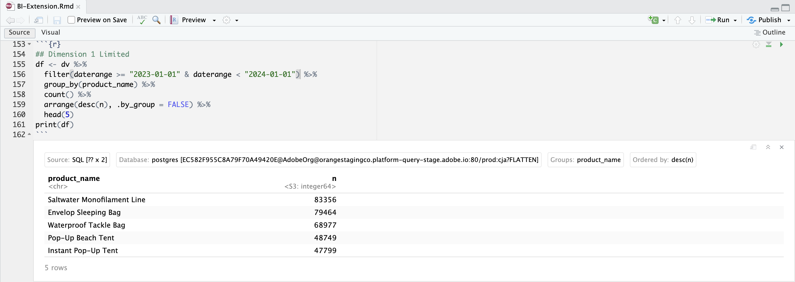

# Gränser


I det här fallet vill du rapportera de fem vanligaste förekomsterna av produktnamn under 2023.

+++ Customer Journey Analytics

Ett exempel på **[!UICONTROL Limit]**-panel för användningsfallet:


+++

+++ BI-verktyg

>[!PREREQUISITES]
>
>Kontrollera att du har verifierat [en lyckad anslutning, kan visa datavyer och använda en datavy](connect-and-validate.md) för BI-verktyget som du vill testa det här användningsfallet för.
>

>[!BEGINTABS]

>[!TAB Power BI Desktop]

1. I rutan **[!UICONTROL Data]**:
   1. Välj **[!UICONTROL daterange]**.
   1. Välj **[!UICONTROL product_name]**.
   1. Välj **[!UICONTROL sum occurrences]**.

1. I rutan **[!UICONTROL Filters]**:
   1. Välj **[!UICONTROL daterange is (All)]** från **[!UICONTROL Filters on this visual]**.
   1. Välj **[!UICONTROL Relative date]** som **[!UICONTROL Filter type]**.
   1. Definiera filtret för **[!UICONTROL Show items when the value]** **[!UICONTROL is in the last]** `1` **[!UICONTROL calendar years]**.
   1. Välj **[!UICONTROL Apply filter]**.
   1. Välj **[!UICONTROL product_name is (All)]** från **[!UICONTROL Filters on this visual]**.
   1. Välj **[!UICONTROL Top N]** som **[!UICONTROL Filter type]**.
   1. Välj **[!UICONTROL Show Items]** **[!UICONTROL Top]** `5` **[!UICONTROL By value]**.
   1. Dra och släpp **[!UICONTROL sum occurrences]** från rutan **[!UICONTROL Data]** och släpp den på **[!UICONTROL Add data fields here]**.
   1. Välj **[!UICONTROL Apply filter]**.

1. I visualiseringsfönstret:
   * Välj  om du vill ta bort daterange från kolumner.

   Ditt Power BI-skrivbord ska se ut så här nedan.

   

Frågan som körs av Power BI Desktop med BI-tillägget innehåller en `limit`-sats, men inte den som förväntades. Gränsen för de fem högsta förekomsterna tillämpas av Power BI Desktop med explicit produktnamnsresultat.

```sql
select "_"."product_name",
    "_"."a0"
from 
(
    select "rows"."product_name" as "product_name",
        sum("rows"."occurrences") as "a0"
    from 
    (
        select "_"."daterangeName",
            "_"."daterange",
            "_"."filterId",
            "_"."filterName",
            "_"."timestamp",
            "_"."affiliate_name",
            "_"."affiliate_url",
            "_"."commerce.order.priceTotal",
            "_"."customer_city",
            "_"."customer_region",
            "_"."daterangeday",
            "_"."daterangefifteenminute",
            "_"."daterangefiveminute",
            "_"."daterangehour",
            "_"."daterangeminute",
            "_"."daterangemonth",
            "_"."daterangequarter",
            "_"."daterangesecond",
            "_"."daterangethirtyminute",
            "_"."daterangeweek",
            "_"."daterangeyear",
            "_"."hitdatetime",
            "_"."page_name",
            "_"."page_url",
            "_"."product_category",
            "_"."product_name",
            "_"."product_short_review",
            "_"."product_subCategory",
            "_"."referrer_url",
            "_"."search_engine",
            "_"."search_keywords",
            "_"."store_city",
            "_"."store_name",
            "_"."store_region",
            "_"."store_type",
            "_"."timepartdayofmonth",
            "_"."timepartdayofweek",
            "_"."timepartdayofyear",
            "_"."timeparthourofday",
            "_"."timepartminuteofhour",
            "_"."timepartmonthofyear",
            "_"."timepartquarterofyear",
            "_"."timepartweekofyear",
            "_"."cm_session_end_rate_defaultmetric",
            "_"."cm_session_person_defaultmetric",
            "_"."cm_session_start_rate_defaultmetric",
            "_"."cm_timespent_person_defaultmetric",
            "_"."cm_timespent_session_defaultmetric",
            "_"."cm_product_name_count_distinct",
            "_"."ad_views",
            "_"."adobe_sessionends",
            "_"."adobe_sessionstarts",
            "_"."adobe_timespent",
            "_"."exchange_buybacks",
            "_"."exchange_cost",
            "_"."exchange_purchases",
            "_"."exchange_revenue",
            "_"."occurrences",
            "_"."page_views",
            "_"."product_quantity",
            "_"."product_reviews",
            "_"."product_views",
            "_"."purchase_revenue",
            "_"."purchases",
            "_"."visitors",
            "_"."visits"
        from "public"."cc_data_view" "_"
        where (("_"."product_name" in ('Saltwater Monofilament Line', 'Pop-Up Beach Tent', 'Instant Pop-Up Tent', 'Envelop Sleeping Bag', 'Waterproof Tackle Bag')) and "_"."daterange" < date '2024-01-01') and "_"."daterange" >= date '2023-01-01'
    ) "rows"
    group by "product_name"
) "_"
where not "_"."a0" is null
limit 1000001
```

>[!TAB Skrivbord för Tablet PC]

1. Välj fliken **[!UICONTROL Sheet 1]** längst ned om du vill växla från **[!UICONTROL Data source]**. I vyn **[!UICONTROL Sheet 1]**:
   1. Dra **[!UICONTROL Daterange]**-posten från listan **[!UICONTROL Tables]** i hyllan **[!UICONTROL Filters]**.
   1. I dialogrutan **[!UICONTROL Filter Field \[Daterange\]]** väljer du **[!UICONTROL Range of Dates]** och sedan **[!UICONTROL Next >]**.
   1. I dialogrutan **[!UICONTROL Filter \[Daterange\]]** väljer du **[!UICONTROL Relative dates]**, väljer **[!UICONTROL Years]** och sedan **[!UICONTROL Previous years]**. Välj **[!UICONTROL Apply]** och **[!UICONTROL OK]**.
   1. Dra **[!UICONTROL Product Name]** från listan **[!UICONTROL Tables]** till **[!UICONTROL Rows]**.
   1. Dra **[!UICONTROL Occurrences]**-posten från listan **[!UICONTROL Tables]** och släpp posten i fältet intill **[!UICONTROL Columns]**. Värdet ändras till **[!UICONTROL SUM(Occurrences)]**.
   1. Välj **[!UICONTROL Text Table]** från **[!UICONTROL Show Me]**.
   1. Välj **[!UICONTROL Fit Width]** i listrutan **[!UICONTROL Fit]**.
   1. Välj **[!UICONTROL Product Name]** i **[!UICONTROL Rows]**. Välj **[!UICONTROL Filter]** i listrutan.
      1. Välj fliken **[!UICONTROL Filter \[Product Name\]]** i dialogrutan **[!UICONTROL Top]**.
      1. Välj **[!UICONTROL By field:]** **[!UICONTROL Top]** `5` **[!UICONTROL by Occurrences]** **[!UICONTROL Sum]**.
      1. Välj **[!UICONTROL Apply]** och **[!UICONTROL OK]**.

          Tabellen försvinner. Att välja de fem främsta produktnamnen efter förekomster fungerar **inte** korrekt med det här filtret.
      1. Välj **[!UICONTROL Product Name]** i **[!UICONTROL Filter]**-hyllan och välj **[!UICONTROL Remove]** i listrutan. Tabellen visas igen.
   1. Välj **[!UICONTROL SUM(Occurrences)]** i **[!UICONTROL Marks]**-hyllan. Välj **[!UICONTROL Filter]** i listrutan.
      1. Välj **[!UICONTROL Filter \[Occurrences\]]** i dialogrutan **[!UICONTROL At least]**.
      1. Ange `47.799` som värde. Detta värde garanterar att endast de fem översta objekten visas i tabellen. Välj **[!UICONTROL Apply]** och **[!UICONTROL OK]**.

         Ditt skrivbord ska se ut så här nedan.

         

Som framgår ovan misslyckas den här frågan som körs av Tableau Desktop när du definierar ett Top 5 instances-filter på produktnamn.

```sql
SELECT CAST("cc_data_view"."product_name" AS TEXT) AS "product_name",
  SUM("cc_data_view"."occurrences") AS "sum:occurrences:ok"
FROM "public"."cc_data_view" "cc_data_view"
  INNER JOIN (
  SELECT CAST("cc_data_view"."product_name" AS TEXT) AS "product_name",
    SUM("cc_data_view"."occurrences") AS "$__alias__0"
  FROM "public"."cc_data_view" "cc_data_view"
  GROUP BY 1
  ORDER BY 2 DESC,
    1 ASC
  LIMIT 5
) "t0" ON (CAST("cc_data_view"."product_name" AS TEXT) = "t0"."product_name")
WHERE (("cc_data_view"."daterange" >= (TIMESTAMP '2023-01-01 00:00:00.000')) AND ("cc_data_view"."daterange" < (TIMESTAMP '2024-01-01 00:00:00.000')))
GROUP BY 1
```

Frågan som körs av Tableau Desktop, när ett av de fem vanligaste filtren definieras för förekomster, visas nedan. Gränsen visas inte i frågan och används på klientsidan.

```sql
SELECT CAST("cc_data_view"."product_name" AS TEXT) AS "product_name",
  SUM("cc_data_view"."occurrences") AS "sum:occurrences:ok"
FROM "public"."cc_data_view" "cc_data_view"
WHERE (("cc_data_view"."daterange" >= (TIMESTAMP '2023-01-01 00:00:00.000')) AND ("cc_data_view"."daterange" < (TIMESTAMP '2024-01-01 00:00:00.000')))
GROUP BY 1
```

>[!TAB Sökare]

1. Uppdatera anslutningen i **[!UICONTROL Explore]**-gränssnittet för Looker. Välj  **[!UICONTROL Clear cache and refresh]**.
1. Kontrollera att du har en ren konfiguration i gränssnittet **[!UICONTROL Explore]** för Looker. Om inte väljer du  **[!UICONTROL Remove fields and filters]**.
1. Välj **[!UICONTROL + Filter]** under **[!UICONTROL Filters]**.
1. I dialogrutan **[!UICONTROL Add Filter]**:
   1. Välj **[!UICONTROL ‣ Cc Data View]**
   1. Välj **[!UICONTROL ‣ Daterange Date]** och sedan **[!UICONTROL Daterange Date]** i listan med fält.
      
1. Ange filtret **[!UICONTROL Cc Data View Daterange Date]** som **[!UICONTROL is in range]** **[!UICONTROL 2023/01/01]** **[!UICONTROL until (before)]** **[!UICONTROL 2024/01/01]**.
1. Från avsnittet **[!UICONTROL ‣ Cc Data View]** i den vänstra listen:
   1. Välj **[!UICONTROL Product Name]**.
   1. Välj **[!UICONTROL Count]** under **[!UICONTROL MEASURES]** i den vänstra listen (längst ned).
1. Se till att du väljer **[!UICONTROL ↓]** (**[!UICONTROL Descending, Sort Order: 1]**) i kolumnen **[!UICONTROL Purchase Revenue]**.
1. Se till att du väljer **[!UICONTROL ↓]** (**[!UICONTROL Descending, Sort Order: 1]**) i kolumnen **[!UICONTROL Purchase Revenue]**.
1. Välj **[!UICONTROL Run]**.
1. Välj **[!UICONTROL ‣ Visualization]**.

En visualisering och en tabell som liknar den visas nedan.


Frågan som genereras av Looker med BI-tillägget inkluderar `FETCH NEXT 5 ROWS ONLY`, vilket innebär att gränsen körs via Looker och BI-tillägget.

```sql
-- Looker Query Context '{"user_id":6,"history_slug":"a8f3b1ebd5712413ca1ae695090f70db","instance_slug":"71d4667f0b76c0011463658f45c3f7a3"}' 
SELECT
    cc_data_view."product_name"  AS "cc_data_view.product_name",
    COUNT(*) AS "cc_data_view.count"
FROM
    "public"."cc_data_view" AS "cc_data_view"
WHERE ((( cc_data_view."daterange"  ) >= (DATE_TRUNC('day', DATE '2023-01-31')) AND ( cc_data_view."daterange"  ) < (DATE_TRUNC('day', DATE '2024-01-01'))))
GROUP BY
    1
ORDER BY
    2 DESC
FETCH NEXT 5 ROWS ONLY
```


>[!TAB Jupyter-anteckningsbok]

1. Ange följande satser i en ny cell.

   ```python
   data = %sql SELECT product_name AS `Product Name`, COUNT(*) AS Events \
               FROM cc_data_view \
               WHERE daterange BETWEEN '2023-01-01' AND '2023-02-01' \
               GROUP BY 1 \
               ORDER BY `Events` DESC \
               LIMIT 5;
   display(data)
   ```

1. Kör cellen. Du bör se utdata som liknar skärmbilden nedan.

   

Frågan körs av BI-tillägget enligt definitionen i Jupyter-anteckningsbok.

>[!TAB RStudio]

1. Ange följande programsatser mellan ` ```{r} ` och ` ``` ` i ett nytt segment.

   ```R
   ## Dimension 1 Limited
   df <- dv %>%
      filter(daterange >= "2023-01-01" & daterange < "2024-01-01") %>%
      group_by(product_name) %>%
      count() %>%
      arrange(desc(n), .by_group = FALSE) %>%
      head(5)
   print(df)
   ```

1. Kör segmentet. Du bör se utdata som liknar skärmbilden nedan.

   

Frågan som genereras av RStudio med BI-tillägget inkluderar `LIMIT 5`, vilket innebär att gränsen tillämpas via RStudio och BI-tillägget.

```sql
SELECT "product_name", COUNT(*) AS "n"
FROM (
  SELECT "cc_data_view".*
  FROM "cc_data_view"
  WHERE ("daterange" >= '2023-01-01' AND "daterange" < '2024-01-01')
) AS "q01"
GROUP BY "product_name"
ORDER BY "n" DESC
LIMIT 5
```

>[!ENDTABS]

+++
