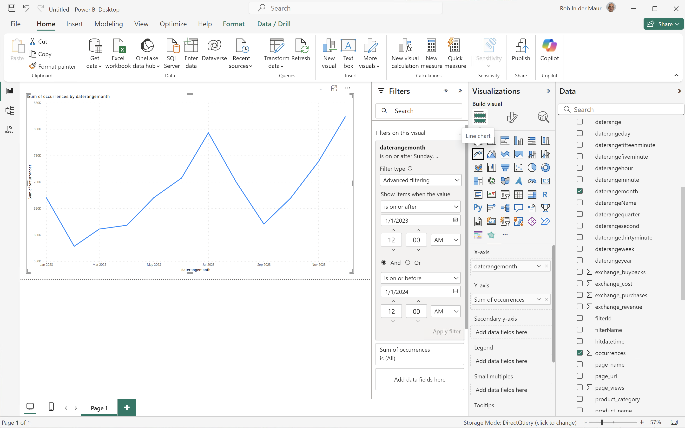
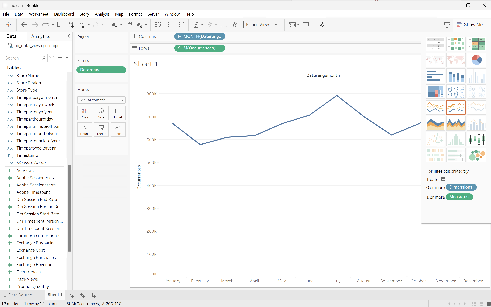

# Månadstrender


I det här fallet vill du visa en tabell och en enkel radvisualisering som visar en månatlig trend för händelser för 2023.

+++ Customer Journey Analytics

Ett exempel på **[!UICONTROL Monthly Trend]**-panel för användningsfallet:


+++

+++ BI-verktyg

>[!PREREQUISITES]
>
>Kontrollera att du har verifierat [en lyckad anslutning, kan visa datavyer och använda en datavy](connect-and-validate.md) för BI-verktyget som du vill testa det här användningsfallet för.
>

>[!BEGINTABS]

>[!TAB Power BI Desktop]

1. I rutan **[!UICONTROL Data]**:
   1. Välj **[!UICONTROL daterangemonth]**.
   1. Välj **[!UICONTROL sum occurrences]**.

   En tabell visas med förekomsterna för den aktuella månaden. Förstora visualiseringen för bättre synlighet.

1. I rutan **[!UICONTROL Filters]**:

   1. Välj **[!UICONTROL daterangemonth is (All)]** från **[!UICONTROL Filters on this visual]**.
   1. Välj **[!UICONTROL Advanced filtering]** som **[!UICONTROL Filter type]**.
   1. Definiera filtret för **[!UICONTROL Show items when the value]** **[!UICONTROL is on or after]** `1/1/2023` **[!UICONTROL And]** **[!UICONTROL is before]** `1/1/2024.` Du kan använda kalenderikonen för att välja och välja datum.
   1. Välj **[!UICONTROL Apply filter]**.

   Tabellen uppdateras med det använda **[!UICONTROL daterangemonth]**-filtret.

1. I rutan **[!UICONTROL Visualizations]**:

   1. Välj visualisering för **[!UICONTROL Line chart]**.

   En linjediagramvisualisering ersätter tabellen och använder samma data som tabellen. Ditt Power BI-skrivbord ska se ut så här nedan.

   

1. Visualisering av linjediagram:

   1. Välj .
   1. Välj **[!UICONTROL Show as a table]** på snabbmenyn.

   Huvudvyn uppdateras för att visa både en radvisualisering och en tabell. Ditt Power BI-skrivbord ska se ut så här nedan.

   

>[!TAB Skrivbord för Tablet PC]

1. Välj fliken **[!UICONTROL Sheet 1]** längst ned om du vill växla från **[!UICONTROL Data source]**. I vyn **[!UICONTROL Sheet 1]**:
   1. Dra posten **[!UICONTROL Daterange]** från listan **[!UICONTROL Tables]** i rutan **[!UICONTROL Data]** och släpp posten på hyllan **[!UICONTROL Filters]**.
   1. I dialogrutan **[!UICONTROL Filters Field \[Daterange\]]** väljer du **[!UICONTROL Range of Dates]** och sedan **[!UICONTROL Next >]**.
   1. I dialogrutan **[!UICONTROL Filter \[Daterange\]]** väljer du **[!UICONTROL Range of dates]** och anger en punkt på `01/01/2023` - `01/01/2024`.

      

   1. Dra och släpp **[!UICONTROL Daterangeday]** från listan **[!UICONTROL Tables]** i rutan **[!UICONTROL Data]** och släpp posten i fältet bredvid **[!UICONTROL Columns]**.
      * Välj **[!UICONTROL MONTH]** i listrutan **[!UICONTROL Daterangeday]** så att värdet uppdateras till **[!UICONTROL MONTH(Daterangeday)]**.
   1. Dra och släpp **[!UICONTROL Occurrences]** från listan **[!UICONTROL Tables (*Måttnamn *)]**&#x200B;i rutan **[!UICONTROL Data]**&#x200B;och släpp posten i fältet bredvid **[!UICONTROL Rows]**. Värdet konverteras automatiskt till **[!UICONTROL SUM(Occurrences)]**.
   1. Ändra **[!UICONTROL Standard]** till **[!UICONTROL Entire View]** från den nedrullningsbara menyn **[!UICONTROL Fit]** i verktygsfältet.

      Ditt skrivbord ska se ut så här nedan.

      

1. Välj **[!UICONTROL Duplicate]** på snabbmenyn på fliken **[!UICONTROL Sheet 1]** om du vill skapa ett andra blad.
1. Välj **[!UICONTROL Rename]** på snabbmenyn på fliken **[!UICONTROL Sheet 1]** om du vill byta namn på bladet till `Graph`.
1. Välj **[!UICONTROL Rename]** på snabbmenyn på fliken **[!UICONTROL Sheet 1 (2)]** om du vill byta namn på bladet till `Data`.
1. Kontrollera att bladet **[!UICONTROL Data]** är markerat. I datavyn:
   1. Välj **[!UICONTROL Show me]** längst upp till höger och välj **[!UICONTROL Text table]** (övre vänstra visualiseringen) för att ändra innehållet i datavyn till en tabell.
   1. Dra **[!UICONTROL MONTH(Daterangeday)]** från **[!UICONTROL Columns]** till **[!UICONTROL Rows]**.
   1. Ändra **[!UICONTROL Standard]** till **[!UICONTROL Entire View]** från den nedrullningsbara menyn **[!UICONTROL Fit]** i verktygsfältet.

      Ditt skrivbord ska se ut så här nedan.

      

1. Skapa en ny **[!UICONTROL New Dashboard]**-vy genom att klicka på tabbknappen **[!UICONTROL Dashboard 1]** (längst ned). I vyn **[!UICONTROL Dashboard 1]**:
   1. Dra och släpp **[!UICONTROL Graph]**-bladet från **[!UICONTROL Sheets]**-hyllan till **[!UICONTROL Dashboard 1]**-vyn som läser *Drop sheets här*.
   1. Dra och släpp **[!UICONTROL Data]**-bladet från **[!UICONTROL Sheets]**-hyllan nedanför **[!UICONTROL Graph]**-bladet till **[!UICONTROL Dashboard 1]**-vyn.
   1. Markera bladet **[!UICONTROL Data]** i vyn och ändra **[!UICONTROL Entire View]** till **[!UICONTROL Fix Width]**.

      Ditt skrivbord ska se ut så här nedan.

      


>[!TAB Sökare]

1. Kontrollera att du har en ren konfiguration i gränssnittet **[!UICONTROL Explore]** för Looker. Om inte väljer du  **[!UICONTROL Remove fields and filters]**.
1. Välj **[!UICONTROL + Filter]** under **[!UICONTROL Filters]**.
1. I dialogrutan **[!UICONTROL Add Filter]**:
   1. Välj **[!UICONTROL ‣ Cc Data View]**
   1. Välj **[!UICONTROL ‣ Daterange Date]** och sedan **[!UICONTROL Daterange Date]** i listan med fält.
      
1. Ange filtret **[!UICONTROL Cc Data View Daterange Date]** som **[!UICONTROL is in range]** **[!UICONTROL 2023/01/01]** **[!UICONTROL until (before)]** **[!UICONTROL 2024/01/01]**.
1. Från vänster **[!UICONTROL Cc Data View]**-räl,
   1. Välj **[!UICONTROL ‣ Daterangemonth Date]** och sedan **[!UICONTROL Month]** i listan med **[!UICONTROL DIMENSIONS]**.
   1. Välj **[!UICONTROL Count]** under **[!UICONTROL MEASURES]** i den vänstra listen (längst ned).
1. Välj **[!UICONTROL Run]**.
1. Välj **[!UICONTROL ‣ Visualization]** om du vill visa radinvisualiseringen.

En visualisering och en tabell som liknar den visas nedan.


>[!TAB Jupyter-anteckningsbok]

1. Ange följande satser i en ny cell.

   ```python
   import seaborn as sns
   import matplotlib.pyplot as plt
   data = %sql SELECT daterangemonth AS Month, COUNT(*) AS Events \
               FROM cc_data_view \
               WHERE daterange BETWEEN '2023-01-01' AND '2024-01-01' \
               GROUP BY 1 \
               ORDER BY Month ASC
   df = data.DataFrame()
   df = df.groupby('Month', as_index=False).sum()
   plt.figure(figsize=(15, 3))
   sns.lineplot(x='Month', y='Events', data=df)
   plt.show()
   display(data)
   ```

1. Kör cellen. Du bör se utdata som liknar skärmbilden nedan.

   


>[!TAB RStudio]

1. Ange följande programsatser mellan ` ` ``{r} ` och ` `` ` ` i ett nytt segment.

   ```R
   ## Hourly Events
   df <- dv %>%
      filter(daterange >= "2023-01-01" & daterange < "2023-01-02") %>%
      group_by(daterangehour) %>%
      count() %>%
      arrange(daterangehour, .by_group = FALSE)
   ggplot(df, aes(x = daterangehour, y = n)) +
      geom_line(color = "#69b3a2") +
      ylab("Events") +
      xlab("Hour")
   print(df)
   ```

1. Kör segmentet. Du bör se utdata som liknar skärmbilden nedan.

   

>[!ENDTABS]

+++
