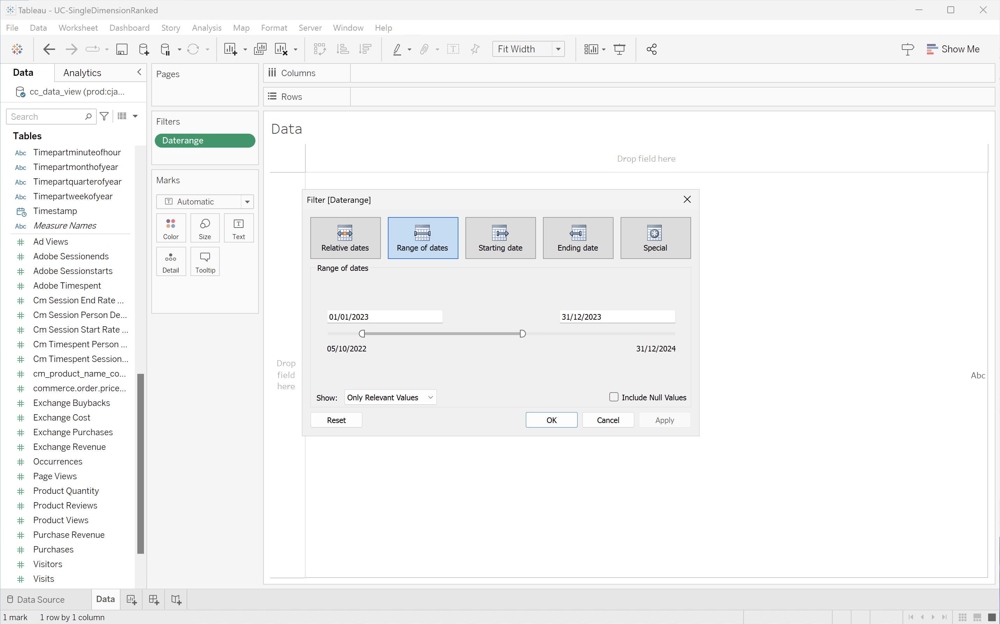
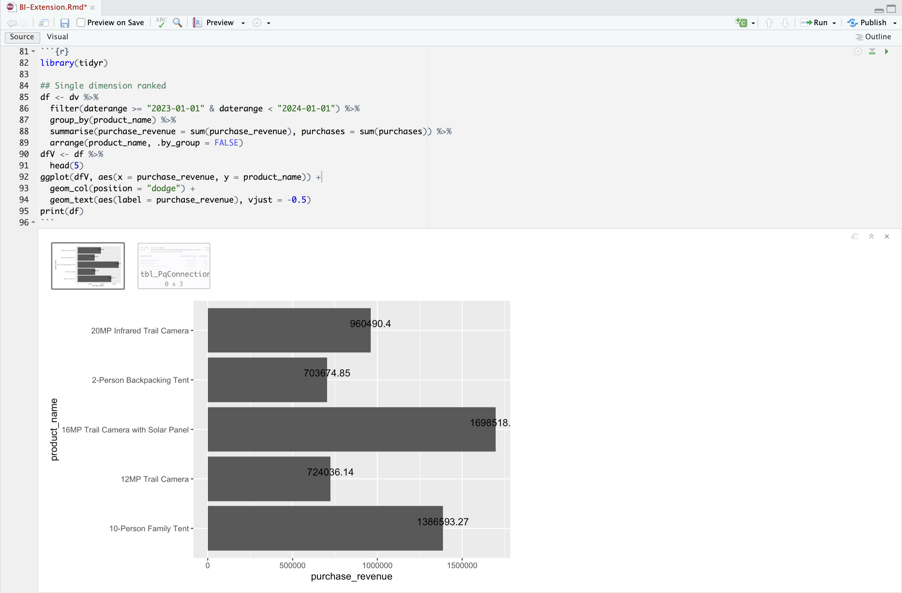

# Enkel dimension rankad


I det här fallet vill du visa en tabell och en enkel fältvisualisering som visar köp- och inköpsintäkter för produktnamn under 2023.

+++ Customer Journey Analytics

Ett exempel på **[!UICONTROL Single Dimension Ranked]**-panel för användningsfallet:


+++

+++ BI-verktyg

>[!PREREQUISITES]
>
>Kontrollera att du har verifierat [en lyckad anslutning, kan visa datavyer och använda en datavy](connect-and-validate.md) för BI-verktyget som du vill testa det här användningsfallet för.
>

>[!BEGINTABS]

>[!TAB Power BI Desktop]

1. I rutan **[!UICONTROL Data]**:
   1. Välj **[!UICONTROL daterange]**.
   1. Välj **[!UICONTROL product_name]**.
   1. Välj **[!UICONTROL sum purchase_revenue]**.
   1. Välj **[!UICONTROL sum purchases]**.

   En tom tabell visas endast med kolumnrubrikerna för det markerade elementet. Förstora visualiseringen för bättre synlighet.

1. I rutan **[!UICONTROL Filters]**:

   1. Välj **[!UICONTROL daterange is (All)]** från **[!UICONTROL Filters on this visual]**.
   1. Välj **[!UICONTROL Relative date]** som **[!UICONTROL Filter type]**.
   1. Definiera filtret för **[!UICONTROL Show items when the value]** **[!UICONTROL is in the last]** `1` **[!UICONTROL calendar years]**.
   1. Välj **[!UICONTROL Apply filter]**.

   Tabellen uppdateras med det använda **[!UICONTROL daterange]**-filtret.

1. I rutan **[!UICONTROL Visualization]**:

   1. Använd  för att ta bort **[!UICONTROL daterange]** från **[!UICONTROL Columns]**.
   1. Dra **[!UICONTROL Sum of purchases_revenue]** under **[!UICONTROL Sum of purchases]** i **[!UICONTROL Columns]**.

1. I tabellvisualiseringen:

   1. Välj **[!UICONTROL Sum of purchase_revenue]** om du vill sortera produktnamnen i fallande inköpsintäktsordning. Ditt Power BI-skrivbord ska se ut så här nedan.

   

1. I rutan **[!UICONTROL Filters]**:

   1. Välj **[!UICONTROL product_name is (All)]**.
   1. Ange **[!UICONTROL Filter type]** till **[!UICONTROL Top N]**.
   1. Definiera filtret för **[!UICONTROL Show items]** **[!UICONTROL Top]** `10` **[!UICONTROL By value]**.
   1. Dra och släpp **[!UICONTROL purchase_revenue]** i **[!UICONTROL By value]** **[!UICONTROL Add data fields here]**.
   1. Välj **[!UICONTROL Apply filter]**.

   Tabellen uppdateras med värden för inköpsintäkter synkroniserat med frihandstabellens visualisering i Analysis Workspace.

1. I rutan **[!UICONTROL Visualizations]**:

   1. Välj visualisering för **[!UICONTROL Line and stacked column chart]**.

   En visualisering av ett linjediagram och ett skiktat stapeldiagram ersätter tabellen med samma data som tabellen.

1. Dra och släpp **[!UICONTROL purchases]** på **[!UICONTROL Line y-axis]** i rutan **[!UICONTROL Visualizations]**.

   Linjediagrammet och det staplade stapeldiagrammet uppdateras. Ditt Power BI-skrivbord ska se ut så här nedan.

   

1. Visualisering av linjediagram och skiktade stapeldiagram:

   1. Välj .
   1. Välj **[!UICONTROL Show as a table]** på snabbmenyn.

   Huvudvyn uppdateras för att visa både en radvisualisering och en tabell.

   

>[!TAB Skrivbord för Tablet PC]

1. Välj fliken **[!UICONTROL Sheet 1]** längst ned om du vill växla från **[!UICONTROL Data source]**. I vyn **[!UICONTROL Sheet 1]**:
   1. Dra posten **[!UICONTROL Daterange]** från listan **[!UICONTROL Tables]** i rutan **[!UICONTROL Data]** och släpp posten på hyllan **[!UICONTROL Filters]**.
   1. I dialogrutan **[!UICONTROL Filters Field \[Daterange\]]** väljer du **[!UICONTROL Range of Dates]** och sedan **[!UICONTROL Next >]**.
   1. I dialogrutan **[!UICONTROL Filter \[Daterange\]]** väljer du **[!UICONTROL Range of dates]** och anger en punkt på `01/01/2023` - `31/12/2023`. Välj **[!UICONTROL Apply]** och **[!UICONTROL OK]**.

      

   1. Dra och släpp **[!UICONTROL Product Name]** från listan **[!UICONTROL Tables]** i rutan **[!UICONTROL Data]** och släpp posten i fältet bredvid **[!UICONTROL Rows]**.
   1. Dra och släpp **[!UICONTROL Purchases]** från listan **[!UICONTROL Tables (*Måttnamn *)]**i rutan **[!UICONTROL Data]**och släpp posten i fältet bredvid **[!UICONTROL Rows]**. Värdet konverteras automatiskt till **[!UICONTROL SUM(Purchases)]**.
   1. Dra och släpp **[!UICONTROL Purchase Revenue]** från listan **[!UICONTROL Tables (*Måttnamn *)]**i rutan **[!UICONTROL Data]**och släpp posten i fältet intill **[!UICONTROL Columns]**och vänster från **[!UICONTROL SUM(Purchases)]**. Värdet konverteras automatiskt till **[!UICONTROL SUM(Purchase Revenue)]**.
   1. Om du vill beställa båda diagrammen i fallande inköpsintäktsordning för du muspekaren över rubriken **[!UICONTROL Purchase Revenue]** och väljer sorteringsikonen.
   1. Om du vill begränsa antalet poster i diagrammen väljer du **[!UICONTROL SUM(Purchase Revenue)]** i **[!UICONTROL Rows]** och väljer **[!UICONTROL Filter]** i listrutan.
   1. I dialogrutan **[!UICONTROL Filter \[Purchase Revenue\]]** väljer du **[!UICONTROL Range of values]** och anger lämpliga värden. Till exempel: `1,000,000` - `2,000,000`. Välj **[!UICONTROL Apply]** och **[!UICONTROL OK]**.
   1. Om du vill konvertera de två stapeldiagrammen till ett dubbelkombinationsdiagram väljer du **[!UICONTROL SUM(Purchases)]** i **[!UICONTROL Rows]** och väljer **[!UICONTROL Dual Axis]** i listrutan. Stolpdiagrammen omformas till en punktdiagram.
   1. Så här ändrar du punktdiagram till ett stapeldiagram:
      1. Välj **[!UICONTROL SUM(Purchases)]** i området **[!UICONTROL Marks]** och välj **[!UICONTROL Line]** i listrutan.
      1. Välj **[!UICONTROL SUM(Purchase Revenue)]** i området **[!UICONTROL Marks]** och välj **[!UICONTROL Bar]** i listrutan.

   Ditt skrivbord ska se ut så här nedan.

   

1. Välj **[!UICONTROL Duplicate]** på snabbmenyn på fliken **[!UICONTROL Sheet 1]** om du vill skapa ett andra blad.
1. Välj **[!UICONTROL Rename]** på snabbmenyn på fliken **[!UICONTROL Sheet 1]** om du vill byta namn på bladet till `Data`.
1. Välj **[!UICONTROL Rename]** på snabbmenyn på fliken **[!UICONTROL Sheet 1 (2)]** om du vill byta namn på bladet till `Graph`.
1. Kontrollera att bladet **[!UICONTROL Data]** är markerat.
   1. Välj **[!UICONTROL Show me]** längst upp till höger och välj **[!UICONTROL Text table]** (övre vänstra visualiseringen) för att ändra innehållet i de två diagrammen till en tabell.
   1. Om du vill beställa inköpsintäkt i fallande ordning för du över **[!UICONTROL Purchase Revenue]** i tabellen och väljer .
   1. Välj **[!UICONTROL Entire View]** i listrutan **[!UICONTROL Fit]**.

   Ditt skrivbord ska se ut så här nedan.

   

1. Skapa en ny **[!UICONTROL New Dashboard]**-vy genom att klicka på tabbknappen **[!UICONTROL Dashboard 1]** (längst ned). I vyn **[!UICONTROL Dashboard 1]**:
   1. Dra och släpp **[!UICONTROL Graph]**-bladet från **[!UICONTROL Sheets]**-hyllan till **[!UICONTROL Dashboard 1]**-vyn som läser *Drop sheets här*.
   1. Dra och släpp **[!UICONTROL Data]**-bladet från **[!UICONTROL Sheets]**-hyllan nedanför **[!UICONTROL Graph]**-bladet till **[!UICONTROL Dashboard 1]**-vyn.
   1. Markera bladet **[!UICONTROL Data]** i vyn och ändra **[!UICONTROL Entire View]** till **[!UICONTROL Fix Width]**.

   **[!UICONTROL Dashboard 1]**-vyn ska se ut så här nedan.

   


>[!TAB Sökare]

1. Kontrollera att du har en ren konfiguration i gränssnittet **[!UICONTROL Explore]** för Looker. Om inte väljer du  **[!UICONTROL Remove fields and filters]**.
1. Välj **[!UICONTROL + Filter]** under **[!UICONTROL Filters]**.
1. I dialogrutan **[!UICONTROL Add Filter]**:
   1. Välj **[!UICONTROL ‣ Cc Data View]**
   1. Välj **[!UICONTROL ‣ Daterange Date]** och sedan **[!UICONTROL Daterange Date]** i listan med fält.
      
1. Ange filtret **[!UICONTROL Cc Data View Daterange Date]** som **[!UICONTROL is in range]** **[!UICONTROL 2023/01/01]** **[!UICONTROL until (before)]** **[!UICONTROL 2024/01/01]**.
1. Välj **[!UICONTROL ‣ Cc Data View]** i avsnittet **[!UICONTROL Product Name]** i den vänstra listen.
1. Från avsnittet **[!UICONTROL ‣ Custom Fields]** i den vänstra listen:
   1. Välj **[!UICONTROL Custom Measure]** i listrutan **[!UICONTROL + Add]**.
   1. I dialogrutan **[!UICONTROL Create custom measure]**:
      1. Välj **[!UICONTROL Purchase Revenue]** i listrutan **[!UICONTROL Field to measure]**.
      1. Välj **[!UICONTROL Sum]** i listrutan **[!UICONTROL Measure type]**.
      1. Ange ett anpassat fältnamn för **[!UICONTROL Name]**. Till exempel: `Purchase Revenue`.
      1. Klicka på fliken **[!UICONTROL Field details]**.  
      1. Välj **[!UICONTROL Decimals]** i listrutan **[!UICONTROL Format]** och kontrollera att `0` anges i **[!UICONTROL Decimals]**.
         
      1. Välj **[!UICONTROL Save]**.
   1. Välj **[!UICONTROL Custom Measure]** en gång till på den nedrullningsbara menyn **[!UICONTROL + Add]**. I dialogrutan **[!UICONTROL Create custom]**:
      1. Välj **[!UICONTROL Purchases]** i listrutan **[!UICONTROL Field to measure]**.
      1. Välj **[!UICONTROL Sum]** i listrutan **[!UICONTROL Measure type]**.
      1. Ange ett anpassat fältnamn för **[!UICONTROL Name]**. Till exempel: `Sum of Purchases`.
      1. Klicka på fliken **[!UICONTROL Field details]**.  
      1. Välj **[!UICONTROL Decimals]** i listrutan **[!UICONTROL Format]** och kontrollera att `0` anges i **[!UICONTROL Decimals]**.
      1. Välj **[!UICONTROL Save]**.
   1. Båda fälten läggs automatiskt till i datavyn.
1. Välj **[!UICONTROL + Filter]** om du vill lägga till ytterligare **[!UICONTROL Filters]** och begränsa data.
1. I dialogrutan **[!UICONTROL Add Filter]** väljer du **[!UICONTROL ‣ Custom Fields]** och sedan **[!UICONTROL Purchase Revenue]**.
1. Gör lämpliga markeringar och ange de föreslagna värdena, så att filtret läser **[!UICONTROL is between inclusive]** `1000000` **[!UICONTROL AND]** `2000000`.
1. Välj **[!UICONTROL Run]**.
1. Välj **[!UICONTROL ‣ Visualization]** om du vill visa radinvisualiseringen.
1. Välj **[!UICONTROL Edit]** i **[!UICONTROL Visualization]** för att uppdatera visualiseringen. I popup-dialogrutan:
   1. Klicka på fliken **[!UICONTROL Series]**.  
   1. Bläddra ned för att se **[!UICONTROL Purchases]** och ändra **[!UICONTROL Type]** till **[!UICONTROL Line]**.
   1. Klicka på fliken **[!UICONTROL Y]**.  
   1. Dra **[!UICONTROL Purchases]** från behållaren **[!UICONTROL Left 1]** till den plats där den läser **[!UICONTROL *Dra serien hit för att skapa en ny vänsteraxel *]**. Den här åtgärden skapar en **[!UICONTROL Left 2]**-behållare.
      
   1. Välj  bredvid **[!UICONTROL Edit]** för att dölja popup-dialogrutan

En visualisering och en tabell som liknar den visas nedan.


>[!TAB Jupyter-anteckningsbok]

1. Ange följande satser i en ny cell.

   ```
   import seaborn as sns
   import matplotlib.pyplot as plt
   data = %sql SELECT product_name AS `Product Name`, SUM(purchase_revenue) AS `Purchase Revenue`, SUM(purchases) AS `Purchases` \
               FROM cc_data_view \
               WHERE daterange BETWEEN '2023-01-01' AND '2024-01-01' \
               GROUP BY 1 \
               LIMIT 10;
   df = data.DataFrame()
   df = df.groupby('Product Name', as_index=False).sum()
   plt.figure(figsize=(15, 3))
   sns.barplot(x='Purchase Revenue', y='Product Name', data=df)
   plt.show()
   display(data)
   ```

1. Kör cellen. Du bör se utdata som liknar skärmbilden nedan.

   


>[!TAB RStudio]

1. Ange följande programsatser mellan ` ```{r} ` och ` ``` ` i ett nytt segment.

   ```R
   library(tidyr)
   
   ## Single dimension ranked
   df <- dv %>%
      filter(daterange >= "2023-01-01" & daterange < "2024-01-01") %>%
      group_by(product_name) %>%
      summarise(purchase_revenue = sum(purchase_revenue), purchases = sum(purchases)) %>%
      arrange(product_name, .by_group = FALSE)
   dfV <- df %>%
      head(5)
   ggplot(dfV, aes(x = purchase_revenue, y = product_name)) +
      geom_col(position = "dodge") +
      geom_text(aes(label = purchase_revenue), vjust = -0.5)
   print(df)
   ```

1. Kör segmentet. Du bör se utdata som liknar skärmbilden nedan.

   

>[!ENDTABS]

+++

