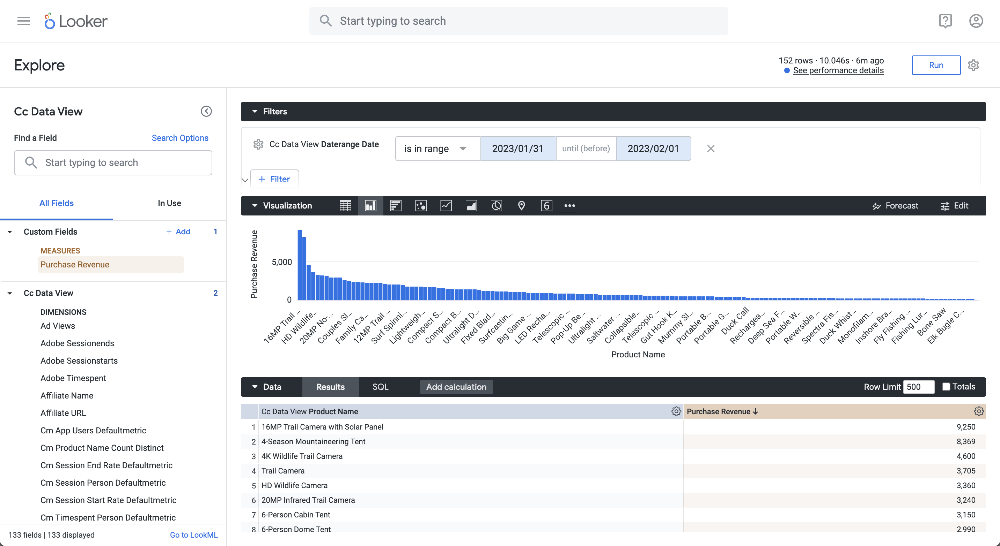

# Sortera


I det här fallet vill du rapportera om inköpsinkomster och inköp för produktnamn under januari 2023, sorterade i fallande inköpsintäktsorder.

+++ Customer Journey Analytics

Ett exempel på **[!UICONTROL Sort]**-panel för användningsfallet:


+++

+++ BI-verktyg

>[!PREREQUISITES]
>
>Kontrollera att du har verifierat [en lyckad anslutning, kan visa datavyer och använda en datavy](connect-and-validate.md) för BI-verktyget som du vill testa det här användningsfallet för.
>

>[!BEGINTABS]

>[!TAB Power BI Desktop]

1. I rutan **[!UICONTROL Data]**:
   1. Välj **[!UICONTROL daterange]**.
   1. Välj **[!UICONTROL product_namr]**.
   1. Välj **[!UICONTROL sum purchase_revenue]**.
   1. Välj **[!UICONTROL sum purchases]**.

1. I rutan **[!UICONTROL Filters]**:
   1. Välj **[!UICONTROL daterange is (All)]** från **[!UICONTROL Filters on this visual]**.
   1. Välj **[!UICONTROL Advanced filtering]** som **[!UICONTROL Filter type]**.
   1. Definiera filtret för **[!UICONTROL Show items when the value]** **[!UICONTROL is on or after]** `1/1/2023` **[!UICONTROL And]** **[!UICONTROL is before]** `2/1/2023`.

1. I rutan Visualiseringar:
   1. Välj  om du vill ta bort daterange från kolumner.
   1. Dra **[!UICONTROL Sum of purchase_revenue]** längst ned på **[!UICONTROL Column]** objekt.

1. I rapporten väljer du **[!UICONTROL Sum of purchase_revenue]** för att sortera tabellen i fallande ordning efter inköpsintäkt.

   Ditt Power BI-skrivbord ska se ut så här nedan.

   

Frågan som körs av Power BI Desktop med BI-tillägget innehåller inte någon `sort`-sats. Avsaknaden av en `sort`-sats tyder på att sorteringen körs på klientsidan.

```sql
select "_"."product_name",
    "_"."a0",
    "_"."a1"
from 
(
    select "rows"."product_name" as "product_name",
        sum("rows"."purchases") as "a0",
        sum("rows"."purchase_revenue") as "a1"
    from 
    (
        select "_"."daterangeName",
            "_"."daterange",
            "_"."filterId",
            "_"."filterName",
            "_"."timestamp",
            "_"."affiliate_name",
            "_"."affiliate_url",
            "_"."commerce.order.priceTotal",
            "_"."customer_city",
            "_"."customer_region",
            "_"."daterangeday",
            "_"."daterangefifteenminute",
            "_"."daterangefiveminute",
            "_"."daterangehour",
            "_"."daterangeminute",
            "_"."daterangemonth",
            "_"."daterangequarter",
            "_"."daterangesecond",
            "_"."daterangethirtyminute",
            "_"."daterangeweek",
            "_"."daterangeyear",
            "_"."hitdatetime",
            "_"."page_name",
            "_"."page_url",
            "_"."product_category",
            "_"."product_name",
            "_"."product_short_review",
            "_"."product_subCategory",
            "_"."referrer_url",
            "_"."search_engine",
            "_"."search_keywords",
            "_"."store_city",
            "_"."store_name",
            "_"."store_region",
            "_"."store_type",
            "_"."timepartdayofmonth",
            "_"."timepartdayofweek",
            "_"."timepartdayofyear",
            "_"."timeparthourofday",
            "_"."timepartminuteofhour",
            "_"."timepartmonthofyear",
            "_"."timepartquarterofyear",
            "_"."timepartweekofyear",
            "_"."cm_session_end_rate_defaultmetric",
            "_"."cm_session_person_defaultmetric",
            "_"."cm_session_start_rate_defaultmetric",
            "_"."cm_timespent_person_defaultmetric",
            "_"."cm_timespent_session_defaultmetric",
            "_"."cm_product_name_count_distinct",
            "_"."ad_views",
            "_"."adobe_sessionends",
            "_"."adobe_sessionstarts",
            "_"."adobe_timespent",
            "_"."exchange_buybacks",
            "_"."exchange_cost",
            "_"."exchange_purchases",
            "_"."exchange_revenue",
            "_"."occurrences",
            "_"."page_views",
            "_"."product_quantity",
            "_"."product_reviews",
            "_"."product_views",
            "_"."purchase_revenue",
            "_"."purchases",
            "_"."visitors",
            "_"."visits"
        from "public"."cc_data_view" "_"
        where "_"."daterange" < date '2023-02-01' and "_"."daterange" >= date '2023-01-01'
    ) "rows"
    group by "product_name"
) "_"
where not "_"."a0" is null or not "_"."a1" is null
limit 1000001
```


>[!TAB Skrivbord för Tablet PC]

1. Välj fliken **[!UICONTROL Sheet 1]** längst ned om du vill växla från **[!UICONTROL Data source]**. I vyn **[!UICONTROL Sheet 1]**:
   1. Dra **[!UICONTROL Daterange]**-posten från listan **[!UICONTROL Tables]** i hyllan **[!UICONTROL Filters]**.
   1. I dialogrutan **[!UICONTROL Filter Field \[Daterange\]]** väljer du **[!UICONTROL Range of Dates]** och sedan **[!UICONTROL Next >]**.
   1. I dialogrutan **[!UICONTROL Filter \[Daterange\]]** väljer du **[!UICONTROL Range of dates]** och sedan `01/01/2023` - `1/2/2023`. Välj **[!UICONTROL Apply]** och **[!UICONTROL OK]**.
   1. Dra **[!UICONTROL Product Name]** från listan **[!UICONTROL Tables]** och släpp posten i fältet intill **[!UICONTROL Rows]**.
   1. Dra **[!UICONTROL Purchases]**-posten från listan **[!UICONTROL Tables]** och släpp posten i fältet intill **[!UICONTROL Columns]**. Värdet ändras till **[!UICONTROL SUM(Purchases)]**.
   1. Dra **[!UICONTROL Purchase Revenue]**-posten från listan **[!UICONTROL Tables]** och släpp posten i fältet intill **[!UICONTROL Columns]**, intill **[!UICONTROL SUM(Purchases)]**. Värdet ändras till **[!UICONTROL SUM(Purchase Revenue)]**.
   1. Välj **[!UICONTROL Text Table]** från **[!UICONTROL Show Me]**.
   1. Välj **[!UICONTROL Fit Width]** i listrutan **[!UICONTROL Fit]**.
   1. Markera kolumnrubriken **[!UICONTROL Purchase Revenue]** och sortera tabellen i den här kolumnen i fallande ordning.

      Ditt skrivbord ska se ut så här nedan.

      

Frågan som körs av Tableau Desktop med BI-tillägget innehåller inte någon `sort`-sats. Avsaknaden av den här `sort`-satsen tyder på att sorteringen körs på klientsidan.

```sql
SELECT CAST("cc_data_view"."product_name" AS TEXT) AS "product_name",
  SUM("cc_data_view"."occurrences") AS "sum:occurrences:ok",
  SUM("cc_data_view"."purchase_revenue") AS "sum:purchase_revenue:ok",
  SUM("cc_data_view"."purchases") AS "sum:purchases:ok"
FROM "public"."cc_data_view" "cc_data_view"
WHERE (("cc_data_view"."daterange" >= (DATE '2023-01-01')) AND ("cc_data_view"."daterange" <= (DATE '2023-02-01')))
GROUP BY 1
```

>[!TAB Sökare]

1. Uppdatera anslutningen i **[!UICONTROL Explore]**-gränssnittet för Looker. Välj  **[!UICONTROL Clear cache and refresh]**.
1. Kontrollera att du har en ren konfiguration i gränssnittet **[!UICONTROL Explore]** för Looker. Om inte väljer du  **[!UICONTROL Remove fields and filters]**.
1. Välj **[!UICONTROL + Filter]** under **[!UICONTROL Filters]**.
1. I dialogrutan **[!UICONTROL Add Filter]**:
   1. Välj **[!UICONTROL ‣ Cc Data View]**
   1. Välj **[!UICONTROL ‣ Daterange Date]** och sedan **[!UICONTROL Daterange Date]** i listan med fält.
      
1. Ange filtret **[!UICONTROL Cc Data View Daterange Date]** som **[!UICONTROL is in range]** **[!UICONTROL 2023/01/01]** **[!UICONTROL until (before)]** **[!UICONTROL 2023/02/01]**.
1. Välj **[!UICONTROL ‣ Cc Data View]** i avsnittet **[!UICONTROL Product Name]** i den vänstra listen.
1. Från avsnittet **[!UICONTROL ‣ Custom Fields]** i den vänstra listen:
   1. Välj **[!UICONTROL Custom Measure]** i listrutan **[!UICONTROL + Add]**.
   1. I dialogrutan **[!UICONTROL Create custom measure]**:
      1. Välj **[!UICONTROL Purchase Revenue]** i listrutan **[!UICONTROL Field to measure]**.
      1. Välj **[!UICONTROL Sum]** i listrutan **[!UICONTROL Measure type]**.
      1. Ange ett anpassat fältnamn för **[!UICONTROL Name]**. Till exempel: `Sum of Purchase Revenue`.
      1. Klicka på fliken **[!UICONTROL Field details]**.  
      1. Välj **[!UICONTROL Decimals]** i listrutan **[!UICONTROL Format]** och kontrollera att `0` anges i **[!UICONTROL Decimals]**.
         
      1. Välj **[!UICONTROL Save]**.
1. Se till att du väljer **[!UICONTROL ↓]** (**[!UICONTROL Descending, Sort Order: 1]**) i kolumnen **[!UICONTROL Purchase Revenue]**.
1. Välj **[!UICONTROL Run]**.
1. Välj **[!UICONTROL ‣ Visualization]**.

En visualisering och en tabell som liknar den visas nedan.




Frågan som genereras av Looker med BI-tillägget inkluderar `ORDER BY`, vilket betyder att sorteringen utförs med Looker och BI-tillägget.

```sql
-- Looker Query Context '{"user_id":6,"history_slug":"fc83573987b999306eaf6e1a3f2cde70","instance_slug":"71d4667f0b76c0011463658f45c3f7a3"}' 
SELECT
    cc_data_view."product_name"  AS "cc_data_view.product_name",
    COALESCE(SUM(CAST(( cc_data_view."purchase_revenue"  ) AS DOUBLE PRECISION)), 0) AS "purchase_revenue"
FROM
    "public"."cc_data_view" AS "cc_data_view"
WHERE ((( cc_data_view."daterange"  ) >= (DATE_TRUNC('day', DATE '2024-01-31')) AND ( cc_data_view."daterange"  ) < (DATE_TRUNC('day', DATE '2023-02-01'))))
GROUP BY
    1
ORDER BY
    2 DESC
FETCH NEXT 500 ROWS ONLY
```


>[!TAB Jupyter-anteckningsbok]

1. Ange följande satser i en ny cell.

   ```python
   data = %sql SELECT product_name AS `Product Name`, SUM(purchase_revenue) AS `Purchase Revenue`, SUM(purchases) AS `Purchases` \
               FROM cc_data_view \
               WHERE daterange BETWEEN '2023-01-01' AND '2023-02-01' \
               GROUP BY 1 \
               ORDER BY `Purchase Revenue` DESC \
               LIMIT 5;
   display(data)
   ```

1. Kör cellen. Du bör se utdata som liknar skärmbilden nedan.

   

Frågan körs av BI-tillägget enligt definitionen i Jupyter-anteckningsbok.


>[!TAB RStudio]

1. Ange följande programsatser mellan ` ```{r} ` och ` ``` ` i ett nytt segment.

   ```R
   ## Dimension 1 Sorted
   df <- dv %>%
      filter(daterange >= "2023-01-01" & daterange < "2023-02-01") %>%
      group_by(product_name) %>%
      summarise(purchase_revenue = sum(purchase_revenue), purchases = sum(purchases), .groups = "keep") %>%
      arrange(desc(purchase_revenue), .by_group = FALSE)
   print(df)
   ```

1. Kör segmentet. Du bör se utdata som liknar skärmbilden nedan.

   

Frågan som genereras av RStudio med BI-tillägget inkluderar `ORDER BY`, vilket innebär att ordningen tillämpas via RStudio och BI-tillägget.

```sql
SELECT
  "product_name",
  SUM("purchase_revenue") AS "purchase_revenue",
  SUM("purchases") AS "purchases"
FROM (
  SELECT "cc_data_view".*
  FROM "cc_data_view"
  WHERE ("daterange" >= '2023-01-01' AND "daterange" < '2023-02-01')
) AS "q01"
GROUP BY "product_name"
ORDER BY "purchase_revenue" DESC
LIMIT 1000
```

>[!ENDTABS]

+++
