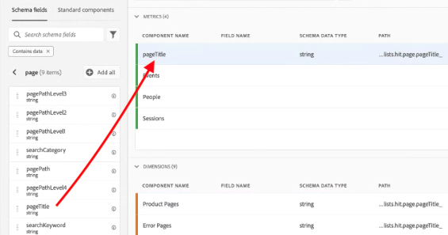
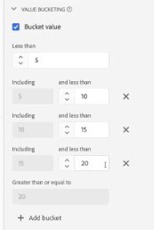

# Datavyer använder exempel

De här användningsexemplen visar hur flexibla och kraftfulla datavyer är i Customer Journey Analytics.

## 1. Skapa ett mått från ett strängschemafält {#string}

När du skapar en datavy kan du till exempel skapa ett [!UICONTROL Orders]-mått från ett [!UICONTROL pageTitle]-schemafält som är en sträng. Så här gör du:

1. På fliken Komponenter drar du [!UICONTROL pageTitle] till avsnittet [!UICONTROL Metrics] under [!UICONTROL Included Components].
   
1. Markera nu måttet som du just drog in och byt namn på det under [!UICONTROL Component Settings] till höger:
   
1. Öppna dialogrutan [!UICONTROL Include/Exclude Values] till höger och ange följande:
   

   &quot;Bekräftelsefrasen&quot; anger att det här är en order. När du har granskat alla sidrubriker där dessa kriterier uppfylls räknas &quot;1&quot; för varje förekomst. Resultatet är ett nytt mått (inte ett beräknat mått). Ett mätvärde som har inkluderade/exkluderade värden kan användas överallt där andra mätvärden kan användas. Det fungerar med Attribution IQ, filter och var du än är kan du använda standardvärden.
1. Du kan ytterligare ange en attribueringsmodell för det här måttet, till exempel [!UICONTROL Last Touch], med [!UICONTROL Lookback window] av [!UICONTROL Session].
Du kan också skapa ytterligare ett [!UICONTROL Orders]-mått från samma fält och ange en annan attribueringsmodell för det, till exempel [!UICONTROL First Touch], och en annan [!UICONTROL Lookback window], till exempel [!UICONTROL 30 days].

Ett annat exempel är att använda besökar-ID, en dimension, som ett mått för att avgöra hur många besökar-ID ditt företag har.

## 2. Använd heltal som dimensioner {#integers}

Tidigare behandlades heltal automatiskt som mätvärden i Customer Journey Analytics. Nu kan numeriska värden (inklusive anpassade händelser från Adobe Analytics) behandlas som dimensioner. Här är ett exempel:

1. Dra heltalet [!UICONTROL call_length_min] till avsnittet [!UICONTROL Dimensions] under [!UICONTROL Included Components]:

   

1. Du kan nu lägga till [!UICONTROL Value Bucketing] för att presentera den här dimensionen på ett paketerat sätt i rapporter. (Utan att låsa visas varje instans av den här dimensionen som ett radobjekt i Workspace-rapporter.)

   

## 3. Använd numeriska mått som &quot;mått&quot; i flödesdiagram {#numeric}

Du kan använda en numerisk dimension för att få in &quot;mått&quot; i [!UICONTROL  Flow]-visualiseringen.

1. Dra schemafältet [!UICONTROL Marketing Channels] till området [!UICONTROL Metrics] under [!UICONTROL Included components] på fliken [Komponenter](https://experienceleague.adobe.com/docs/analytics-platform/using/cja-dataviews/create-dataview.html#configure-component-settings) i datavyer.
2. I Workspace-rapporter visar det här flödet [!UICONTROL Marketing Channels] som flödar in i [!UICONTROL Orders]:

## 4. Gör subevent-filtrering {#sub-event}

Den här funktionen gäller specifikt för matrisbaserade fält. Med funktionerna för att inkludera/exkludera kan du filtrera på underhändelsenivå, medan filter (segment) som är inbyggda i filterverktyget bara ger dig filtrering på händelsenivå. Du kan alltså filtrera efter händelser genom att använda Inkludera/Exkludera i datavyer och sedan referera till det nya måttet/måttet i ett filter på händelsenivå.

Använd till exempel funktionerna Inkludera/exkludera i datavyer om du bara vill fokusera på produkter som genererade mer än 50 dollar för försäljning. Om du har en beställning som innehåller ett produktköp på 50 dollar och ett inköp på 25 dollar tar vi bara bort 25 dollar, inte hela beställningen.

1. Dra schemafältet [!UICONTROL Revenue] till området [!UICONTROL Metrics] under [!UICONTROL Included components] på fliken [Komponenter](https://experienceleague.adobe.com/docs/analytics-platform/using/cja-dataviews/create-dataview.html#configure-component-settings) i datavyer.
1. Markera måtten och konfigurera följande på höger sida:
a. Välj [!UICONTROL Currency] under [!UICONTROL Format].
b. Välj USD under [!UICONTROL Currency].
c. Markera kryssrutan intill [!UICONTROL Set include/exclude values] under [!UICONTROL Include/Exclude Values].
d. Välj [!UICONTROL If all criteria are met] under [!UICONTROL Match].
e. Välj [!UICONTROL is greater than or equal] under [!UICONTROL Criteria].
f. Ange &quot;50&quot; som värde.

Med de här nya inställningarna kan du bara visa värdefulla intäkter och filtrera bort vad som helst under 50 dollar.

## 5. Använd inställningen [!UICONTROL No Value Options] {#no-value}

Företaget kan ha ägnat tid åt att utbilda dina användare så att de förväntar sig&quot;Ospecificerat&quot; i rapporter. Standardvärdet i datavyer är &quot;Inget värde&quot;. Du kan nu [byta namn på&quot;Inget värde&quot; till&quot;Ospecificerat&quot;](https://experienceleague.adobe.com/docs/analytics-platform/using/cja-dataviews/create-dataview.html#configure-no-value-options-settings) i användargränssnittet för datavyer.

Ett annat exempel är en dimension för registrering av medlemsprogram. I det här fallet kan du ändra namnet&quot;Inget värde&quot; till&quot;Inget medlemskap i programmet&quot;.

## 6. Skapa flera mätvärden med olika [!UICONTROL Attribution]-inställningar {#attribution}

Använd funktionen [!UICONTROL Duplicate] längst upp till höger och skapa ett antal intäktsmått med olika attribueringsinställningar som [!UICONTROL First Touch], [!UICONTROL Last Touch] och [!UICONTROL Algorithmic].

Glöm inte att byta namn på varje mätvärde för att återspegla skillnaderna, t.ex.&quot;Algoritmisk omsättning&quot;:

Mer information om andra datavyinställningar finns i [Skapa datavyer](/help/data-views/create-dataview.md).
En konceptuell översikt över datavyer finns i [Översikt över datavyer](/help/data-views/data-views.md).

## 7. Ny session- och retursessionsrapportering {#new-repeat}

Du kan avgöra om en session faktiskt är den första sessionen någonsin för en användare eller en retursession, baserat på det rapportfönster som du definierade för datavyn och ett 13-månaders uppslagsfönster. Med den här rapporten kan du till exempel avgöra:

* Hur stor procentandel av dina beställningar kommer från nya sessioner eller retursessioner?

* För en viss marknadsföringskanal, eller för en viss kampanj, riktar ni er till förstagångsanvändare eller returanvändare? Hur påverkar detta valet konverteringsgraden?

En dimension och två mätvärden underlättar den här rapporteringen:

* [Sessionstyp](https://experienceleague.adobe.com/docs/analytics-platform/using/cja-dataviews/component-reference.html#optional) - Den här dimensionen har två värden: 1) [!UICONTROL New] och 2) [!UICONTROL Returning]. Radobjektet [!UICONTROL New] innehåller allt beteende (dvs. mått mot den här dimensionen) från en session som har fastställts vara en persons definierade första session. Allt annat ingår i radobjektet [!UICONTROL Returning] (förutsatt att allt tillhör en session). Om mätvärden inte ingår i någon session hamnar de i&quot;Inte tillämpligt&quot;-haken för den här dimensionen.

* [Första sessionen](https://experienceleague.adobe.com/docs/analytics-platform/using/cja-dataviews/component-reference.html#optional). Mätvärdet för förstagångssessioner definieras som en persons definierade första session i rapportfönstret.

* [Retursessioner](https://experienceleague.adobe.com/docs/analytics-platform/using/cja-dataviews/component-reference.html#optional) Måttet på retursessioner är antalet sessioner som inte var en persons första session.—>

Så här kommer du åt komponenten:

1. Gå till datavyredigeraren.
1. Klicka på fliken **[!UICONTROL Components]** > **[!UICONTROL Optional Standard components]** i den vänstra listen.
1. Dra dessa komponenter till datavyn.

95-99 % av tiden rapporteras nya sessioner korrekt. De enda undantagen är:

* När en första session ägde rum före 13-månaders uppslagsfönster. Den här sessionen kommer att ignoreras.

* När en session sträcker sig över både uppslagsfönstret och rapportfönstret. Låt oss säga att du har en rapport från 1 juni till 15 juni 2022. Fönstret för uppslag skulle omfatta 1 maj 2021 till 31 maj 2022. Om en session skulle påbörjas den 30 maj 2022 och avslutas den 1 juni 2022 eftersom sessionen ingår i uppslagsfönstret, räknas alla sessioner i rapportfönstret som retursessioner.

## 8. Använd funktionerna Datum och Tid {#date}

Scheman i Adobe Experience Platform innehåller fälten [!UICONTROL Date] och [!UICONTROL Date-Time]. Datavyer i Customer Journey Analytics har nu stöd för dessa fält. När du drar dessa fält till en datavy som en dimension kan du ange deras [format](/help/data-views/component-settings/format.md). Den här formatinställningen avgör hur fälten visas i rapporter. Exempel:

* Om du väljer **[!UICONTROL Day]** med formatet **[!UICONTROL Month, Day, Year]** för datumformatet kan ett exempel i en rapportering se ut så här: 23 augusti 2022.

* Om du väljer **[!UICONTROL Minute of Day]** med formatet **[!UICONTROL Hour:Minute]** för formatet Datum-Tid kan utdata se ut så här: 20:20.

Vi stöder för närvarande datum efter 1 januari 1900 (med undantag av 1 januari 1970) och datum- och tidsvärden efter 1 januari 2000 00:00:00.

### Användningsexempel för datum och tid

* Datum: Ett reseföretag samlar in avgångsdatumet för resor som ett fält i sina uppgifter. De vill ha en rapport som jämför [!UICONTROL Day of Week] för alla insamlade avgångsdatum för att förstå vilka som är mest populära. De vill göra samma sak för [!UICONTROL Month of Year].

* Datum och tid: Ett detaljhandelsföretag samlar in tiden för var och en av sina inköp i butiken (POS). Under en viss månad vill de förstå de mest köpta perioderna med [!UICONTROL Hour of Day].

>[!MORELIKETHIS]
>[Datum och tid i inställningen för formatkomponenten](/help/data-views/component-settings/format.md)

