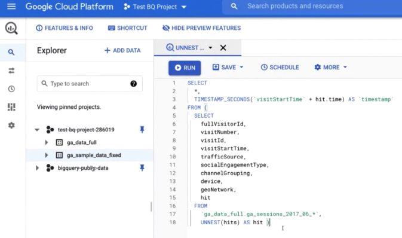

# Ställ in Google Analytics-rapportering i Customer Journey Analytics

## Förutsättningar

* Tillgång till Adobe Experience Platform
* Tillgång till Universal Google Analytics (Google Analytics 360-versionen) eller Google Analytics 4 (kostnadsfri version eller Google Analytics 360-versionen)
* Åtkomst till Customer Journey Analytics

## 1. Koppla Google Analytics-data till Adobe Experience Platform

Hur du överför Google Analytics data till Adobe Experience Platform beror på vilken version av Google Analytics du använder:

| Om du använder ... | Du behöver också den här licensen.. | Och gör det här.. |
| --- | --- | --- |
| **Universal Google Analytics** | Google Analytics 360 | Utför steg 1 - x av instruktionerna nedan |
| **Google Analytics 4** | Kostnadsfri GA-version eller Google Analytics 360 | Inget behov av steg x i instruktionerna nedan. |

Följande instruktioner bygger på Universal Google Analytics.

1. Koppla Google Analytics-data till BigQuery och
Mer information finns i [dessa instruktioner](https://support.google.com/analytics/answer/3416092?hl=en).

1. (Endast kunder med Universal Analytics) Omvandla sessioner med Google Analytics till händelser i BigQuery.
Detta gör att data blir kompatibla med Adobe Experience Platform. Mer information finns i [dessa instruktioner](https://support.google.com/analytics/answer/3437618?hl=en).

   Information: I BigQuery visas dina GA-data som en tabell:

   
Du måste skapa en SQL-fråga för att omvandla data från den universella analysen till ett Experience-Platform-kompatibelt format. I den här videon finns instruktioner:

   >[!VIDEO](https://video.tv.adobe.com/v/332634)

1. Exportera Google Analytics-händelser i JSON-format till Google Cloud-lagring och spara dem i en hink.
Mer information finns i [dessa instruktioner](https://support.google.com/analytics/answer/3437719?hl=en&amp;ref_topic=3416089).

1. Hämta in data från Google Cloud Storage i Experience Platform.
I den här videon finns instruktioner:

   >[!VIDEO](https://video.tv.adobe.com/v/332641)

1. Importera GCS-händelser till Adobe Experience Platform och mappa till XDM-schema

Export av BigQuery-schema (https://support.google.com/analytics/answer/3437719?hl=en&amp;ref_topic=3416089)

