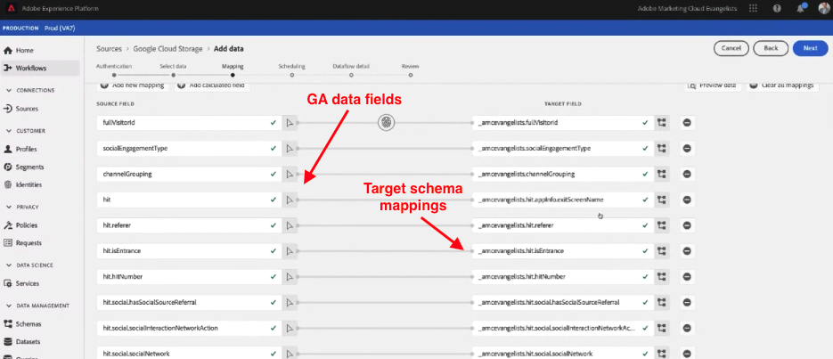

# Ingest Google Analytics historiska data

På den här sidan fokuseras på hur du importerar historiska data för Google Analytics till Adobe Experience Platform som en datauppsättning, vilket gör att du kan referera till den datauppsättningen i en datavy i Customer Journey Analytics. Du kan kombinera stegen på den här sidan med [Konfigurera en Google Analytics-implementering](streaming.md) som genererar en återkommande datauppsättning. Kombinera den här historiska datauppsättningen med den aktuella implementeringens datauppsättning för att få en smidig vy över data i Customer Journey Analytics med både aktuella och efterfyllda data.

## Förutsättningar

För att kunna utföra dessa uppgifter behöver du följande åtkomst och behörigheter:

* Tillgång till Adobe Experience Platform
* Tillgång till Google Analytics (GA-standard eller GA 360)
* [Administratörsåtkomst](/help/technotes/access-control.md) till Customer Journey Analytics

## Konfigurera en BigQuery-export

Datastrukturen i Universal Analytics-egenskaperna skiljer sig från datastrukturen i Google Analytics 4-egenskaperna. Konfigurera en BigQuery-export baserat på egenskapstypen som du vill exportera data från:

* [Konfigurera en BigQuery-export för en Universal Analytics-egenskap](https://support.google.com/analytics/answer/3416092)
* [Konfigurera en BigQuery-export för en Google Analytics 4-egenskap ](https://support.google.com/analytics/answer/9823238)

### Ytterligare krav för universella analysegenskaper

>[!NOTE]
>
>Det här avsnittet gäller endast för Universal Analytics-egenskaper. Om du exporterar från en GA4-egenskap kan du fortsätta till [Exportera data till Google Cloud Platform](#export-gcp).

Universal Analytics-egenskaper lagrar varje post i sina data som en användarsession i stället för som enskilda händelser. Det krävs en SQL-fråga för att omvandla data från Universal Analytics till ett format som är kompatibelt med Adobe Experience Platform. Använd funktionen `UNNEST` på fältet `hits` i GA-schemat och spara den som en BigQuery-tabell.

>[!VIDEO](https://video.tv.adobe.com/v/332634)

```sql
SELECT
   *,
   timestamp_seconds(`visitStartTime` + hit.time) AS `timestamp` 
FROM
   (
      SELECT
         fullVisitorId,
         visitNumber,
         visitId,
         visitStartTime,
         trafficSource,
         socialEngagementType,
         channelGrouping,
         device,
         geoNetwork,
         hit 
      FROM
         `example_bq_table_*`,
         UNNEST(hits) AS hit 
   )
```

## Exportera data till Google Cloud Platform {#export-gcp}

Navigera till **Exportera > Exportera till GCS** i Google Cloud Platform. När data finns i Google Cloud-lagringsutrymmet kan de hämtas till Adobe Experience Platform.

## Importera data från Google Cloud Storage till Experience Platform

1. I Adobe Experience Platform väljer du **[!UICONTROL Sources]** till vänster.
1. Leta upp alternativet **[!UICONTROL Google Cloud Storage]** under katalogen. Klicka på **[!UICONTROL Add data]**.

>[!VIDEO](https://video.tv.adobe.com/v/332676)

>[!TIP]
>
>Om du tänker importera både tidigare och liveströmmande Google Analytics-data måste du använda samma schema för båda datauppsättningarna. Du kan sammanfoga datauppsättningarna i en Customer Journey Analytics med en [kombinerad datauppsättning](/help/connections/combined-dataset.md).

Du kan mappa GA-händelsedata till en befintlig datauppsättning som du skapade tidigare, eller skapa en datauppsättning med det XDM-schema som du väljer. När du har valt schemat använder Experience Platform maskininlärning för att automatiskt mappa varje fält i Google Analytics till ditt [XDM-schema](https://experienceleague.adobe.com/docs/experience-platform/xdm/home.html#ui).



När du är klar med mappningen av fälten till XDM-schemat kan du schemalägga den här importen regelbundet och tillämpa felvalidering under importen. Valideringen säkerställer att det inte uppstår några problem med de data som du har importerat.

## Obligatoriska XDM-fält

Vissa XDM-fält i Platform kräver rätt format för att data ska kunna behandlas korrekt.

* **`timestamp`**: Skapa ett särskilt beräknat fält i användargränssnittet för schemat i Experience Platform. Klicka på **[!UICONTROL Add calculated field]** och omsluta strängen `timestamp` i en `date`-funktion:

  `date(timestamp, "yyyy-MM-dd HH:mm:ssZ")`

  Spara det beräknade fältet i tidsstämpeldatastrukturen i schemat:

  

* **`_id`**: Det här fältet måste ha ett värde - Customer Journey Analytics bryr sig inte om vad värdet är. Du kan lägga till&quot;1&quot; i fältet:

  

## Nästa steg

* Om du har aktuella data som du vill direktuppspela till Adobe Experience Platform finns mer information i [Konfigurera direktuppspelning för Google Analytics-data](streaming.md).
* Om du vill börja rapportera om data som har fyllts i på fel sätt kan du läsa [Skapa en anslutning](/help/connections/create-connection.md).
