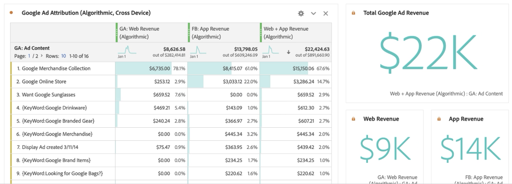

# Rapport om Google Analytics data i Customer Journey Analytics

När du har data tillgängliga i Customer Journey Analytics ger följande exempel användbara scenarier för rapportering av dessa data.

## Visa webbdata och appdata som kombinerade datauppsättningar

I det här Venndiagrammet visas hur många användare som finns på din webbplats (från dina Google Analytics-data) och i din mobilapp (från dina Firebase-data) och från ditt callcenter. Du kan också se de bästa produkterna - inte bara på webben, utan även i mobilappen. Du kan till och med få de totala intäkterna från båda genom att använda ett beräknat mått. Lägg märke till hur de bästa produkterna berättar en annan historia när du tittar på de kombinerade intäkterna. Utan de kombinerade datauppsättningarna skulle du aldrig ha vetat att &quot;Twill cap&quot; var en sådan stark utförare.

## Identifiera samtalsorsaker och minska samtalsvolymen

Du kan trender för hur mycket samtalscenter-tid som har tillbringats de senaste två månaderna för att fastställa samtalsvolymen. I följande exempel visas de data som trendats under de senaste två månaderna. I följande exempel visas en ökande trend som kan påverka organisationskostnaderna.

Genom att använda dimensionen&quot;Anledning till anrop&quot; kan du få tips på hur du kan förbättra webbupplevelsen och förhindra att personer ringer från början. Ovanstående exempel visar att&quot;Skadan&quot; har en genomsnittlig samtalstid på nästan 3 minuter per samtal, vilket ger organisationen ett exakt sätt att förbättra kundupplevelsen och sänka kostnaderna för callcenter.

Du kan se vilka produkter som orsakar de flesta samtalen till ditt callcenter och hur många kunder som har gjort dessa samtal. Bubbeldiagrammet visar att 20 000 personer ringde, spenderade mer än 4 timmar och 30 minuter och returnerade 33 enheter av produkten &quot;Men&#39;s short Sleeve Tee&quot;.

Om du använder en dimensionsuppdelning av &#39;Anropsorsak&#39; visas dimensionsobjektet &quot;Skadad produkt&quot; i exemplet. Nästa steg är att kontakta avdelningen för kvalitetskontroll och se varför kunderna har fått skadade T-shirts.

Du kan se vilka webbsidor som ledde samtal till callcentret. I den här rapporten får ni veta var det finns mindre optimala upplevelser på webbplatsen och hjälpa era produktchefer att lösa dessa utmaningar. I följande exempel används ett beräknat mått med en deltagarattribueringsmodell för att filtrera data ner till endast sessioner som avslutades med ett anrop till en callcenter.

I följande exempel visas att sidorna&quot;Kundvagn&quot; och&quot;Kassainformation&quot; styr de flesta samtal.

Med kohorttabellen kan du se hur lång tid det normalt tar för användare att ringa callcentret efter att de har besökt webbplatsen. I följande exempel visas att den genomsnittliga tiden för exempeldatauppsättningen är mellan tre och fyra veckor.

## Använd avancerad marknadsattribuering

Med Customer Journey Analytics kan ni använda sofistikerade attribueringsmodeller på flerkanalsdata. I följande exempel kan du se en jämförelse mellan hur man använder sista handen, första beröringen, u-formad och algoritmisk attribuering av intäkterna för grupperingsdimensionen för Google Analytics-kanalen.

Med hjälp av beräknade mätvärden kan du använda attribueringen på dina webbintäkter, intäkter från mobilappar och till och med ta bort produktreturer. Resultatet blir en verklig nettointäkt för varje marknadsföringskanal.

Med Attribution IQ kan du också filtrera dina data. Du kan bara se attribuering mot vissa användaruppsättningar, till exempel de som använder mer än en enhet.

Du kan också tilldela webb- och appintäkter till ditt Google Ad Content. Datauppsättningens exempel genererade mer intäkter från att mobilappen drivs av Google Ads online än från webben. Genom att sortera annonser efter webb- och appintäkter får ni en annan bild av vad era främsta Google-annonser var.

Genom att kombinera datauppsättningar i Customer Journey Analytics kan du i det här exemplet se att onlineannonser har någon effekt på produkter som köpts i din mobilapp. I följande visualisering visas att intäkterna från Google Ads för mobilappar utgör en extra kostnad på 14 000 - 15 000 dollar jämfört med bara webben.

