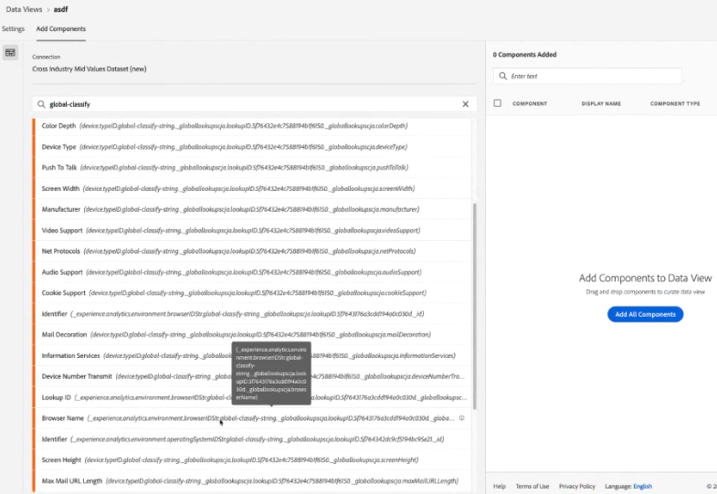

# Lägg till globala sökningar i datauppsättningarna

Globala sökningar gör det lättare för Customer Journey Analytics att rapportera om vissa dimensioner/attribut som inte är användbara för sig själva, men som är användbara när de sammanfogas med andra data. Exemplen innehåller attribut för mobila enheter och attribut för OS- och webbläsardimensioner, till exempel versionsnummer för webbläsare. En Global sökning liknar en uppslagsuppsättning. Globala sökningar kan användas i olika Experience Cloud-organisationer. De tillämpas automatiskt på alla händelsedatamängder som innehåller vissa XDM-schemafält (se nedan för de specifika fälten). Det finns en global sökdatamängd för varje schemaplats som Adobe klassificerar.

I traditionella Adobe Analytics visas de här dimensionerna fristående, men i CJA måste du aktivt ta med de här dimensionerna när du skapar datavyer. I anslutningsarbetsflödet väljer du en datauppsättning som är flaggad som en med en nyckel för global sökning. Användargränssnittet för datavyer kan automatiskt inkludera alla globala sökningsdimensioner som är tillgängliga för rapportering. Uppslagsfilerna uppdateras automatiskt och är tillgängliga i alla regioner och för alla konton. De lagras i regionspecifika organisationer som är kopplade till kunden.

## Använd globala sökningar med datauppsättningar i Adobe Data Connector

Datauppsättningar för global sökning tillämpas automatiskt vid rapporttidpunkten. Om du använder Analytics Data Connector och har en dimension som Adobe tillhandahåller en global sökning för, tillämpar vi automatiskt den här globala sökningen. Om en händelsedatamängd innehåller XDM-fält kan vi tillämpa globala sökningar på den.

## Tillgängliga globala sökfält

* `browser`
   * `browser`, `group_id`, `id`
* `browser_group`
   * `browser_group`, `id`
* `os`
   * `os`,  `group_id`,  `id`
* `os_group`
   * `os_group`,  `id`
* `mobile_audio_support - multi`
* `mobile_color_depth`
* `mobile_cookie_support`
* `mobile_device_name`
* `mobile_device_number_transmit`
* `mobile_device_type`
* `mobile_drm - multi`
* `mobile_image_support - multi`
* `mobile_information_services`
* `mobile_java_vm - multi`
* `mobile_mail_decoration`
* `mobile_manufacturer`
* `mobile_max_bookmark_url_length`
* `mobile_max_browser_url_length`
* `mobile_max_mail_url_length`
* `mobile_net_protocols - multi`
* `mobile_os`
* `mobile_push_to_talk`
* `mobile_screen_height`
* `mobile_screen_size`
* `mobile_screen_width`
* `mobile_video_support - multi`

## Rapport om dimensioner för global sökning

För att kunna rapportera om de globala uppslagsdimensionerna måste du lägga till dem när du skapar en datavy i Customer Journey Analytics:

Du kan sedan se sökdata i arbetsytan:

