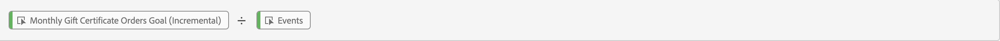

# Använd härledda fält för att rapportera mål

I det här användningsexemplet beskrivs hur du använder funktionerna i härledda fält för att ange mål för en viss dimension och sedan använda dessa mål i ditt Workspace-projekt.

Om du inte känner till härledda fält kan du få en introduktion i [självstudiekursen](https://experienceleague.adobe.com/docs/customer-journey-analytics-learn/tutorials/data-views/derived-fields-in-cja.html) och [dokumentationen](../data-views/derived-fields/derived-fields.md) .

## Definiera mål

Om du vill definiera mål skapar du ett nytt härlett fält där du uttryckligen anger egna numeriska värden direkt eller indirekt med de värden som härrör från regler tidigare i den härledda fältdefinitionen.

### Mål för månatliga gipscertifikatorder

Du vill uttryckligen ange mål för dina presentkortsbeställningar för fyra månader, från juli 2023 till oktober 2023. Så här gör du:

1. Skapa ett nytt härlett fält med namnet `Monthly Gift Certificate Orders Goal (Incremental)`.

1. Ange statiska värden med en CASE WHEN-REGEL för varje månad genom att ange en **[!UICONTROL Custom numeric value]**. Se regeln för månatliga produktmål nedan.

   

### Intäktsmål för marknadsföringskanaler

Ni vill ange ett månatligt intäktsmål för varje marknadsföringskanal. Så här gör du:

1. Skapa ett nytt härlett fält med [marknadsföringskanalernas funktionsmall](/help/data-views/derived-fields/derived-fields.md#marketing-channels) och namnet `Monthly Marketing Channel Revenue Goal (Incremental)`.

1. Definiera alla regler för att korrekt identifiera var och en av marknadsföringskanalerna baserat på en kombination av reglerna URL PARSE och CASE WHEN. Exempel:

   

1. Ange explicit statiska värden, som representerar månatliga intäktsmål, för specifika marknadsföringskanaler i en slutgiltig WHEN-regel genom att ange en **[!UICONTROL Custom numeric value]**. Se regeln [!DNL Monthly Goal] nedan.

   

## Använd mål

Om du vill använda mål i ditt Workspace-projekt använder du den beräknade mätfunktionen för att&quot;normalisera&quot; det härledda fältet tillbaka till det ursprungliga statiska värdet. Denna normalisering krävs eftersom de statiska värden som du anger för de härledda fälten som definierar mål ökas med varje händelse.

### Mål för månatliga gipscertifikatorder

1. Skapa ett beräknat måttfält med namnet `Monthly Gift Certificate Orders Goal`, definierat som:

   

1. Du kan skapa ytterligare beräknade fält, till exempel `% of Monthly Gift Certificate Orders Goal`, för att visa faktisk förlopp mot mål, till exempel:

   

Du kan använda dessa beräknade värden för att rapportera förloppet i frihandstabeller och visualiseringar. Exempel:

### Intäktsmål för marknadsföringskanaler

1. Skapa ett beräknat måttfält med namnet `Marketing Channel Revenue Goal`, definierat som:

   

1. Du kan skapa ytterligare beräknade fält, till exempel `% of Marketing Channel Revenue Goal`, för att visa faktisk förlopp mot mål, till exempel:

   

Du kan använda dessa beräknade värden för att rapportera förloppet i frihandstabeller och visualiseringar. Exempel:

