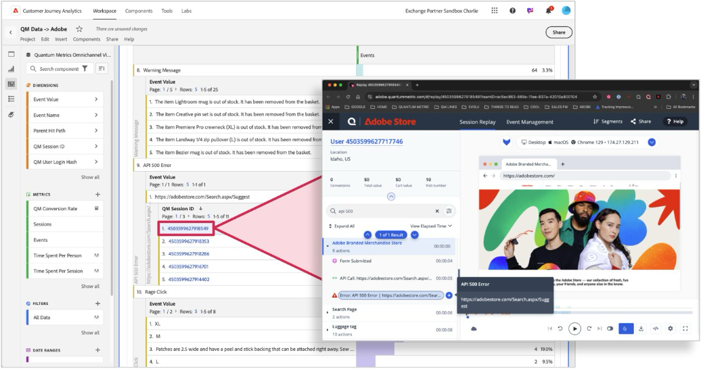

# Tie Quantum Metric-sessionen spelas upp på nytt till data i Customer Journey Analytics

Genom att länka Quantum Metric-sessionsuppspelningar till CJA-data kan kunderna bättre förstå&quot;varför&quot; bakom&quot;vad&quot;.  Workspace kan användas för att upptäcka sessioner med friktion. Sedan kan du klicka på hyperlänkade sessions-ID:n för att utforska sessionsreprisen i Quantum Metric.  Dessa data gör det möjligt att visa beteenden i en session och få en bättre förståelse för vad som driver konsumentens friktion.  Genom sessionsrepriser som är knutna till CJA kan ni fånga upp viktiga kontexter kring kundbeteenden i er upplevelse.

## Förutsättningar

I de här stegen förutsätts att du använder taggar i Adobe Experience Platform Data Collection. Du kan anpassa datainsamlingsmetoderna till en manuell implementering av Web SDK om din organisation inte använder taggar.

Mer information finns i dokumentationen för [Quantum Metric-taggtillägget](https://experienceleague.adobe.com/sv/docs/experience-platform/destinations/catalog/analytics/quantum-metric).

## Steg 1: Skapa ett schemafält för kvantmetriskt sessions-ID

Det här användningsfallet kräver ett dedikerat schemafält att skicka data till. Du kan skapa det här fältet på valfri plats i ditt schema och ge det vilket namn du vill. Exempelvärden anges om din organisation inte har någon inställning för namn eller plats.

1. Logga in på [experience.adobe.com](https://experience.adobe.com).
1. Navigera till **[!UICONTROL Data Collection]** > **[!UICONTROL Schemas]**.
1. Välj önskat schema i listan.
1. Välj ikonen  bredvid det önskade objektet. Till exempel bredvid `Implementation Details`.
1. Ange [!UICONTROL Name] till höger. Exempel: `qmSessionId`.
1. Ange önskad [!UICONTROL Display name]. Exempel: `Quantum Metric session ID`.
1. Välj [!UICONTROL Type] som **[!UICONTROL String]**.
1. Välj **[!UICONTROL Save]**.

## Steg 2: Hämta Quantum Metric-sessions-ID med tillägget för kvantmetrisk tagg

Följ de här stegen för att lägga till Quantum Metric-sessions-ID:t till data som du skickar till Adobe Experience Platform.

1. Logga in på [experience.adobe.com](https://experience.adobe.com).
1. Navigera till **[!UICONTROL Data Collection]** > **[!UICONTROL Tags]**.
1. Välj önskad taggegenskap.
1. Välj **[!UICONTROL Data Elements]** och sedan **[!UICONTROL Add Data Element]**.
1. Ange följande inställningar:
   * **[!UICONTROL Name]**: `Quantum Metric session ID`
   * **[!UICONTROL Extension]**: [!UICONTROL Core]
   * **[!UICONTROL Data Element Type]**: [!UICONTROL Custom Code]
1. Markera knappen **[!UICONTROL Open Editor]** och klistra in följande kod:

   ```js
   // Check for the presence of the Quantum Metric session ID cookie
   const qmCookie = _satellite.cookie.get("QuantumMetricSessionID");
   if(qmCookie != null) return qmCookie;
   // If a cookie is not set, check local storage
   const qmLocalStorage = JSON.parse(localStorage.getItem("QM_S") || "{}");
   if (qmLocalStorage?.s != null) return qmLocalStorage.s;
   ```

1. Välj **[!UICONTROL Save]**.

## Steg 3: Mappa dataelementet till det önskade XDM-schemafältet

Nu när dataelementet har logik för att få fram det önskade värdet mappar du dataelementet till XDM-objektet.

1. Markera **[!UICONTROL Data Elements]** i taggegenskapen och markera sedan det dataelement som innehåller ditt XDM-objekt.
1. I den högra kolumnen i det här dataelementet navigerar du till den sökväg som skapades när schemafältet skapades.
1. Ange värdet för dataelementets namn omgivet av procenttecken. Exempel: `%Quantum Metric session ID%`.
1. Välj **[!UICONTROL Save]**.
1. Lägg till ett bibliotek och publicera sedan ändringarna i produktionen.

Om ditt XDM-objekt redan ingår i en konfiguration för skicka-händelseåtgärd börjar du se data när ändringarna publiceras.

>[!NOTE]
>
>Ibland körs Web SDK snabbare än Quantum Metric-koden. I dessa fall skickas sessions-ID vid nästa träff. Om en besökare studsar samlas inte sessions-ID:t in i dessa instanser.

## Steg 3: Lägg till sessions-ID för kvantmått som en tillgänglig dimension

När implementeringen har publicerat ändringarna ovan redigerar du den befintliga datavyn för att lägga till sessions-ID som en tillgänglig dimension i Customer Journey Analytics.

1. Logga in på [experience.adobe.com](https://experience.adobe.com).
1. Navigera till Customer Journey Analytics och välj **[!UICONTROL Data views]** på den översta menyn.
1. Välj önskad befintlig datavy.
1. Leta reda på fältet Sessions-ID för kvantmetrisk session till vänster och dra det till dimensionsområdet i mitten.
1. I den högra rutan anger du inställningen [persistence](/help/data-views/component-settings/persistence.md) till `Session`.
1. Välj **[!UICONTROL Save]**.

## Steg 4: Konfigurera Analysis Workspace för att anpassa dimensionen för sessions-ID

Skapa en friformstabell i Workspace och konfigurera den så att sessions-ID-värden länkas direkt till kvantmätvärden.

1. Logga in på [experience.adobe.com](https://experience.adobe.com).
1. Navigera till Customer Journey Analytics och välj **[!UICONTROL Workspace]** på den översta menyn.
1. Välj ett befintligt projekt eller skapa ett projekt.
1. Skapa en [friformstabell](/help/analysis-workspace/visualizations/freeform-table/freeform-table.md).
1. Dra sessions-ID-dimensionen till Workspace Canvas.
1. Högerklicka på dimensionskolumnens rubrik och välj sedan **[!UICONTROL Create hyperlinks for all dimension items]**.
1. Välj **[!UICONTROL Create a custom URL]**.
1. Klistra in följande URL-struktur:

   ```
   https://adobe.quantummetric.com/#/replay/cookie:$value
   ```

1. Klicka på **[!UICONTROL Create]**.

Varje sessions-ID är nu en klickbar länk. Mer information om hur du lägger till hyperlänkar i Analysis Workspace-dimensionsobjekt finns i [Skapa hyperlänkar i en frihandstabell](/help/analysis-workspace/visualizations/freeform-table/freeform-table-hyperlinks.md).



## Steg 5: Visa sessioner från Customer Journey Analytics

När du har hittat ett intressant segment som du vill utforska sessionsuppspelningar kan du använda det på panelen som innehåller dina sessions-ID-länkar. Tabellen returnerar alla sessioner i det segmentet och du kan klicka på någon av dem för att utforska mer i kvantmätaren.

Mer information finns i [Enterprise Guide to session replay](https://www.quantummetric.com/resources/ebook/the-enterprise-guide-to-session-replay) på Quantum Metric. Du kan också kontakta din kundsupportrepresentant för Quantum Metric eller skicka en begäran via [portalen för kvantmetrisk kundbegäran](https://community.quantummetric.com/s/public-support-page).
